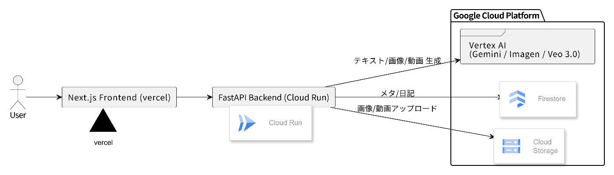

#  AI未来日記 - 予定を夢に変える新しい体験

##  はじめに

「明日は早起きして勉強しよう」「今度の休日は友達と映画を見に行こう」「レポートは今週末に仕上げよう」

学生時代、こんな風に予定を立てては、実際には全然違うことをしていた経験はありませんか？私自身、計画を立てるのは好きなのに、実際の行動が予定通りいかないことがよくありました。そして、「なぜ計画通りにいかなかったんだろう」と振り返ることもなく、また同じような予定を立ててしまう...そんな繰り返しに悩んでいました。

また、せっかく立てた予定も、カレンダーアプリに機械的に入力するだけでは味気なく、「予定を立てるのがめんどくさい」と感じることも多々ありました。

でも、もしその予定が物語になったら？もし「こんな一日になりそう」という期待を視覚化できたら？そして、実際の体験と比較して「なるほど、こういう違いがあったのか」と気づきを得られたら？

そんな発想から生まれたのが「AI Future Diary」です。学生から社会人まで、老若男女問わず多くの人に使ってもらえるよう、シンプルで直感的な操作性を重視し、様々な使い方ができるアプリケーションを目指して開発しました。

この記事では、AIの力で予定から「未来日記」を生成し、実際の体験と比較して気づきを得る革新的なアプリケーション「AI Future Diary」を紹介します。

##  プロジェクトが対象とするユーザー像と課題

###  対象ユーザー像

AI Future Diaryは、老若男女問わず幅広い層の方々に使ってもらえるよう設計しています

  * **予定管理に悩む学生** : 計画は立てるものの実行が難しい、振り返りの習慣がない
  * **忙しい日常を送るビジネスパーソン** : 予定に追われがちで、日々の体験を振り返る時間がない
  * **ライフログに興味がある人** : 日記を書きたいがハードルが高く感じている
  * **家族や友人との思い出を残したい人** : デジタルアルバムとしても活用可能
  * **研究者や創作者** : 日々の活動記録やアイデアの整理に活用
  * **チーム活動をする人** : グループでの進捗管理や振り返りに利用

###  解決すべき課題

  1. **予定立てへの意欲低下** : 「どうせ予定通りいかない」「予定を立てるのがめんどくさい」
  2. **予定管理の機械的さ** : カレンダーアプリは事務的で、体験への期待感を醸成しない
  3. **振り返りの習慣化の困難** : 日記を継続するのは難しく、多くの人が挫折する
  4. **計画と実際のギャップへの無関心** : 予定と実際の違いから学べる機会を逃している
  5. **体験の記録化への障壁** : 文章を書くのが苦手で、記録を残せない人が多い
  6. **思い出の散逸** : 写真は撮るが整理されず、体験とのつながりが失われる

###  ソリューションの特徴

**AI Future Diary** は、これらの課題を以下の革新的な機能で解決します!

  * **未来日記生成** : 予定からAIが魅力的な物語風の日記を自動生成（予定立てが楽しくなる）
  * **視覚化機能** : Imagen APIによる水彩画風の挿絵で、想像を視覚化
  * **デュアル記録システム** : AI生成画像と実際の写真を並べて比較（思い出のアルバム機能）
  * **振り返りサマリー** : 予定と実際の違いをAIが分析し、気づきを提供
  * **継続支援** : 7日間連続記録でVeo 3.0による特別動画を生成
  * **多様な使い方** : 日記、アルバム、研究記録、グループ管理など用途に応じて活用可能

##  システムアーキテクチャ

###  全体構成図

###  詳細アーキテクチャ

####  フロントエンド層 (Next.js)

  * **UI/UX** : ノートブック風のデザインで親しみやすい操作感
  * **認証管理** : JWT トークンベースの認証システム
  * **状態管理** : React Hooksによるローカル状態管理
  * **画像処理** : ドラッグ&ドロップ対応のファイルアップロード

####  バックエンド層 (FastAPI)

  * **API Gateway** : RESTful APIエンドポイントの提供
  * **認証ミドルウェア** : JWT認証による保護されたルーティング
  * **マイクロサービス構成** : 
    * `textgen.py`: Gemini AIによるテキスト生成
    * `imagegen.py`: Imagen APIによる画像生成
    * `videogen.py`: Veo 3.0による動画生成
    * `diary.py`: 日記データの CRUD操作
    * `auth.py`: ユーザー認証管理

####  データ層 (Google Cloud Platform)

  * **Firestore** : ユーザーデータと日記エントリの永続化
  * **Cloud Storage** : 画像・動画ファイルの保存
  * **Vertex AI** : 
    * Gemini 2.5 Flash: テキスト生成とサマリー作成
    * Imagen: 水彩画風画像生成
    * Veo 3.0: 特別動画生成

####  デプロイメント

  * **Cloud Run** : コンテナベースの自動スケーリング
  * **Cloud Build** : CI/CDパイプライン

##  技術的な特徴と革新性

###  1\. マルチモーダルAI統合

単一のアプリケーション内で、テキスト生成、画像生成、動画生成の3つのAI機能を統合し、包括的な日記体験を提供します。

###  2\. デュアル画像システム

AI生成の「期待」画像と実際の「現実」写真を並べて表示することで、視覚的な振り返りを可能にする独自の機能を実装しました。

###  3\. ゲーミフィケーション要素

7日間連続記録という達成可能な目標設定により、継続的な使用を促進します。

###  4\. スケーラブルなクラウドアーキテクチャ

Google Cloud Platformを活用した自動スケーリング対応のマイクロサービス構成です。

##  実装品質と拡張性

###  コード品質

  * **型安全性** : TypeScript (フロントエンド) + Pydantic (バックエンド)
  * **エラーハンドリング** : 包括的なエラー処理とユーザーフレンドリーなメッセージ
  * **セキュリティ** : JWT認証、環境変数による機密情報管理

###  拡張性

  * **マイクロサービス** : 各機能が独立したモジュール構成
  * **API設計** : RESTful設計による他サービスとの連携可能性
  * **データベース設計** : NoSQLによる柔軟なスキーマ拡張

###  運用性

  * **モニタリング** : Cloud Run による自動ヘルスチェック
  * **スケーリング** : トラフィックに応じた自動スケーリング
  * **コスト効率** : サーバーレス アーキテクチャによる従量課金

##  デモ動画

以下の3分間のデモ動画で、AI Future Diaryの全機能をご覧いただけます：

###  デモで確認できる機能

  1. **ユーザー登録とログイン** : 簡単な「あいことば」認証システム
  2. **未来日記生成** : 予定入力からAIが生成する物語風テキスト
  3. **画像生成** : 水彩画風の美しい挿絵作成
  4. **実際の記録** : 写真アップロードと振り返りテキスト
  5. **比較分析** : AIによる予定と実際の差分サマリー
  6. **カレンダー表示** : 過去の日記を月別で閲覧
  7. **継続機能** : 7日間連続記録での特別動画生成

##  多様な活用シーン

AI Future Diaryは、シンプルな操作性により様々な用途で活用できます：

###  📖 日記初心者に優しい

「日記って何書けばいいの？」という人でも大丈夫。AIが物語調に変換してくれるので、サクサク書けます。実際の写真とAI画像を比較するのも面白い！

###  📸 思い出のアルバムとして

スマホに散らかっている写真を整理したい人にもピッタリ。写真と一緒にその日の体験も記録されるので、後で振り返った時に「あ、こんなことしたなぁ」って懐かしくなります。

###  🔬 研究・創作活動の記録に

「今日は実験して、論文読んで...」という研究進捗も、AIが読みやすくまとめてくれます。予定と実際の違いから「あ、ここがボトルネックか」という発見もあります。

###  👥 チームでの進捗共有にも（将来機能）

サークルや研究室、プロジェクトチームでアカウントを共有すれば、「みんな今日何したの？」を楽しく確認できそうです。予定と実際のギャップから、チームの効率化のヒントも得られるかも。

##  課題の新規性と解決策の有効性

###  新規性

従来の日記アプリやカレンダーアプリは、記録や管理に特化していましたが、「予定を物語に変換する」という発想は新しく、日常の予定管理に創造性と楽しさをもたらします。また、「予定立てがめんどくさい」という多くの人が抱える課題に対し、AIの魅力的な物語生成で楽しい体験に変えました。

###  こんな効果が期待できます

  * **継続しやすい** : AIのサポートにより「何書こう...」と悩まず書ける
  * **予定が楽しみに** : 機械的なカレンダー入力から、ワクワクする物語作成へ
  * **気づきの創出** : 「あ、私ってこんなパターンあるんだ」という発見
  * **日常が物語に** : 普通の予定管理が、特別な体験記録に変わる
  * **使い方自由** : 一人でも、みんなでも、研究でも、いろんな用途に対応

##  今後の拡張性と発展可能性

AI Future Diaryは現在の機能だけでなく、将来的な拡張性も考慮した設計になっています：

###  機能面での拡張性

  * **グループ機能の本格実装** : アカウント共有によるチーム・家族での日記共有
  * **AI分析の高度化** : 長期的な行動パターン分析と改善提案
  * **カスタマイズ機能** : ユーザー独自の文体やテーマ設定
  * **外部連携** : GoogleカレンダーやNotionなど他ツールとの統合

###  技術面での拡張性

  * **マイクロサービス化** : 各機能の独立性により新機能追加が容易
  * **API設計** : RESTful設計により第三者アプリケーションとの連携可能
  * **クラウドネイティブ** : Google Cloud Platformによる無制限スケーリング
  * **モジュール構造** : 新しいAIモデルの追加や入れ替えが簡単

###  プラットフォーム展開

  * **モバイルアプリ化** : React NativeによるiOS/Android対応
  * **PWA対応** : オフライン機能とプッシュ通知の実装
  * **多言語対応** : i18n対応による国際展開
  * **デスクトップ版** : Electronによるデスクトップアプリ化

###  ビジネス展開の可能性

  * **教育機関向け** : 学習計画と実績の可視化ツールとして
  * **企業向け** : チーム管理とプロジェクト振り返りツールとして
  * **ヘルスケア** : 生活習慣の記録と改善支援ツールとして
  * **エンターテイメント** : SNS機能付きライフログプラットフォームとして

##  最後に

AI Future Diaryは、「予定を立てるのがめんどくさい」「日記が続かない」という皆さんの悩みから生まれたアプリです。AIの力で予定を物語に変え、日常をもっと楽しく、もっと意味のあるものにしたい。そんな思いで作りました。

「予定通りいかなくても、それも一つの物語だよね」「今日はどんな一日になるかな？」そんな風に、毎日が少しだけ特別に感じられる。そんな体験を提供できたらいいな、と思っています。

正直、私自身も「予定が苦手」だったので、同じような悩みを持つ方に少しでも役立てば嬉しいです。AIテクノロジーの進歩で、こんなことが可能になったんだなぁ、と実感します。

* * *

**GitHub リポジトリ** : [プロジェクトのGitHubリポジトリURL](https://github.com/Takato180/ai-future-diary)
