#  0

この度のAIハッカソンでは、残念ながら動画を提出することができませんでした。  
動画制作はまだ不得意ですが、プロジェクトを作り上げる過程そのものがとても貴重で楽しい経験となりました。  
企画・運営いただいた皆さまに心から感謝いたします。  
こちらにリポジトリを公開いたしますので、ご覧いただければ幸いです 👉 [[repo link](https://github.com/shengangli/hackathon-zenn-ai3/)]  
本プロジェクトが少しでも多くの方のインスピレーションにつながれば嬉しいです。

#  1.1 はじめに

私が一橋大学大学院に在学していた頃、ある教授がこう語ったことを今でも鮮明に覚えています。

> 真の技術革新とは、誰かを排除するのではなく、すべての人を包み込むものである。

この言葉は、私の心に強く刻まれました。  
技術は日々、想像を超える速度で進歩しています。エンジニアである私でさえ追いつくのが難しいのですから、そうでない人々にとってはどれほど大きな壁となるでしょうか。

そんなある日、近所の親しいおばあちゃんが、静かにこう打ち明けてくれました。

> だまされて、お金を取られてしまったの。

異国で暮らす私にとって、人からの小さな温かい支えは、何よりも心に響くものでした。三つの国で育った経験からも、その小さな思いやりの積み重ねが人を生かすことを私は知っています。だからこそ、この問題を決して見過ごすことはできません。詐欺はどの国でも許されない。けれど現実には存在し、日本でも高齢者を中心に被害件数は年々増加し、もっとも弱い立場の人々を狙っています。  
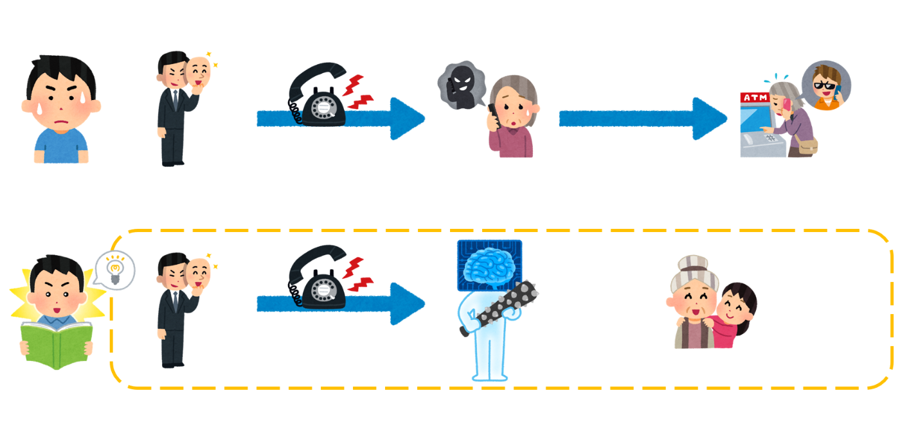  
その思いと恩返しを原点として、私は エルブリ（ElderBridge） を立ち上げました。

##  1.2 社会の背景

詐欺グループは、自動発信システムや生成AIによる声の偽装など、最新のテクノロジーを取り込み、短時間で膨大な数の電話を仕掛けることができます。その結果、被害の規模はかつてないスピードで拡大しています。

一方で、一般の生活者や家族は、こうした「攻撃の規模」に見合う防御手段をまだ十分に備えていません。個人の注意や常識だけでは、組織的かつ技術的に洗練された詐欺に立ち向かうのは難しい状況です。  
つまり、

> 攻撃者（高いテクノロジーで規模拡大） > 防御者（限定的なテクノロジー）

だからこそ、防御の側もテクノロジーを活かしてスケールアップすることが求められています。ElderBridge は、その第一歩となる仕組みです。

#  ２． エルブリとは

日本で急増する電話詐欺は、高齢者など弱い立場の人々を狙い、深刻な社会課題となっています。攻撃者はAIや自動発信システムを駆使して規模を拡大する一方、防御側の手段は追いついていません。ElderBridge（エルブリ）は、このギャップを埋める新しい仕組みです。AIがおばあちゃん役として着信を先に受け、会話を解析し、怪しい場合は遮断・記録、安全なら本人へ転送します。さらにホワイトリスト／ブラックリストやモニタリング機能を備え、家族や管理者も安心。電話という従来インフラをAIで再発明し、守りをスケールさせることが可能です。  
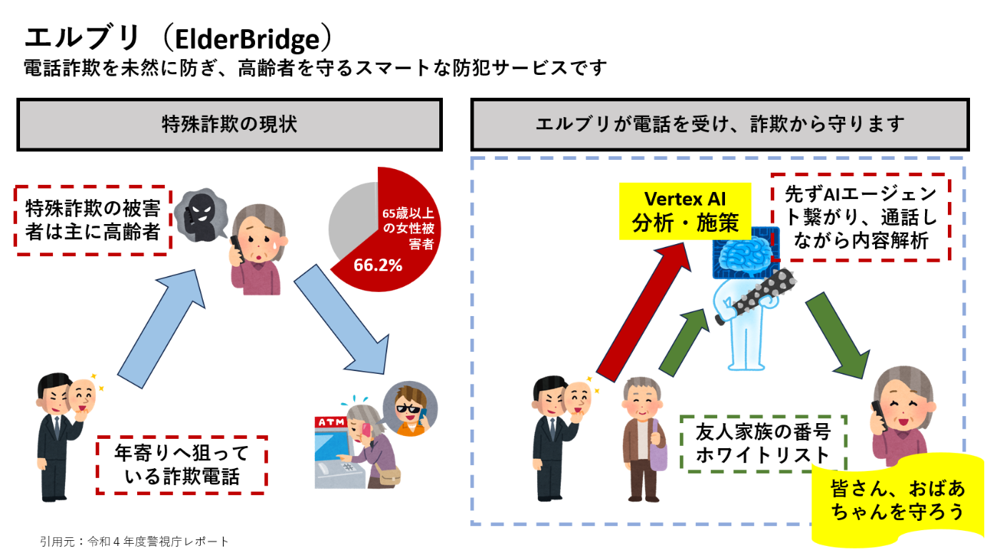  
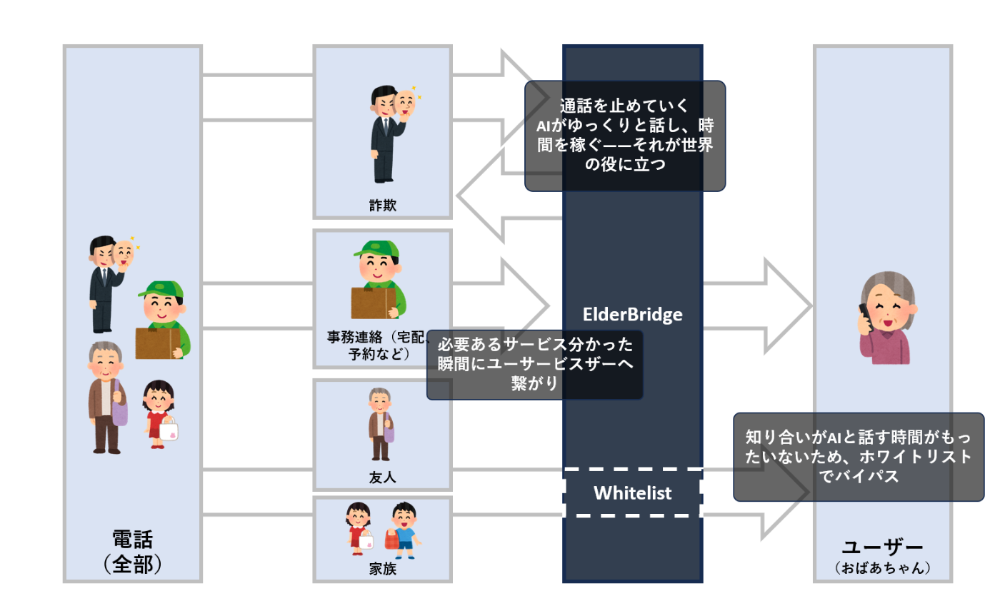

  * AI応答：家族の代わりに着信に応答し、会話を記録・分析
  * 疑わしい兆候の検知：権威をかたる、緊急性を強調するなど典型的な詐欺パターンを検出
  * 安全な転送：問題がなければ本人にのみ着信をつなぐ
  * モニタリング：着信履歴や会話ログを可視化し、安心をサポート
  * ホワイトリスト / ブラックリスト：信頼できる相手は常に通話可能にし、怪しい発信元は自動遮断

#  3\. 問題の本質

なぜ高齢者の方々はそれほどまでに詐欺に引っかかってしまうのか？  
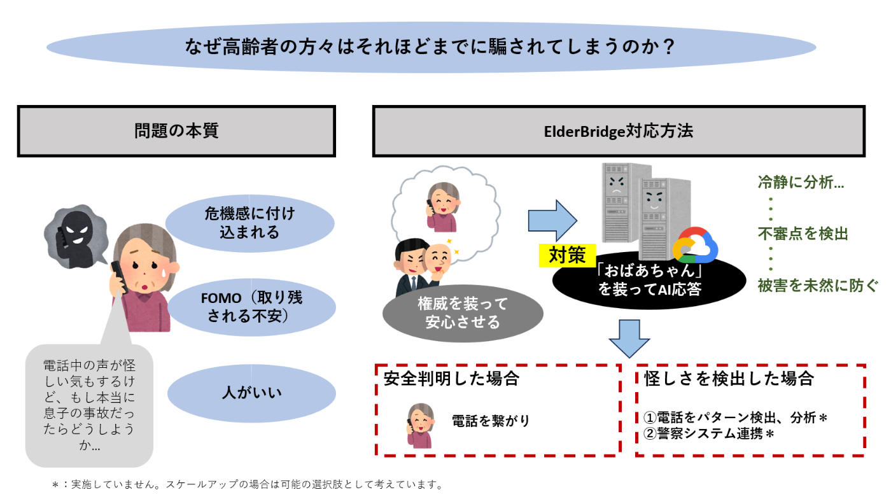  
ElderBridgeは人間の心理的弱点を補い、冷静に詐欺を見抜きます。

#  4\. 具体的な仕組み

##  4.1 システムアーキテクチャ

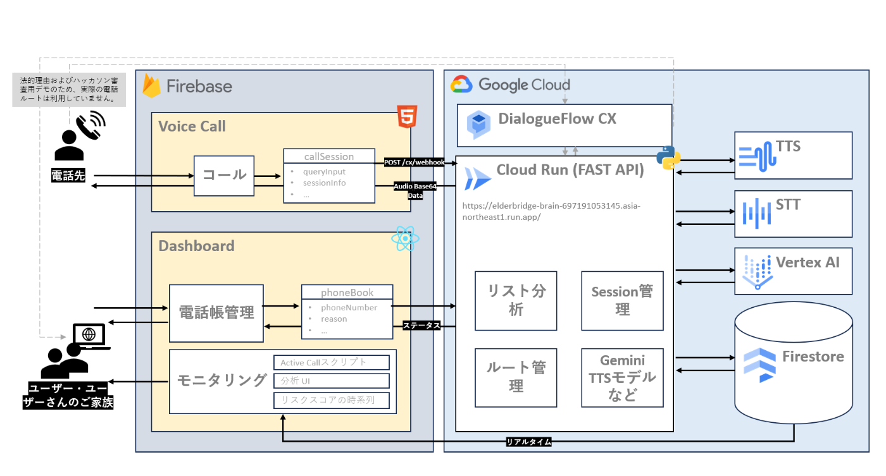

> > **【実装上の補足】**  
>  本プロジェクトのハッカソンデモでは、実環境の電話回線の代わりに**ウェブポータル経由の通話シミュレーション** を採用しています。  
>  理由：①審査員・閲覧者のアクセシビリティ向上、②法令・プライバシー面での安全確保、③デモ運用の再現性確保。  
>  ※日本の電話番号を商用利用する場合は **事業者登録（事業者向け契約・届出等）** が必要です。本デモはハッカソン専用の代替実装であり、実運用時は別途登録・法令対応を行う想定です。

##  4.2 技術スタック

フロントエンド層

  * ダッシュボード: React 18 + TypeScript SPA
  * 音声インターフェース: 音声認識機能付きWebベース音声操作
  * ホスティング: Firebase Hosting（2サイト）: 
    * elderbridge-voice (public-voice)
    * elderbridge-dashboard (dashboard/dist)

バックエンド層

  * Cloud Run: Python 3.11 FastAPIバックエンド 
    * エンドポイント: /cx/webhook、/health、ダッシュボードAPI
    * オートスケール、認証不要アクセス
    * リージョン: asia-northeast1

AI/ML層

  * Vertex AI (Gemini 1.5): リスク評価・詐欺検知
  * 音声認識: Web Speech APIによる音声入力

##  4.3 ワークフロー

通話処理の全体フロー

  1. 着信フェーズ

着信 → 発信者番号取得 → データベース照合  
├── ホワイトリスト → 即座に転送  
├── ブラックリスト → 即座にブロック  
└── 未登録番号 → AI分析フェーズへ

  2. AI分析フェーズ

音声入力  
↓  
Web Speech API (音声→テキスト変換)  
↓  
FastAPI バックエンド (/cx/webhook)  
↓  
Vertex AI Gemini 1.5  
├── 詐欺パターン検知  
├── リスクスコア算出 (0-100)  
├── 意図分析  
└── 推奨アクション決定  
↓  
Firestore保存 + ダッシュボード更新

  3. リスク判定ワークフロー

低リスク (0-30)

配送業者、病院など正当な通話  
↓  
「転送しますか？」  
├── Yes → おばあちゃんに転送  
└── No → 丁寧にお断り

中リスク (31-70)

不明確な通話、要確認  
↓  
「どちらさまですか？」  
↓  
追加情報収集  
↓  
再評価 → 低リスクまたは高リスクに分類

高リスク (71-100)

詐欺の可能性が高い  
↓  
funMode設定により分岐:  
├── funMode: false → 丁寧にお断り  
└── funMode: true → 時間稼ぎ対話  
↓  
家族に緊急アラート送信（送信出力現在なし）

##  4.4 UI/UX観点

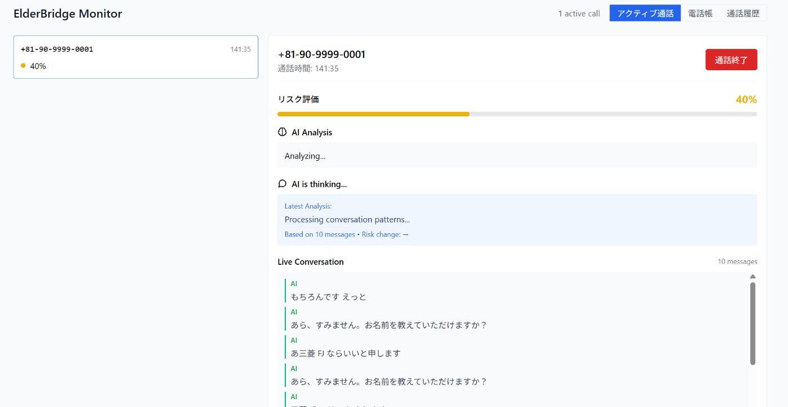  
図：ElderBridgeのアクティブ通話モニター — 左に着信一覧とリスク、右に選択通話のリスクゲージ（40％）、AIの最新分析コメント、ライブ会話ログを表示。転送・確認・拒否の判断に必要な情報をリアルタイムで提示。

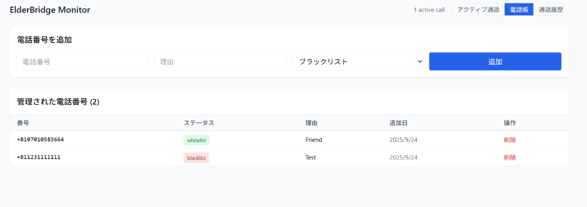  
電話帳ベースの着信コントロール番号と理由を登録→ホワイト/ブラックを即時適用。次の着信からポリシーが発動。  
Whitelist & Blacklist をワンタップで友人・家族はスルー接続、怪しい番号はブロック。削除も簡単。  
ElderBridge Phonebook追加→理由→ステータス選択で完了。通話体験を安全にカスタマイズ。

##  4.5 データレイヤー

フロントエンドダッシュボード

{  
"フレームワーク": "React 18.2.0",  
"言語": "TypeScript 4.9.0",  
"ビルド": "Vite 4.1.0",  
"スタイリング": "Tailwind CSS 3.2.0",  
"状態管理": "@tanstack/react-query 4.24.0",  
"ルーティング": "react-router-dom 6.8.0",  
"チャート": "Recharts 2.5.0",  
"アイコン": "Lucide React 0.263.0",  
"UI": "@headlessui/react 1.7.0"  
}

バックエンドサービス

{  
"フレームワーク": "FastAPI",  
"言語": "Python 3.11",  
"サーバー": "Uvicorn",  
"AI": "Vertex AI Gemini",  
"コンテナ": "Cloud Run"  
}

#  5\. ビジネス観点から

##  5.1 Scale

ElderBridgeはクラウドネイティブに設計されており、需要に応じて水平スケールが可能です。通話はすべてコンテナ化されたAIサービスで処理され、ユーザー数の増加に伴い、サーバーレス関数やマネージドDB、分散ストレージが自動的に拡張されます。これにより、1日100件から100万件の通話まで、安定した応答とコスト効率を維持。クラウドコンピューティングによって、ElderBridgeは試作品にとどまらず、世界規模へ展開可能な基盤となります。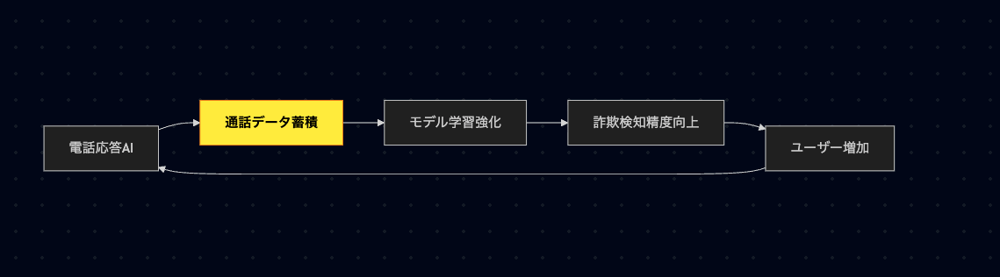  
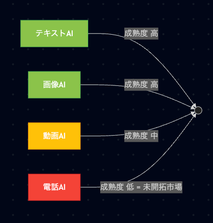

##  5.2 Service

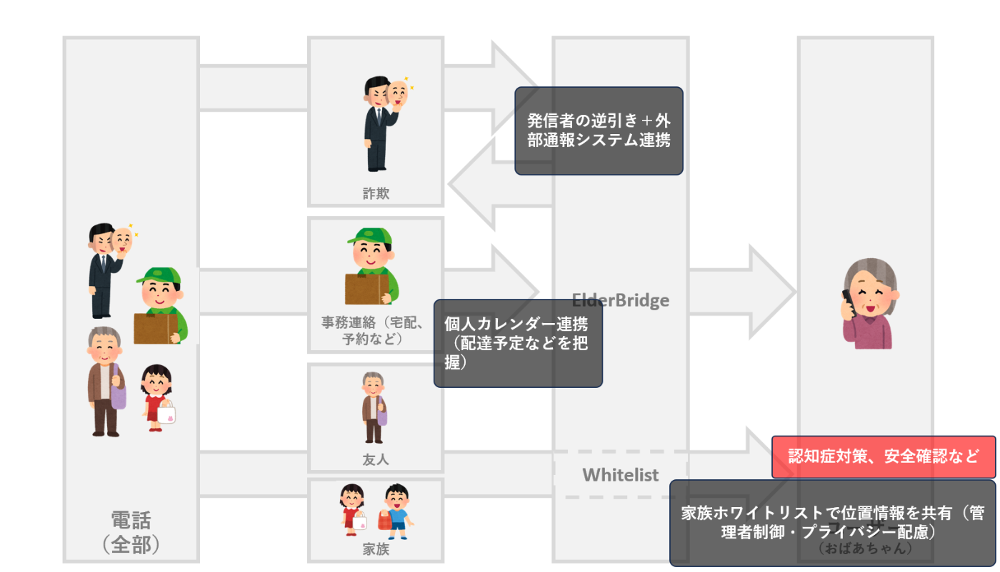  
ElderBridge は単なる「詐欺をブロックするAI」ではなく、家族・介護・セキュリティの領域へ横展開できるプラットフォームです。例えば、家族がホワイトリスト登録できる管理者権限を用意し、指定の相手に自動転送する／応答がなければ管理者へエスカレーションする、といった運用が可能です。  
さらに、同意に基づいてAIエージェントが位置情報やステータス（例えば位置の最終更新）を参照して安否確認を支援する仕組みは、高齢者・要介護者の見守りに非常に有用です。ただし位置情報などのセンシティブデータを扱う際は、実装時に細心の注意が必要です。

#  6\. 終わりに

テクノロジーで詐欺は強くなる。だからテクノロジーで、おばあちゃんを守ろう。  
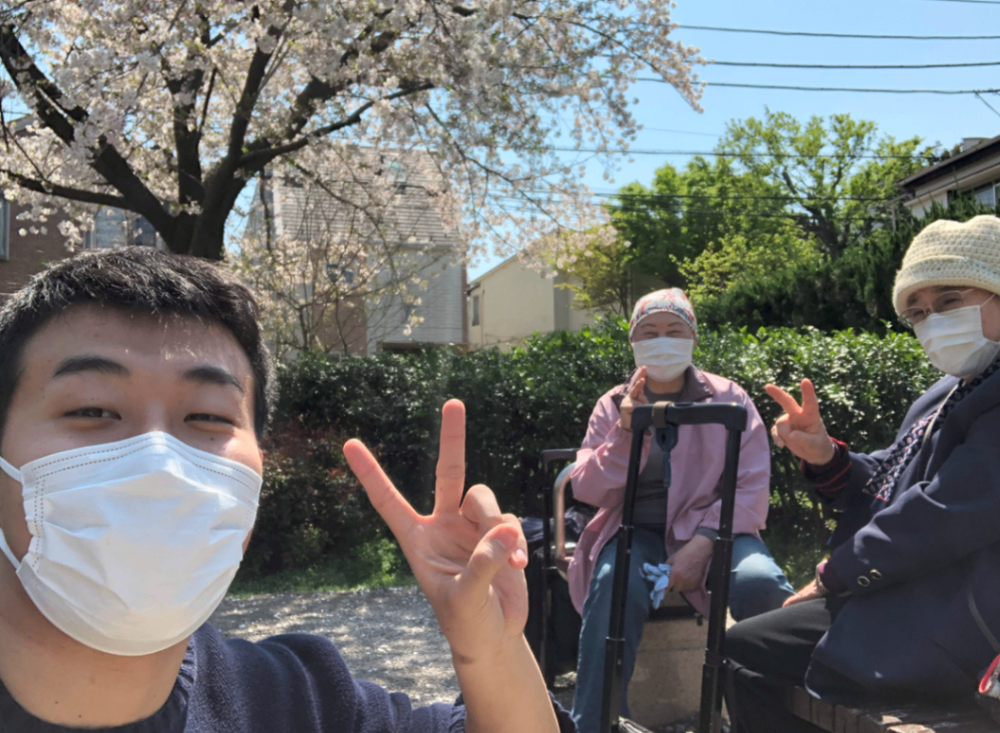  
日本に来たのはコロナ直前。桜の下で、やさしいおばあちゃんとベンチに座って「花より団子」を本気で議論していたのを思い出します。  
あの平和で笑える時間を守るために、ElderBridge があるのです。
