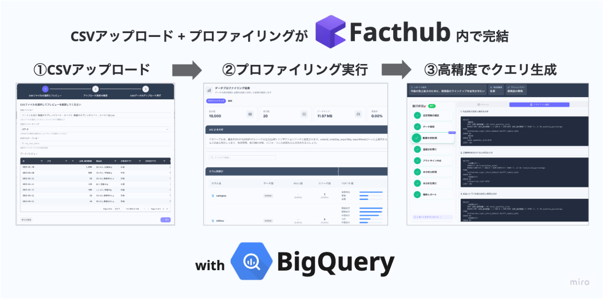
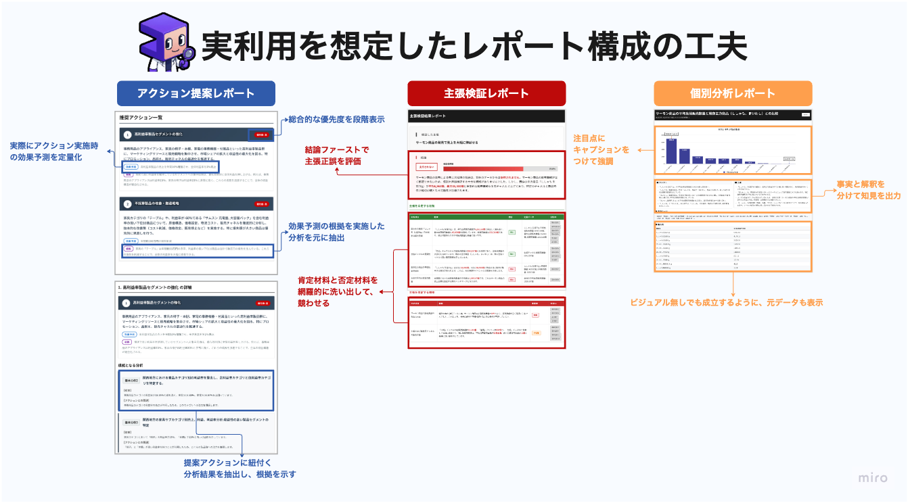
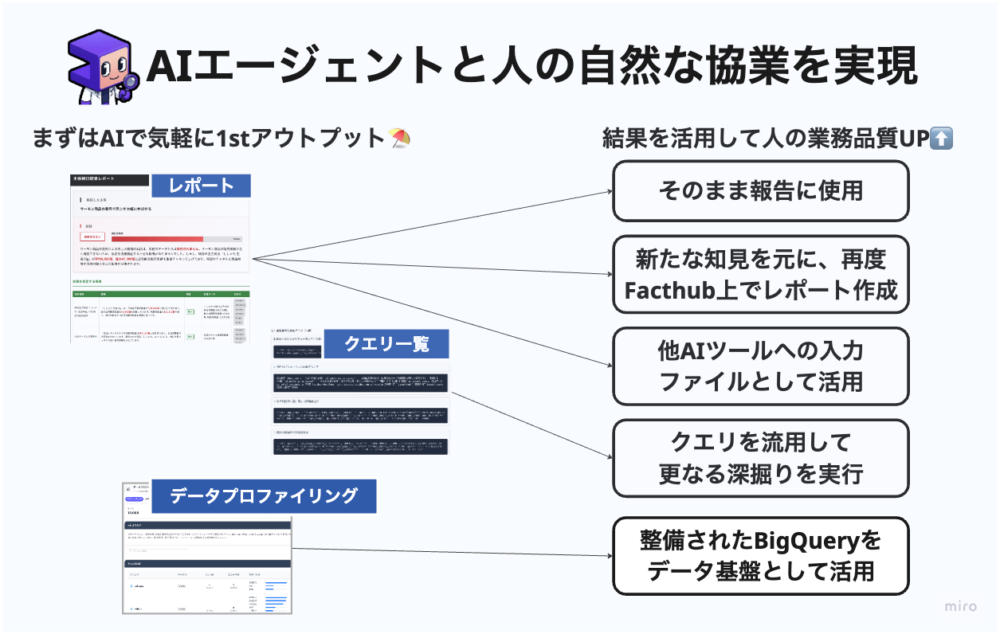
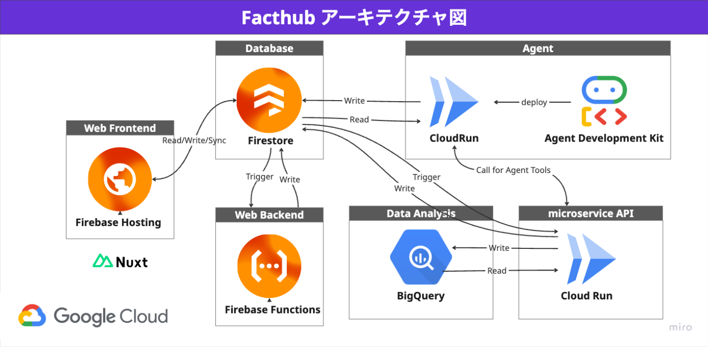
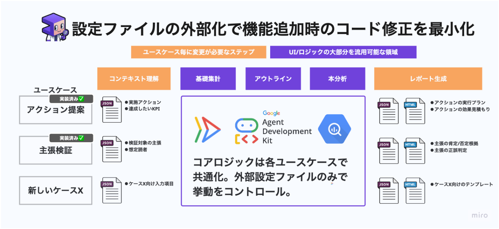
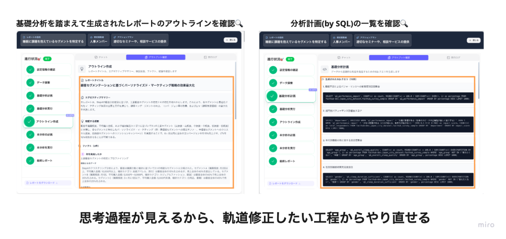
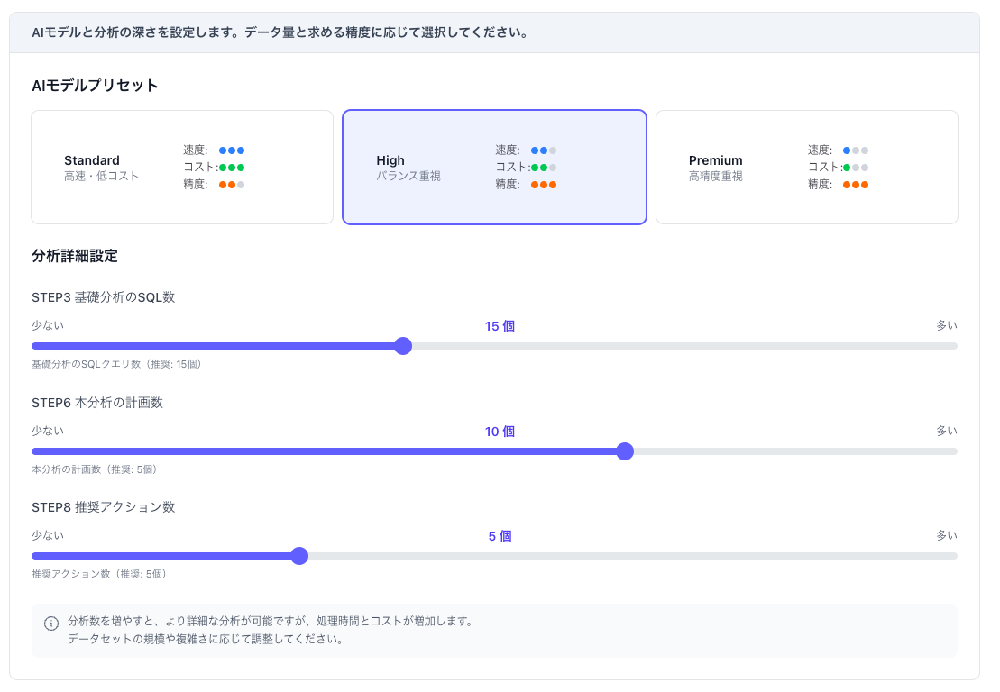

FactHubは、**“理想的なデータアナリストの作業プロセスをAIエージェントで再現する”** をコンセプトに開発されました。分析設計からレポート作成まで自律的に実行し、組織のデータ活用を新たなステージへ引き上げることを目指しています。

この記事では、FactHubが解決する課題や開発背景、その特徴、そして技術的な挑戦について紹介します。

<https://www.youtube.com/watch?v=mkggXIOoneE>  
※中段の動画と中身は同一です

##  1\. 解決する課題と開発の背景

###  1.1 データ活用における理想と現実のギャップ

長らく、データ分析の業務は、中々に実施のハードルが高いものでしたが、2022年以降のLLM（大規模言語モデル）の登場により、この状況に変化の兆しが見えました。自然言語でSQLを生成したり、分析のアイデアを提案したりと、データ分析業務の様々な場面でLLMが活用され始めています。

###  1.2 単純なLLM x データ分析の限界

本サービスの背景には、筆者自身のフリーランスデータアナリストとしての長年の実務経験があります。実際LLMは確かに強力で、分析設計の相談相手やSQL作成の補助において素晴らしいパフォーマンスを発揮し、実際業務効率は飛躍的に上がったと肌で感じています。

しかし、その利用はまだ**断片的** であり、大多数の組織においては **“あると時短ができる便利ツール” の域を脱却できていない** のが現状ではないでしょうか。

###  1.3 データアナリストに求められる役割

私見になりますが、データ分析の最終目的は、**分析結果に基づいて人と組織を動かし、より勝率の高い意思決定の絶対数を増やすこと** にあると考えています。

単純なLLM活用では、この目的達成には不十分です。分析実行者自身が思いつく範囲でのタスク実行や、分析プログラムの断片的な生成だけでは、データ分析の全体をカバーできているとは言えません。

データアナリストの存在価値は、より広範で複雑なプロセスの中にあります。ビジネス現場では、**曖昧な目的とデータだけが与えられた状況から知見を抽出し、人や組織が自信を持って意思決定できる形に情報をまとめ上げ、定量的な事実を根拠により良い方向へと周囲を動かしていくこと** が求められます。

特に、**分析結果を意思決定に繋がる「レポート」に昇華させるプロセスは、時間を要する作業であり、一定の経験も必要** です。個別の分析項目のアウトプットをLLMで得られたとしても、その結果を適切にまとめ上げ、確かな裏付けを持って周囲および自らを自信を持って動かしていくことは、実務経験がないユーザーにとっては、実行のハードル高いと言えるでしょう。

###  1.4 AIエージェントで”理想のデータアナリスト”を創造する

目指したのは、単なる便利ツールではありません。曖昧なインプットから、分析設計、データ抽出、集計、そして示唆出しを含んだレポート作成まで**一気通貫で高品質かつ自律的に実行してくれる”理想のデータアナリスト”の実装** です。

その際に、より親しみやすさを感じられるように。実行主体のデータアナリストをキャラクター化してみました。それが本サービスの主役でもあるAIデータアナリスト「**Factくん** 」です。  
  
_シゴデキ データアナリストのFactくん_

※Factくんは、Gemini 2.5 Flash Image (Nano Banana)によって生み出されました。最初は若干不気味でしたが、開発を続けていくうちに愛着が湧いて可愛く見えてきました...☺️

###  1.5 “理想のデータアナリスト”の要件定義

では“理想のデータアナリスト”とは、具体的にどのような能力を持つ人物なのでしょうか。

**”こんなデータアナリストがいたら現場は助かるなぁ”という妄想を元に、以下の6つの必須要件を定義** し、これらの特性をAIエージェントで再現することを目指しました。

必須要件 | 分析の進め方 | FactHubでの実装  
---|---|---  
**分析設計力** | 曖昧な目的や前提が与えられるだけで、的確な分析設計を立案する | ユーザーは分析目的など基本情報をフォームに入力するだけで、エージェントが意図を汲み取って、適切な分析計画を立案  
**自走力** | 都度の指示や介入なしに、与えられた仕事をスピード感を持って進める | 一度指示を与えれば「エージェント to エージェント」の仕組みにより完了まで自律的にタスクを遂行  
**丁寧な報連相** | プロセスの区切りで適切に報告し、軌道修正の機会を提供する | 各分析ステップ完了時にUIに進捗を反映。ユーザーはいつでも確認・介入可能  
**発想力** | 単一の観点に縛られることなく、多角的な視点から実際に手を動かして分析を実行する | 1つのテーマに対し最大30の異なる切り口から分析SQLを自動生成し並列実行  
**レポート作成力** | 分析の目的と次に繋げたいアクションに沿って、最適なフォーマットでレポートを作成する | 目的に応じて最適化されたレポートテンプレートを複数用意。分析結果を統合して出力。  
**仕事に対する説明能力** | 算出プロセスがトレース可能で属人性を排し、アウトプットの二次加工や検算を容易にする | 生成レポートと合わせ、実行された全SQLクエリや元データも提供し透明性を担保  
  
##  2\. サービスデモ

FactHubが実際にどのように動作するのか、こちらのデモ動画をご覧ください。曖昧な分析背景情報を与えるだけで、意思決定に即活用可能な高品質な分析レポートが自動生成される様子をご確認いただけます。

!

★動画の流れ

  1. 分析したいCSVデータをアップロード & データプロファイリング実施
  2. ユーザーが分析したいテーマや目的をフォームに入力
  3. FactHub（Factくん）が分析計画を立案し、複数の分析クエリを生成
  4. 生成されたクエリをBigQueryで並列実行
  5. 分析結果を統合し、目的別のテンプレートに沿ったレポートを自動生成
  6. 完了をメールでユーザーに通知し、いつでも結果を確認・ダウンロード可能

<https://www.youtube.com/watch?v=mkggXIOoneE>

###  実際にFactHubで生成したレポートのサンプル🗒️

レポートタイプ | 元データ | 想定シーン | 出力レポート  
---|---|---|---  
アクション提案 | POSデータ | 関東地方のエリアマネージャーが新規キャンペーンの企画を検討 | [リンク](https://drive.google.com/file/d/1Cpsu4GYDhRM-dc0zcMjwVJ0HLrj3P4Sm/view?usp=sharing)  
主張検証 | POSデータ | 家電部門への販促注力による利益率への影響を調査 | [リンク](https://drive.google.com/file/d/1dA8omaDAA2De_t-NERbDBFf4yR6WOrro/view?usp=sharing)  
アクション提案 | 架空のGCP課金データ | 情報システム部門がクラウド料金の最適化に向けた分析を実行 | [リンク](https://drive.google.com/file/d/135qXJgdraI38ZmisxHskPNUL2yzo3LoL/view?usp=sharing)  
  
##  3\. サービスの特徴

FactHubは、以下の特徴を備えています。

###  3.1 業務経験不要、誰でも使える

**ベテランアナリストの業務ナレッジをAIエージェントに移植**  
FactHubを使うのに専門知識は必要ありません。**①データ分析の目的が分かる** **②どのデータを使うのが良さそうか分かる** この2点さえクリアしていれば、誰でも理想のデータアナリストをパーソナルな相棒として分析を依頼できます。

データの取り込みも手元のCSVファイルをアップロードするだけで、取り込みから、事前準備として必要なデータプロファイリングまでシステム側で自動実行します。  
  
_アップロード⇨プロファイリング⇨分析の流れ_

###  3.2 とびきりに働き者

**手作業では不可能な大量の分析を一斉実行**  
FactHubは、1つの分析テーマに対して**最大30個の分析SQLを同時に生成し、並列実行** します。人間のアナリストに同様の指示を出した場合、どんなに優秀な人でも数日はかかるでしょう。そもそも、その依頼を出す上長がいたら職場環境がとんでもない事になりそうですが、AIであれば問題なく実行可能です。

データ分析の実務では、複雑で高度な統計分析を少量行うよりも、**シンプルでも多角的な分析を大量に行う** アプローチが有効な場面が圧倒的に多いと感じています。FactHubは、まさにAIにしか実現できない「単純作業の処理スピード」と「多角的視点からの検証」を強みとして、人間には見つけられなかったインサイトを発掘します。

また、**シンプルな分析を積み上げるアプローチは、システムの安定性向上にも寄与** します。0ベースで高度な統計処理や、機械学習を行うと言ったタスクの場合、どうしても人の監修・介入の場面が増えますが、単純であればあるほど、自信を持って仕事を任せられます。

###  3.3 数百万〜数億行のデータでも気にせず扱える

**データ分析×LLMのトークン上限問題を解決**

数百万、数億行といった大規模なデータを扱う際、LLMの入力トークン数の制限が大きな壁となります。従って、大量の行x列を持つ生データをそのままLLMに渡して分析させることは現実的に不可能であり、LLMによるデータ活用を阻む大きな障壁となっています。

FactHubでは、**システム上でクエリ生成に必要十分なメタデータ（テーブル定義、カラムの統計量、データ型、TOPN値の抽出など）をデータのインポート時にシステム上で事前生成** します。

この軽量化・圧縮されたメタデータと、適切にチューニングされたプロンプトをLLMに与えることで、**LLMのトークン上限を気にすることなく、巨大なデータに対しても実用的な精度で安定的に分析クエリを生成することに成功しています。**

厳密な検証は行っていませんが、8〜9割の精度で実行可能なSQLが生成できています。システムの性質上、同時に数十個のSQLを生成するため、1〜2個が失敗したとしても成功したクエリだけでタスクは進行するので、必要十分な性能と言えます。

###  3.4 自信を持って人と組織を動かす

**“次のアクション”に繋がり & 内容の取捨選択が可能なアウトプット**

FactHubが生成するレポートは、単にグラフを寄せ集めただけの物ではありません。分析結果から導き出される「示唆」や「推奨される次のアクション」、「想定される定量インパクトとその根拠」までも提示することで、**レポートの閲覧者が根拠を十分に理解した上で、具体的な行動を起こす** ことを強力に後押しします。

実務経験を踏まえ、**このレポートを受け取った人が過不足なく情報を受け取り、自信を持って意思決定を下せるか？** の観点から、出力レポートの構造設計を行っています。  
  
_実務のナレッジを詰め込んだレポート構成_

例えば、アクション提案型レポートで、以下の内容（出力しています。

!

**★出力項目**  
① アクション実施時の効果予測  
② ①の効果予測算出の根拠  
③ 提案の根拠となっている分析番号  
④ なぜ対象の分析を元に、当アクションを推奨しているのか?の理由/主張との関連性

閲覧者はAIの回答の思考過程や提案ロジックも含めて確認することで、その妥当性を正確に評価できます。

###  3.5 既存業務と自然に溶け込む

FactHubはそれ単体で分析のビジネス活用が完結することを目指していますが、既存の業務フローに組み込むことで分析チームのアウトプットを改善する役割を果たすことも想定しています。

生成されたレポートは、他のAIツールにコンテキストとして読み込ませるなどして、2次活用が可能です。また、自動生成された大量のSQL文を人間が引き継いで転用したり、異なる分析で活用することも可能です。

FactHubで得られた知見は、組織全体の知識資産として蓄積され、再利用されていきます。**「とりあえず最初の方針をFacthubに考えてもらい大まかな方向性を決定 → より具体的な条件や高度な統計的手法を用いた分析を人間が実施」** といった協業体制を取ることで、分析部門のアウトプットの質と量を底上げできます。  
  
_Factくん と 筆者も含むデータアナリストの協業イメージ_

##  4\. システムアーキテクチャ

Firebase x Agent Development Kit x CloudRunを全面的に採用しています。  

####  主要な技術選択

  * Nuxt3 + TailwindCSS: モダンなフロントエンド開発
  * Firebase: 包括的なBaaSソリューション
  * Zod + TypeScript: 実行時型安全性
  * Vertex AI: Google Cloud AI統合
  * Cloud Run: サーバーレスマイクロサービス

####  設計原則

  * 🔒 型安全性の担保: Zod + TypeScript による厳密な型管理
  * 🤖 最新AIエージェント機能の利活用: VertexAI 及び Agent Development Kit によるタスク処理機構
  * 🔥メインDBにFirstoreを採用
  * 🔄 リアルタイム性の高いUX: Firestore リスナーによる即座の画面更新

####  フルサーバーレス＆スケーラブルなアーキテクチャ

コンピューティングリソースは全てサーバーレスで構成されており、Firebase(Hosting/Firestore/Cloud Storage for Firebase)とCloud Runを全面的に採用。ユーザー数の増減に沿って自動でスケールします。インフラ管理のコストを最小限に抑え、開発者はアプリケーションロジックに集中できる環境を構築しました。

####  エンタープライズレベルの堅牢なセキュリティ

Firestore/Cloud Storage for Firebase: テナント（企業）ごとにデータアクセスを分離する厳格なセキュリティルールを設定。認証必須のCloud Run/ Firebase App Checkを導入し、未認証の不正なリクエストをブロックしています。

##  5\. 技術的チャレンジ

FactHubの開発では、単に機能を実装するだけでなく、**新たなユースケースに対する拡張性 / 調整・運用コストの低減** を意識して、3つの技術的挑戦を行いました。

###  5.1 コアロジックとレポートテンプレートの分離による新ユースケースに対する拡張性確保

FactHubが提供する「アクション提案」や「主張検証」といった個々のレポートテンプレートは、一見すると全く異なる処理に見えます。しかし途中の処理ステップには共通のコアロジックを使用しています。

これは、**実務においても「目的の把握 → 初期分析で当たりをつける(EDAの実施) → 方向性の決定 → 本分析で示唆出し」というプロセスはいかなる分析ワークにおいて基本的には共通している。** という要素を実装に落とし込んだものです。

コアロジックをアウトプットフォーマットから独立させ、**(1)実行するプロンプト** と **(2)出力レポートのテンプレート** という2つのパラメータを外部から差し替えることで、目的に合わせた異なる動作を実現するアーキテクチャを採用しました。

これにより、将来「アンケート集計」「ドメイン特化の専用報告資料作成」といった新しいユースケースを追加する際に、**車輪の再発明を避け、設定ファイルの差し替え + 少々のコード修正の最小限の工数で機能拡張が可能** となっています。これは、本サービスの持続的な拡張を支える重要な設計思想です。  
  
_コアロジック共通化により.少ない工数で対応ユースケースを拡張可_

###  5.2 ステップ細分化による思考プロセスの見える化 と 使用モデル最適化

LLMはその思考プロセスがブラックボックス化しやすいという課題があります。FactHubでは、レポート作成に至るまでの一連のプロセスを細かくステップに分解し、**各ステップの中間アウトプットをUI上で確認できるように** しました。  

これにより、ユーザーはFactHubがどういった思考を得て最終レポートを生成したのか、直感的に把握できます。もし途中の結果が意図と異なる場合は、**チャットから「〇〇のステップでXXの修正を加えた上で、そこからやり直して」と指示するだけで、その地点から分析を再実行させることが可能** です。この透明性と介入の容易性が、AIエージェントへの安心感を生み、指示修正がうまくいかず挫折するといった事態を防ぎます。

また、**ステップ毎に分解する事で、"SQL生成ステップは安価なモデルAで、レポート生成は性能重視でモデルBで。ステップXでは分析発行数を10個数で、ステップYでは5個に抑える"といった細かなコントロールが可能** で、ユーザーは費用対効果を最大化できます。

FactHubでは、使用するモデルを3つのプリセットから選択する仕様を組み込んでいます。  
  
_処理ステップ毎に使用するモデルを切り替えたり、分析生成数をパラメータで調整できる_

!

最初ずっと性能重視のモデルを使って開発を進めていたので意図しない課金が発生。半ば慌てて導入した機能でもあります😅

###  5.3 エージェント to エージェントによる レポート生成のバックグラウンド自動実行

“理想のデータアナリスト”の要件である「自走力」、つまり **“ほったらかしでも仕事を進めてくれる”** 体験は、開発において絶対に実現したかったUXです。

そのために実装したのが、**【タスクの進行をユーザーの代わりに実行するエージェント】** です。具体的には、分析タスクを実行するエージェント(Factくん)からの回答を、管理エージェントが受け取ります。管理エージェント は、その出力内容を検証し、問題がなければ次のステップに進める指示を出します。もしエラーや問題が発生した場合は、解決を促すメッセージをFactくんに送り返します。

_管理エージェントと分析エージェントのやり取りの流れ_

この連携により、 **システム全体が自己修復性を持った自律的なワークフローとして機能** します。

例えば、途中でクエリの構文エラーが発生しても、管理エージェントがやり直しを指示することで、人間が介入することなくエラーを乗り越え、タスクを最後まで遂行できます。

**都度フォーム経由でテキスト送信してエージェントを動かすのは、現実世界で言えば行き過ぎたマイクロマネジメント** であり、貴重なリソースである「人間の時間」がAIに奪われてしまっています。

!

初期は手動送信のみだったのですが、開発時に何度も指示を出すのが億劫になり、その過程でこうした考えに至りました。

**“優秀なメンバーに仕事を丸っと任せて、後からレビューと修正を行う”** という、最も生産性が高いワークフローを、このバックグラウンド自動実行とステップ単位での途中介入によって擬似的に再現しました。

バックグラウンド実行の場合、ユーザーは、分析を依頼した後は他の仕事に集中できます。**分析が完了すればメールが届きます。退社間際に生成依頼を作って帰ったり、朝イチで生成依頼を作っておいて、昼にまとめて確認するといった活用法を念頭に置いています。**

##  6\. 今後に向けた展望

本サービスの最終的な目標は、あらゆる組織のあらゆるメンバーが、データに基づいて当たり前のように意思決定を行える世界を実現することです。

AIエージェントの可能性は無限大です。今後も、“理想のデータアナリスト” Factくんを育て上げ、データとビジネスの距離を限りなくゼロに近づける挑戦を続けていきます。

最後までお読みいただき、ありがとうございました。
