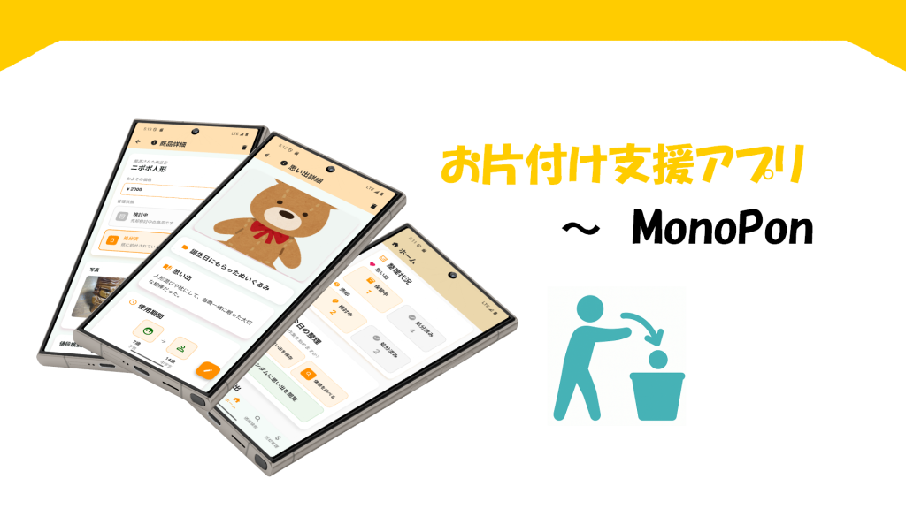
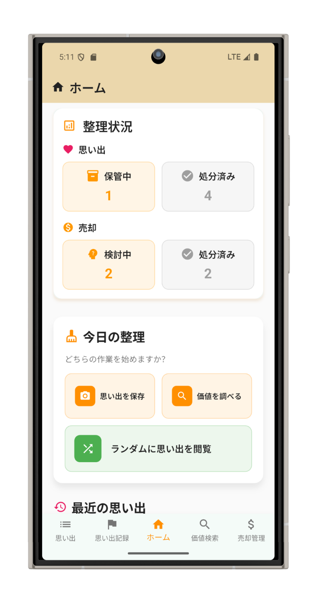
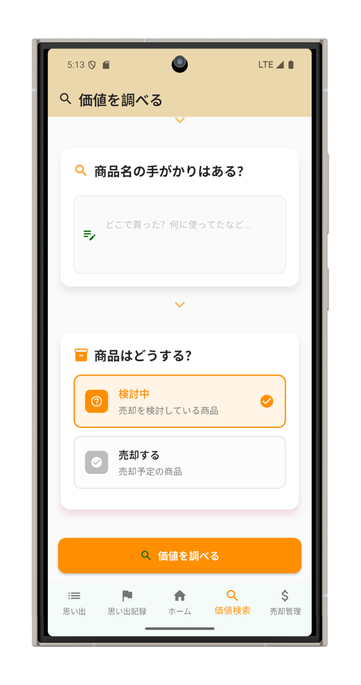
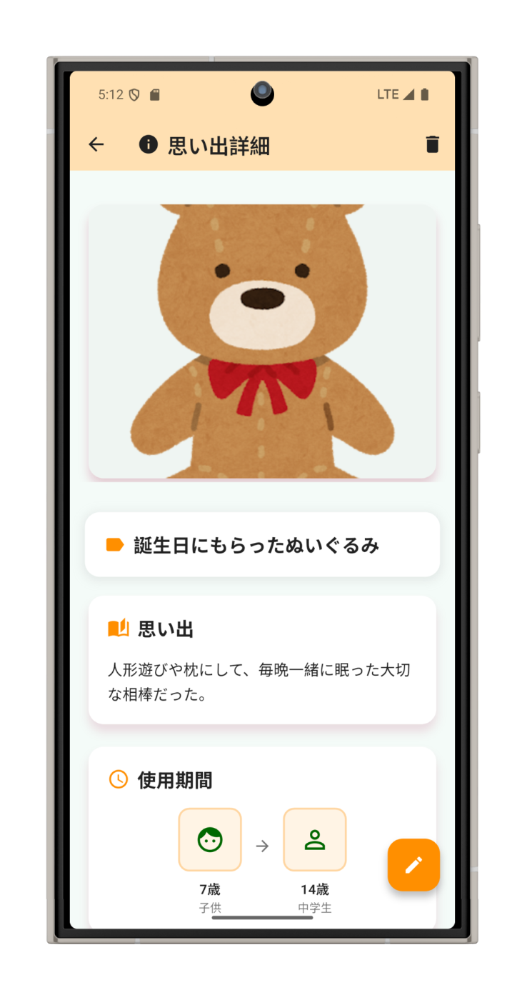
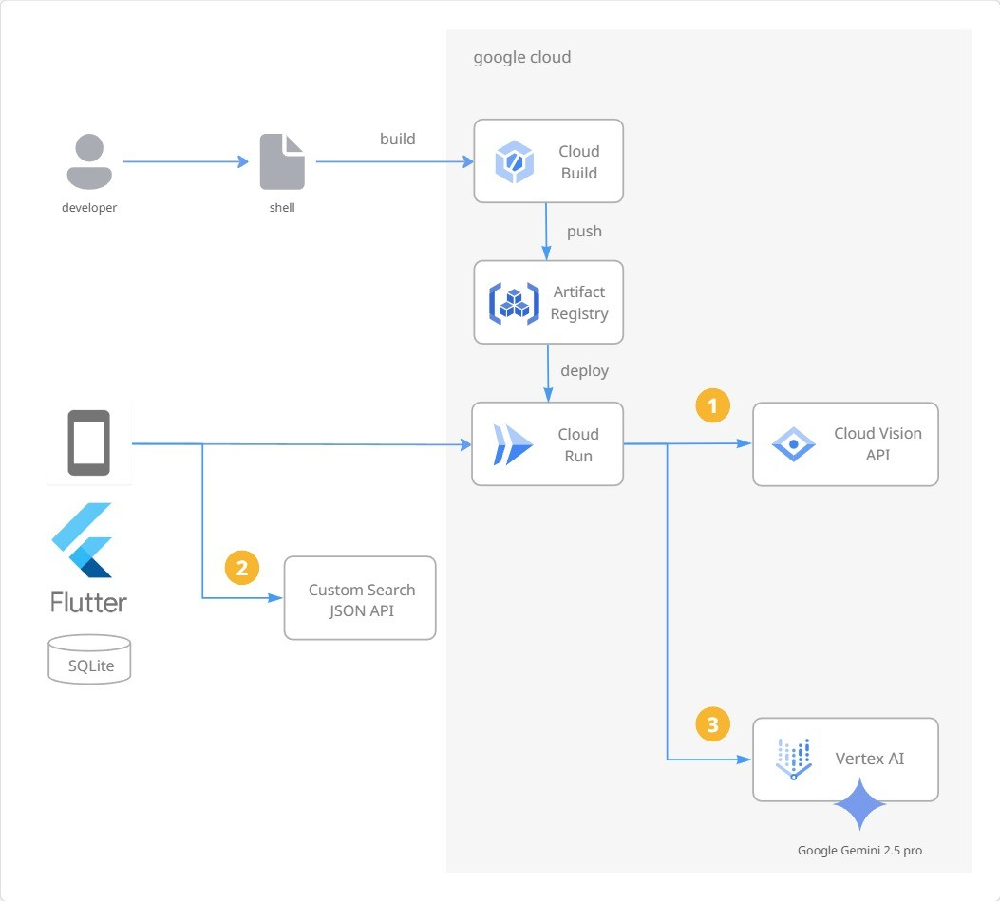

##  デモ動画

AI 技術でモノとの向き合い方を変える片づけ支援アプリ**MonoPon** のデモ動画（3 分程度）です。

<https://youtu.be/53iHHUqOQxU?si=lDFjExOrvMkwJ6-S>

##  はじめに

「思い出があるから捨てられない」「これって価値があるの？」そんな悩みを抱えながら、なかなか片づけが進まない経験はこれまでありませんでしたか？

今回の[第 3 回 AI Agent Hackathon with Google Cloud](https://zenn.dev/hackathons/google-cloud-japan-ai-hackathon-vol3) では、片づけにまつわる心理的な課題を AI 技術で解決することに取り組みました。MonoPon は、AI 画像認識による物品価値査定とデジタル思い出保存機能を組み合わせることで、物を手放すことへの不安を解消し、より良い生活空間づくりをサポートするモバイルアプリです。

##  対象ユーザーと解決する課題

###  想定ユーザー

  * **属性** : 忙しい日常の中で住環境を改善したいと思っている方
  * **現在の困りごと** : 物の価値判断ができない、思い出があって手放せない、片づけが進まない

###  解決したい課題

  1. **物の価値が分からない問題**

     * 使用用途が不明な古い物やコレクト品の適正価値が分からず処分に踏み切れない
     * 売れるものと売れないものの区別がつかない
     * 査定に出すのが面倒で放置してしまう
  2. **思い出への執着による処分困難**

     * 写真や手紙など思い出の品を物理的に保管し続けてしまう
     * デジタル化するのが面倒で先延ばしにしてしまう
     * 手放すことで思い出も失ってしまうのではという不安
  3. **片づけ作業の心理的負担**

     * 物を捨てるか売却すかなどの判断に時間がかかり作業が進まない
     * 「また今度」と先延ばししてしまう
     * 片づけ自体がストレスになっている

###  アプリの概要

**MonoPon** : AI 技術でモノとの向き合い方を変える片づけ支援アプリ

  * **コアアイデア** : AI による客観的な価値判定と安心できるデジタル保存で、物を手放すことへの不安を解消
  * **差別化ポイント** : 単なる片づけアプリではなく、心理的な課題解決にフォーカス
  * **期待される効果** : 片づけ作業時間の短縮と、ストレスの少ない片づけ体験を実現

##  主な機能と特徴

###  アプリホーム画面

###  機能紹介

####  1\. AI 画像認識による物品価値査定

  * **概要** : 写真を撮影するだけで物品の種類、ブランド、型番、おおよその市場価値を自動判定
  * **技術** : [Cloud Vision API](https://cloud.google.com/vision?hl=ja)（OCR・物体認識）+ [Vertex AI Gemini 2.5 Pro](https://cloud.google.com/vertex-ai/generative-ai/docs/models/gemini/2-5-pro?hl=ja) （LLM で総合的な価値を推論）
  * **ユーザーへの価値** : 専門知識がなくても客観的な価値判断ができ、売る・保管の判断がスムーズに

####  2\. デジタル思い出保存機能

  * **概要** : 手放す物品の写真と思い出のメモをデジタルデータとして保存
  * **技術** : sqflit（スマホ内のローカル DB として利用）
  * **ユーザーへの価値** : 物理的には手放しても思い出は失わない安心感を提供

###  想定してるアプリの使い方

  1. アプリを開くとホーム画面が表示される
  2. 「撮影」ボタンから片づけたい物品をカメラで撮影
  3. 必要に応じて思い出メモを追加（オプション）
  4. AI 分析結果（商品名、推定価値、状態評価）を確認
  5. Keep/Sell/Donate/Digital Memory の 4 つの選択肢から判断
  6. 手放す場合はデジタル思い出として写真とメモを保存

##  システムアーキテクチャ

###  アーキテクチャ図

###  技術スタック

####  フロントエンド

  * **Flutter** : スマホアプリ UI の作成に利用

####  バックエンド

  * **Cloud Run** : バックエンドのエンドポイントを作成に利用
  * **FastAPI** : エンドポイント作成に利用
  * **Custom Search JSON API** : Google 検索エンジンから検索結果を取得

####  インフラ

  * **Artifact Registry** : コンテナイメージの保存とバージョン管理
  * **Cloud Build** : ビルド

####  AI

  * **Google Vision API（Web Detection）** : 類似する画像の 情報 を取得。LLM に連携するコンテキストを広げるために活用
  * **Vertex AI （Gemini 2.5 Pro）** : マルチモーダル 処理（画像と Vision API からの情報） でプロンプトから撮影した物品の商品名を推定

####  データベース・ストレージ

  * **sqflite** : モバイル端末でのローカル DB として利用

###  想定してる処理の流れ

  1. **ユーザー入力** : モバイルアプリで物品を撮影、思い出メモを追加
  2. **AI 処理** : バックエンドの API をコールして Vision API で類似画像の 情報 を取得。Custom Search JSON API で類似する画像の WEB ページの情報を取得し、物品の写真と一緒に Gemini に渡して商品名を推定
  3. **結果生成** : AI 判定結果と信頼度をユーザーにわかりやすい形で整理
  4. **ユーザーへの提示** : AI の算出した商品情報からユーザーが保管、売却、処分するかの判断材料を提供

##  工夫点

###  UI

  * **認知不可の小さい UI** :ユーザーがアプリを開いた瞬間に「次に何をすればいいか」が迷わずわかるような画面設計を意識しました。文字入力は面倒に感じられがちなのでスライダーやボタン、並びにアイコンを多く使用し、初見でも操作方法がすぐに理解できるユーザーストーリーを重視した設計にしています

###  商品認識精度

  * **LLM に渡すコンテキストを広げた点** : 商品認識精度の向上のため、Vision API を使用した物品の類似画像を検索、Custom Search JSON API での Web ページの情報（商品説明、価格、レビューなど）を取得することで、Vertex AI （Gemini 2.5 pro） に渡すコンテキストを広げしました。

##  関連リポジトリ

  * **フロントエンド(Flutter)** : [2025-katazuke-frontend-app-ai-agent-hackathon](https://github.com/team-nup/2025-katazuke-frontend-app-ai-agent-hackathon)
  * **バックエンド(FastAPI + GCP)** : [2025-katazuke-backend-app-ai-agent-hackathon](https://github.com/team-nup/2025-katazuke-backend-app-ai-agent-hackathon)

* * *

##  おわりに

MonoPon を通して、片づけにまつわる心理的な課題を AI 技術で解決するアプローチを検討してみました。  
Flutter アプリと Google Cloud AI サービスを連携させ、物の価値判断とデジタル思い出保存の仕組みを構築することで、手放すことへの不安を和らげるアイデアを形にまででき、本ハッカソンを通して技術的に成長できたと思います。
