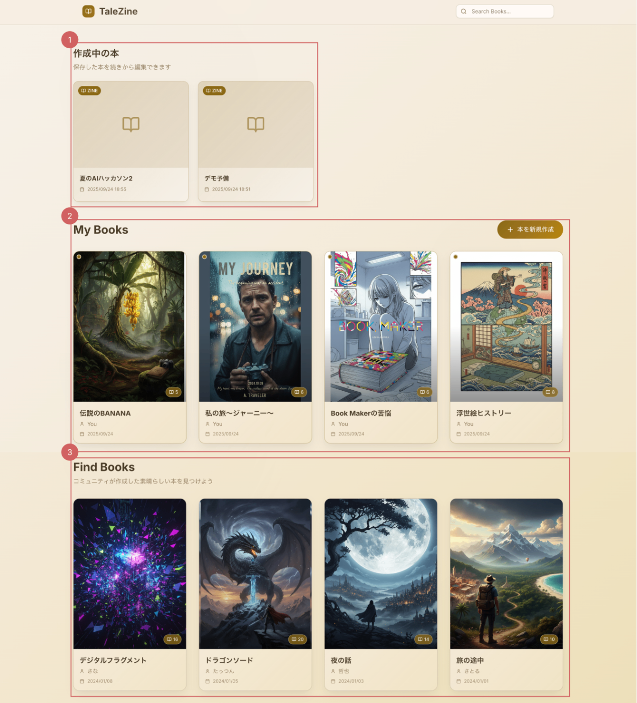
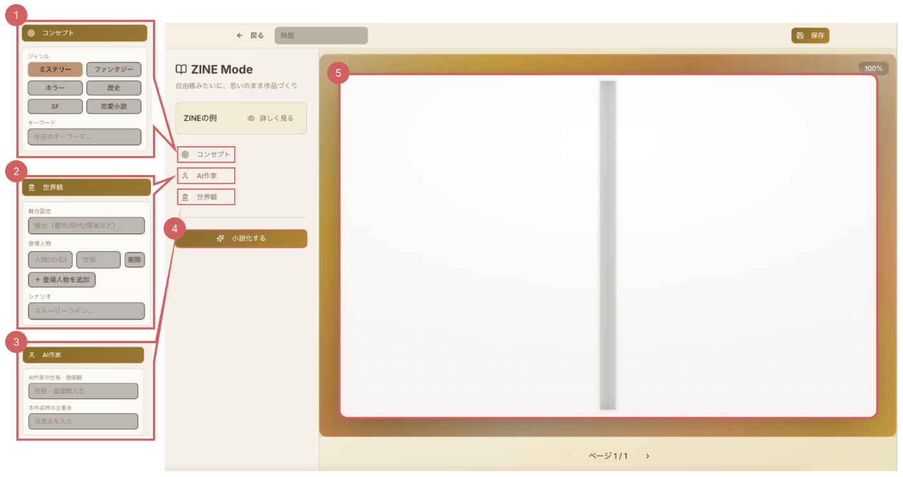
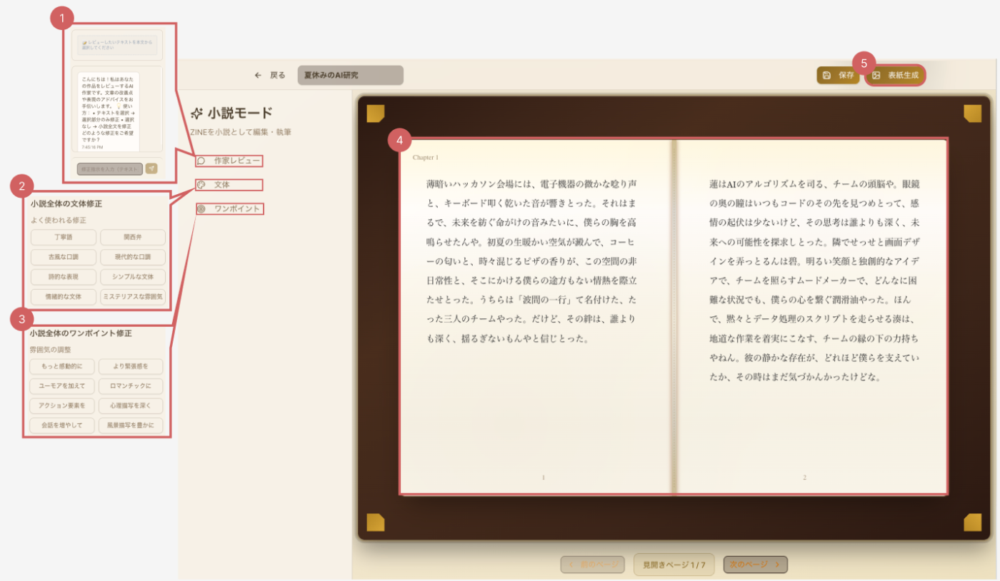
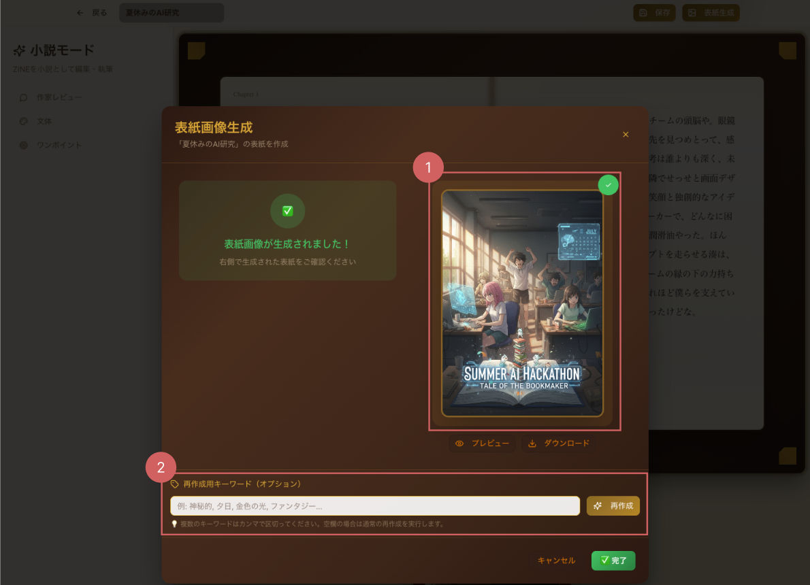
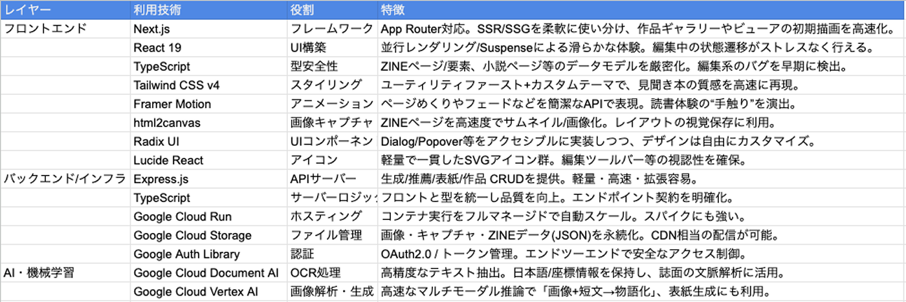

本記事は、第3回AI Agent Hackathon with Google Cloud応募作品である、オリジナル本づくりアプリ「TaleZine」 の解説記事です。

<https://youtu.be/uFS0-_xK4QU>

#  1\. はじめに

生成AIの発展により、文章作成・要約・翻訳・企画立案・思考整理までAIに任せられる時代になりました。  
その一方で、**自分の言葉で考え抜く力（言語的思考力）が弱まる** 懸念がされているのも事実です。筆者自身も生成AIを使用する中で、その影響を実感しており、現代の子供達にとっては影響がより大きいかもしれません。

ただし、生成AI時代において、言語力が不要になるわけではありません。**生成AIからより良い応答を引き出すには、むしろ高度な“言語的思考力”＝プロンプト力が不可欠** だからです。  
このサービスでは、こうした矛盾に対し、**「自分だけのオリジナルの本を作成することで、言語的思考力を向上するきっかけを生み出す」**ことを目指します。

本稿で紹介する本づくりアプリを **TaleZine** と呼びます。

#  2\. 言語的思考力を向上するにはどんな方法があるのか

言語的思考力を鍛える方法は数多くありますが、入り口として最も大切なのは**活字に慣れること、すなわち読む体験** だと考えます。  
また個人的に、言語的思考力を“**楽しく** ”鍛えるには、**読書が最適** だと考えています。実際、言語感覚に優れた人で、まったく読書をしない人は多くないでしょう。  
本サービスは、本があまり得意でない子どもたちを主対象に（もちろん本好きも大人も歓迎）読書を**“慣れる・楽しむ”**段階で支援します。

#  3\. このサービスではどういう手法を取るのか――その手法は現実的なのか

###  手法1：自分オリジナルの本づくりで“読む”を引き出す

  * ユーザーは、写真・絵・短い文章を**ZINE形式** で作成します。  
（ZINEとはテーマも形式も自由な小冊子。いわば**自由帳** のようなもの）
  * そのZINEを元に、**AIが短編小説へと昇華** します。構成や物語の流れなどの難所はAIが“足場”として支え、ユーザーは自分の「好き」や「表現したい」を置いていくことに集中できます。
  * 自分で作った本には自然と愛着が生まれ、**“作ったから読みたくなる”**循環が起きます。

###  手法2：オリジナルの本を元に言語を操ってみる

このサービスでは**AIが本の加筆修正を支援** する様々な機能があります。

  * **対話形式** でのAI作家への相談・改善提案
  * **ワンポイント修正機能** で文体や雰囲気を簡単に変更（例：アクション風→叙情的に）
  * なかなか作成の難しい**伏線の作成や山場の設計** のAI作家によるサポート

AIと対話しながら**加筆・修正（推敲）**を行うことで、**読む → 直す → また読む** という言語的思考の往復運動を体験できます。

###  手法の現実性：オリジナル本づくりの障壁をAIが解決

この手法の現実性（ユーザー受け入れについて）です。

  * **着手の障壁を低減** ：構成・語り口・章立てなどの難所を自動補助
  * **推敲の楽しさを可視化** ：AI草稿に対する自分の加筆・修正が成果として残り、成長実感につながる
  * **“読む理由”の内在化** ：自作の物語だからこそ、最後まで読みたくなる

#  4\. オリジナル本づくりアプリ「TaleZine」について

###  Home画面

  
①作成中の本  
現在取り組んでいるZINEや小説が一覧で表示されます。作業途中の作品をすぐに再開できます。

②My Books  
完成した小説が並び、表紙も一緒に表示されます。本棚に並んでいるような感覚で、自分の作品を振り返れます。

③Find Books  
友人や知り合いが作った本を共有し合えるスペース。自分の作品を見てもらったり、他の人の作品からインスピレーションを得ることができます。

###  ZINE作成画面

①コンセプト設定  
ZINEを小説に変換するときの方向性を設定します。キーワードだけでなく「冒険ものにしたい」「日常的な物語にしたい」といったコンセプトを指定可能です。

②世界観  
物語の舞台や登場人物を自分で設定できます。AIによる小説化に、自分らしい好みを反映することができます。

③AI作家  
ZINEに配置した画像や文章をAIが解析し、小説へと昇華させます。まるでAI作家と共作しているような体験ができます。

④小説化ボタン  
押すと、ZINEの内容と設定をもとにAIが小説を自動生成してくれます。

⑤ZINE作成エリア  
画像を貼ったり文字を入力したりして、自分だけのZINEを自由に作り上げられるエディタです。思い出やアイデアをそのまま形にできます。

###  小説作成画面

  
①作家レビュー  
AI作家と対話形式で小説を修正できます。全体の流れを調整することも、段落や1文単位でピンポイントに直すことも可能です。

②文体  
「やわらかい雰囲気に」「もっとテンポよく」など、好みの文体をAIで全ページに反映できます。

③ワンポイント  
AI機能を用いて自分好みの小説の流れや展開に変更できる。

④小説作成エリア  
ZINEや設定した情報をもとにAIが生成した小説本文が表示されます。

⑤表紙生成  
小説やZINEの内容に合わせて、AIが表紙を自動で作成します。Gemini Flash 2.5 Image Preview (Nano Banana) を利用しています。

###  表紙作成画面

  
①表紙作成エリア  
AIが生成した表紙画像が表示されます。

②表紙再作成エリア  
好みに合わない場合は、キーワードや指示を入力して再生成できます。気に入るまで試せる柔軟さがあります。

#  5\. 実装について

###  全体アーキテクチャ

※この図は GCP 上での配置と通信経路を示しています。各サービスの役割は「全体の流れ」で具体化します。

###  技術スタック

##  全体の流れ

まず大前提として、ユーザーが操作するのは Next.js / React をベースにした Web アプリケーションです。ここから小説生成や ZINE 作成といったリクエストが発行され、それが HTTPS を介して Cloud Run 上に動いている Express API に届きます。フロントから見れば「生成ボタンを押すと裏側で処理が走る」というシンプルな体験ですが、内部では複数のステップを踏んでいます。

###  1\. リクエストの受け取りと処理の分岐（GCP: Cloud Run / OAuth 2.0）

Express API では受け取ったリクエストを一旦整理し、どの処理をどこに渡すかを決めます。  
比較的軽い処理（例えばメタ情報の整理など）はその場で完結させ、逆に時間や計算リソースを食う処理は AI パイプラインへ振り分ける仕組みです。ここで単なるルーティングではなく「どの処理をどのレイヤーに回すべきか」を判断しているのがポイントです。

###  2\. AIパイプラインでの並列処理（GCP: Document AI / Vertex AI / Generative AI SDK）

AIパイプラインは複数のモジュールが役割を分担しています。

  * Document AI で画像から文字情報を抽出
  * Vertex AI Vision で画像にキャプションを付与し、特徴量を生成
  * 独自実装した空間解析モジュールで「画像とテキストがどう関係しているか」を突き合わせ
  * 最後に Vertex AI Gemini が文章生成や推敲を担当し、場合によっては 1.5 Pro や Generative AI SDK にフォールバックする

**これらは直列ではなく並列的に進むため、速度と冗長性のバランスが取れるようになっています。失敗したときのフォールバック設計もあって、安定した生成体験を支えています。**

###  3\. ストレージへの保存とレスポンス（GCP: Cloud Storage）

生成された本文や表紙画像は Cloud Storage に保存されます。用途ごとにバケットを分けていて、

  * 本文や ZINE データは `zines-bucket`
  * 生成した表紙は `covers-bucket`
  * 中間生成物は `temp-processing`

といった具合です。保存が終わると、その参照 URL や生成済みデータが Express API を通じてクライアントに返却されます。

###  4\. クライアントへの反映と体験（GCP: Web Application / localStorage）

クライアント側ではレスポンスを受け取り次第、即座に UI が更新されます。ユーザーは生成結果をリアルタイムで確認でき、さらにインライン編集や再生成のリクエストも行えます。結果的に「裏側で AI が色々な処理をしている」ことを意識させずに、自然な体験を実現しています。

###  5\. ログと監視（GCP: Cloud Logging）

最後に忘れてはいけないのが運用の観点です。各種 API 呼び出しのログやエラー、AI の呼び分け結果は Cloud Logging に集約されます。

全体を通して言えるのは、「ユーザーにはシンプルな体験を見せつつ、裏側は複数のレイヤーとフォールバック設計で堅牢性を確保している」という点です。

* * *

##  6\. 工夫・苦労した点

###  1) 素材前処理で“迷わないAI”にする

最初は、ZINEは自由度が高いぶん、作者の意図をAIが誤読しやすいという課題がありました。OCRの生テキストやキャプションをそのまま投げると、AIの出力がブレやすいことに悩みました。そこでAIに入れる前の“整え”を徹底しています。具体的には、Document AI（OCR）と画像キャプション（Vertex AI/Gemini）を並列で回し、さらに位置関係（上下・左右・距離）を見た空間解析の結果を足し合わせます。そのうえで、**紛れ込んだUI文言などはフィルタで削り、「必ず拾ってほしい事実」と「雰囲気として伝えたい要素」を短い日本語のヒント文にまとめ直してからプロンプトへ。手間はかかりますが、モデルの迷いが減って安定した出力になりました。**

###  2) “手触りのある”小説づくりのために、AIと一緒に部分修正する

一気に全部をAIに書き換えてしまうと、自分の文体やリズムが消えてしまう。そこでこのアプリでは、直したい場所だけを選んでAI作家に相談できるようにしました。たとえば「この段落のテンポだけ速く」「この比喩は残して言い回しだけ柔らかく」など、ピンポイントの指示を添えて部分修正を頼めます。AIは提案を返し、最終的な採否や細かい調整は人間が決める前提です。**つまり“丸投げ”ではなく、自分で作り、必要なところだけAIに手伝ってもらう設計。結果として、作者の声を保ったまま、仕上がりは着実に良くなるという落としどころが見つかりました。**

#  7\. まとめ

皆さんも小さい頃、自由帳や白い紙に絵や文字を自由に書いた経験は一度はないでしょうか。  
**あの自由帳が、そのまま一冊の“本”になる。** そのワクワクを、AIを活用することで提供できると考えています。

このサービスだけでは、言語的思考力を飛躍的に向上することは難しいかもしれません。  
ただ、このサービスで**「本を作る体験を入り口に、言語的思考力を向上するきっかけを生み出す」**。  
これを **TaleZine** を通じて提供していきたいと考えています。
