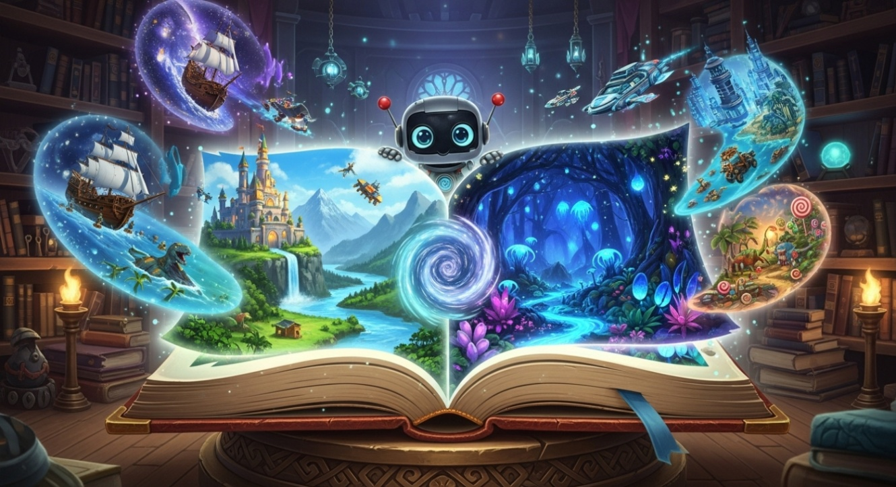
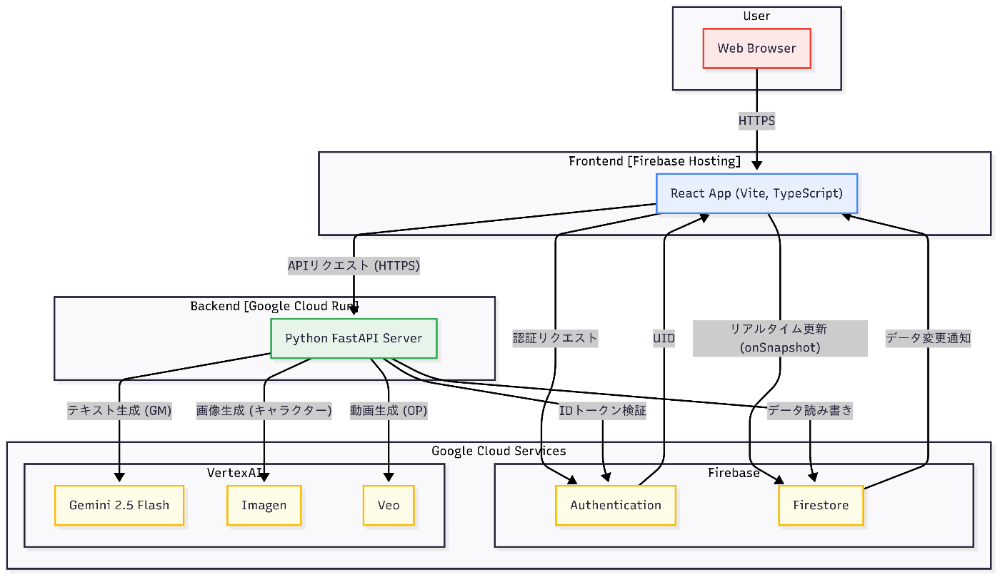

##  はじめに

第3回 AI Agent Hackathon with Google Cloudに参加し、「AI TRPG Agent」というWebアプリケーションを開発しました。

###  対象ユーザーと課題

本プロジェクトでは、以下のユーザー像を想定しています。

  * TRPG（テーブルトークRPG）に興味はあるが、経験者が周りにおらず、とっつきにくいと感じている初心者。
  * リアルでTRPGをやろうとしても、スケジュール調整がつかず、結局諦めてしまうプレイヤー。
  * 従来のテキストベースのみのやり取りでは没入感がなく、楽しむことが難しいと感じているプレイヤー。

TRPGの魅力は、参加者全員で協力して物語を創り上げる「共創体験」にありますが、その体験には「GMの高い専門性」と「参加者間のスケジュール調整」、「テキストベースの進行によるとっつきにくさ」という3つの大きなハードルが存在します。

※TRPGとは...?  
TRPGとは「テーブルトークRPG」の略で、参加者がサイコロやルールに従い、ゲームマスター（GM）と共に会話と想像力で物語を「創り上げていく」アナログゲームです。プレイヤーはそれぞれキャラクターを演じ、GMの導く物語に沿って行動を決定します。明確な勝ち負けはなく、参加者全員で「楽しい時間」を共有することが最も重要な目的です。

###  解決策と本プロジェクトの特徴

上記の課題に対し、「**AIをGMとし、Web上でマルチモーダルなリアルタイムマルチプレイを可能にするアプリケーション** 」をソリューションとして提案します。これにより、GMの負荷をなくし、誰もがいつでも気軽に楽しいTRPGの共創体験を得られる環境を目指しました。

本プロジェクトの主な特徴は以下の3点です。

  1. **自律的なAI Agent** : GeminiのFunction Callingを活用し、AIがゲームルールを理解・実行します。
  2. **リアルタイム・マルチプレイヤー** : Firestoreを用い、複数人での同時プレイと状態同期を実現します。
  3. **マルチモーダルな体験** : Imagenによる画像生成を組み込み、テキストとビジュアルで物語への没入感を高めます。

特にAI-TRPGアプリケーションとして、リアルタイムマルチプレイや動的な情景画像の生成、FunctionCallingによるダイス判定要素を組み込んでいるのは、新規性があるのかなと思います。

AIが難易度の高いGMを担当し、初心者が遅延なくリアルタイムで身内と没入感のあるシーンでワイワイできるのは、TRPGというジャンルのハードルを大きく下げ、今後のTRPGの発展に貢献することができるのではないかなと思います。

※TRPGはGMによる主観要素がありますが、AIによるGMは突飛な質問に対しても、客観的な回答を返してくれるため、テストプレイをしていてとても楽しかったです！

以降では、これらの特徴を実現するためのシステムアーキテクチャと、採用した主要技術について詳述します。

##  プレイデモ動画

<https://youtu.be/BQyPSpzJ7SQ>

##  システムアーキテクチャ

開発したシステムのアーキテクチャは以下の通りです。フロントエンドとバックエンドを分離し、状態同期をFirebase Firestoreに集約させる構成としました。

  * **フロントエンド** : React (TypeScript), Vite, Firebase Hosting
  * **バックエンド** : Python, FastAPI, Cloud Run
  * **データベース / リアルタイム通信** : Firebase Firestore
  * **AI** : Vertex AI (Gemini 2.5 flash, Imagen, Veo)

バックエンドはステートレスなAPIとして設計し、ゲームの永続的な状態はすべてFirestoreに保持します。プレイヤーのアクションはFastAPI経由で受け付け、AIによる処理を行った後、結果をFirestoreに書き込みます。フロントエンドはFirestoreの変更をリアルタイムに購読し、UIを更新する責務を負います。

##  主要技術と選択理由

###  1\. AI Agentの自律性：Gemini と Function Calling

ゲームマスターとしてのAIの自律性を実現するため、Vertex AIのGemini 2.5 flashとFunction Callingを採用しました。

TRPGでは、「ダイスを振る」「ステータスを確認する」といった、物語の進行とは別のルールベースの処理が頻繁に発生します。

Function Callingを用いることで、これらのルール処理をPythonの関数として定義し、その説明を自然言語でGeminiに提供するだけで、AI自身が対話の文脈から適切なタイミングで関数を呼び出すことが可能になりました。例えば、「力づくで穴を掘る」というプレイヤーの発言に対し、Geminiが自律的に`roll_dice`関数を呼び出して成功を判定する、といった挙動が実現できます。これにより、柔軟なユーザー入力に対応できるようになりました。

###  2\. リアルタイム性の実現：Firebase Firestore

複数プレイヤー間でのリアルタイムな状態同期には、Firestoreを選択しました。主な理由は、そのリアルタイムリスナー機能と、開発の容易さです。

WebSocketを用いたカスタム実装も選択肢にありましたが、ハッカソンという限られた開発期間を考慮すると、自前で実装するコストは大きいと判断しました。（1敗）  
Firestoreを利用することで、簡単にデータベースの変更をリアルタイムにUIへ反映させることができました。

結果として、プレイヤーの参加、投票、チャットといったインタラクションが、ストレスなく全参加者の画面で同期される体験を、短期間で実現することができました。

###  3\. マルチモーダルへの挑戦：Imagen と Veo

表現の幅を広げる試みとして、画像生成AIのImagenと動画生成AIのVeoの組み込みも行いました。

Imagenは、Geminiが生成した物語の情景を説明するプロンプトを受け取り、挿絵を生成する役割を担います。これにより、テキストだけでは伝えきれない雰囲気を視覚的に補強する効果が得られました。

Veoについては、ゲームのオープニング&エピローグ動画を動的に生成する機能の実装に挑戦しました。バックエンドのコードは一応完成させたものの、ハッカソン期間中にAPIの429 Quota上限エラーが解決せず、実際にAPIを呼び出して動作させるまでには至りませんでした😿  
これは今後の課題となります。（プロビジョンドスループットとか？）

##  **今後の拡張性について**

本アプリケーションは、将来的な機能追加やユーザー規模の拡大に柔軟に対応できる、持続可能なアーキテクチャを採用しています。

###  **1\. 技術的拡張性：柔軟なデータモデルの採用**

データベースとして、スキーマレスなNoSQLデータベースであるCloud Firestoreを採用しています。これにより、以下のようなメリットが生まれます。

  * **迅速な機能追加** : 新しいゲーム要素（例：アイテム、スキル、キャラクター属性）の追加に伴うデータ構造の変更に対して、大規模なマイグレーション作業を必要とせず、迅速かつ柔軟に対応可能です。
  * **開発の俊敏性** : アプリケーションを停止させることなく新しいデータフィールドを拡張できるため、アジャイルな開発サイクルを維持し、継続的にサービスを改善していくことができます。

###  **2\. 運用・コスト面の拡張性：サーバーレスアーキテクチャの活用**

バックエンドのCloud RunおよびデータベースのCloud Firestoreは、いずれもサーバーレスのマネージドサービスです。このアーキテクチャは、運用面で大きな利点をもたらします。

  * **優れたスケーラビリティ** : ユーザー数やアクセス数の増減に応じて、コンピューティングリソースが自動的にスケールするため、突発的なトラフィック増加にも安定したパフォーマンスを維持します。
  * **コスト効率の高さ** : リクエストがない時間帯にはコンピューティングリソースがゼロ近くまでスケールダウンするため、インフラの維持コストを最小限に抑えることができます。手厚い無料利用枠の活用により、サービス初期段階では特にコストを意識することなく運用が可能です。
  * **運用負荷の軽減** : サーバーのプロビジョニング、OSのパッチ適用、セキュリティ管理といった煩雑なインフラ運用をGoogle Cloudに任せることができます。これにより、開発チームはアプリケーションの価値向上に集中できます。

以上の点から、本アプリケーションの基盤は、技術的な柔軟性と、低コストかつ高効率な運用を両立しており、将来の成長を見据えた拡張性の高い設計になっています。

##  まとめと今後の課題

本プロジェクトでは、GeminiのFunction CallingとFirestoreのリアルタイム機能を組み合わせることで、AIが自律的にルールを処理し、かつ複数人がリアルタイムで参加できるTRPGアプリケーションのプロトタイプを開発しました。

今後の技術的な課題としては、以下の点が挙げられます。

  * **Veoの組み込み** : Quotaの問題をクリアし、動画生成機能を完全に動作させること。
  * **Function Callingの拡充** : より多彩なゲームルールの判定（例：戦闘処理、アイテムの効果判定など）をツールとして追加していくこと。
  * **BGM生成** : ゲームの展開に適したBGMの動的組み込みをすること。

##  感想

個人的な技術的所感として、Firestoreの便利さを改めて実感しました。以前、第2回のハッカソンに出場した際に、WebSocketを用いたリアルタイム通信の実装を試みましたが、その実装難易度の高さに苦戦した経験がありました。今回はFirestoreを採用したことで、リアルタイム性が求められるアプリケーション開発の生産性が大幅に向上することを体験できました。

今回、目標としていたコア機能（AI Agentとリアルタイムマルチプレイ）実装を期間内に完成させることができ、大きな達成感を得られました。

最後に、このような貴重な機会を提供してくださった運営の皆様に、心より感謝申し上げます。
