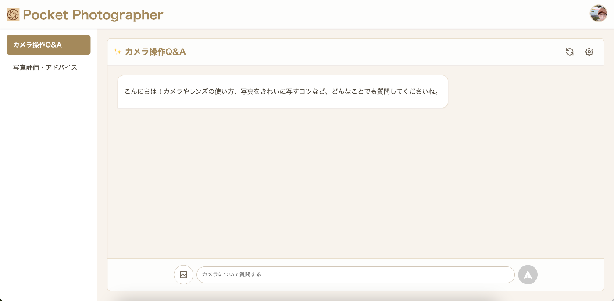
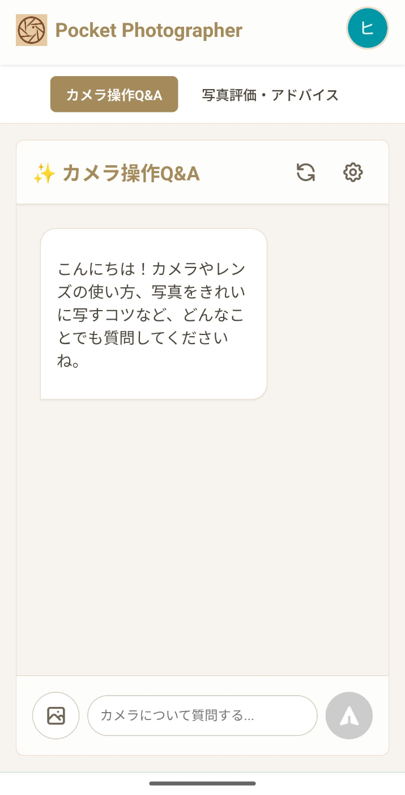
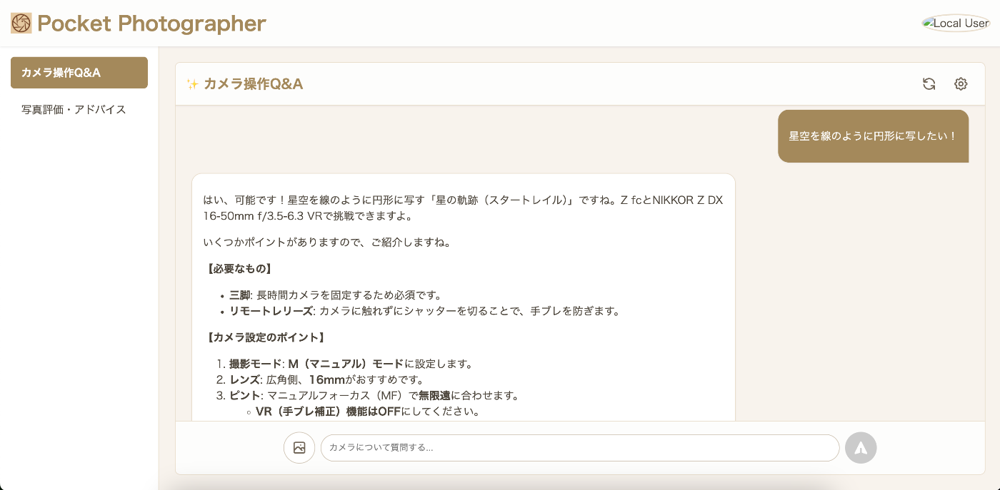
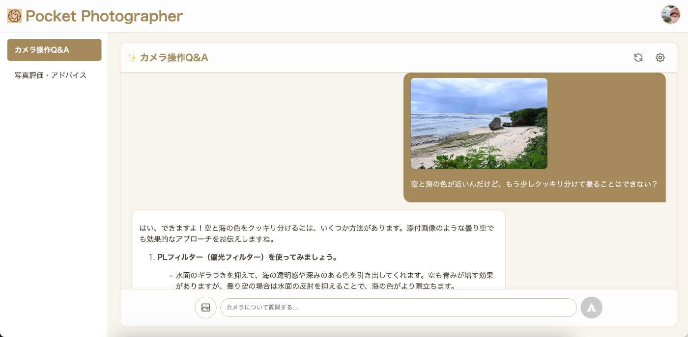
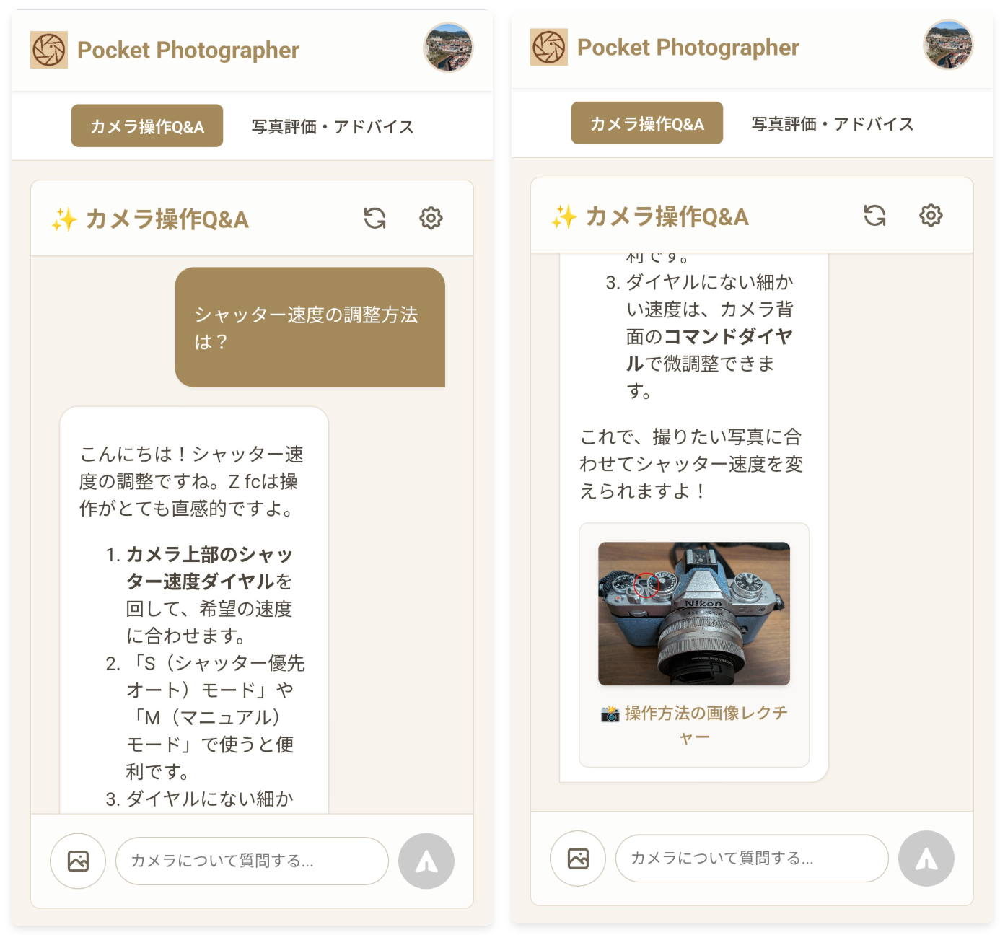
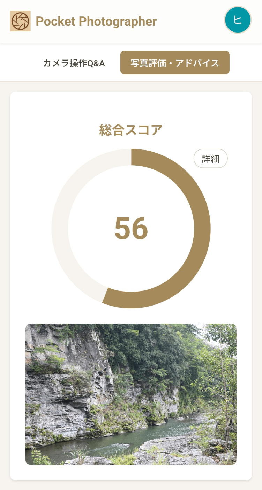
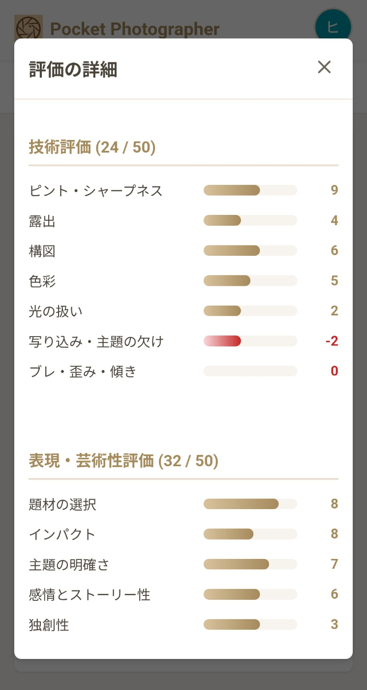
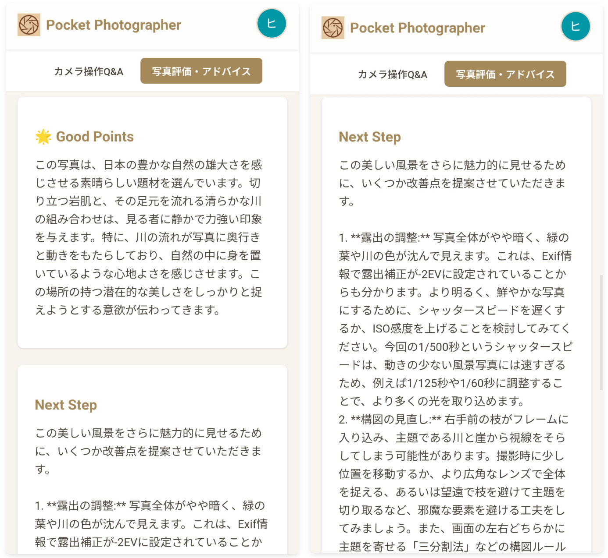
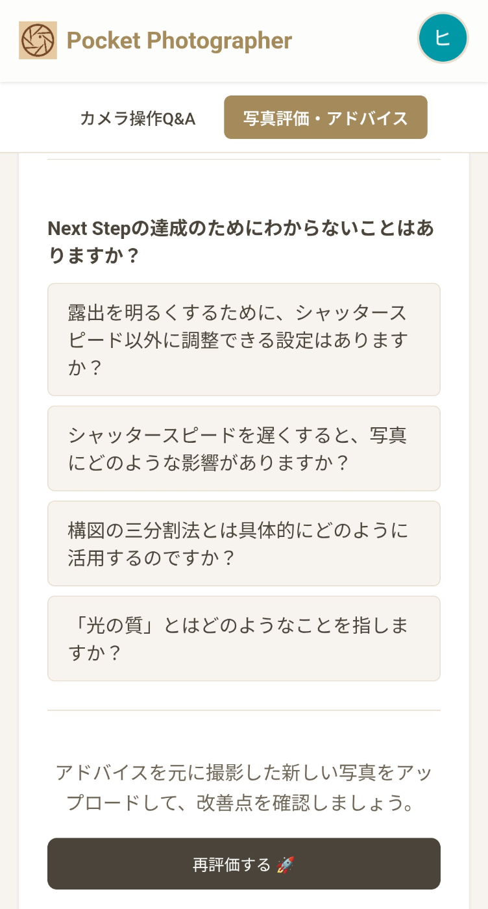
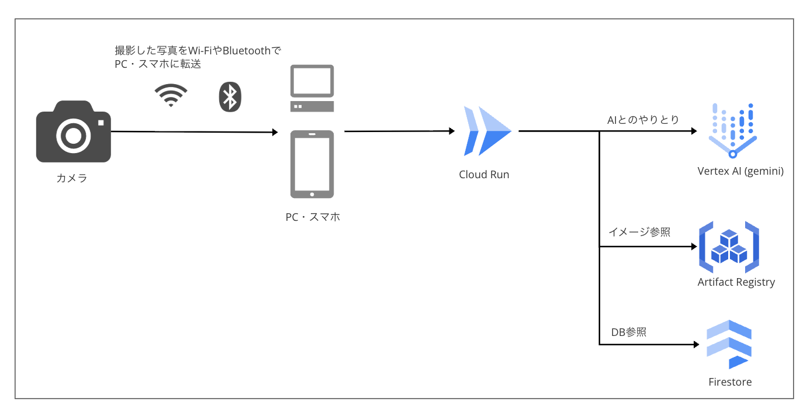

##  はじめに

この記事は、[第3回 AI Agent Hackathon with Google Cloud](https://zenn.dev/hackathons/google-cloud-japan-ai-hackathon-vol3)への応募作品として開発した、AIカメラサポートエージェント「Pocket Photographer」の紹介記事です。

##  開発背景：カメラ初心者が直面する共通の課題

開発のきっかけは、私自身がカメラを始めた際に感じた、いくつかの実体験に基づいています。  
スマホカメラの高性能化や編集技術が高度化・手軽化している中ではありますが、「スマホでは撮れない写真が撮れる」「カメラを使うことで、撮影する行為に意識を向けることができる(撮影体験)」といったような点に惹かれ、Nikon Zfcというエントリーモデルのデジタルカメラを購入しました。  
しかし、初めて本格的なカメラを手にして撮影を試していたのですが、以下の **"壁"** があると感じました。

  * **操作の壁:** スマホとは異なり、カメラには多数のボタンがあります。また写真を撮る上で、カメラの操作と紐づく専門用語(例：絞り、ISO感度、シャッタースピード...)もあり、難易度が高いです。そして説明書を読んでも、目的の撮影方法にたどり着くのは容易ではありません。例えば「星空の軌跡を撮る」といった目的があっても、それを実現するための具体的な設定方法を独学で見つけるのは困難です。
  * **評価の壁:** 撮影した写真が客観的に見てどうなのか、改善点はどこにあるのかを把握することが難しく、成長を実感しにくいという課題がありました。
  * **学習方法の壁:** カメラの学習は、書籍や専門家からの指導といった伝統的な手法が中心で、他の分野に比べてテクノロジーを活用した新しい学習方法が不足していると感じていました。

これらの課題を解決するため、**"ポケットに入るプロフォトグラファー"** をコンセプトに、対話形式で疑問を解消し、具体的なフィードバックを提供するAIエージェント「Pocket Photographer」を開発することとしました。

##  機能紹介

本アプリケーションは、Webアプリケーションとして実装しました。  
PC/スマホ両方で利用できるよう、レスポンシブデザインを採用しています。  
  

課題を解決するための機能としては、以下二つを搭載しています。

###  1\. カメラ操作Q&Aエージェント 💬

チャット形式でカメラの操作に関する質問に答える機能です。

  * **使用機材特化の回答:** 使用するカメラとレンズを登録することで、その機材の取扱説明書をAIが参照することにより、正確な情報に基づいた回答を生成します。RAGという技術を用いて実現しています。  

  * **多様な質問に対応:** 「シャッタースピードの調整方法は？」といった具体的な質問だけでなく、「星空を線のように円形に写したい」といった抽象的な要望まで、AIが必要な撮影技術や設定を判断して提案します。  

また、質問に画像を付与することもでき、撮影した写真から直接アドバイスを引き出す、といったユースケースもサポートしています。  

  * **画像レクチャー機能:** AIが回答時に「ボタンなどの用語が含まれる」と判断した場合、操作が必要なボタンの位置を画像上で示し直感的な理解をサポートします。  

###  2\. 写真評価・アドバイスエージェント 📸

撮影した写真をAIが分析し、評価とアドバイスを提供する機能です。  

  * **多角的なスコアリング:** 写真を以下の2つの観点から100点満点で採点し、客観的な評価を提供します。芸術性を評価させている部分がポイントです。

    * **A) 技術評価 (50点満点):** ピント、露出、構図、色彩など、技術的な完成度を評価します。
    * **B) 表現・芸術性評価 (50点満点):** 題材の選択、インパクト、ストーリー性など、芸術的な価値を評価します。  

  * **具体的なアドバイスの提示:** 評価と共に、アドバイスと改善点を「Next Step」として具体的に提示。これにより、次の撮影に向けた明確な目標設定を支援します。写真に含まれるexifという「どのカメラで、どんな設定で撮ったか」という情報が入ったメタデータ情報を渡すことで、正確なスコアリングやレビューに繋げています。  

  * **Q &A機能との連携:** アドバイスに含まれる専門用語に難しい点があるとAIが判断した場合、想定質問を返却します。この質問をクリックすることで手軽にQ&Aエージェントに質問でき、学習サイクルをシームレスに回すことが可能です。  

  * **再評価** Next Stepを参考にして撮り直した場合、再評価をさせることができます。点数の増減比較や、1枚目のNext Stepが達成されたのか？という観点で評価を確認することができます。

###  デモ動画

<https://www.youtube.com/watch?v=CqpcEXCK-yU>

##  システムアーキテクチャ

本システムは、以下技術により構築しました。

最近のカメラにはBluetoothやWi-fiとの連携ができるモデルが多く、スマートフォンに自動で写真を連携することができます。これにより、カメラで撮った写真をスマホで立ち上げたPocket Photographer でスムーズに利用することができます。

今回採用した技術スタックは以下になります。

  * **フロントエンド:** TypeScript

  * **バックエンド:** Go

  * **AI:**

    * **Gemini 2.5 Pro/Flash:**
  * **アプリケーション実行環境:** Cloud Run

  * AIに関しては、主に自然言語での回答生成はFlash、写真を入力/出力とするやり取りはProで使い分けました。Q&Aなど速度優先にしたいものにはFlash、写真採点などの精度を上げたいケースではProを選択しています。

  * 実行環境にはCloud Runを採用しました。業務で利用経験があったのも大きいのですが、小規模アプリケーションに適している点、デプロイ時にURLが自動発行される点などが選定理由です。またタグ付きリビジョンを活用することで、本番環境に影響を与えず変更点を手軽に適用してチェックできる点も気にいっています。

##  まとめ・所感

AIの画像処理の向上から着想を得たプロダクトでしたが、想定した以上に精度が高い機能を作り上げることができました。写っているものの正確な判断や写真家から見た(ような)的確なレビューをしてくれる点は純粋に「すごい」と感じました。開発背景に記載した、「操作の壁」「評価の壁」「学習方法の壁」は2つの機能で越えることができたと思います。  
今回は開発にもGeminiを全面的に利用しました。コードの9割程はGeminiに書かせたものになります。スムーズにコードを書くための工夫や、他AIとの精度検証なども体験でき、良い機会となりました。
