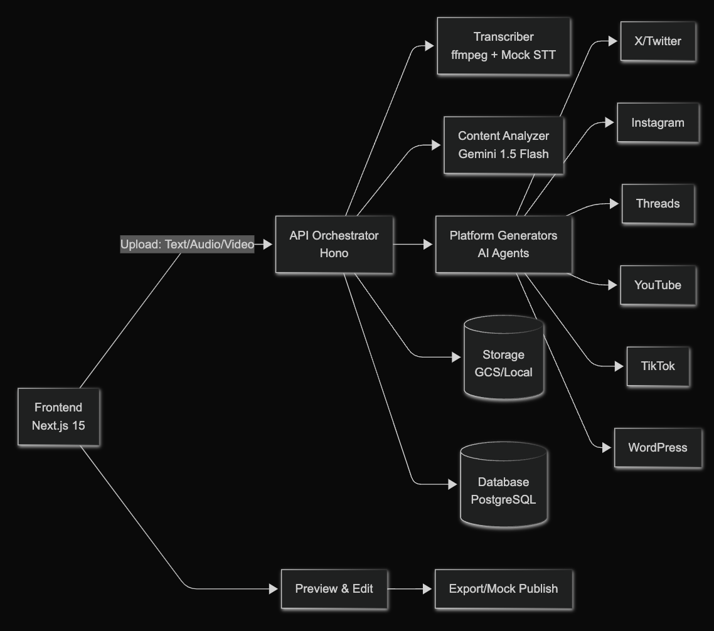

##  デモ動画

<https://youtu.be/TIBre0EXrn8>

##  はじめに

本記事は、第3回AI Agent Hackathon with Google Cloud応募作品である、ワンソースマルチユース支援サービス「One-to-Multi Agent」の解説記事です。

##  背景 - コンテンツ発信の壁

私はこれまで何度も「発信を習慣にしたい」と思ってきました。  
でも実際には、1 つのアイデアを複数の SNS に広げるのはとても骨の折れる作業です。

  * X では短く鋭い言葉に削る必要がある
  * Instagram では写真やビジュアルを準備し、ハッシュタグを考えなければならない
  * YouTube は動画説明文やチャプター構成が欠かせない
  * WordPress は長文記事として整理が求められる
  * TikTok や Threads はまた違う文脈とトーンが必要になる

結果として、「発信したい」という気持ちよりも「どう整えるか」という作業に時間を奪われてしまう。これが多くの人がぶつかる壁ではないでしょうか。

既存の SNS 運用ツールは、スケジューリングや一括投稿には強いけれど、**各プラットフォームに最適化されたコンテンツを自動でつくる** ことまではできません。  
ここに大きなギャップがあります。

##  One-to-Multi Agent とは

**One-to-Multi Agent** は、1 つのソース（テキスト・音声・動画）から、各 SNS に合わせた投稿文章を自動生成するエージェントです。

AI がソースを要約し、キーポイントを抽出し、それぞれのプラットフォームに最適化して変換。数分で複数 SNS 用の発信が整う仕組みです。

このツールが目指すのは「発信の代替」ではなく、**「発信者のパートナー」** 。  
あなたのアイデアを広げ、現実の発信活動をもっと豊かにする存在です。

##  主な特徴

  * **マルチモーダル入力** ：文章・音声・動画、どれでも OK
  * **プラットフォーム最適化** ：X, Instagram, Threads, YouTube, TikTok, WordPress 対応
  * **シンプルな UX** ：入力 → プラットフォーム選択 → ワンクリック生成
  * **AI による分析・要約** ：タイトル、要点、トーンを自動抽出
  * **ブランドに合わせた調整** ：カスタムプロンプトで「自分らしさ」を保った発信

##  ユーザー体験の流れ

  1. **コンテンツを入力**  
旅行日記、製品紹介、日常の学び、愚痴…どんな形でもいい。文章・動画・音声をアップロードします。

  2. **プラットフォームを選ぶ**  
発信したいプラットフォームをチェックするだけ。

  3. **生成ボタンをクリック**  
数秒～数十秒後、各 SNS に最適化された投稿文が一覧で表示されます。

  4. **確認して編集**  
必要なら編集も可能。そのまま発信の準備が整います。

これまで 2 時間かかっていた作業が、15 分で終わる。  
このシンプルな体験が、発信を「特別な作業」から「日常の一部」へ変えていきます。

##  アーキテクチャ

###  システム構成図

###  リポジトリ構造
    
    
    one-to-multi-agent/
    ├── apps/
    │   ├── web/          # Next.js 15 (App Router)
    │   └── api/          # Hono API Server
    ├── packages/
    │   ├── core/         # 共通型定義・ビジネスロジック
    │   ├── ai/           # AI処理クライアント (Gemini)
    │   └── adapters/     # プラットフォームアダプター (Mock実装)
    └── infra/
        ├── docker/       # 開発環境構築
        └── sql/          # データベーススキーマ
    

###  技術スタック

  * **Frontend** : Next.js 15, React 19, TypeScript, Tailwind CSS 4
  * **Backend** : Hono, Node.js 18+, TypeScript
  * **AI** : Google Gemini 1.5 Flash API（マルチモーダル対応）
  * **Storage** : Google Cloud Storage / ローカルストレージ（抽象化レイヤー）
  * **Database** : PostgreSQL 15（Drizzle ORM）
  * **Authentication** : NextAuth 5（Google OAuth）
  * **Media Processing** : ffmpeg（動画・音声変換）
  * **Infrastructure** : Docker, Google Cloud Run, Cloud SQL

##  各プラットフォーム向けの最適化例

  * **X（Twitter）** : 280 文字以内、絵文字・ハッシュタグ最適化
  * **Instagram** : 最大 2200 文字のキャプション、30 個までのハッシュタグ
  * **Threads** : 会話的なトーン、複数投稿の連続性
  * **YouTube** : SEO 最適化されたタイトル、構造化された説明文、チャプター
  * **WordPress** : 見出し階層、内部リンク、メタデータ
  * **TikTok** : トレンドを意識した短文、Gen-Z 向けの語彙

##  ユーザーの声

  * 「SNS 投稿準備の時間が 1/5 になった」
  * 「副業で忙しくても毎日発信できるようになった」
  * 「アイデアを寝かせず、その日のうちに届けられる」

こうした小さな変化が、発信者の継続を支え、世界にもっと多様な声を届けることにつながります。

##  今後の展望

  * スケジュール投稿
  * 画像・サムネイル自動生成
  * リアルタイム分析ダッシュボード
  * A/B テスト機能
  * エンゲージメント分析

##  まとめ - AI Agent が現実を豊かにする

AI は人間の代わりにすべてを行う存在ではありません。  
むしろ、**人がやりたいことを後押しし、余計な手間を取り除き、創造性や発信力を増幅させるパートナー** です。

One-to-Multi Agent は、あなたの言葉や映像を出発点に、複数の SNS へと橋渡しをします。  
それによって、これまで「時間がないから」と諦めていた発信が可能になる。  
そして、小さな声が広がり、現実の世界が少しずつ豊かになる。

私たちが描く未来は、「AI が人を置き換える」社会ではなく、**「AI が人と共に現実を豊かにする」社会** です。  
あなたの発信が、その未来を形づくる一歩になります。

ぜひいいね/コメントをお願いします！

* * *

チーム名：筋肉で伸ばすアルゴリズム  
チームメンバー：櫻岡紘典、松田航佑  
プロダクト名：One-to-Multi Agent
