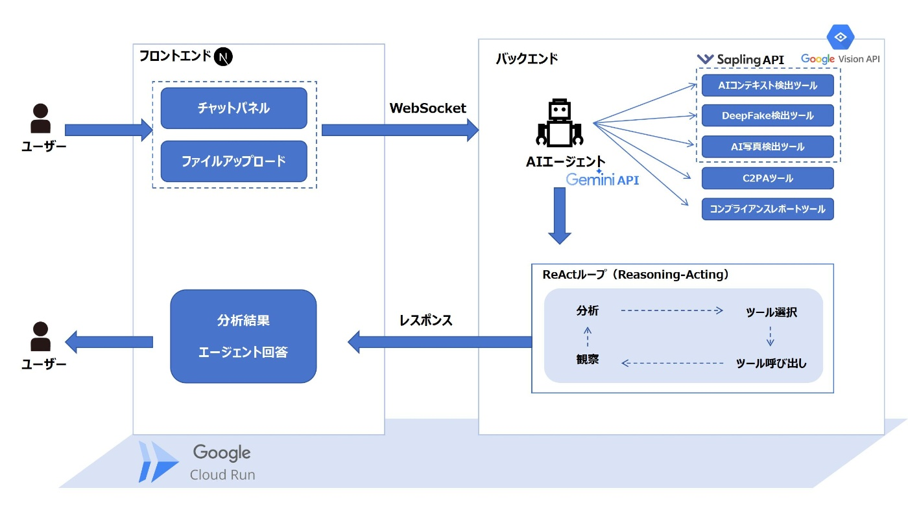
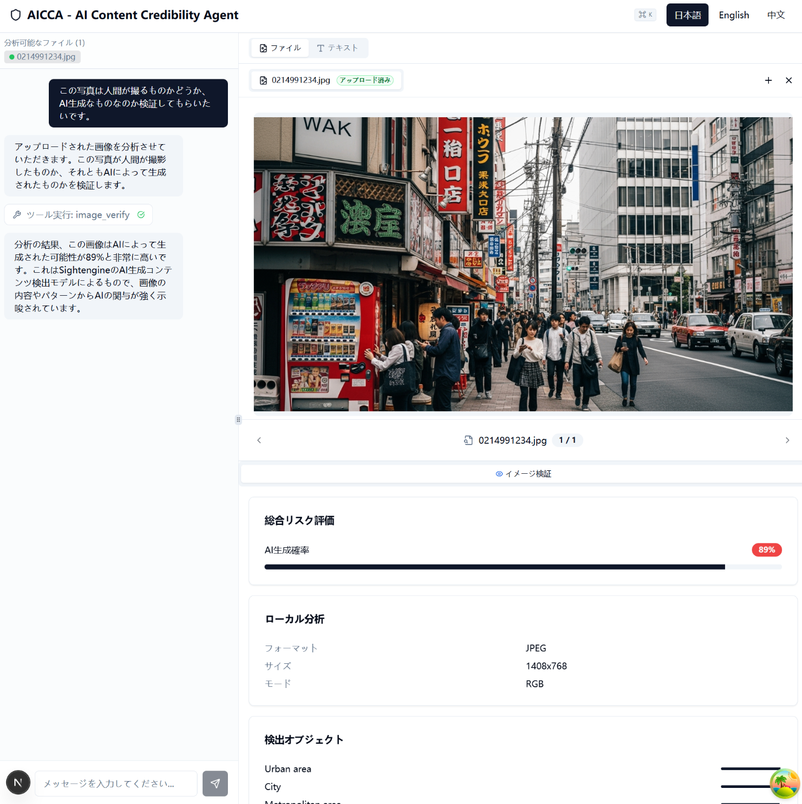
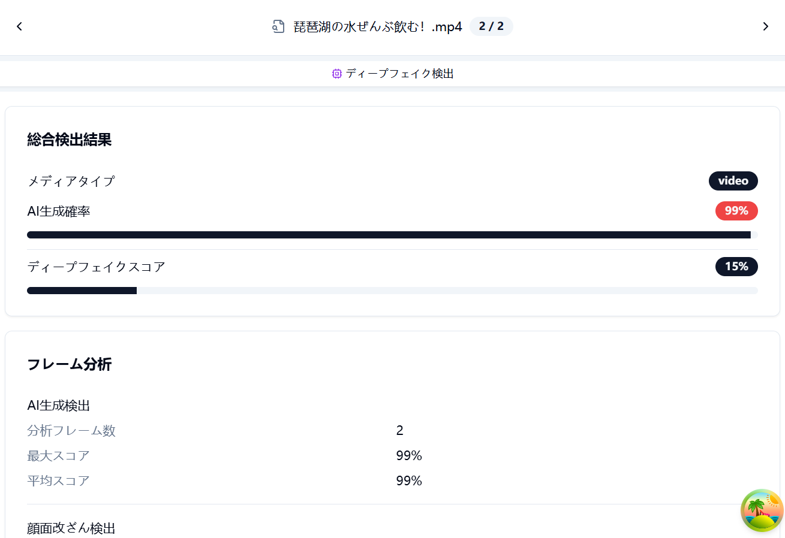
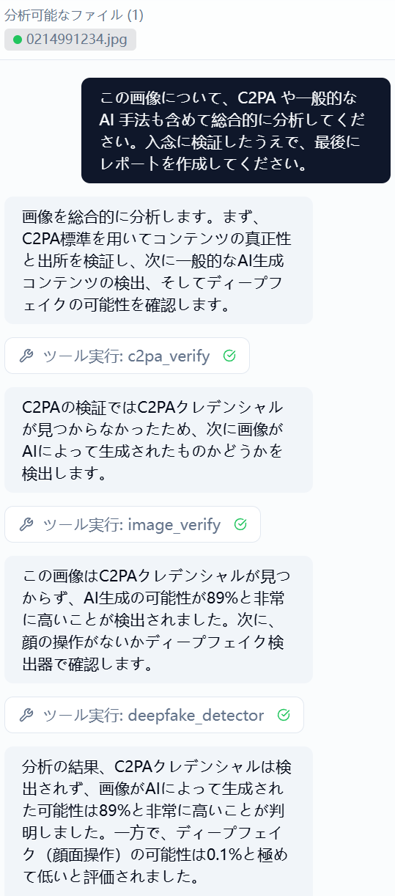

##  デモ動画 (3分)

<https://youtu.be/MCI9sM0NBYE>

##  はじめに

2025年、私たちは前例のないAIコンテンツ信頼性の危機に直面しています。

Resemble AIのQ1 2025報告によると、第1四半期だけでDeepfake詐欺による被害額が2億ドルを超え、人間の目では高品質な偽造動画をわずか24.5%しか見破れないことがDeepStrikeの研究で明らかになっています。さらに深刻なのは、学術データセットでは90%以上の精度を誇る検証ツールですら、実環境ではAUCが45-50%も低下するという現実でした。

実際に様々な検証ツールを試してみると、それぞれが独立して動作し、**柔軟的かつ総合的な判断ができないという根本的な問題に気づきました** 。そこで開発したのが、コンテンツ信頼性検証エージェント**AICCA (AI Content Credibility Agent)** です。

##  対象ユーザーと解決すべき課題

###  ターゲットユーザー

企業の広報部門やメディア関係者と話してみると、共通して聞かれたのは「AIが生成したコンテンツかどうか、もう判断できない」という悩みでした。特に企業のブランドイメージを守る広報・マーケティング部門、報道の信頼性を確保したい編集部門、そして公式情報の真正性を保証する必要がある政府機関など、信頼性が生命線となる組織ほど、この問題は深刻です。

###  解決すべき課題：真偽が見分けられない時代

現在、私たちは「どのコンテンツが本物か判別できない」という前例のない状況に直面しています。CEOの偽造動画による株価操作、有名人の偽音声を使った詐欺、政治家のディープフェイクが選挙に影響を及ぼすといった事例が、すでに現実に起きています。

こうした状況をさらに困難にしているのが、「Nano Banana」や「Veo 3」といった進化し続けるAIコンテンツ生成技術です。Nano Bananaは数秒で本物と見分けがつかない画像を生成し、Veo 3は音声付きの動画まで作成可能です。これらの技術は映像制作や教育、エンターテインメントなど多くの分野で革新的な可能性を広げていますが、その高度な表現力ゆえに真偽の判別を一層難しくしているのも事実です。専門家の多くが「AIコンテンツの判別はますます困難になっている」と指摘しています。

##  AICCAソリューション

###  従来の検証方法との違い

これまでコンテンツの真偽を確認するには、人間が複数の検証ツールを個別に操作する必要がありました。例えばSapling APIでAI生成率をチェックし、Sightengineでディープフェイクを検出し、メタデータを手動で確認する——このような煩雑な作業を、それぞれのツールの使い方を理解した上で実行しなければなりませんでした。

AICCAは、これらの作業をAIエージェントが代行します。ReAct（Reasoning + Acting）というアーキテクチャを採用し、**状況に応じて最適な検証戦略を自ら判断** します。

例えば、企業の広報担当者が疑わしい画像を受け取った場合：

**従来の手動検証：**

  * 複数の検証サービスに個別にアクセス
  * 各ツールに画像をアップロード
  * 結果を手動で統合・解釈
  * 判断・分析に時間がかかる

**AICCAによる検証：**
    
    
    ユーザー: この画像を分析して、AI生成かどうか総合的に分析した上で教えてください
    
    【1回目のサイクル】
    Agent推論: 画像の基本情報を把握する必要がある
    Agent行動: Google Vision APIで画像内容を分析
    Agent観察: 人物の顔が含まれている企業イベントの写真
    
    【2回目のサイクル】
    Agent推論: 人物画像なので、AI生成とDeepFakeの両方を確認すべき
    Agent行動: AI写真検出ツールでAI生成チェック → 92%の確率でAI生成
              メタデータ抽出でEXIF情報を確認
    Agent観察: 高いAI生成率、しかしEXIFに矛盾がある
    
    【3回目のサイクル】
    Agent推論: 矛盾があるため、より詳細な検証が必要
    Agent行動: C2PA署名を確認 → 署名なし
              DeepFake検出で顔領域を精査 → 不自然な境界線
    Agent観察: 複数の証拠がAI生成を示している
    
    【最終判定】
     AI生成の可能性が極めて高い
    

日常的な画像には軽量な検証で済ませる一方で、重要なコンテンツには徹底的な検証を実施します。さらに、初回の検証で矛盾を発見した場合には追加検証を自動的に行うなど、固定的なワークフローではなく柔軟な対応が可能になりました。

##  システムアーキテクチャ

AICCAはGoogle Cloud Run上で動作し、以下のような構成になっています。

システムの中心となるAIエージェントはGemini APIを基盤として動作します。ユーザーからWebSocket経由でリクエストを受け取ると内容を理解し、必要な検証ツールを選択・実行します。単にツールを順番に実行するのではなく、コンテンツの内容や重要度に応じて検証方法を切り替える点が、従来のツールとの大きな違いです。

フロントエンドはNext.jsで構築されており、検証プロセスをリアルタイムで可視化します。「現在どのツールで何を検証しているか」が常に表示されるため、ユーザーは安心して結果を確認できます。

現在統合している主な検証ツールは以下の通りです：

  * **AIコンテンツ検出ツール** （Sapling API）：AI生成した文章などのコンテンツの判定
  * **DeepFake検出ツール** （Google Vision API, Sapling API）：偽造動画や画像の分析
  * **画像分析ツール** （Google Vision API, Sapling API）：詳細分析と異常検出
  * **C2PAツール** （c2pa-pythonライブラリ）：コンテンツ認証と改ざん検出
  * **コンプライアンスレポートツール** ：検証結果の統合レポート生成

これらのツールはプラグイン形式で実装されているため、新しい検証技術が登場しても容易に追加できる柔軟な設計になっています。

##  主要機能の動作

###  多層検証アプローチ

AICCAの大きな特徴のひとつが、多層的な検証アプローチです。単一のツールでは限界があるため、複数の観点から段階的に信頼性を確認する仕組みを採用しました。

まずコンテンツ分析では、テキスト・画像・動画それぞれの特徴を専門ツールで解析します。続いてメタデータ検証として、EXIF情報や作成日時、編集履歴の整合性をチェック。さらにC2PA（Coalition for Content Provenance and Authenticity）標準に基づくデジタル署名を確認することで、コンテンツの出所や改ざんの有無を把握します。最終的には、これらすべての結果を統合し信頼スコアを算出します。

###  Agentによる検証戦略の最適化

多層検証を効果的に活用するのがReActアーキテクチャ（Reasoning and Acting）です。実際の運用では、状況に応じてどのレベルの検証が必要かを判断し、最適なツールを組み合わせて実行します。

このように、日常的なコンテンツには軽量な検証で対応し、社会的影響の大きいコンテンツには徹底的な検証を行う――AICCAは状況に応じた柔軟かつ効率的な運用を実現しています。

##  実際の動作画面

###  メインインターフェース

AICCAのインターフェースは、使いやすさを最優先に設計しました。左側のチャットパネルで自然な言葉で質問できるほか、中央には検証対象の画像がプレビュー表示され、右側には検証結果の詳細がリアルタイムで更新されます。

###  検証結果の表示

動画ファイルを検証した結果画面です。AI生成確率は99%と判定され、ディープフェイクスコアは15%と表示されています。フレーム分析では最大スコア99%を検出し、顔の改ざんの可能性を詳細に分析しています。

###  リアルタイム分析プロセス

検証中は、Agentが実行している具体的なツール（c2pa_verify、image_verify、deepfake_detector）とその分析内容がリアルタイムで表示されます。C2PA署名の検証から始まり、AI生成の可能性やディープフェイク検出までが段階的に可視化されます。

##  まとめ

今回のハッカソンでは、ReActアーキテクチャを活用したAI検証エージェント **AICCA** を試作しました。AICCAは複数の検証ツールを組み合わせ、状況に応じて最適な検証戦略を選ぶことで、従来より効率的かつ一貫した結果を提示できる点が特徴です。

短期間での開発でしたが、今回の試作を通じて、多層的な検証とエージェントによる柔軟な判断が有効であるという手応えを得ています。

生成AIの進化が加速する中で、こうした「信頼性を支える技術」にも継続的に取り組むことが重要です。今後も改善を重ねながら、同じ課題意識を持つ方々と知見を共有していきたいと考えています。
