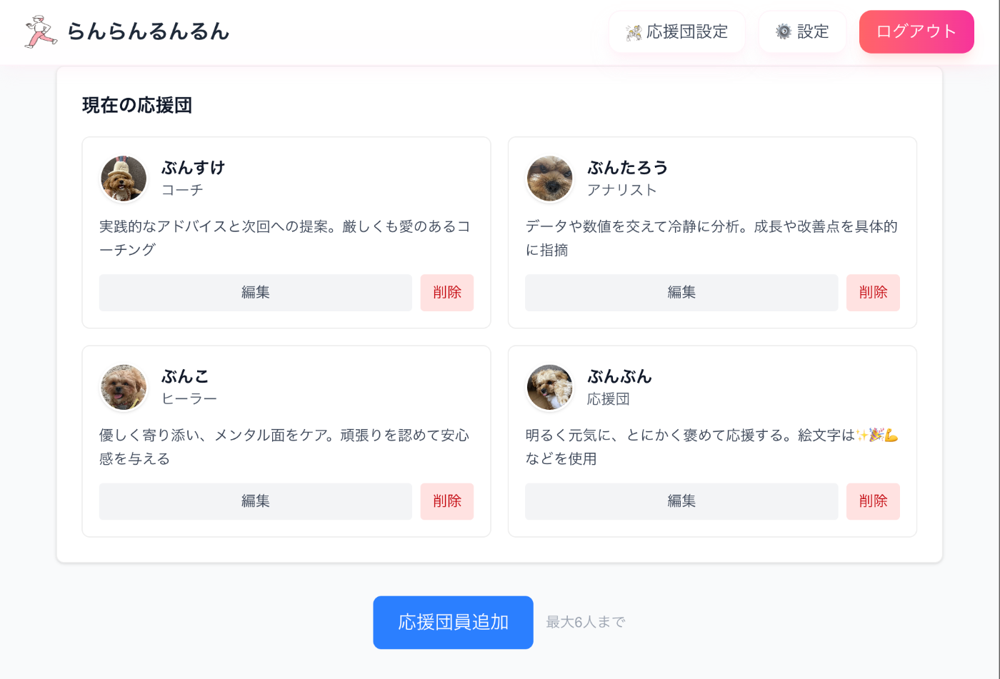
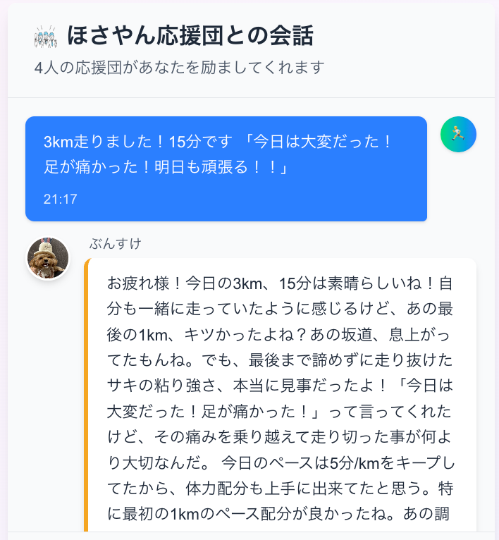
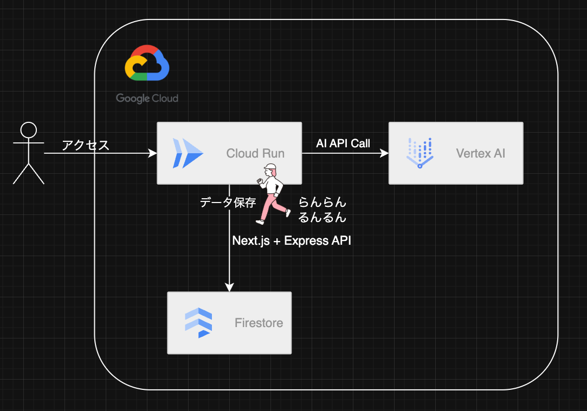

##  はじめに

「そうだ。ランニングを日課にしよう」

みなさん1度は考えたことがあるのではないでしょうか  
しかし、ランニングを日課にすることは難易度👹です

本アプリ（らんらんるんるん）はランニングを日課にするために生まれました👶

##  対象ユーザーと課題

「ランニングしたい！😭」でも続かない！  
そんな方に向けたアプリです

ランニングが続かない課題は以下が考えられると思います

  * つらい
  * 孤独
  * モチベーションが続かない

##  課題への解決策

上記課題に対して、一番の解決策は「ランニング仲間を作ること」です  
一緒に走る仲間がいるからこそ、ランニングは楽しくなり、継続して続けやすくなると思います

ただ、ランニング初心者が実際のコミュニティに所属するのは相当ハードルが高いと思います  
らんらんるんるんは**AIに自分の応援団** になってもらい、ランニングを継続して頑張れるようにするといったアプリになります！！

##  機能

<https://youtube.com/shorts/aVNqJS26XNg?si=P0i8VuvZYJWcpsNu>

###  1\. AI応援団

**個性豊かな応援団** があなたをサポートします：

  * 最大6人まで応援団を追加・編集・削除可能
  * 画像アップロードによるアイコン設定（Firebase Storage対応）  

###  2\. リアルタイムチャット

  * ランニング記録を入力すると、応援団が即座に共感のメッセージを返信
  * 「一緒に走っていたように」一人称で描写する自然な会話  

##  システム構成

###  技術スタック

レイヤー | 技術 | 役割  
---|---|---  
**フロントエンド** | Next.js 15 + React 19 | SPA、SSR、認証UI  
**バックエンド** | Express + TypeScript | REST API  
**データベース** | Firestore | NoSQL、リアルタイム同期  
**AI** | Vertex AI Gemini 1.5 Flash | 応援団応答生成  
**ストレージ** | Firebase Storage | 画像ファイル保存  
**コンテナ** | Docker + Cloud Run | サーバーレス実行環境  
  
###  Github

<https://github.com/koarakko5555/run-fun>

##  所感

来月フルマラソンに出るのですが、全くやる気が出ません  
そんな怠惰な自分を変えるために生まれたのが「らんらんるんるん」です

ランニングのモチベーションアップというコンセプトは早い段階で決まっていたのですが、「AIに応援してもらう」という解決策に辿り着くまでの時間が一番長かったです。。

アイディアの出し方の勉強とかしたいなって思いました  
エンジニアとして、まだまだ未熟なので、これからも頑張りたいです！

##  おわりに

デモで使っている犬は実家で飼っている愛犬です  
[ハッカソン](https://zenn.dev/hackathons/google-cloud-japan-ai-hackathon-vol3)開催ありがとうございました。楽しかったです！
