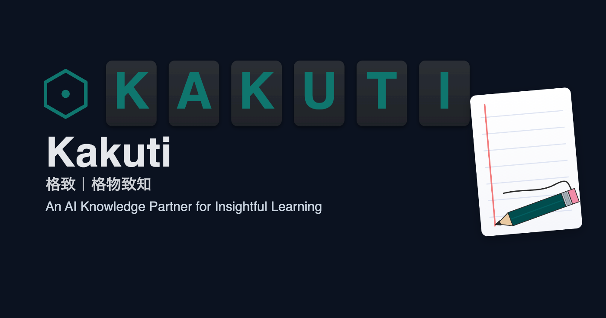

<https://www.youtube.com/watch?v=vj762GReOkU>

<https://www.youtube.com/watch?v=AO9_nX5QVeM>

#  Kakuti: 学びを深める知識パートナーをつくる

Kakuti は、PDF と Markdown を中心に「読み・考え・書き留める」を再発明する個人向けナレッジプラットフォームです。AI を単なる自動化ではなく、理解を深める伴走者へ変えることを目指しています。

* * *

##  ターゲットユーザーと抱える課題

  * **研究職・知識労働者** : 論文・調査資料の理解に時間がかかり、重要箇所の整理が追いつかない。
  * **多言語ドキュメントを扱う個人学習者** : 英語や中国語など他言語の資料を読む際、即時に翻訳や補助が得られず学習が停滞する。
  * **チームでナレッジを共有するプロジェクト運営者** : ハイライトや Q&A が個々人に散在し、再利用可能な知識として蓄積されない。

これらのユーザーは「速さだけではなく、理解の深さを伴う学習ループ」を求めています。

* * *

##  課題へのソリューションと特徴

  * **ドキュメントワークスペース** : PDF/テキストをアップロードし、ワークスペース単位で整理。全文検索とダウンロードにも対応し、必要な情報へ即アクセス。
  * **ビューア + 注釈体験** : ズーム・スクロール・テキスト選択が滑らか。選択した箇所をハイライトやノートとして蓄積し、後から振り返りやすい構造化データに変換。
  * **翻訳・対話エンジン** : 選択テキストをワンクリック翻訳。LLM を介した Q&A や背景説明で理解のボトルネックを解消。
  * **RAG ベースの質問応答** : 個別ドキュメントからワークスペース全体まで柔軟に検索対象を設定。回答には引用元を添え、確信度が可視化されるため学習の裏付けが取れる。
  * **Magic Wand（開発中）** : PDF 上で線を引くだけで関連テキストを抽出し、検索・解説・翻訳などのアクションを提案。読みながら思考を止めずに次の一歩を得られる。

* * *

##  システムアーキテクチャ

  * フロントエンドは Vite + React で実装し、PDF/Markdown ビューアや注釈 UI を提供。
  * FastAPI ベースのバックエンドが認証・ワークスペース管理・ワークフロー調停を担い、LLM 連携や RAG サービスへ橋渡しする。
  * ドキュメントファイルやノートはオブジェクトストレージへ保存。メタデータとベクトル埋め込みは SQLite または PostgreSQL + pgvector に格納。
  * LLM プロバイダを抽象化したインターフェースによって、翻訳・要約・質問応答を柔軟に切り替え可能。

* * *

##  学びを支えるユースケース

  1. **難解な論文の読解** : ハイライトと質問を繰り返し、AI に論点整理や背景説明を依頼。理解の抜け漏れを可視化。
  2. **多言語資料の把握** : 選択テキストの即時翻訳と対話で、日本語以外の資料もストレスなく読み進められる。
  3. **チームナレッジの蓄積** : ハイライト・ノート・Q&A をワークスペース単位で整理し、Reusable な知識ベースへ昇華。

* * *

##  プロジェクトの背景と哲学

おびただしい AI ツールが効率化を競う中で、「速さ＝成長ではない」と気づいたことが Kakuti 開発の原点です。AI が代わりにタスクを片付けるだけでは、ユーザーは自ら考え、問い、理解を深める機会を失ってしまう。そこで Kakuti は「AI を思考のパートナーにする」ことに挑戦しています。

プロジェクト名の語源は「格致（Kakuti）」――格物致知に由来する言葉で、事物の本質を探求し、真の理解に至る姿勢を意味します。AI による自動化以上に、ユーザー自身の理解と判断を育てることこそが Kakuti の使命です。

* * *

##  開発運用体制

  * **バックエンド** : FastAPI + SQLite（または PostgreSQL/pgvector）。`backend/.env` に API キーや LLM プロバイダを設定。
  * **フロントエンド** : Vite + React。`VITE_API_BASE` や `VITE_API_KEY` をビルド時に読み込み。
  * **ワンコマンド開発支援** : `scripts/dev.sh`（Linux/macOS）と `scripts/dev.ps1`（Windows）が環境準備からバックエンド/フロントエンドの同時起動まで自動化。
  * **GitHub Actions** : GitHub Pages へデプロイし、Secrets に `VITE_API_BASE`・`VITE_API_KEY` を登録する設計。

* * *

##  ロードマップ

  * Magic Wand の精度向上（テーブル・画像領域への対応）
  * 表構造の抽出や画像キャプチャ機能
  * 個人ノート／ナレッジベース機能の強化

Kakuti は「タスクを速く片付ける」ツールではなく、「知識を深め、自分の力を育てる」ための AI パートナーとして進化し続けます。

* * *

##  参加の呼びかけ

AI を取り巻く環境が急速に進歩する中で、Kakuti は学びの本質――考え、問い、理解し、記録する――を大切にするプロダクトです。効率化だけでは得られない「内面的な成長」を支援したいと考える方は、ぜひ Kakuti を体験してみてください。

  * GitHub: <https://github.com/mengyang0529/kakuti>

あなたの学びを、AI と共にもう一段深いところへ。

