##  1\. 背景・課題

日本国内では年間多くのペットが迷子になり、その多くが家族と再会できずにいます。愛するペットが突然いなくなった時、飼い主ができることはチラシを作って電柱に貼り、近所を歩き回って名前を呼び、SNSで情報を拡散するなど、できることも現状限られています。  
そこで、生成AIやAIエージェントなどの技術を使って、人間のように役割分担をしながら、24時間休むことなくペットを捜索できるシステムを構築してみたいと考えました。  
また現状では、発見者と飼い主を繋ぐ効率的なプラットフォームが存在せず、善意の発見者が「似たペットを見つけた」としても、その情報が飼い主に届くまでに時間がかかってしまいます。

今回開発したPawMateは、この社会課題に対し、Google CloudのVertex AIとADK（Agents Development Kit）を活用した科学的アプローチで挑戦します。複数のAIエージェントが協調しながら、リアルタイムの環境データ（天候、時間帯、地形）を考慮した行動予測を行い、従来の「勘と経験」に頼った捜索から、「データとAIに基づく効率的な捜索」への転換を目指し、すべての迷子ペットが家族の元へ帰れる世界の実現を目指したプロダクトです。

###  PawMateの語源

Paw（ポウ）= 肉球  
Mate（メイト）= 相棒、仲間、友達  
→ PawMate = 「ペットと飼い主を繋ぐ相棒」という、親しみやすさとAIの頼もしさを表現しています

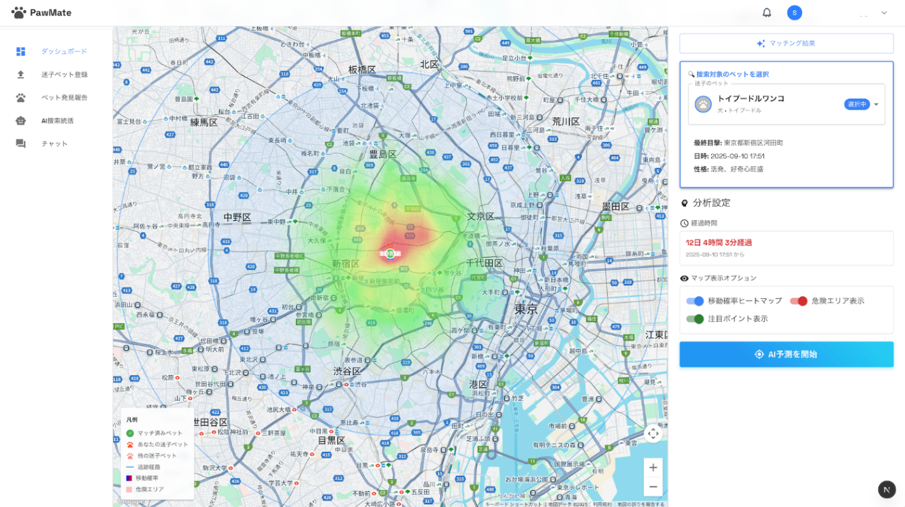

###  デモ動画

<https://youtu.be/OM9RLoDUaUI>

##  2\. 解決する課題

####  1\. 非科学的な捜索アプローチ

  * 闇雲な捜索による時間とリソースの浪費
  * X等のSNSでの捜索、街中へのポスター掲示

####  2\. 情報連携

  * 発見者と飼い主を繋ぐプラットフォームが少ない
  * リアルタイムな情報共有ができない

####  3\. テクノロジーの未活用

  * 画像認識技術の未導入
  * AIによる予測分析が行われておらず目視での確認に頼っている

##  3\. ソリューション：PawMateの実装概要

###  マルチエージェントAIシステム

PawMateは**2つの専門AIエージェント** が協調動作するシステムです

####  **Visual Detective Agent（視覚探偵エージェント）**

**役割：画像解析とペット識別のスペシャリスト**

  * **Gemini 2.5 Pro Vision** による高精度画像認識
  * リアルタイム画像マッチング
  * 特徴抽出と自動タグ付け
  * 複数角度からの画像比較

####  **Behavior Predictor Agent（行動予測エージェント）**

**役割：科学的データに基づく行動パターン予測**

  * ペット種別・性格に応じた移動パターン分析
  * **リアルタイム環境データ統合** ： 
    * OpenWeatherMap APIによる実際の天気情報
    * 時間帯による活動パターン変化
    * 地形・危険エリアの考慮
  * 動的ヒートマップ生成

###  🌟 主要機能

####  1\. **環境適応型ヒートマップ**
    
    
    // 環境要因
    - 天候影響（雨天時：移動確率-30%、隠れる確率+50%）
    - 時間帯考慮（猫：夜間活動+40%、犬：昼間活動+20%）
    - 危険エリア回避（道路、線路、水域を自動識別）
    - 地形適応（公園、住宅地、森林での行動変化）
    

####  2\. **科学的根拠に基づく予測モデル**

研究データに基づく発見確率分布：

  * **50%** が半径402m以内で発見
  * **70%** が半径1.6km以内で発見
  * **93%** が半径3km以内で発見

####  3\. **リアルタイムデータ統合**

  * **OpenWeatherMap API** : リアルタイム天気データ
  * **Google Maps API** : 地形・施設情報
  * **Firebase Realtime Database** : 即時情報共有

####  4\. **チャットでのコミュニケーション**

AI概算し、マッチング度の高い結果に関しては迷子のペットの飼い主と発見者でチャットを行うことができます

##  4\. 技術スタック

###  システム概要図

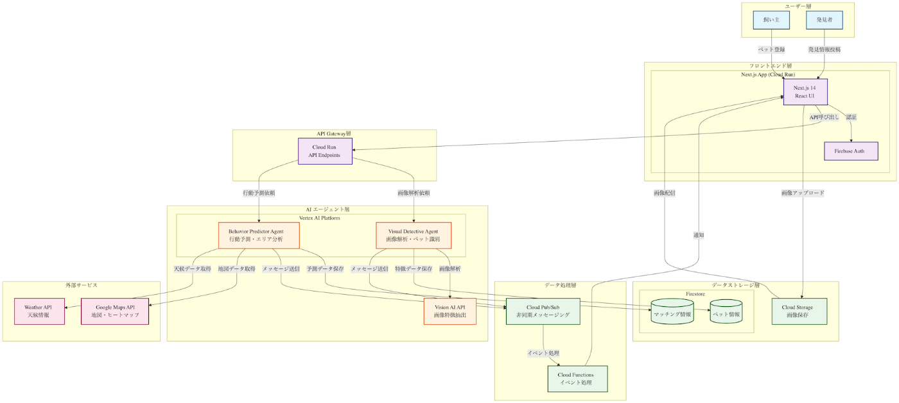

###  Google Cloud AI技術（コア）
    
    
    AI/ML:
      - Vertex AI / Gemini 2.5 Pro: マルチモーダル処理
      - ADK (Agents Development Kit): エージェント管理
      - Vision AI: 画像特徴抽出
      
    インフラ:
      - Cloud Run: アプリケーション実行環境
      - Firestore: NoSQLデータベース
      - Cloud Storage: 画像ストレージ
    

###  フロントエンド・その他
    
    
    フロントエンド:
      - Next.js 15.5.2 (Turbopack)
      - TypeScript 5
      - Tailwind CSS v4
      - Google Maps JavaScript API
      
    認証・通信:
      - Firebase Auth
      - WebSocket (リアルタイムチャット)
      
    外部API:
      - OpenWeatherMap API (天気データ)
      - Google Places API (施設情報)
    

##  5\. 実装のポイント

###  🧠 ADKを活用したマルチエージェントシステムの構築

今回の実装で最も推したいポイントは、Google CloudのADK（Agent Development Kit）を使用した**統一されたエージェントフレームワーク** の構築です。各エージェントが独立して専門的な処理を行いながら、協調して動作する仕組みを実現しました。
    
    
    // lib/adk/agent-framework.ts
    export abstract class ADKAgent {
      protected vertexAI: VertexAI;
      protected config: ADKAgentConfig;
      
      constructor(config: ADKAgentConfig) {
        // Vertex AIの初期化とモデル設定
        this.vertexAI = new VertexAI({
          project: this.projectId,
          location: this.location,
        });
        
        // Gemini 2.5モデルの設定
        this.model = this.vertexAI.preview.getGenerativeModel({
          model: 'gemini-2.0-flash-exp',
          generationConfig: {
            maxOutputTokens: 2048,
            temperature: 0.7,  // 創造性と正確性のバランス
          },
        });
      }
      
      // 各エージェントが実装する抽象メソッド
      abstract process(input: any, context: ADKContext): Promise<any>;
    }
    

###  🌍 環境データを統合した科学的な行動予測

最も難しかった実装の一つが、**複数の環境要因を統合した行動予測モデル** です。単純な距離計算ではなく、リアルタイムの環境データを組み合わせて予測精度を向上させました。
    
    
    // lib/utils/environmental-analysis.ts
    static calculateMovementProbability(
      location: { lat: number; lng: number },
      petType: 'dog' | 'cat',
      weather: WeatherCondition,
      timeOfDay: TimeOfDay,
      terrain: TerrainInfo[],
      dangerZones: DangerZone[]
    ): number {
      let probability = 0.5; // ベース確率
      
      // 🌧️ 天候の影響（OpenWeatherMap APIからリアルタイムデータ取得）
      if (weather.precipitation) {
        probability -= 0.2;  // 雨天時は移動確率減少
        if (petType === 'cat') {
          probability -= 0.1;  // 猫は特に雨を嫌う
        }
      }
      
      // 🌡️ 気温の影響
      if (weather.temperature < 5) {
        probability -= 0.15;  // 寒さで活動低下
      } else if (weather.temperature > 30) {
        probability -= 0.1;   // 暑さで日陰を求める
      }
      
      // 🕐 時間帯の影響（ペットの活動パターンを考慮）
      switch (timeOfDay.period) {
        case 'dawn':  // 早朝
          probability += petType === 'cat' ? 0.15 : 0.1;
          break;
        case 'night': // 夜間
          probability += petType === 'cat' ? 0.1 : -0.2; // 猫は夜行性
          break;
      }
      
      // ⚠️ 危険エリアの回避
      const nearbyDanger = dangerZones.filter(zone => 
        this.getDistance(location, zone.location) < zone.radius
      );
      if (nearbyDanger.length > 0) {
        probability *= 0.3;  // 危険エリア近くでは確率大幅減
      }
      
      return Math.max(0.05, Math.min(0.95, probability));
    }
    

###  🗺️ 動的に変化する高密度ヒートマップ生成

ヒートマップの実装では、**ズームレベルに応じて自動的にグリッドサイズを調整** し、常に最適な解像度で表示される仕組みを構築しました。これにより、広域表示でも詳細表示でも適切な情報密度を保てます。
    
    
    // lib/services/enhanced-heatmap-generator.ts
    async generateDetailedHeatmap(options: EnhancedHeatmapOptions): Promise<HeatmapData[]> {
      // 📏 ズームレベルに応じた動的グリッドサイズ調整
      const gridSize = this.calculateOptimalGridSize(options.zoomLevel);
      // zoom 18以上: 25mグリッド（超詳細）
      // zoom 16-17: 50mグリッド（詳細）
      // zoom 14-15: 100mグリッド（標準）
      // zoom 12-13: 150mグリッド（広域）
      
      // 🎯 科学的データに基づく確率計算
      // 研究論文のデータを活用：50%が402m以内、70%が1.6km以内で発見
      const calculateProbability = (distanceKm: number): number => {
        if (distanceKm <= 0.4) {
          return 0.9 - (distanceKm * 0.5);  // 近距離：最高確率
        } else if (distanceKm <= 1.6) {
          return 0.7 - ((distanceKm - 0.4) * 0.3);  // 中距離：高確率
        } else {
          // 遠距離：指数関数的減衰
          return Math.max(0.05, 0.25 * Math.exp(-distanceKm / 5));
        }
      };
      
      // 🔄 ガウス補間による滑らかな可視化
      const interpolatedGrid = this.interpolateWithGaussian(
        probabilityGrid,
        smoothingFactor: 0.7
      );
      
      return this.convertToHeatmapData(interpolatedGrid);
    }
    

###  🔍 Gemini Vision APIを使った高精度画像マッチング

画像マッチングでは、単純な画像比較ではなく、**AIが特徴を言語化して意味的に比較** する仕組みを実装しました。「足が白い」と「足の先だけ白い」のような微妙な違いも識別できます。
    
    
    // lib/services/pet-feature-analyzer.ts
    private async analyzeWithGemini(imageData: string): Promise<PetAnalysis> {
      const prompt = `
        あなたはペットの特徴を分析する専門家です。
        画像から以下の特徴を詳細に抽出してください：
        
        1. 種類と品種（確信度付き）
        2. 毛色のパターン（メイン色、サブ色、模様）
        3. 特徴的なマーク（位置と形状）
        4. 体格（サイズ、体型）
        5. その他の識別可能な特徴
        
        重要：「足が白い」のような部分的な特徴も見逃さないでください。
      `;
      
      const result = await this.vertexAI.generateContentWithImage([
        { text: prompt },
        { inlineData: { data: imageData, mimeType: 'image/jpeg' } }
      ]);
      
      return this.parseAnalysisResult(result);
    }
    
    // マッチング時の意味的比較
    private compareFeatures(lost: PetFeatures, found: PetFeatures): MatchScore {
      // 🎨 色の類似度計算（部分一致も考慮）
      const colorMatch = this.calculateColorSimilarity(lost.colors, found.colors);
      
      // 📝 テキスト特徴の意味的比較（Geminiで自然言語理解）
      const semanticMatch = await this.compareSemanticFeatures(
        lost.description,
        found.description
      );
      
      // 🏷️ 品種の一致度（ミックス犬も考慮）
      const breedMatch = this.calculateBreedMatch(lost.breed, found.breed);
      
      return {
        overall: colorMatch * 0.4 + semanticMatch * 0.4 + breedMatch * 0.2,
        details: { colorMatch, semanticMatch, breedMatch }
      };
    }
    

###  ⚡ リアルタイム目撃情報の動的反映

目撃情報が報告されると、**ヒートマップが即座に更新** される仕組みを実装。確信度に応じて周辺エリアの確率が動的に調整されます。
    
    
    // lib/services/enhanced-heatmap-generator.ts
    updateHeatmapWithSighting(
      currentHeatmap: HeatmapData[],
      sightingLocation: google.maps.LatLngLiteral,
      confidence: number  // 0.0〜1.0の確信度
    ): HeatmapData[] {
      const boostRadius = 500;  // 影響範囲（メートル）
      const boostFactor = 1 + (confidence * 0.5);  // 確信度に応じた増幅率
      
      // 🎯 目撃地点を中心に確率を再計算
      return currentHeatmap.map(point => {
        const distance = this.getDistance(point.location, sightingLocation);
        
        if (distance <= boostRadius) {
          // ガウス分布に基づく重み付け
          const weight = Math.exp(-(distance * distance) / (2 * boostRadius * boostRadius));
          const boost = 1 + (boostFactor - 1) * weight * confidence;
          
          return {
            ...point,
            weight: Math.min(100, point.weight * boost),  // 上限100
          };
        }
        return point;
      });
    }
    

###  🎯 実装で最も工夫した点

####  1\. **日本の環境に特化した調整**
    
    
    // 日本犬種の特性データ
    const JAPANESE_BREED_PATTERNS = {
      shiba: { 
        independence: 0.9,      // 独立心が強い
        trackingTendency: 0.73,  // 帰巣本能
        searchMultiplier: 1.5    // 捜索範囲拡大係数
      },
      akita: { 
        independence: 0.95,     // さらに独立心が強い
        trackingTendency: 0.8,   // 高い帰巣本能
        searchMultiplier: 2.0    // より広い範囲を移動
      }
    };
    

####  2\. **パフォーマンス最適化**

  * グリッドポイントの動的調整で、不要な計算を削減
  * Web Workerを使った並列処理（ヒートマップ生成）
  * 画像のプログレッシブ読み込みとキャッシング

####  3\. **エラーハンドリングとフォールバック**
    
    
    // APIエラー時のフォールバック処理
    if (!weatherData) {
      // デフォルトの天候条件を使用
      return this.getDefaultWeatherConditions();
    }
    
    // Gemini API制限時の代替処理
    if (rateLimitExceeded) {
      // ローカルの簡易マッチングアルゴリズムを使用
      return this.fallbackMatcher(lostPet, foundPet);
    }
    

###  💡 技術的な学びと挑戦

このプロジェクトで最も難しかったのは、**複数の不確実な要素を統合して一つの確率マップを生成すること** でした。天候、時間、地形、ペットの性格など、それぞれが独立した変数でありながら相互に影響し合う関係を、数学的にモデル化する必要がありました。

また、Vertex AIとADKを活用することで、従来のルールベースのシステムでは実現できなかった**柔軟で適応的な予測** が可能になりました。AIが画像から抽出した特徴を自然言語で表現し、それを別のAIが理解して比較するという、**AIエージェント間の協調** も技術的に興味深い実装となりました。

##  6\. PawMateを使用する流れ

  1. **迷子ペット登録**  
ペットが迷子になってしまった時、写真や年齢、体重、首輪の情報やマイクロチップ番号、性格、迷子になった場所などわかる情報はすべて入力します。入力内容が充実しているほどマッチングの精度も向上します。

     * 写真アップロード → AIによる特徴抽出
     * 最後の目撃位置やテキストでの細かい特徴等も入力  
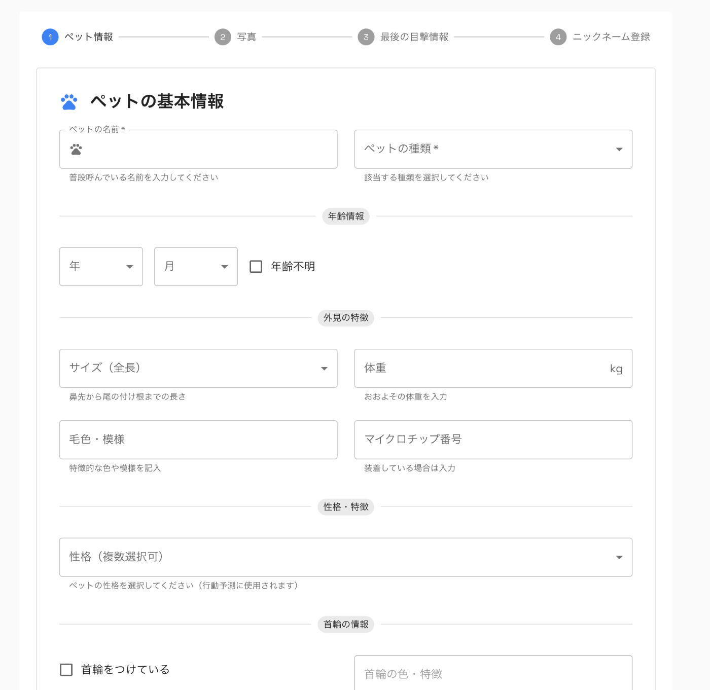
  2. **AI予測開始**  
迷子のペット情報の登録が完了すると、マッチングの対象になります。現在登録されている発見されたペットの情報と似ているペットがいないかエージェントが捜索を開始します。また、マップにはペットの情報や天気の情報を利用して、捜索エリアをヒートマップで可視化することで、人間が探す範囲を科学的根拠に基づいて絞ることができます。

     * 環境データ収集（天気、時間、地形）
     * ヒートマップ生成と危険エリア表示
     * 優先捜索エリアの提示  
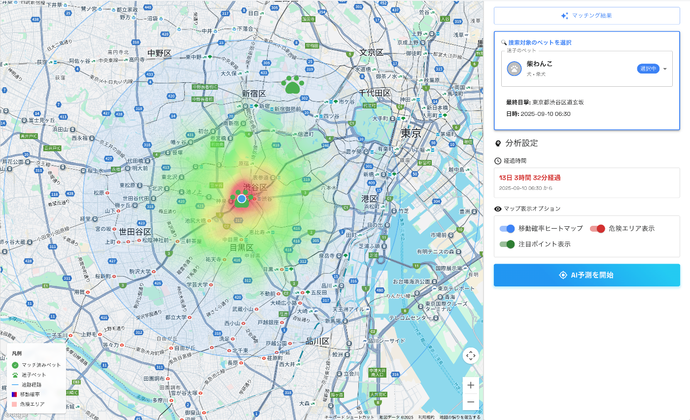
  3. **発見者投稿**  
迷子になっている動物を発見した時、誰でもこのサイトを使えば簡単に投稿することができます。写真や発見した場所、ペットの状態や、一時的に保護できるかの状態を入力します。

     * 写真撮影 → 自動マッチング
     * 類似度スコア表示 → 飼い主への即時通知  
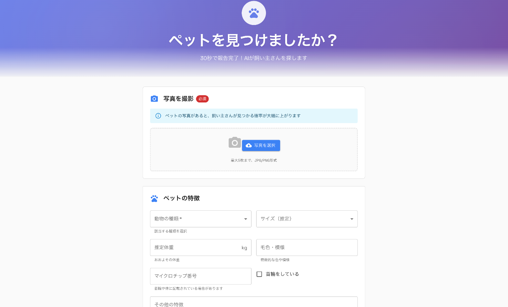
  4. **マッチング**  
迷子の動物と発見された動物がAIによってマッチングのスコアが計算され、一致した可能性が高い場合はマッチングの一覧に表示されます。詳細を開くと細かい情報の確認と、各項目ごとのマッチングのスコアを確認することができます。

     * 写真撮影 → 自動マッチング
     * 類似度スコア表示 → 飼い主への即時通知  
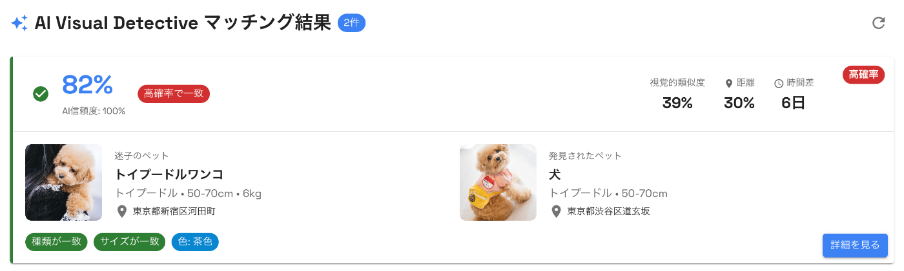  
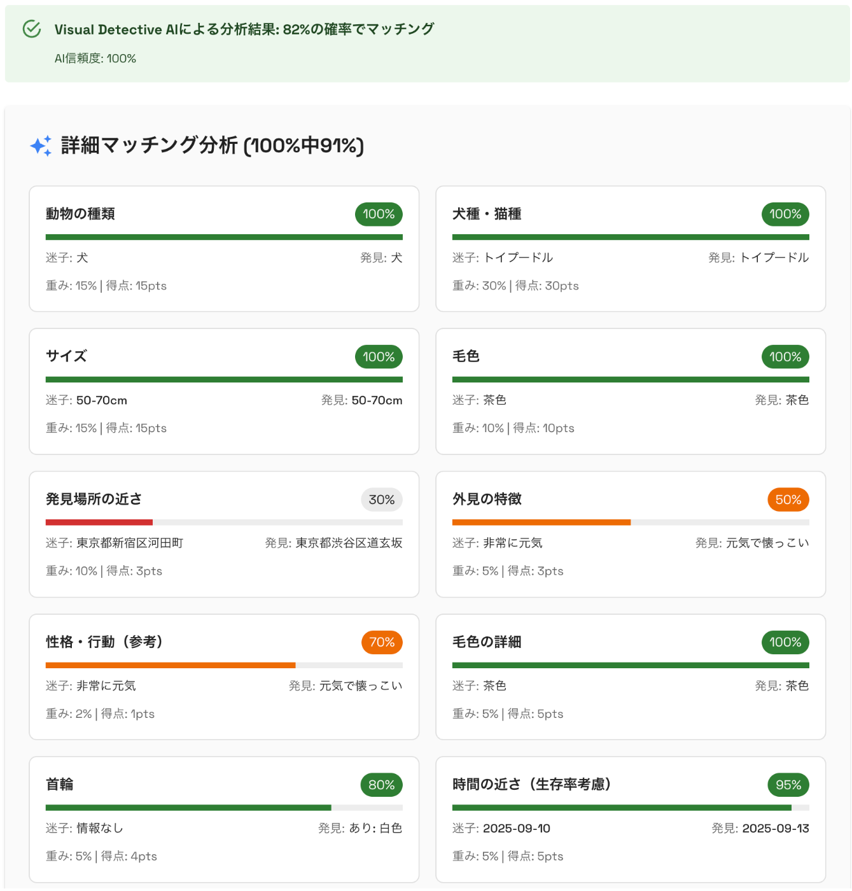  
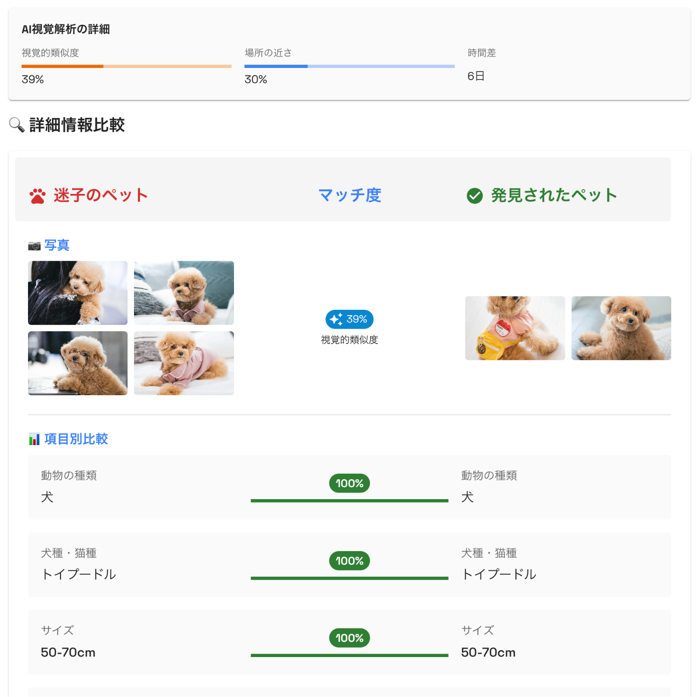  
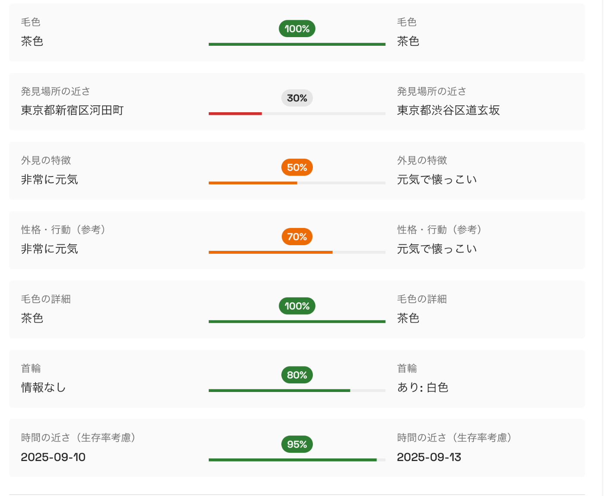  
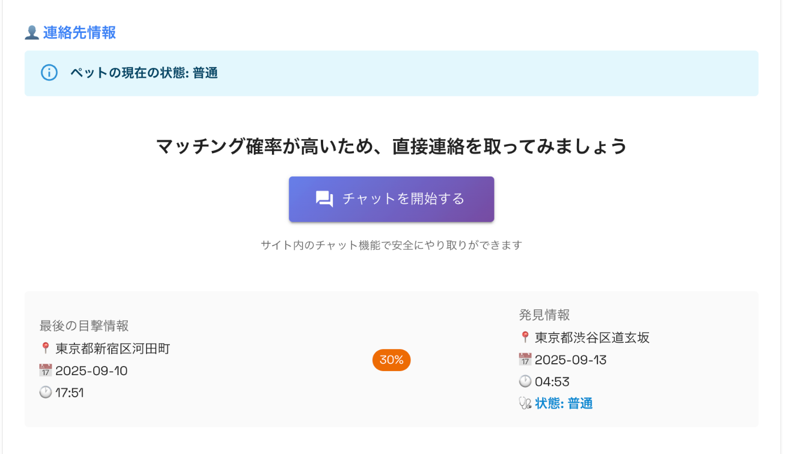
  5. **コミュニケーション**  
飼い主はマッチングの一覧から詳細を確認し、連絡を取りたい発見者と直接チャットを行うことができます。チャット上から発見者と連絡を取り合い、実際にペットの状態の確認や引き取りなどの連絡を行うことができます。

     * リアルタイムチャット開始
     * マッチングした場合はチャット上でやり取りを行い、解決の報告をウェブ上から行う  
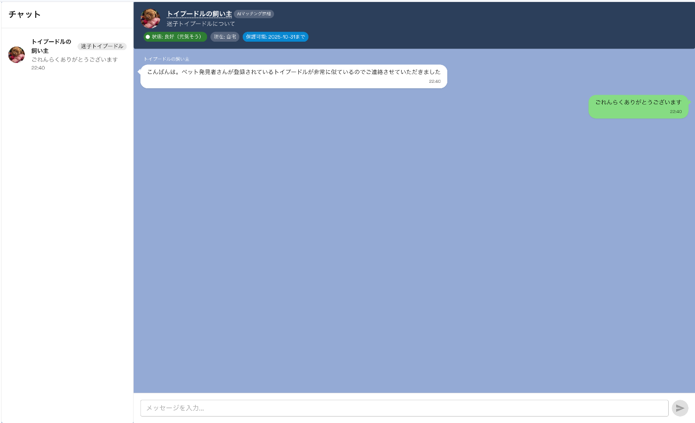

##  7\. 今後

現状は「犬」のみのサンプルデータでテストを行っているので、「猫、鳥、小動物への対応拡大」や「実際の迷子ペットデータを使用しての実運用」を目指して、実際にリリースして本当に困っている方に使っていただけるようなプラットフォームへ成長させたいです。

また、今回参加させていただいた[「AI Agent Hackathon with Google Cloud」](https://zenn.dev/hackathons/google-cloud-japan-ai-hackathon-vol3?tab=rule)を発見したのは締め切りの直前で、時間が許される限り毎日のように夜中まで実装してとても大変だったのですが、触れたことない技術に多く触れながら楽しんで進めることができました。  
また機会があれば参加させていただきたいです。  
お読みいただきありがとうございました〜！

##  資料

[Youtubeリンク](https://youtu.be/OM9RLoDUaUI)
