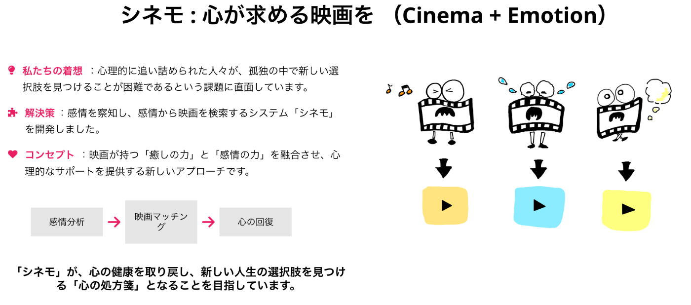
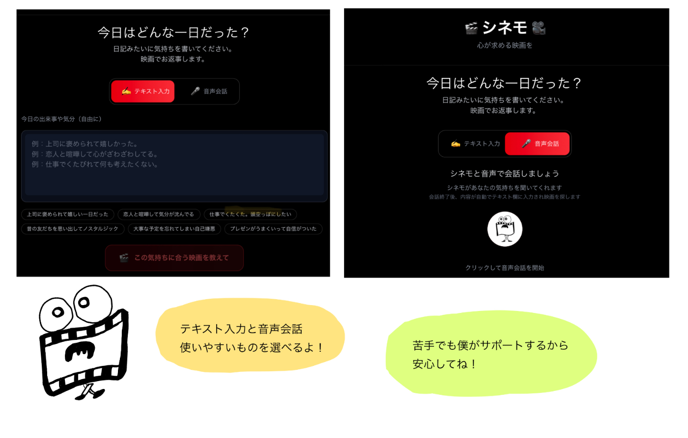
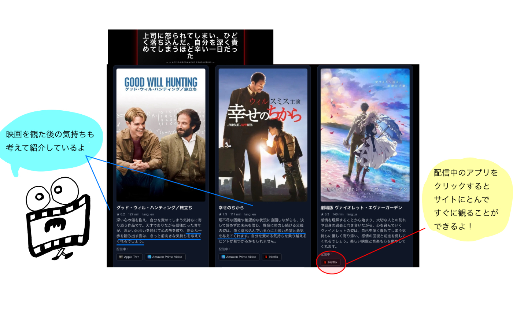
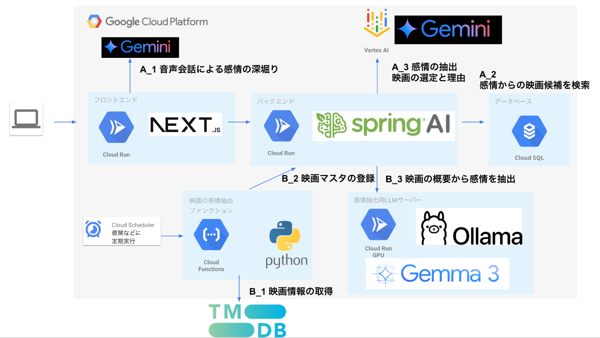

##  デモ動画(3分)

<https://www.youtube.com/watch?v=sDWOZZMkP9I>

デモサイト:  
<https://cinemo-front.vercel.app/search?streaming=true>

##  1\. 背景 課題

日本の自殺問題は深刻な社会課題として毎年注目されています。厚生労働省の調査によると、年間約2万人が自殺で命を落としており、これは一日あたり約55人が自ら命を絶っている計算になります。この数字は先進国の中でも特に深刻な水準にあります。

厚生労働省によると、自殺に至る心理状態は、様々な悩みが重なって心理的に追い詰められ、自殺以外の選択肢が見えなくなった状態であることが指摘されています。  
この問題の解決策として注目したのが「シネマセラピー」です。これは映画を通じて心の癒しや気づきを得る治療法で、適切な映画との出会いが人の心に深い影響を与え、新たな視点や希望をもたらすことが実証されています。

今回開発した「シネモ」は、AIが感情を読み取り、その人に最適な映画を提案するアプリケーションです。AIが利用者の感情と心理状態を分析し、最も適切な映画を提案することで、新しい選択肢を見つける手助けができると考えています。

「シネモ」は利用者が心の健康を取り戻し、新しい人生の選択肢を見つけるための「心の処方箋」となることを目指しています。

##  2\. シネモとは

「シネモ」は、自殺予防を含む幅広い心の健康支援を目的としています。

###  既存サービスとの違い

現在の動画配信サービスは、視聴履歴をもとにおすすめ映画を提案しています。しかし、好きなジャンルと現在の心理状態が異なる場合、必ずしも適切な提案にならないという課題があります。

###  シネモの強み

  * **感情に寄り添う提案** ：その時の感情や境遇に合わせた映画を提案
  * **AI対話機能** ：気軽な会話から感情を読み取り、感情表現や会話が苦手な方でも利用しやすい
  * **パーソナライズされた紹介文** ：提案する映画には、利用者の感情や境遇を踏まえた紹介文を掲載し、「この映画を観ることでどのような気持ちになれるか」を具体的に説明

AIが利用者と同じ状況を想定し、寄り添うことで、悩みを抱える人の力になることを目指しています。

##  3\. 機能要件

###  3.1 機能

  1. 映画・感情データベースの作成

  * プルチックの感情の輪理論に基づく映画データベース構築
  * 各映画に3つの感情タグを付与
  * 感情と映画の関係性をデータ化して管理

  2. ユーザーの感情を抽出して映画検索

  * テキスト入力または音声会話からの感情抽出
  * AIによる会話内容の分析
  * ユーザーの現在の感情状態の特定
  * 感情状態に基づく映画データベースの検索・マッチング

  3. 検索した映画候補から3つ選定して回答

  * 検索結果から最適な3本を選定
  * 各映画への推薦理由の生成
  * 配信サイトへのリンク提供

###  3.2 ユーザーインターフェース

####  入力方式

  
Cinemoはテキスト入力と音声会話の両方から感情を抽出できます。

  * **テキスト入力** ：チャット形式での感情や状況の入力
  * **音声会話** ：自然な対話を通じた感情の深掘り

####  映画推薦画面

  
会話終了後、AIが会話内容を分析し、ユーザーの感情状態に最適な映画を選定します。

  * 厳選された3本の映画を推薦
  * AI生成による推薦理由を表示
  * ワンクリックで配信サイトへ直接アクセス可能
  * 視聴まで迷うことなく進められるUI設計

###  3.3 システムアーキテクチャ

####  A. ユーザー入力から映画推薦までの流れ

##### A_1 音声会話による感情の深掘り

**使用AI** ：gemini-2.5-flash-preview-native-audio-dialog  
**特徴** ：音声会話機能により、ユーザーの感情をより自然に引き出す

##### A_2 ユーザー感情の抽出

**抽出対象** ：ユーザーの入力から3つの感情を抽出  
**理論的基盤** ：プルチックの感情の輪理論に基づく24個の感情  
**使用AI** ：gemini-2.5-flash

##### A_3 感情に基づく映画候補検索

**検索ロジック** ：

  1. ユーザーの3つの感情（感情A、B、C）でAND検索
  2. ヒットしない場合は「感情A、B」で検索
  3. それでもヒットしない場合は「感情A」で検索
  4. 必ず検索結果が得られるまで段階的に条件を緩和

##### A_4 映画選定と推薦理由生成

**選定方法** ：検索結果からAIが最適な3本を選定  
**特徴** ：映画の概要をプロンプトに含めることで、ユーザーの境遇に適した映画を選定  
**使用AI** ：gemini-2.5-flash

####  B. 映画・感情データベース構築フロー

##### B_1 映画情報取得

**データソース** ：TMDB（The Movie Database）から映画情報を取得

##### B_2 映画マスタ登録

**処理内容** ：取得した映画情報をバックエンドサーバーに登録

##### B_3 映画概要からの感情抽出

**処理内容** ：登録された映画の概要から感情タグを自動抽出  
**使用AI** ：Gemma3-4b（Ollamaサーバー上で実行）

####  技術選定理由

##### Spring AIを選定した理由

  * **AIモデルの柔軟性** ：OpenAI、Hugging Face、Google Geminiなど様々なAIモデルを容易に切り替え可能
  * **コンテキスト管理** ：会話履歴やユーザー状態を効率的に管理
  * **構造化出力対応** ：JSONなどの構造化形式での出力を容易に処理
  * **Springエコシステム連携** ：既存のSpring開発環境とシームレスな統合

##### OllamaサーバーでGemma3を選定した理由

  * **処理タイミング** ：映画の感情抽出は夜間等の定期実行を想定
  * **コスト効率** ：スポット的なサーバー起動によるコスト削減
  * **速度要件** ：リアルタイム性を求められない処理に適用

##### 音声会話機能での選定理由

**gemini-2.5-flash-preview-native-audio-dialog**

  1. **感情認識対話** ：ユーザーの感情表現を理解し適切に応答する機能により、シネモの感情分析に最適
  2. **自然な音声対話** ：高品質で低遅延の音声インタラクションにより、ユーザーが自然に感情を表現しやすい環境を提供
  3. **プロアクティブ機能** ：背景音声を無視し、適切なタイミングで応答することで、集中した対話が可能

##### テキスト処理・感情分析での選定理由

**gemini-2.5-flash**

  1. **優れた価格性能比** ：高品質な処理を低コストで実現し、大量の感情分析処理に適用可能
  2. **高速処理** ：208.9 tokens/秒の処理速度と0.31秒の低遅延により、リアルタイムな感情分析を実現
  3. **思考機能** ：複雑な感情分析や映画選定において、推論プロセスを通じてより精度の高い結果を提供
  4. **長コンテキスト** ：100万トークンのコンテキストウィンドウにより、長い会話履歴を考慮した感情分析が可能

###  3.4 データベース設計

####  movies テーブル

映画の基本情報を格納するメインテーブルです。

##### 主要項目：

  * movie_id: 映画の一意識別子（主キー）
  * title: 邦題
  * original_title: 原題
  * duration: 上映時間（分）
  * release_date: 公開日
  * poster_url: ポスター画像のURL
  * rating: 評価スコア
  * overview: 映画の概要・あらすじ
  * adult: 成人向けコンテンツフラグ
  * original_language: 原語
  * emotion_status: 感情分析ステータス（未処理/処理済み等）

####  emotions テーブル

システムで使用する感情カテゴリのマスターテーブルです。

##### 主要項目：

  * emotion_id: 感情の一意識別子（主キー）
  * name: 感情名

##### データ構成：

プルチックの感情の輪理論に基づく24個の感情で構成されています。

  * 基本感情8個（喜び、信頼、恐れ、驚き、悲しみ、嫌悪、怒り、期待）
  * 複合感情16個（愛、提出、畏敬、失望、後悔、軽蔑、積極性、楽観等）

####  movie_emotions テーブル

映画と感情の多対多関係を管理する中間テーブルです。

###### 主要項目：

  * movie_id: 映画ID（外部キー）
  * emotion_id: 感情ID（外部キー）
  * rank: 感情の優先順位（1〜3）※各映画に3つの感情タグを付与

###### 関係性

  * movies ↔ emotions: 多対多の関係 
    * 1つの映画は複数の感情を持つ（最大3つ）
    * 1つの感情は複数の映画に関連付けられる
    * movie_emotionsテーブルが中間テーブルとして機能

##  まとめ

最後までお読みいただき、ありがとうございます。  
日本では一日に約55人が自ら命を絶っている深刻な現実があります。  
一本の映画が人生を変えることがある—AIの力で、そんな心に響く映画との出会いを届けたい。  
完璧な解決策ではありませんが、誰かの「最後の夜」を「新しい始まりの朝」に変えることができるなら、それこそが技術の最も尊い使命だと信じています。  
シネモが、一人でも多くの方の心に希望の光を灯せることを願っています。​​​​​​​​​​​​​​​​
