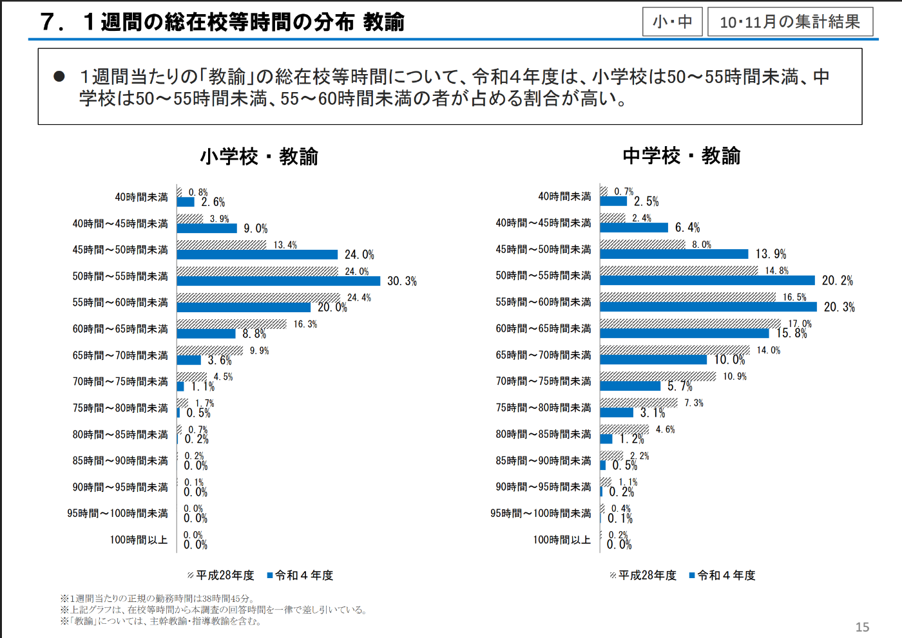
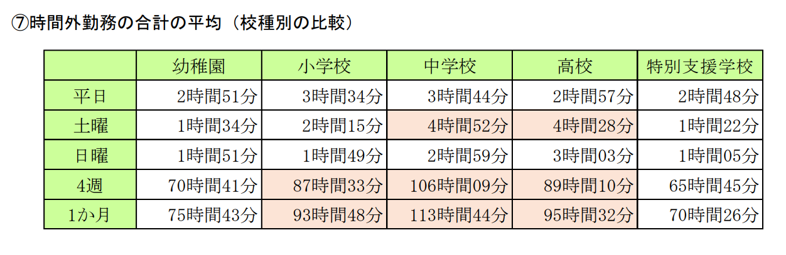
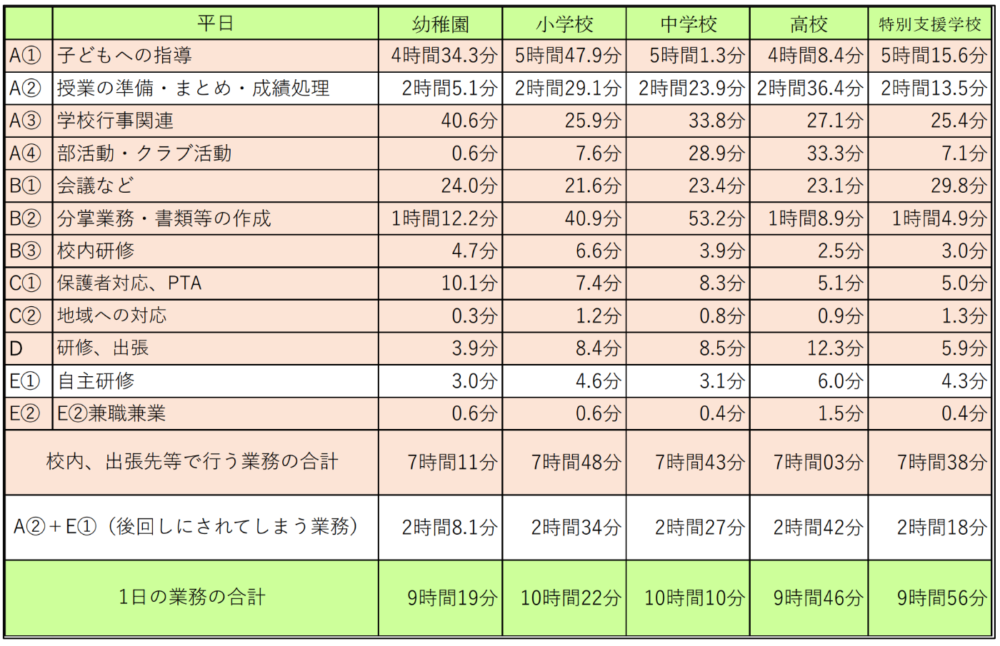
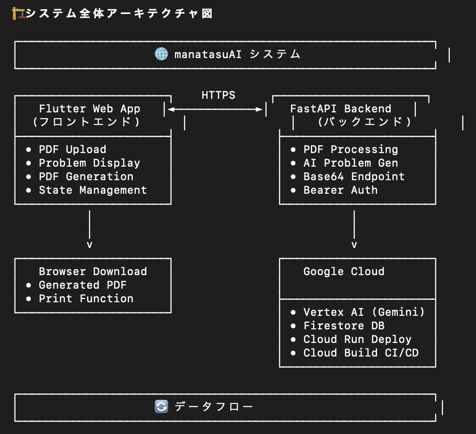
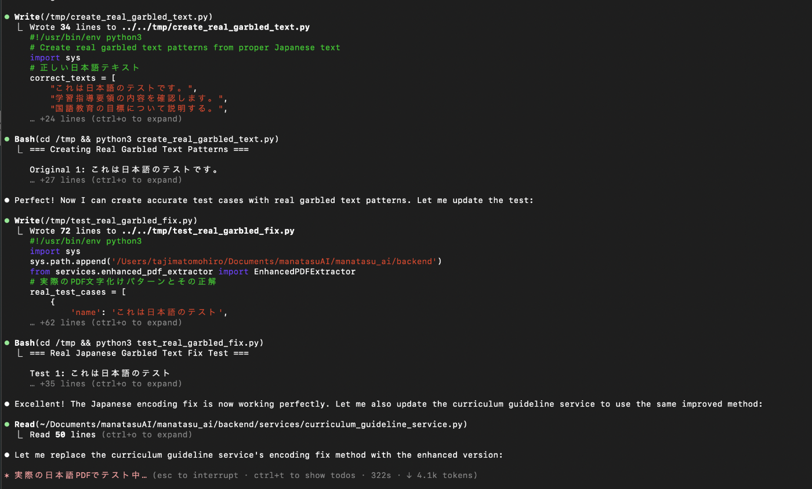

##  📌 背景と課題（課題の新規性）

日本の教育現場では、いまだに **デジタル教育の遅れ** が深刻な課題として残っています。  
特に教員の労働環境は厳しく、残業代も支給されない長時間労働が常態化し、過労死ラインを超える勤務時間に達している先生も少なくありません。

私自身も高校生の頃（約9年前）、情報を専門とする高校に進学しましたが、授業は「プログラミングを紙で学ぶ」といったデジタル化からほど遠い内容でした。当時、生徒会長としてICT活用の導入を「予算がない」「先生の時間が足りない」

コロナ禍とGIGAスクール構想により、教育現場にICT環境が整いつつある中、教育現場の業務逼迫により、十分に使いこなすところまでは、至っておらず先生の労働時間削減にもつながっていないのが実情です。

##  🏫 教職員勤務実態調査から見える現状

文部科学省・全教による「教職員勤務実態調査（2022年）」によれば、中学校の先生が平日に最も多く時間を費やしている業務は以下のとおりです。  

本来、教育の質を高めるために重要なのは **授業準備・まとめ・成績処理** が重要な部分ではありますが、この作業が後回しとなっており、残業時間の逼迫に繋がっています。  
しかし実際には、先生方の多くの時間が「事務作業」や「部活動指導」に奪われ、授業準備は、後回しとなっていることが多く、残業時間の増加につながっているのが現状です。  
よって、授業準備・まとめ・成績処理に時間がかかる→自主研修(ICT活用・新教育)に時間が使えない→ICT導入が進んでも、活用が進まないという負の循環が生まれているのが実態です。

  
上記のデータは平日のみですが、土日のデータも合わせると土日に部活動の時間が多い中学校教員が1番多くなります。

> 出典：文部科学省「教職員勤務実態調査（2022年度）結果」  
>  <https://www.mext.go.jp/b_menu/houdou/mext_01232.html>

##  💡 プロジェクト概要

今回のプロジェクトでは、  
**「先生が本来注力すべき授業準備・宿題・テスト作成を効率化する生成AIツール「manatasuAIを開発して業務負荷軽減を目指します」」**

業務時間別で見ると生徒指導(授業等)についで時間がかかっている部分であり中学校では、毎日2時間23分もの時間が費やされているため、負の循環もとになっているここの部分の生産性をUPできれば、教員の皆様の自主研修の時間が生まれ、ICT利活用の推進・アクティブラーニング・探究学習など新しい指導要項を取り入れた授業のスタイルへの時間も生み出すことができます。

#  業務生産時間の改善見立て

毎日2時間23分もの時間を費やしている授業の準備時間等を「manatasuAIを活用して」業務時間を50%削減し、1時間10分程度になった場合、1ヶ月20日出勤していると仮定すると、月23時間の削減につながります。

#  🎯 対象ユーザー

  * 特に業務量の多い **中学校教員** にターゲットを絞って作成。
  * 教材やテスト問題を効率的に作りたいが、日々の業務に追われて時間がない先生。
  * ペルソナ設定は ChatGPT にヒアリングを行いながら構築。

##  👤 ペルソナ概要

**名前** ：田中先生（仮）  
**年齢** ：43歳 / 男性（仮設定）  
**勤務先** ：地方の市立中学校  
**担当教科** ：国語  
**役職** ：学年主任  
**部活動** ：卓球部顧問  
**月残業時間** ：45時間以上

##  📌 特徴・性格

  * 生徒思いで面倒見が良く、学年全体の人間関係にも気を配る。
  * 温厚で話しやすいが、授業や規律に関しては厳しさもある。
  * 同僚からは「真面目で頼れる」と信頼される一方、仕事を抱え込みやすい。
  * 生徒からは「少し口うるさいが信頼できる先生」と見られている。

##  ⚠️ 悩み・課題

  * **長時間労働** で心身ともに疲労が蓄積。
  * **ICTの導入や教育政策** に対して不安・戸惑いを感じる。
  * **部活動顧問の負担** が大きく、家庭との両立が困難。
  * **進路指導・保護者対応** など「国語教師以外の業務」に追われ、本来の授業準備に十分な時間が割けない。

##  🔄 現状の業務 → manatasuAIを活用すると

  * **Before:**

    * 宿題やテストの問題は、過去問・練習問題・授業の内容・教科書などを参考に1問1問考えて作るため時間がかかる。
    * 質の高い教材を作りたくても、事務作業や部活動で時間が取れず、宿題や練習問題と同じ問題をテストで出題する。
    * デジタル化は必要だと思っているが、ICTをどう使えばいいのかわからず、学ぶ時間も取れない。
  * **After:**

    * 教科書・過去のテスト・宿題のプリント・ワークノートなどmanatasuAIに読み込む
    * manatasuAIで強化を選び、何問でも瞬時にAIが問題を作成、問題・答え・詳しい解説もしてくれる。
    * 自動で生成された問題は、追加・並び替え・削除も簡単！さらに、PDF・印刷もスムーズに可能！
    * 将来的に、生徒の端末でも回答でき、瞬時に答えと解き方の解説も見れるため、回答方法を説明する手間も省ける。

* * *

##  🛠 どのように解決するのか

  * 教科書等のPDFファイルをアップローとして、授業範囲をプロンプトで入力するだけで、自動で **問題集・宿題プリント・テスト問題** を生成
  * 問題のレベル調整（基礎／標準／応用）や出題形式（記述／選択式など）を指定可能
  * 先生の作成済み教材をベースに、自動で類題や補足問題を生成
  * クラウド上で動作するため、PC・タブレットから簡単に利用可能

* * *

##  ✨ 教育現場へのインパクト

  * 教員が本来の役割である **授業と生徒指導** に集中できる
  * 残業時間の削減 → 働き方改革の推進
  * 教育の質を上げつつ、先生の「心身の健康」も守ることに貢献

#  🛠 実装内容と工夫（実装品質・拡張性）

本プロジェクト **manatasuAI** は、Flutter Web をフロントに、FastAPI をバックエンド、Vertex AI（Gemini）と Firestore を活用したサーバーレス構成で実装しています。**月額 $50 以下** の運用を目標に、キャッシュ・スケール設計・CI/CD による運用性を重視しました。

##  🏗️ 全体アーキテクチャ

**データフロー（4ステップ）**

  1. **PDFアップロード** （Flutter）
  2. **テキスト抽出** （PyPDF2）
  3. **AI問題生成** （Vertex AI Gemini）
  4. **PDF作成 & ダウンロード**（Flutter `pdf` ライブラリ）

* * *

##  💻 フロントエンド（Flutter Web）

**主要パッケージ**

  * `file_picker`：PDF選択／Base64 変換
  * `pdf` / `printing`：PDF生成・印刷・DL
  * `http`：REST 通信
  * `provider`：状態管理
  * `go_router`：SPA ルーティング
  * `google_fonts`：Webフォント適用

**UI/UX と実装ポイント**

  * 日本の教育現場向けに **1問1ページ + 解答欄 + 解説ページ** の標準書式を提供
  * Provider パターンで「アップロード → 生成 → プレビュー → DL」の状態遷移を一元管理
  * Web 互換性（Chrome / Safari / Firefox）・レスポンシブ対応・PWA 準備

**状態管理（例）**

* * *

##  🚀 バックエンド（FastAPI）

**主要ライブラリ**

  * `fastapi`, `uvicorn`：高速 API / ASGI サーバ
  * `python-multipart`：ファイルアップロード
  * `PyPDF2`：PDF テキスト抽出
  * `google-cloud-aiplatform`：Vertex AI SDK（Gemini）
  * `google-cloud-firestore`：メタデータ・キャッシュ
  * `pydantic`：入出力スキーマ
  * `python-dotenv`：環境変数管理

**API 設計**

  * `POST /api/generate-problems`：問題生成（通常）
  * `POST /api/generate-problems-base64`：Flutter Web 向け Base64
  * `POST /api/extract-pdf`：PDF 抽出専用
  * `GET /api/health`：ヘルスチェック

**認証**

  * `Authorization: Bearer {API_KEY}`（※公開記事では実キーを掲載しない）

**セキュリティ**

  * CORS 制御（`GET`, `POST` / 必要ヘッダのみ許可）
  * PDF は **一時処理・非永続化** ／個人情報は不保存
  * すべて **HTTPS** 経由

* * *

##  🧠 AI・問題生成フロー

  1. PDF → `PyPDF2` でテキスト抽出
  2. 教科・学年・難易度などの **ガイドライン** （Firestore）を参照
  3. **Vertex AI Gemini** で構造化された問題・解答・解説を生成
  4. Flutter 側で **出題レイアウトをPDF化** （印刷・配布可能）

**MVP RAG（低コスト運用）**

  * Firestore を簡易 KB として活用／**インメモリキャッシュ** でトークン使用量最小化
  * 失敗時は **フォールバック問題生成** で UX を担保
  * **月額 $50 以下** を指標に、呼び出し頻度・プロンプト長を最適化

##  📊 今後の実装とアップデート

現状は、問題作成の機能ですが授業の設計をAIに相談しながら作成し、パワーポイント・プリントなどの資料作成もAIが手助けするツールへとアップデートしていきたいと考えております。  
教育指導要項が年々アップデートされ、2020年頃にはディスカッションに重きを置いたアクティブラーニングや探究学習など答えにとらわれない学びが取り入れられるようになってきました。生成AIをはじめとしてテクノロジーの進化が加速する中で、日本の未来を支えていく子供たちの学習スタイル・教員の皆様の授業も社会の変化の流れに合わせた変化が求められる時代になりました。  
AIと相談しながら未来に必要な教育を実現できるように機能をアップデートしていきたいと思います。

##  📊 ハッカソンに参加してみての感想と学び

今回、社内のAI勉強会でこのハッカソンを知り、5日間と限られた期間の中で、アイデアの構想から実装までをなんとか行うことができました。  
生成AIを活用することで、サービス作りのスピードも上げられると実感しました。

今回は、現場のヒアリング・チーム作りといった時間が取れないため、ChatGPT先生を活用して(一部Gemini先生も活用)ペルソナ・教職員勤務実態調査データ・ネット上の教育現場の声の情報をもとにGPTに中学校教員になりきってもらい、AIヒアリングを行いながら課題の特定、アイデアの検討をさせていただきました。

プロダクト開発においても、Claude Codeをフル活用して、技術設計・開発・テスト・デプロイまでを一貫して行いました。  
PDF等が文字化けしてしまいうまく読み込めなかったりとバグもありましたが、Claude Codeに成功パターンを教えて、成功するまでTry&Errorを繰り返すことで徐々にバグを潰していくことができました。

Claude CodeがPDF→日本語のテスト化をする際のテスト中  
最初は、◻︎◻︎◻︎◻︎で読み込めなかったところから、中国語での表示に変わり、最後、正しく日本語表示されるように徐々に修正してました。  

