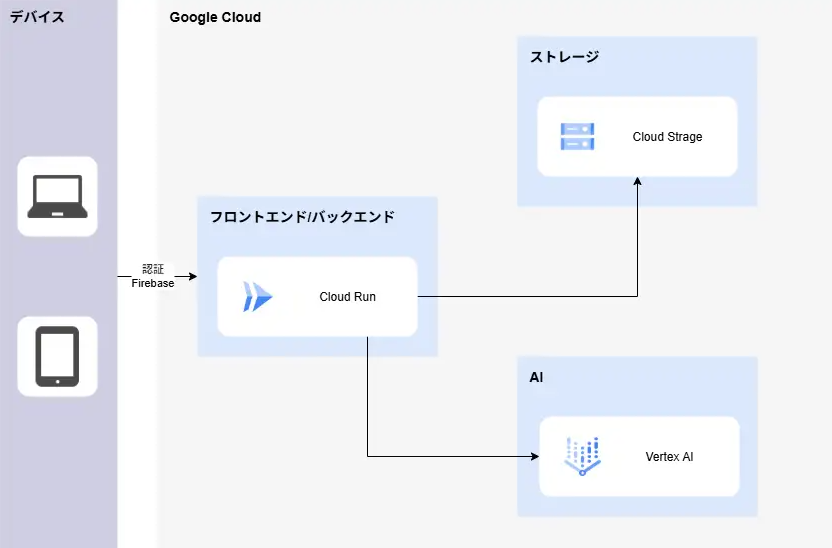

#  プロジェクト背景

生成AI、特に大規模言語モデル（LLM）の進化は、私たちの働き方や創造性のあり方を根底から変えようとしています。しかし、その強力なポテンシャルを誰もが最大限に引き出せているわけではありません。

「AIを使って業務を自動化したいが、プログラミングは難しそう…」  
「複数のAIを連携させる『マルチエージェント』という考え方は面白そうだけど、どう実装すればいいのか分からない」

多くのビジネスパーソンや企画担当者が、このような技術的な壁に直面しています。AIのアイデアを思いついても、それを形にするためには専門的なスキルや長い開発時間が必要でした。

この「アイデア」と「実装」の間の深い溝を埋め、誰もが直感的な操作でAIの力を解き放てるようにしたい。そんな想いから、ノーコードAIワークフロービルダー「**Agent Canvas** 」の開発プロジェクトはスタートしました。

#  対象とするユーザー像と課題

本プロジェクトでは、特に以下のような方々が抱える課題を解決することを目指しました。

  * **ユーザー像:**

    * **DX推進・業務改善担当者:** プログラミングは専門外だが、AIを活用して社内の定型業務を自動化し、生産性を向上させたいと考えている。
    * **企画・マーケティング担当者:** 顧客データの分析やレポート作成をAIで効率化したいが、都度エンジニアに依頼する時間的・コミュニケーションコストに課題を感じている。
    * **AIエンジニア・プロンプトエンジニア:** 複雑なプロンプトチェーンやマルチエージェントシステムのプロトタイピングを、コーディングの手間をかけずに迅速に行いたい。
  * **課題:**

    * AI活用のためのプログラミング学習コストが高い。
    * アイデアを試すためのプロトタイピングに時間がかかりすぎる。
    * 専門家（エンジニア）への依存度が高く、業務部門が主体的にAI活用を進められない。
    * 複数のAIを協調させる高度なワークフローは、構想はあっても実装のハードルが非常に高い。

#  ソリューション: Agent Canvas（ノーコードAIワークフロービルダー）

これらの課題を解決するのが、GUIで直感的にAIエージェントの連携（A2A: Agent-to-Agent）を設計できるノーコード・プラットフォーム「Agent Canvas」です。

Agent Canvasを使えば、**分析役、レビュー役といった異なる役割を持つAIエージェント群をキャンバス上に配置し、それらを線でつなぐだけで、独自の自動化ワークフローを自由に構築** できます。プロンプトによる指示だけでなく、**Pythonコードの実行やファイルアップロードによる簡単なデータ連携も可能** 。GCPとLangGraphを基盤技術として採用することで、**複雑な実装はプラットフォームが肩代わり** します。

これにより、開発者や企画担当者はインフラやコーディングの詳細に煩わされることなく、**アイデアの実現そのものに集中し、生産性を最大化** できます。

##  「Agent Canvas」の主な特徴

  1. **直感的なGUI:**  
プログラミング不要。画面上のフォームに必要な情報を入力し、ノード（エージェント）とエッジ（連携）を追加していくだけで、**AIエージェント同士が連携するワークフロー（A2A）を視覚的に構築** できます。

  2. **柔軟なノード（エージェント）設計:**  
単純なLLMへの指示（プロンプト）だけでなく、**ユーザーが記述したPythonコードを安全な環境で実行するノードもサポート** 。ノーコードの手軽さに加え、Pythonによるローコードの拡張性を提供し、単純な文章生成に留まらない高度なデータ加工や独自のロジックをワークフローに組み込めます。

  3. **簡単なデータ連携:**  
テキストファイルやCSV、Excelはもちろん、複数のソースコードをまとめたZIPファイルまで、**様々な形式のデータを簡単にアップロード** 。AIエージェント群が利用する共通の「文脈」として、ワークフローにシームレスに取り込めます。

  4. **セキュアでスケーラブルな実行基盤:**  
GCPの堅牢な基盤上で構築。Firebaseによるユーザー認証で作成したワークフローやファイルは完全に分離・保護されます。また、Pythonコードはサンドボックス環境で実行されるため、システムの安全性を損なうことなく高い自由度を享受できます。

##  サービスデモ

実際に「Agent Canvas」を使って「アップロードされたソースコードを、楽観的な視点と悲観的な視点の2人のAIレビューアが分析し、最終的なレポートを生成する」ワークフローを構築・実行する様子を3分程度の動画にまとめました。

<https://www.youtube.com/watch?v=BphhoysNw_s>

##  体験フロー

ユーザーは以下の簡単なステップで、自分だけのAIワークフローを作成できます。

  1. **新規登録・ログイン:** メールアドレスとパスワードでアカウントを作成します。
  2. **ワークフロー作成:** サイドバーから新しいワークフローを作成し、名前を付けます。
  3. **ノード（エージェント）定義:** 「LLM」や「Python」といった処理の単位（ノード）を追加し、それぞれの役割（プロンプトやコード）を定義します。
  4. **エッジ（連携）設定:** ノード間の処理の順序やデータの流れを線（エッジ）でつなぎます。
  5. **ファイルアップロード（任意）:** ワークフローで利用したいCSVやテキスト、ZIPファイルなどをアップロードします。
  6. **実行と結果確認:** 実行ボタンを押し、生成された最終結果や各ノードの途中経過を確認します。

##  アーキテクチャ

「Agent Canvas」は、**Google Cloudのスケーラブルかつ堅牢なマネージドサービス群** を全面的に採用しています。バックエンドでは**LangGraphを活用** し、ユーザーがGUIで設計したエージェント連携を動的なワークフローとして実行。これにより、**複雑な実装やインフラ管理をプラットフォームが完全に肩代わり** します。ユーザーはサーバーの心配を一切することなく、アイデアの実現という本質的な作業に集中できます。

>   * **ユーザー:** Webブラウザからシステムにアクセス。
>   * **認証 (Firebase Authentication):** セキュアなユーザー認証を管理。
>   * **フロントエンド/バックエンド (Cloud Run):** メインのアプリケーションが動作するサーバーレス環境。リクエストに応じて自動でスケールします。
>   * **ワークフロー定義 (Firestore):** ユーザーが作成したワークフローの構成情報（ノード、エッジ、プロンプト等）を保存するNoSQLデータベース。
>   * **ファイルストレージ (Cloud Storage):** ユーザーがアップロードしたファイルを安全に保管。
>   * **AIモデル (Vertex AI):** LLMノードの実行時に、Googleの最新AIモデル（Geminiなど）を呼び出します。
>   * **CI/CD (Cloud Build, Artifact Registry):** ソースコードの変更を自動で検知し、ビルド、テスト、デプロイを実行する仕組み。
> 

##  技術ハイライト

本プロジェクトの実現にあたり、特に重要だった技術要素を3つご紹介します。

  1. **LangGraphによる動的ワークフロー:**  
ユーザーがGUIで定義した**AIエージェントの連携（A2A）構成** を基に、バックエンドで実行時に処理のグラフ（ワークフロー）を動的に組み立てています。これにより、固定的な処理しかできないシステムとは一線を画す、高い柔軟性と拡張性を実現しました。

  2. **RestrictedPythonによるセキュアなコード実行:**  
**プロンプトだけでは実現できない高度な処理** を安全な形でワークフローに組み込むため、`RestrictedPython`ライブラリを採用。ファイルシステムへのアクセスや危険なモジュールのインポートなどを制限したサンドボックス環境を構築し、高い自由度と安全性を両立しています。

  3. **ZIPファイル自動解析機能:**  
ソースコードレビューのような「複数のファイルをまとめて扱いたい」というニーズに応えるため、アップロードされたZIPファイルを自動的に展開・解析する機能を実装。これにより、**複数のファイルを扱うAIエージェントのタスクを簡略化** し、ユーザーは前処理の手間なく本質的な作業に集中できます。

##  テストユーザーの声

開発段階で、ターゲットユーザー層の方々にプロトタイプを試していただきました。

> **DX推進担当 Aさん**  
>  「プログラミング経験のない私でも、社内問い合わせ対応の一部を自動化するチャットボットのプロトタイプを半日で作成できました。これまでエンジニアに依頼して数週間かかっていたことが、自分の手で試行錯誤できることに感動しました。」

> **マーケティング担当 Bさん**  
>  「顧客アンケート（CSV）をアップロードし、要約・感情分析・ネガティブ意見の抽出を**複数のAIエージェントが連携する一つのワークフローで実行** できました。アイデアが浮かんだその日のうちに結果を得られるので、施策のPDCAサイクルが格段に速くなりそうです。」

#  今後の展望

「**Agent Canvas** 」はまだスタートラインに立ったばかりです。今後は、さらに多くのユーザーにとって価値あるプラットフォームとなるべく、以下の機能拡充を計画しています。

  * **ノード種類の拡充:** Web検索、外部API連携（HTTPリクエスト）、データベース接続など、より実用的なノードを追加。
  * **UI/UXの向上:** ドラッグ＆ドロップによる視覚的なグラフ編集機能や、ワークフローのバージョン管理・共有機能の実装。
  * **モニタリング機能:** 各ノードの実行時間やコストを可視化し、ワークフローのパフォーマンス改善を支援。

#  まとめ

「**Agent Canvas** 」は、GUIによる直感的な操作で、専門知識がなくとも**複数のAIエージェントが連携（A2A）する高度なワークフロー** を設計できるノーコード・プラットフォームです。プロンプトだけでなくPythonコード実行やファイル連携にも対応し、**複雑な実装はGCPとLangGraphを基盤とする私たちが肩代わりします** 。

これにより、開発者や企画担当者は「アイデア」と「実装」の間の溝を飛び越え、**本来注力すべき創造的な活動に集中し、生産性を最大化** できます。このプラットフォームが、皆さんの挑戦を後押しする強力なツールとなることを願っています。
