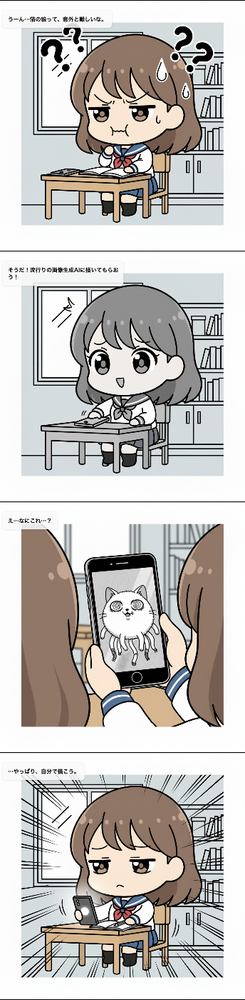

<https://youtu.be/4yahvdn8isk>

##  1\. プロジェクト概要

本プロジェクトが対象とするのは、広告運用・コンテンツマーケ担当者、グロースチーム、制作リソースが限られるスタートアップや個人事業主、そして複数案の提案が求められる制作代理店です。A/Bテストのために漫画クリエイティブを量産したい一方で、毎回の手描き・外注は時間とコストがかかり、学習と検証のサイクルが回りにくいという現場課題があります。

課題の本質は「一貫性」と「スピード」です。従来の画像生成AIでは、同じキャラクターを別シーンに登場させると外見や表情が揺れてしまい、ブランドや検証結果の信頼性を損ねがちでした。また、短期間に複数パターンを作る運用も、人手では現実的ではありません。

本システムは、nano bananaを用いたキャラクター一貫性の確保を軸に、4コマ漫画を自動生成します。キャラクター定義（外見・小物・口調など）をテンプレートとして保持し、シーンごとの差分（状況・セリフ・オチ）だけを変えるプロンプト設計により、A/Bテスト用のバリエーションを短時間で複数生成できます。Web UI（React）から入力し、Cloud Run 上の Hono API を経由して Gemini API と連携することで、スクリプトと画像を取得し、即座に比較できる形で提示します。

特徴は次のとおりです。

  * 一貫性: 同一キャラクターの外見・表情・小物を保ちながら、パネルごとのシーン差分を生成。
  * 量産性: 同じテンプレートから複数パターンを連続生成でき、検証サイクルを高速化。
  * 実運用志向: 4コマ構成の統一により、広告やLPでのA/B比較がしやすいフォーマットを維持。
  * コスト効率: 制作の初期工数と修正回数を抑え、検証にリソースを振り向けられる。

結果として、A/Bテスト前提の漫画クリエイティブを「速く・崩さず・何案も」用意できるようになり、学習速度と意思決定の質を同時に引き上げます。

作成した4コマ漫画の例を以下に示します。  

##  2\. 使用技術

  * nano banana
  * cloud run
  * react
  * hono

##  3\. システム構成

##  おわりに

驚くほど簡単に4コマ漫画を生成できました。  
また、自前の画像も使うことができるので、自社サービスのキャラクターを使った漫画も簡単に生成できます。  
今後は、生成した漫画のクオリティを上げるために、プロンプトの改善や、生成された漫画の評価を行う仕組みを導入していきたいと考えています。
