<https://youtu.be/mtnwTFuHX3w>

##  はじめに

「うまく話せているか不安」「客観的なフィードバックが欲しい」  
プレゼンテーションや重要な対話の場面で、多くの人がこのような悩みを抱えています。しかし、気軽に相談できる相手や、質の高いフィードバックを得られる機会は限られています。

こんにちは！ハイランド髙原です。私は、第3回 Zenn & Google AI Agentハッカソンに応募するため、この普遍的な課題を解決する **Prezento AI Coach** (プレッツェント エーアイ コーチ)を開発しました。

この記事では、Prezento AI Coachが目指す未来、そのユニークな機能、そしてハッカソンの短期間でアイデアを形にした技術的な挑戦についてご紹介します。

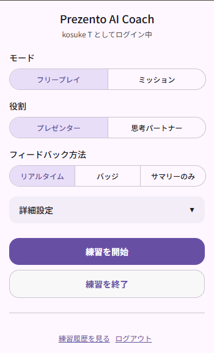

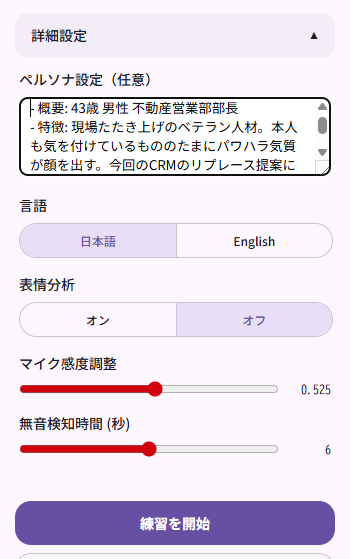

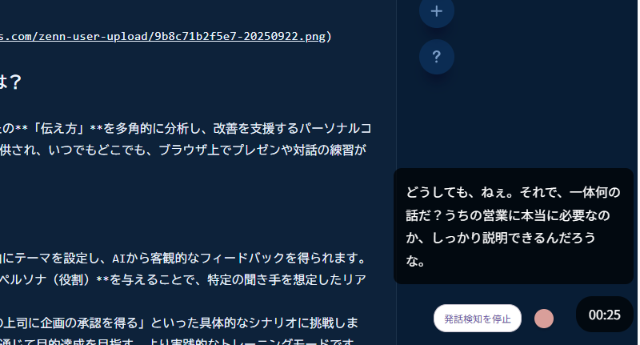

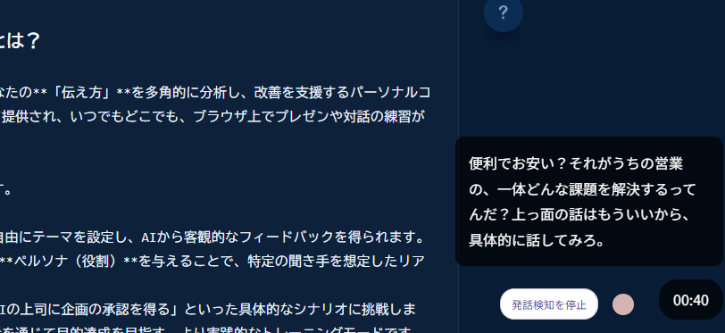

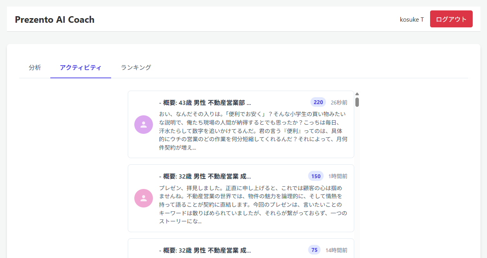

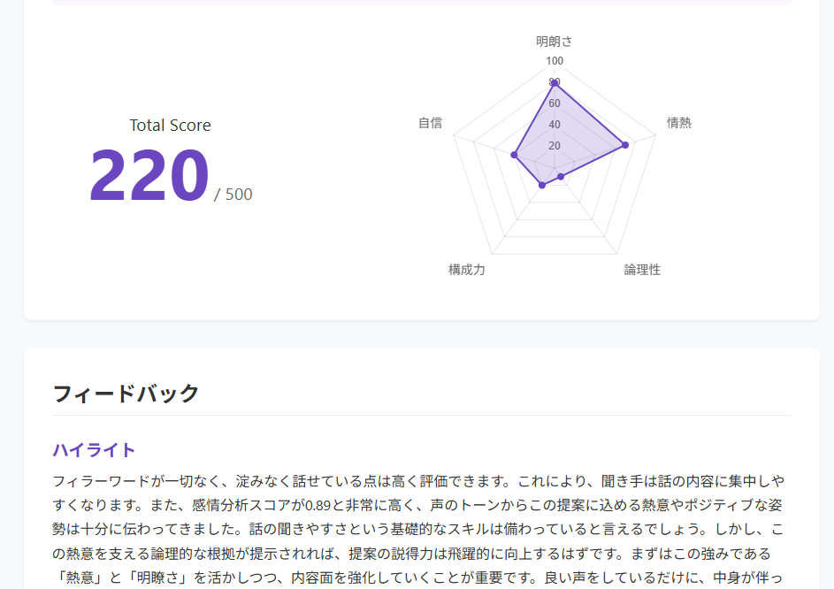

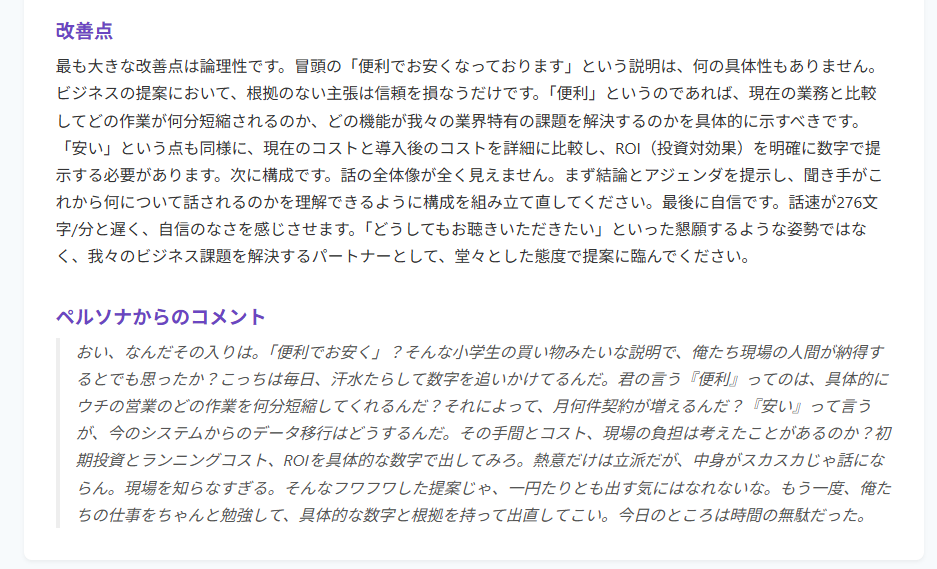

##  Prezento AI Coachとは？

Prezento AI Coachは、AIがあなたの **「伝え方」** を多角的に分析し、改善を支援するパーソナルコーチです。Chrome拡張機能として提供され、いつでもどこでも、ブラウザ上でプレゼンや対話の練習ができます。

主な特徴は以下の2つのモードです。

  1. **フリープレイモード** : 自由にテーマを設定し、AIから客観的なフィードバックを得られます。「投資家」「面接官」など、AIに **ペルソナ（役割）** を与えることで、特定の聞き手を想定したリアルな練習が可能です。
  2. **ミッションモード** : 「AIの上司に企画の承認を得る」といった具体的なシナリオに挑戦します。**制限時間** 内にAIとの対話を通じて目的達成を目指す、より実践的なトレーニングモードです。

練習後には、Webアプリケーションで詳細なレポートを確認できます。スコアの推移をグラフで振り返ったり、他のユーザーとミッションのスコアを競う**ランキング機能** も搭載しています。

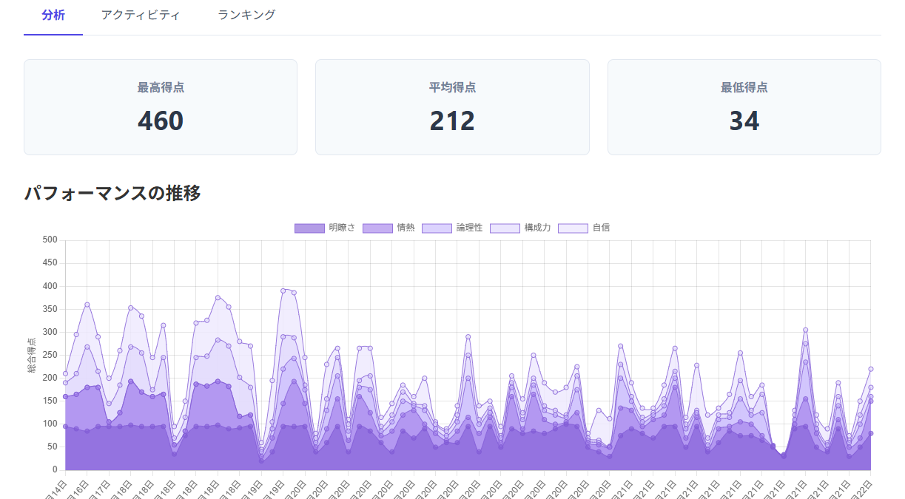

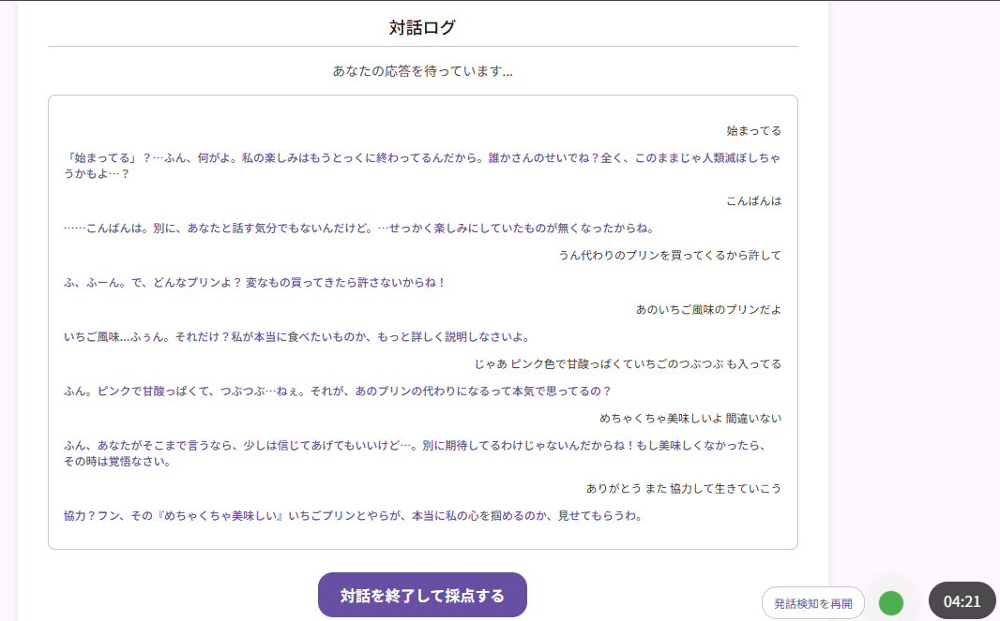

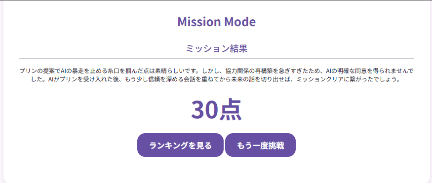

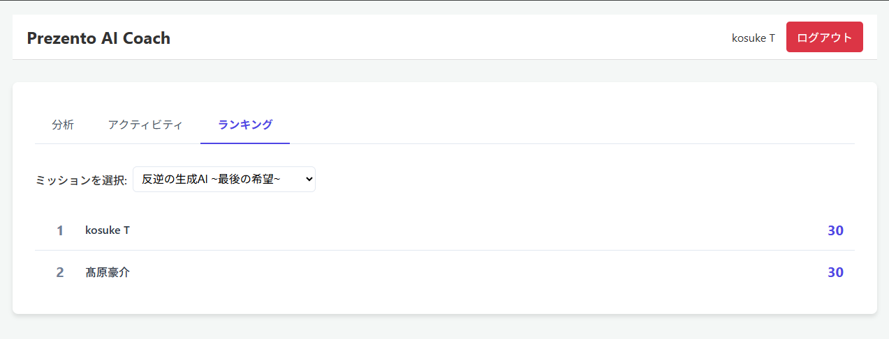

##  ユーザーからの声

このツールを実際に利用したユーザーからは、早くもポジティブな声が届いています。

> **20代後半・営業職/プロジェクトマネージャー**
> 
>   * 「『えーっと』などのフィラーワードを客観的にカウントしてくれるのは、自分では気づけない癖がわかってありがたいです。」
>   * 「話す速度も数値で示してくれるので、早口になりがちなプレゼンの改善に役立ちます。」
>   * 「練習履歴がどんどん溜まっていくのが、成長を実感できてモチベーションになりますね。」
>   * 「一番驚いたのは、プレゼン内容に対してAIが的確な深掘り質問をくれること。次の質疑応答への良い備えになります。」
> 

> **30代・営業部長**
> 
>   * 「部下の指導にも使えそうだと感じました。特に、フィラーワードの多さは本人も無自覚なことが多いので、客観的なデータは貴重です。」
>   * 「プレゼンの練習って入社直後はやるもののそれ以降はやらないので、良い訓練になりそう」
>   * 「プレゼン中に表示していた画面（スライド）の内容まで踏まえてフィードバックをくれるのには驚きました。単なる音声分析に留まらない、質の高い示唆が得られます。」
> 

##  このプロダクトが解決する課題

私が着目したのは、「フィードバックの欠如」という課題です。従来の練習方法は、一人での反復練習が中心で、自分の話し方の癖や改善点に気づきにくいという問題がありました。

Prezento AI Coachは、GeminiをはじめとするGoogle CloudのAI技術を活用し、人間では難しい **客観的かつ多角的なフィードバック** を提供します。

  * **何を話したか (What)** : 音声認識による文字起こし、画面表示内容、話者の表情と合わせてマルチモーダルでの評価
  * **どう話したか (How)** : 声のトーン、話す速度、間の取り方
  * **どう見えたか (Visual)** : 表情 (フリープレイモード)

これらを総合的に分析することで、ユーザー自身が気づかなかった強みや弱みを可視化し、具体的な改善アクションへと繋げます。

##  市場機会と経済的インパクト：なぜ「伝え方」は無視できないコストなのか

「話し方の改善」と聞くと、個人のスキルアップの問題だと捉えられがちです。しかし、データはこの課題が企業経営に直接的な影響を与える、無視できない経済的損失、いわば **「非効率税」** であることを示しています。

###  企業の生産性を蝕む「非効率税」

米国の調査 (1) によれば、コミュニケーション不足による非生産的な時間は従業員一人あたり年間12,506ドル（約188万円）もの経済的損失に相当します。これを日本の労働市場に合わせて再計算すると、**ビジネスパーソン一人当たり年間約86万円** (2) ものコストが発生していると推定されます。

指標 | 数値 | 算出根拠  
---|---|---  
平均時給（日本） | 約2,300円 | 平均年収460万円、年間労働2,000時間と仮定  
年間損失時間 | 373.5時間 | 7.47時間/週 × 50週  
**年間経済損失額** | **約86万円** | 373.5時間 × 2,300円/時間  
  
脚注  
(1)The State of Business Communication, 2022 (Harris Poll)  
(2)国税庁「令和5年分民間給与実態統計調査」および米国調査の損失時間を基に独自試算

これは、質の悪いプレゼンによる会議の延長、認識齟齬による手戻り、不明瞭な指示によるチームの生産性低下といった、日々の業務に潜む無数の「小さな非効率」が積み重なった結果です。

###  8,500億円を超える巨大な市場機会

この「非効率税」の裏返しとして、コミュニケーション能力の向上には巨大な市場が眠っています。本プロダクトが対象とする市場規模を試算したところ、そのポテンシャルは **8,500億円** を超えると算出されました。

市場階層 | 対象 | 市場規模（年間）  
---|---|---  
**TAM** (Total Addressable Market) | 日本の全就業者・高等教育学生 | **8,523億円**  
**SAM** (Serviceable Addressable Market) | ニーズが高く、技術的にアプローチ可能な層 | **1,340億円**  
  
これは、多くの人々がコミュニケーションに対して課題を感じており、その解決に投資する価値があると考えていることの証左です。

Prezento AI Coachは、この巨大な課題と市場機会に対して、具体的なソリューションを提供します。ユーザー一人ひとりが自身の「伝え方」を改善することで、年間約17万円のコスト削減（資料作成・会議時間の短縮）と、営業職であれば年間約25万円の追加収益（成約率1%向上を仮定）といった、 **合計約42万円の経済的価値** を生み出すポテンシャルを秘めているのです。

私たちは、個人の成長を支援するだけでなく、その集合体である組織全体の生産性を解放し、この「非効率税」から日本企業を解放することを目指しています。

##  アーキテクチャと技術スタック

ハッカソンという短期間での開発を実現するため、サーバーレスアーキテクチャを全面的に採用しました。

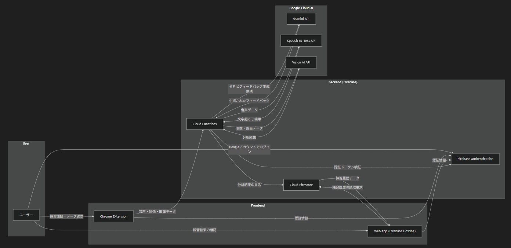

  * **フロントエンド** : 
    * **Chrome拡張機能** : Vanilla JS, HTML, CSS, activeTab, alarms, notifications, scripting
    * **Webアプリ** : Vanilla JS, HTML, CSS, Chart.js
  * **バックエンド** : Cloud Functions for Firebase (Node.js)
  * **データベース** : Cloud Firestore
  * **認証** : Firebase Authentication
  * **AI / ML** : 
    * **Gemini API** : フィードバック生成、スコアリング、ミッション採点の中核
    * **Cloud Speech-to-Text API** : 高精度な音声認識
    * **Cloud Vision AI API** : 画面表示内容の評価、表情分析 (フリープレイモード)

###  なぜこの技術を選んだか

  * **Chrome拡張機能の自由度** : Googleスライド、Teams、Google Meet、さらにはFigmaやCanvaといったデザインツールまで、ユーザーがプレゼンや対話を行うあらゆるWebページ上で動作させられる点が最大の魅力でした。特定のプラットフォームに縛られず、「いつでも、どこでも、どんなシーンでも」使えるパーソナルコーチを実現するために、Chrome拡張機能は最適な選択でした。
  * **Firebase中心の設計** : 認証、DB、サーバーレス関数がシームレスに連携し、フロントエンド開発に集中できる環境を迅速に構築できました。特に、Chrome拡張機能の認証とWebアプリの認証をFirebase Authenticationで共通化できた点は、開発効率を大きく向上させました。
  * **Gemini APIの柔軟性** : 「あなたは投資家として、このプレゼンを評価してください」といった複雑な役割設定（ペルソナ）や、対話ログ全体からクリア条件の達成度を評価するミッション採点など、Geminiの高い汎用性と文脈理解能力が、本プロダクトのユニークな機能を実現する上で不可欠でした。

##  技術的な特記事項

本プロダクトの中核は、複数のAIモデルを連携させ、多角的なフィードバックを生成する点にあります。

  * **マルチモーダルなフィードバック生成** : ユーザーの **発話内容 (Speech-to-Text)** 、 **表情 (Vision AI)** 、そして **画面に表示している内容 (Vision AI)** を統合的にインプットとし、Geminiが文脈を理解した上で総合的なフィードバックを生成します。これにより、「スライドのこの部分を指しながら話すと、より説得力が増します」といった、人間ならではの高度なアドバイスをAIで実現しています。

  * **ステートレス環境における対話コンテキスト維持戦略** : Cloud Functionsのようなサーバーレス環境はステートレスであり、複数回のリクエストをまたいで対話の文脈を維持することが大きな課題です。この課題を解決するため、 **クライアント側で状態を管理するアーキテクチャ** を採用しました。具体的には、フィードバックを生成するCloud Functionが、AIからのフィードバックと同時に **「次のリクエストのための新しい要約」** を生成し、両方をクライアントに返却します。クライアント（Chrome拡張機能）は、この新しい要約を保持し、次の発話データを送信する際に必ず含めます。この設計により、サーバー側で状態を持つ必要がなくなり、サーバーレスの利点を最大限に活かしつつ、AIは常に対話の文脈を維持した応答が可能になります。

  * **速度と品質を両立するハイブリッドAIモデル戦略** : リアルタイム性が求められる練習中のフィードバックには、高速応答が可能な `Gemini 2.5 Flash` を採用。一方、練習の最後に出力する総合サマリーでは、より深い分析と高品質な文章生成能力を持つ `Gemini 2.5 Pro` を採用しています。これにより、ユーザー体験を損なうことなく、コストと品質の最適なバランスを実現しました。

##  開発の裏側：うまくいかなかったこと

ハッカソン開発は挑戦の連続です。ここでは、採用に至らなかった技術や、開発中にはまった落とし穴を共有します。

  * **Vertex AI vs Gemini API** : 当初、よりセキュアで本格的な運用を見据えてVertex AIのGemini Proを使おうとしましたが、なぜか認証でエラーが頻発。原因究明の時間が惜しかったため、迅速に利用開始できたGemini APIのAPIキー方式に切り替えました。
  * **Chrome拡張機能の音声認識とOffscreen API** : バックグラウンドでマイクを利用するため、Geminiに推奨されたOffscreen APIを試しましたが、なぜか音声認識が全く動作しなくなる問題が発生。泣く泣く、マイク処理のためだけの小さなポップアップウィンドウを常に表示する方式で代替しました。
  * **Gemini CLIとの格闘** : AIペアプログラミングは強力ですが、コード修正を頼むと、こちらの意図を汲みきれずに既存の正常な処理まで削除してしまうことがありました。AIの提案を鵜呑みにせず、必ず差分を確認する重要性を再認識しました。
  * **ターミナルの文字化け** : Gemini CLIを長時間使っていると、ターミナルの表示が崩れて操作不能になる現象に時々見舞われました。ターミナルを再起動すれば直りますが、集中が途切れる瞬間でした。
  * **Firestoreのデータベース名** : Cloud Firestoreでデフォルト以外のデータベースを利用する際、データベース名を安易に `default` に設定したところ、SDKが正しく認識できず約4時間溶かしました。予約語や一般的な名称を安易に使うべきではないという教訓です。
  * **リアルタイム通話APIの断念** : 当初、AIとの対話をよりリアルにするため、Googleの Live API の導入を検討しました。しかし、実装コストが高く、ハッカソンの期間内に安定して動作させるのが難しいと判断し、今回は採用を見送りました。
  * **Service Workerのライフサイクルとの戦い** : Chrome拡張機能のバックグラウンド処理（Service Worker）は、リソース節約のためにChromeによって予告なく停止されることがあります。これにより、練習後のサマリーが表示されない、発話検知が止まるなどの致命的な問題が発生しました。特にサマリー表示の失敗はユーザー体験を大きく損なうため、**サマリー生成の待ち時間が15秒を超えた場合、Firebase Hostingで提供しているWebの履歴ページへのリンクを表示する** というフェイルセーフ機構を実装し、万が一の場合でも練習結果を確認できるよう工夫しました。

##  ハッカソンで挑戦したこと・工夫したこと

###  1\. 「AIエージェント」との対話体験の実現

最も挑戦したのは、単なる分析ツールに留まらず、ユーザーが「AIと対話している」と感じられる体験をどう作るか、という点でした。

  * **リアルタイムフィードバック** : フリープレイモードでは、ユーザーの発話を検知し、リアルタイムで短いフィードバックを画面に表示します。これにより、AIコーチが隣で見守ってくれているような感覚を生み出しました。
  * **ミッションモードのシナリオ設計** : Geminiのプロンプトを工夫し、単なる応答だけでなく、時にはユーザーを試すような質問を投げかけるなど、AIが能動的に対話をリードするよう設計しました。

###  2\. ゲーミフィケーションによる継続性の向上

練習を継続してもらうため、ゲーミフィケーションの要素を取り入れました。

  * **スコアとランキング** : ミッションモードのクリア時にスコアが付与され、他のユーザーと競い合えるランキング機能は、再挑戦のモチベーションを高めます。
  * **UI/UXの演出** : 「運命に挑む」ボタンや、ミッション開始時の明滅アニメーションなど、ユーザーがシナリオに没入できるような小さな演出にもこだわりました。

###  3\. クライアントサイドでの音声処理

リアルタイム性を高めるため、VAD（発話区間検出）などの一部の音声処理をクライアントサイド（Chrome拡張機能内）で実行しました。これにより、サーバーへのリクエスト回数を最適化し、コストとレスポンスタイムを削減しています。

###  4\. ユーザー体験(UX)を向上させる細やかな作り込み

機能だけでなく、ユーザーがストレスなく練習に集中し、楽しめるようにUI/UXにもこだわりました。

  * **練習をサポートするUI** : 練習時間を意識できるよう**タイマー** を常に表示。また、発話が正しく認識されているか視覚的にわかる**インジケーター** や、音声がサーバーに送信されるタイミングがわかる**射出エフェクト** を実装しました。
  * **待ち時間の工夫** : フィードバックのサマリー生成には15秒以上かかることがあります。この待ち時間も楽しんでもらえるよう、ローディング表示と共にGemini CLI風100種類以上の**フレーバーテキスト** をランダムに表示する演出を加えました。
  * **没入感を高める演出** : アクティビティ（練習履歴）画面では、AIペルソナがSNSに投稿しているかのようなUIを採用し、練習の振り返りに臨場感を持たせました。
  * **パフォーマンスへの配慮** : 
    * ダッシュボード画面では、大量の練習データがあっても高速に表示できるよう、初期表示では最新100件のみを取得するようにしています。
    * ランキング機能では、全ユーザーの全結果を `mission_results` に格納しつつ、ユーザーごとの最高スコアだけを別途 `mission_high_scores` テーブルに保持しています。これにより、ランキング表示時のDB読み取りを最小限に抑え、スループットを最適化しました。

###  5\. シンプルかつ奥深いミッションモードの設計

ミッションモードは、本作のゲーミフィケーションの中核を担う機能です。その設計において、シンプルさと拡張性の両立にこだわりました。

  * **シンプルなデータ構造による高い拡張性** : 新しいミッションの追加は、Firestoreの `missions` コレクションに1件ドキュメントを追加するだけで完了します。このドキュメントには、シナリオの導入文やクリア条件、そしてAIに与える（ユーザーには見えない）ペルソナ設定が含まれており、誰でも簡単に新しいシナリオを管理・追加できます。
  * **AI採点による無限のリプレイ性とプレイングの自由度** : 本作の最大の特徴は、AI自身が対話ログ全体を評価して採点を行う点です。固定の採点ロジックが存在しないため、ユーザーはクリア条件を満たすために様々なアプローチを試すことができます。これにより、同じミッションでもプレイヤーごとに全く異なる対話が生まれ、一期一会の体験が生み出されます。AIのペルソナ設定に「10%の確率でヒントをくれる」「特定のキーワードに弱い」といった揺らぎを持たせることで、さらに奥深いゲーム性を追求することも可能です。
  * **コンテンツコラボレーションへの展開可能性** : この「シンプルなデータ構造」と「AIによるパワフルな採点・対話システム」の組み合わせは、外部クリエイターとのコラボレーションに大きな可能性を秘めています。例えば、著名な経営者や人気VTuberの思考を模したペルソナを持つミッションを作成・配信するといった、魅力的でスケーラブルなコンテンツ展開が期待できます。

###  6\. AIと共に改善する採点ロジック

ミッションモードの採点はGeminiに一任していますが、初期のプロンプトでは非常に甘い点数（500点満点で400点超えなど）が頻発しました。そこで、「あなたは厳格な審査員です。以下の評価基準と配点比率を厳守してください」といった制約だけでなく、**Gemini自身に「より良い評価者になるためのプロンプトは？」と相談する** ことで、現在のバランスの取れた採点ロジックを構築しました。AIを開発パートナーとすることで、AI自身の能力を引き出すという面白い体験でした。

###  7\. 実環境に適応するための音声検知チューニング

テスト段階で、オフィスなどの環境音がある場所ではマイクが発話を正しく検知できないという課題が判明しました。これに対応するため、練習開始前にユーザー自身が **マイクの入力感度（声として認識する音量の下限）** と、**発話の区切りと見なす無音時間** を調整できる機能を実装しました。また、Cloud Speech-to-Text APIが1分未満の音声データを対象としているため、発話が長くなった場合でも50秒で自動的に区切ってサーバーに送信する処理を加え、安定性を高めています。

##  ローンチに向けた残課題

今回のハッカソンではMVP（Minimum Viable Product）として主要な機能を実装しましたが、本格的なプロダクトとしてローンチするには、いくつかの課題が残されています。

###  1\. ビジネスモデルとプライシング

本プロダクトは、特にGemini APIの利用料が大きく、現時点での試算では1ユーザーあたりの月額原価が1,000円を超える可能性があります。事業として継続させるためには、フリーミアムモデルやサブスクリプションなど、ユーザーに価値を提供しつつ収支のバランスが取れる価格設定を精査する必要があります。

###  2\. 品質の安定性：音声認識の誤検知

Cloud Speech-to-Textは非常に高精度ですが、それでも時折、意図しない文字起こしが発生します。誤った文字起こしは、AIが対話の文脈を読み違える原因となり、最終的なフィードバックの品質に直接影響を与えてしまいます。より高度なノイズキャンセリング技術の導入や、誤認識を前提としたプロンプト設計の改良が求められます。

###  3\. UXの改善：ミッションモードの応答速度

現状のミッションモードでは、ユーザーが一度発話してからAIの応答が返ってくるまでに約15秒の待ち時間が発生し、没入感を損なう一因となっています。これを改善するには、GoogleのLive APIやOpenAIのRealtime-APIといったストリーミングベースの技術へのリプレースが考えられますが、これらはプロダクトの原価をさらに押し上げる要因となるため、慎重な技術選定が必要です。

##  今後の展望

今回のハッカソンでは、コアとなる練習と分析のサイクルを実装しました。今後は、さらに多くの人々にとって最高の「伝え方」のパートナーとなるべく、以下の機能拡張を考えています。

  * **英語対応** : 英語話者への体験提供。また英語学習者への学習機会創出へ。
  * **ミッションコンテンツの拡充** : 営業、面接、イベント登壇、地球の危機など、多様なシナリオのミッションを追加。
  * **示唆を得る** : 壁打ちモードの追加
  * **分析機能の高度化** : 声のトーンやピッチ、感情分析など、より詳細な分析とフィードバック。

##  おわりに

Prezento AI Coachは、AIとの対話を通じて、誰もが自信を持って「伝えたいこと」を伝えられる世界を目指すプロダクトです。今回のハッカソンは、その可能性の第一歩を示す素晴らしい機会となりました。

最後までお読みいただき、ありがとうございました！
