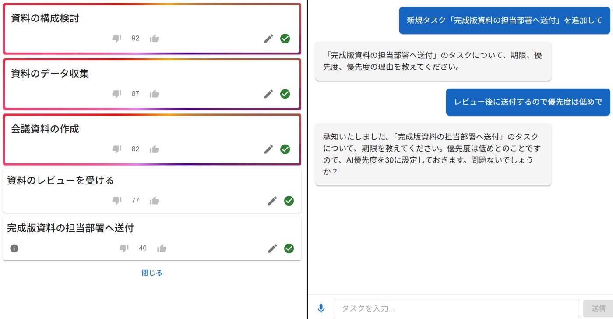
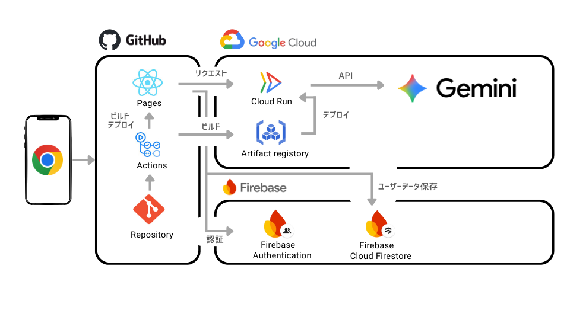

<https://youtu.be/ErZ9V5-XRAM>

#  はじめに

ふとした瞬間に浮かんだ画期的なアイデア、会議中に思いついた重要なタスク、「いつかやろう」と心に決めた小さな目標。私たちの頭の中では日々、無数の思考が生まれては消えていきます。その中で、本当に価値のある閃きが、気づかぬうちに記憶の彼方へ消えてしまった経験は、誰しもあるのではないでしょうか。

従来のタスク管理ツールは、こうした思考の断片を記録し、整理するための強力な味方でした。しかし、その利用には常に「ひと手間」が伴います。PCやスマートフォンを取り出し、ロックを解除し、アプリを立ち上げ、キーボードで文字を打ち込む。この一連の動作は、私たちの繊細な思考の流れを容赦なく中断させます。特に、何かに集中している時や移動中など、すぐに行動に移せない状況では、その「面倒くささ」が思考の記録をためらわせ、せっかくの閃きを揮発させてしまう大きな原因となっていました。開いた瞬間に別の通知に気を取られ、何を記録したかったのか忘れてしまう、といった経験は決して少なくないはずです。

私たちは、この「思考と記録の間の断絶」こそが、現代人の生産性と創造性を縛る大きな足かせになっていると考えました。もし、頭に浮かんだことを、まるで隣にいるアシスタントに話しかけるように、そのまま記録・整理できたとしたら。思考の流れを一切止めることなく、アイデアを即座に構造化できたとしたら。私たちの日常は、どれだけ創造的で効率的になるでしょうか。

そんな課題意識から、私たちは「話すだけ」で思考を止めずにタスク管理が完結するAIアプリケーション「TaskEcho」を開発しました。TaskEchoは、単なる音声入力ツールではありません。ユーザーとの自然な対話を通じて意図を汲み取り、思考のパートナーとして寄り添うAIアシスタントです。私たちの脳が本当に集中すべきクリエイティブな活動にリソースを割けるよう、煩雑な記憶と整理のプロセスを肩代わりします。

#  課題とソリューション

##  ターゲットユーザー像

####  多忙なビジネスパーソン

会議や移動中に次々とタスクが思い浮かぶが、メモを取る時間がない方。

####  クリエイターや企画職

アイデアが閃いた瞬間に、その熱量を保ったまま記録・整理したい方。

####  マルチタスクに追われるすべての人

頭の中がごちゃごちゃになり、何から手をつければ良いか分からなくなりがちな方。

##  ユーザーが抱える課題

従来のテキストベースのタスク管理は、私たちの思考の流れを妨げていました。ふとした瞬間に思いついたアイデアやタスクを記録するためには  
①デバイスを開く  
②アプリを起動する  
③キーボードで入力する  
という複数の手順が必要でした。この手間が、せっかくのアイデアを忘れてしまう原因となり、タスクの抜け漏れを引き起こします。  
また、単にタスクをリスト化するだけでは、頭の中のモヤモヤは晴れません。「何が重要で、いつまでにやるべきか」という思考の整理までサポートしてくれるツールは多くありませんでした。

##  ソリューション

TaskEchoは、AIとの自然な対話によって、この「思考の妨げ」を取り除きます。  
ユーザーは思いついたことを、ただ話すだけ。AIがその内容を理解し、タスクとして自動で構造化・登録します。さらに、会話の文脈からタスクの重要性や期限をAIが判断し、最適な優先順位を提案します。これにより、ユーザーはタスクを記録する手間から解放されるだけでなく、頭の中をクリアに整理し、本当に集中すべきことに時間を使えるようになります。

##  機能と特徴

TaskEchoは、AIとの「対話」を通じて、これまでのタスク管理の概念を根本から覆します。これは単なるツールではなく、ユーザー一人ひとりの思考の癖や状況を理解し、最適なサポートを提供する「思考パートナー」です。キーボードを叩いてタスクを「入力」するのではなく、AIと「会話」する中で、自然と頭の中が整理されていく。そんな新しい体験を提供します。

###  主要機能

####  音声によるタスクの即時登録・編集・完了

TaskEchoの最も基本的な機能であり、最もパワフルな機能です。ユーザーは思考を中断することなく、思いついたことをそのまま口にするだけでタスクを管理できます。

例えば、「来週の水曜までに企画書を修正して、金曜にAさんに送る」と話しかけるだけで、AIは「企画書を修正する（期限：来週水曜日）」と「企画書をAさんに送る（期限：金曜日）」という2つのタスクを自動で切り分け、適切な期限と共に登録します。さらに、「あ、ごめん、さっきの企画書のタスク、やっぱりAさんじゃなくてBさんに送って」といったように、直前の会話内容を記憶しているため、自然な対話でタスクの編集が可能です。「今日の買い物リストに牛乳と卵を追加して」「このタスク完了」など、日常のあらゆるシーンで、思考と行動をシームレスに繋ぎます。この裏側では、高度な自然言語理解モデルが日付、人名、アクションといった要素を瞬時に解析し、構造化されたデータへと変換しています。

####  AIによるタスクの自動整理・優先順位付け

TaskEchoは、単に言われたことを記録するだけのボイスメモではありません。会話のニュアンスや文脈を深く理解し、ユーザーの頭の中を整理する役割を担います。

「今日の最優先タスクは何？」と聞けば、AIが登録されたタスクの中から、期限や会話中での言及（「これは最重要」「絶対忘れないで」など）を基に判断した最も重要なタスクを提示します。また、「この新しいアイデア、今進めてるプロジェクトより重要度高いかな？」といった曖昧な相談にも、「承知しました。新しいアイデアの優先度を高く設定しますね」と、ユーザーの意図を汲み取って柔軟に整理します。複数のプロジェクトが並行していても、タスクの粒度がバラバラでも、AIが背後で常に関係性を整理し、ユーザーが次に何をすべきかを明確に示してくれます。これは、ユーザーが意識せずとも、優秀な秘書が常にタスクリストを最適化してくれているような感覚です。

####  自然な対話によるタスク検索と発見

記憶は曖昧なものです。TaskEchoは、そんな人間の記憶を補完する強力な検索機能も対話形式で提供します。

「A社に関するタスクを全部教えて」「先週登録した、あの新しいアプリのアイデアってどうなった？」など、まるで人に尋ねるように話しかけるだけで、関連する情報を瞬時に引き出すことができます。「確か、先月の会議で決まったタスクがあったはずなんだけど…」のような、うろ覚えの記憶を手繰り寄せるような問いかけにも、AIが関連性の高いタスクをいくつか提案し、「これのことですか？」と確認してくれるため、目的の情報へ素早くたどり着けます。これにより、タスクの抜け漏れを防ぐだけでなく、忘れていた重要なアイデアとの再会（セレンディピティ）を促し、新たな創造のきっかけを生み出すことさえあります。

###  独自性・競合との比較

| TaskEcho | 従来のタスク管理アプリ | 音声メモアプリ  
---|---|---|---  
入力方法 | 音声対話 | テキスト入力 | 音声録音  
タスク構造化 | ◎ 自動で構造化 | ◯ 手動で設定 | × 録音のみ  
優先順位付け | ◎ AIが自動提案 | ◯ 手動で設定 | × 不可  
思考の連続性 | ◎ 思考を止めない | △ 入力時に中断 | ◯ 思考を止めない  
  
TaskEchoの最大の特徴は、単なる音声入力に留まらず、AIとの「対話」を通じて思考整理まで行う点です。ユーザーの脳の外部記憶装置として機能し、行動をサポートするパーソナルAIアシスタントを目指しています。

#  システム構成

このプロダクトの根幹をなすのは、リアルタイムな音声処理と、ユーザーの意図を汲み取る自然な対話を実現するAIです。私たちは、「AIで何か新しいことができるはずだ」という挑戦心から、このプロダクトを開発しました。

##  システムアーキテクチャ

システムは、ユーザーの音声入力からタスク管理までを一貫して処理するマイクロサービス構成を採用しています。  

##  使用技術スタック

アーキテクチャ図に示した通り、本プロダクトでは以下の技術スタックを採用しました。

技術要素 | 使用サービス・ライブラリ | 選定理由  
---|---|---  
フロントエンド | React, GitHub Pages | Reactによるコンポーネントベースの開発でUIを効率的に構築しました。GitHub Pagesを利用することで、リポジトリからのデプロイを簡素化し、迅速なホスティングを実現しました。  
バックエンド | Cloud Run (Node.js) | APIリクエストに応じて迅速にスケールするサーバーレス環境としてCloud Runを採用。Node.jsの非同期処理モデルが、Gemini APIとの通信を効率的に行うのに適していました。  
AI | Gemini API | 本プロダクトの核となる自然言語での対話とタスクの文脈理解を実現するため、Googleの高性能な生成AIモデルであるGeminiを利用しました。  
データベース | Cloud Firestore | ユーザーごとのタスクデータを安全かつ柔軟に保存するため、NoSQLデータベースであるFirestoreを選択。リアルタイムでのデータ同期も容易なため採用しました。  
認証 | Firebase Authentication | GitHubアカウントを利用したOAuth認証を簡単かつ安全に実装できるためFirebase Authenticationを採用しました。Firestoreのセキュリティルールとの連携もスムーズでした。  
CI/CD | GitHub Actions | ソースコード管理に利用しているGitHubに統合されており、mainブランチへのプッシュをトリガーに自動でビルドとデプロイを実行するため、GitHub ActionsでCI/CDパイプラインを構築しました。  
コンテナ管理 | Artifact Registry | Cloud Runで実行するバックエンドアプリケーションのコンテナイメージを、Google Cloud上で安全かつ一元的に管理するために利用しました。  
  
##  ポイント

開発において特にこだわったのは、「リアルタイム応答」と「文脈理解に基づくタスク管理」です。

###  リアルタイム応答の実現

ユーザーの思考を止めないためには、音声入力からAIの応答、タスクの反映までが遅延なく行われる必要がありました。これを実現するために、フロントエンドからのREST APIリクエストをCloud Runで即座に処理し、Gemini APIの結果を返すアーキテクチャを構築しました。

###  文脈理解に基づくタスク管理

単にキーワードを抽出するのではなく、ユーザーの「思考」を読み取ることが最大の挑戦でした。Gemini APIと連携し、「このタスクは前のより重要」「あれを明後日までに」といった曖昧な指示や代名詞を、過去の会話履歴を考慮して解釈するプロンプト設計に最も注力しました。これにより、より人間らしい対話によるタスク管理を実現しました。

###  パーソナライズされたAI

設定よりあなただけの独自のAIを作成できます。好みのキャラ設定をすることでお好みのAIや知識を持たせることが出来るので楽しくタスク管理ができます。  

#  今後の展望・課題

##  今後の展望

今後は、さらにユーザーの行動パターンを学習し、よりパーソナライズされたタスク提案（「毎週月曜の定例前に、進捗報告タスクを作成しますか？」など）や、プロジェクト単位での自動整理機能などを追加していく予定です。  
また、Google CalendarやSlackなど、他のサービスとの連携を強化し、私たちの日常にシームレスに溶け込むAIアシスタントへと進化させていきたいと考えています。

##  課題

現状の課題として、長時間の対話における文脈維持の精度向上が挙げられます。今後は、より長期的な記憶を管理する仕組みを導入し、さらに人間らしい対話体験を目指します。

#  おわりに

TaskEchoは、「AIで何ができるか」という純粋な探求心と、「テクノロジーで人間の思考を拡張したい」という想いから生まれたプロダクトです。このアプリが、日々のタスク管理に追われ、思考が散乱しがちな人々の助けとなることを心から願っています。

チーム名:ぷらいおり隊  
メンバー（イラスト左から）  
nonal：AIエージェント設計、実装、動画作成  
mahiro：実装全般、Firebase  
kou426：AI機能、UIアイデア、記事作成  
hoshymo：発案、クラウド、CI/CD  

