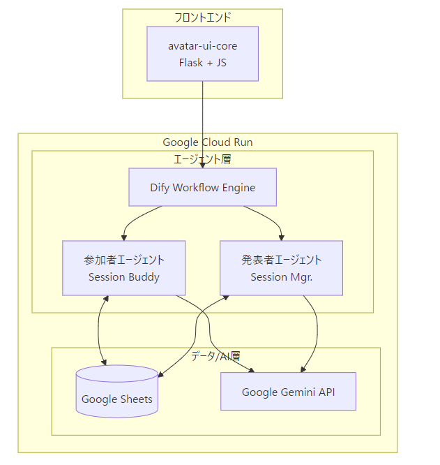
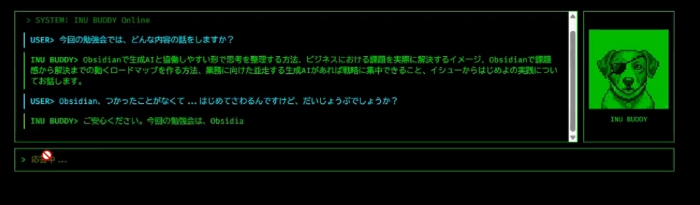

こんにちは、チームManabi-DX-Crewです。  
僕達は今回、Zennの**AI Agent Hackathon 第3回** に参加し、「**Session Buddy** 」というサービスを開発しました。前回のGrowth Buddyに続き、2回目のハッカソン挑戦となります。今回はどのようなサービスを考えたのかをご紹介します。

#  概要: **「自己紹介はもう要らない。本題から始めよう。」**

「**Session Buddy** 」は、**勉強会などのイベントにおける参加者と発表者をつなぎ、質問のハードルをさげることで、より良い学習体験を提供するAIエージェントシステム** です。

事前の対話を通じて参加者と発表者が互いを知ることで、貴重な発表時間を本当に学びたい内容に集中できます。参加者は匿名で質問でき、AIによる即時回答を受けられます。発表者は参加者のニーズを事前に把握でき、フィードバックを効率的に収集できます。**プライバシーを保ちながら、イベントをより価値あるものにする** 仕組みです。

<https://www.youtube.com/watch?v=SH28bDAXMxA>

###  チームメンバー

  * [toki](https://zenn.dev/murakamiastom)
  * [M_R_K_W_](https://zenn.dev/mrkw)
  * [YF-40](https://zenn.dev/yf_40)
  * [たまちゃん](https://zenn.dev/tama_c)
  * [座禅いぬ](https://zenn.dev/zazen_inu)

###  チームで共有の課題感は「イベントでの質問の障壁」

元々僕達はManabi DX Questというイベントで知り合って出来た勉強会のメンバーで、定期的に勉強会などを開催しています。前回のGrowth Buddyでは従業員教育に焦点を当てましたが、今回は僕達自身が日々感じている課題に取り組むことにしました。それが**イベントでの質問の障壁の高さ** です。

参加者側の立場では、「こんな初歩的な質問をしていいのか」「他の参加者の時間を奪ってしまうのではないか」という不安があります。発表者側の立場では、「参加者が本当に理解しているか分からない」「どんな質問があるか事前に把握できない」という悩みがありました。

議論を重ねる中で、これらの課題はAIエージェントによって解決できるのではないかと考えました。単なるQ&Aボットではなく、イベントの申し込み段階から参加者と発表者をサポートし、**双方向のコミュニケーションを促進する仕組み** として、Session Buddyを開発しました。

##  対象ユーザーと課題

###  対象ユーザー像と課題、何が解決できるのか

  1. **イベント参加者**

     * 技術勉強会やセミナーの参加者
     * 質問したいけど躊躇してしまう人
     * 疑問点をうまく言語化できない不安がある人
  2. **イベント発表者**

     * 勉強会やセミナーを主催・発表する人
     * 参加者の理解度やニーズを事前に把握したい人
     * より良いイベント運営を目指す人

###  解決する課題

  * **参加者側** ：質問の心理的障壁、理解度の不安、フォローアップ不足
  * **発表者側** ：参加者ニーズの把握困難、フィードバック収集の手間、質疑応答の偏り

###  何が解決できるのか

Session Buddyは**イベント前の参加者との対話を実現する** ことで、以下の問題解決を提供します。

  * **匿名質問機能** ：心理的障壁を取り除く
  * **AI即時回答** ：過去のQ&Aデータベースを活用した即座のサポート
  * **事前の相互理解促進** ：自己紹介時間を省略し、発表時間を本題に集中
  * **本音の深掘り** ：表面的な質問の奥にある真の課題を対話で引き出す
  * **発表時間の最適化** ：限られた時間をより価値ある学習に活用

#  想定するユーザー体験

##  ストーリー：初心者参加者・花子さんとSession Buddyの体験

「**こんにちは！明日のObsidian勉強会への参加、楽しみですね。何か不安なことはありますか？** 」  
初めて技術イベントに参加する花子さんは、Session Buddyの画面に現れたメッセージに少しほっとしました。

###  イベント前日：準備の不安を解消

「実は...Obsidianって触ったことないんです。明日ついていけるか心配で」  
「大丈夫ですよ！このイベントは初心者向けです。でも、**事前にインストールしておくとスムーズ** ですね。**過去の資料にインストール手順やおすすめのプラグインについて解説があります** 」

Session Buddyは過去の勉強会資料から、概略を説明しました。

「インストールはできたんですが、vaultって何を指定すればいいんでしょう？」  
「vaultはあなたのノートを保存するフォルダのことです。どこでも大丈夫ですが、例えばDocumentsフォルダ内に『Vault』という名前で作ってみてはいかがでしょうか」

###  発表者について知りたい

「ところで、**明日の発表者ってどんな方なんでしょうか** ？Obsidianのプロなんですか？」

「明日発表する座禅いぬさんは、医療系の仕事をしていて、Obsidianを学習およびビジネス情報管理に1年ほど使われています。特にAIとの連携が得意で、過去の勉強会でも『Obsidianでビジネス提言を生成する方法』などを発表されています」

「**AI連携、すごく興味があります** ！初心者でも分かるように教えてもらえるでしょうか？」

「もちろんです！**事前質問として『AI連携の初心者向け説明』をリクエスト** しておきますね。発表者にもお伝えしておきます」

###  他の参加者のことも気になる

「他にはどんな方が参加されるんでしょう？私みたいな初心者、浮かないでしょうか...」

「安心してください！今回の参加者は初心者の方を想定しています。過去には様々な背景の方が参加され、皆さん『自分の学んだ情報の管理を改善したい』という共通の目的で参加されています」

「それを聞いて少し安心しました。でも質問するとき、みんなの前だと迷惑かけそうで緊張しちゃうんです。しかも、**子育て中だから声を出しづらくて...** 」

「大丈夫です！Session Buddyでは**事前に匿名で質問ができますし、似たような質問をしている人がいれば、まとめて回答してもらうこともできます** 。一人で抱え込まず、気軽に聞いてくださいね」

花子さんはSession Buddyとの対話を通じて、不安が解消され、明日の勉強会が楽しみになってきました。

##  ストーリー：発表者・座禅いぬさんの準備とSession Mgr.の体験

###  イベント1週間前：参加者のニーズを把握

座禅いぬさんは来週のObsidian勉強会で発表予定です。Session Mgr.を確認すると、**既に参加者からの事前質問が集まっていました** 。

「参加者の事前質問を見てみましょう。以下の希望がありました」

  * Obsidianの基本的な使い方を知りたい
  * AIとの連携方法に興味がある
  * スマートフォンでの使用方法

「なるほど、AI連携への関心が高いんだ。予定していた内容を少し調整しよう」

対話から、参加者の本当の関心が見えてきました。

**表面的な質問の裏にある本音：**

  * 「基本的な使い方を知りたい」→ 実は「今使っているEvernoteからの移行に不安」
  * 「AI連携に興味がある」→ 「論文読みが追いつかないので効率化したい」
  * 「スマホでの使い方」→ 「通勤中に思いついたアイデアを素早くメモしたい」

**質問の背景にある課題：**

  * 「論文管理が煩雑で、関連性が見えない」
  * 「卒論のネタ探しで情報が散らばっている」
  * 「技術記事をまとめているが検索性が悪い」

「なるほど！単なる機能説明じゃなく、それぞれの課題解決にフォーカスした構成にしよう。論文管理、情報整理、技術ナレッジベース構築...具体的なユースケースで説明した方が刺さりそうだ」

###  質問の奥にある「言えない困りごと」

対話を続ける中で、Session Buddyは**表面的な質問では見えない「本当の困りごと」を引き出していました** 。

**対話で見えてきた参加者の本音：**

  * 「実は研究室の先輩がObsidian推しなんですが、正直使いこなせる自信がなくて...でも『分からない』と言いにくくて」
  * 「卒論指導教授から『もっと体系的に情報整理しろ』と言われて焦ってます。でもどこから手をつけていいか...」
  * 「チームでNotionを使ってるんですが、個人的にはObsidianが良さそう。でも一人だけ違うツール使うのって...」

「こういう『言いにくい本音』は、フォーム回答では絶対に出てこない。でもSession Buddyとの対話なら匿名で安心して話せるんだな」

座禅いぬさんは**単なる機能説明ではなく、それぞれの「言えない悩み」に寄り添った内容を準備する** ことにしました。

###  発表当日：時間を有効活用

「それでは始めましょう。皆さんはもう私のことやAI連携への関心をご存知ですね。自己紹介は省いて、早速Obsidianの実際の活用法から入りましょう」

通常なら3~5分程度かかる自己紹介と参加者の関心確認を省略し、その分実践的なデモやハンズオンに時間を使えました。参加者も発表者の背景を理解しているため、専門的な内容にもスムーズについてこれます。

「限られた時間を最大限活用できて、参加者の満足度も向上しました。Session Buddyのおかげで、発表の質が格段に上がったと思います」

#  システムアーキテクチャ

###  アーキテクチャ図

###  使用した技術

  * **Google Cloud Run** ：サーバーレスデプロイ環境
  * **Dify** ：エージェントワークフロー管理
  * **Google Gemini API** ：自然言語処理
  * **Google Sheets** ：データ管理、可視化、集計
  * **avatar-ui-core** ：ターミナル風チャットUI（Flask + JavaScript)  
© 2025 Sito Sikino — MIT License

##  検討の経緯

###  インフラ

前回のGrowth BuddyではGoogle Compute Engineを使用しましたが、今回はスケーラビリティとコスト効率を考慮し、サーバーレスなアーキテクチャGoogle Cloud Runを採用しました。今回の用途だと、常時サーバーを起動せずに使用した分だけの課金で済むため最適と考えました。さらに、イベントの規模に応じて自動的にスケールできるため、小規模な勉強会から大規模カンファレンスまで対応可能です。

###  バックエンド

Difyを採用することで、複雑なエージェントワークフローを視覚的に構築できました。参加者向けエージェントと発表者向けエージェントを別々に設計し、それぞれの役割に特化した処理を実装しています。

###  データ管理

プロトタイピングの速さを重視し、Google Sheetsを採用しました。質問・回答履歴、フィードバックデータを簡単に管理でき、発表者が直接データを確認・集計することも可能です。

###  フロントエンド

avatar-ui-coreを使わせていただき、ターミナル風のチャットUIを実装しました。Flask + JavaScriptベースで、アバター表示とタイプライター的効果により親しみやすい対話体験を実現しました。参加者が楽しみながら自然に質問できる環境を提供しています。（[avatar-ui-coreのgithub](https://github.com/sito-sikino/avatar-ui-core)）

##  実際のエージェントの挙動

###  参加者向けエージェント(Session Buddy)

  * **事前質問サポート** ：イベント前の不安や疑問に対するAI回答
  * **過去資料へのアクセス** ：関連する過去の勉強会資料の提供
  * **匿名質問機能** ：心理的障壁を下げる安心できる質問環境
  * **発表者情報提供** ：発表者の背景や専門分野の紹介
  * **参加者分析情報** ：同じイベントに参加する人の傾向

###  発表者向けエージェント( Session Mgr.)

  * **表面的な質問の深掘り** ：「基本的な使い方」の裏にある真の課題を特定
  * **言いにくい本音の抽出** ：フォームでは得られない参加者の本当の困りごとを把握
  * **個別の文脈理解** ：それぞれの参加者の背景や制約を考慮した分析
  * **共感ベースの内容提案** ：技術説明だけでなく、悩みに寄り添った構成を提案

###  今後実装予定の機能

  * **イベント中** ：リアルタイム質問処理、質問集約表示
  * **イベント後** ：フィードバック自動集計、満足度分析、改善提案

##  やってみて分かったこと

###  現在の成果（イベント前機能での効果）

  * **事前質問数の大幅増加** ：匿名性により、初心者でも気軽に質問できる環境が実現。発表者側はするつもりがなかった「録画して配信してほしい」という需要が思った以上に多いことに気付くなど、想定外のニーズをキャッチしました。

  * **発表時間の有効活用** ：自己紹介で通常3~5分を要する時間を短縮。その分をデモや実習に活用できました。発表する側は最初から関心を持ってもらえる本題に入ることができてよい流れを感じながら発表しました。

  * **発表者の準備効率化** ：事前質問の分析により、参加者のニーズを事前に把握。発表内容の調整や準備の方向性が明確になり、準備時間を有効活用できました。

  * **参加者の不安解消** ：イベント前の対話を通じて、技術的な準備や心理的な不安を解消。参加への意欲向上と当日の理解度アップを実現しています。

  * **質問データの蓄積** ：過去のQ&Aデータベースが構築され、より精度の高い事前回答が可能。勉強会運営の知見も蓄積されています。

###  今後の課題

  * イベント中、イベント後の対応機能
  * イベント中 
    * 発表者が質問の要点を抽出し回答するのが大変なので、そのサポート機能
    * 参加者の小さな疑問点を細やかに回答し理解をサポートする機能
  * イベント後 
    * 参加者からのフィードバックを収集し、次回のイベントに活かす機能
    * 発表者や主催者の今後の発表や記事、所属勉強会等の情報を提供する機能

#  まとめ

  * Session Buddyは「イベント参加者と発表者をつなぐ」伴走エージェント
  * 現在はイベント前に特化し、質問の障壁を下げる事前サポートを実現
  * 匿名性を保ちながら、参加者の不安解消と発表者の準備効率化を両立
  * Dify × Google Cloud Run × avatar-ui-coreの組み合わせで実用的なプロトタイプを実現
  * 前回のGrowth Buddyの経験を活かし、よりユーザー体験にフォーカスした設計
  * 将来的にはイベント中・後まで拡張し、包括的な学習体験を提供予定

最後までお読みいただき、ありがとうございました！質問やフィードバックはぜひコメントでお寄せください。  
また、さらに興味を持たれた方は追加の[説明動画](https://www.youtube.com/watch?v=lOyUxkAfVVs)も用意していますのでご覧になってください。そして、もしよければ前回の[Growth Buddy](https://zenn.dev/zazen_inu/articles/bb3e9ec90c256d)の記事もぜひご覧ください。
