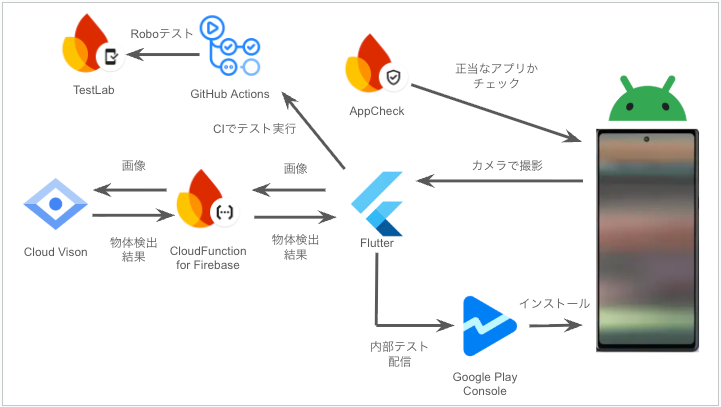

###  プロジェクト概要

####  物体検出とゲームを組み合わせたスマホアプリ *1

  * カメラで撮影して獲得したポイントで友だちと競い合おう！
  * Cloud Vision APIによる物体検出結果を元にスコアを算出。
  * 30秒以内に撮影しよう、ただし同じような画像を何度撮影してもスコアは獲得できないぞ！ 
    * いろんなものを撮影できるところでポイントを稼ごう！
    * ただし勝手に人や人のものを撮影するのはやめましょう。

*1 Android のみ対応

####  課題

  * ポイント獲得のルールが画一的なので、ボーナスタイムを設ける、なにかアイテムを消費することでポイントを稼ぎやすくするなど、ゲーム性をもっと高める
  * 今のところ、自分がポイントを稼ぐだけで直接競争する要素がないので、対戦要素やランキング要素などを追加したい

###  システムアーキテクチャ図（画像でも可）

  * Flutter で Android アプリを作成
  * Google Cloud Vision API を用いて物体検出 
    * Google Cloud Vision は Cloud Function for Firebase で実行し、結果を返す
    * API Key は、Secret Manager で管理
  * Firebase App Check を用いて、アプリの正当性をチェック
  * Google Play Console (内部テスト) でアプリを配信
  * GitHub Actions を用いて、Firebase Test Lab の RoboTest を自動実行

###  デモ動画

<https://www.youtube.com/watch?v=xxbwwB9mdag>

  * 画像 
    * [Photo Ac](https://www.photo-ac.com/)
    * [pixabay](https://pixabay.com/ja/)
  * BGM : [musmus様](https://musmus.main.jp/)
    * [ゆっくり急げ！](https://musmus.main.jp/music_game.html)
    * [朧月](https://musmus.main.jp/music_img1.html)

以上になります、最後までお読みいただきありがとうございました。
