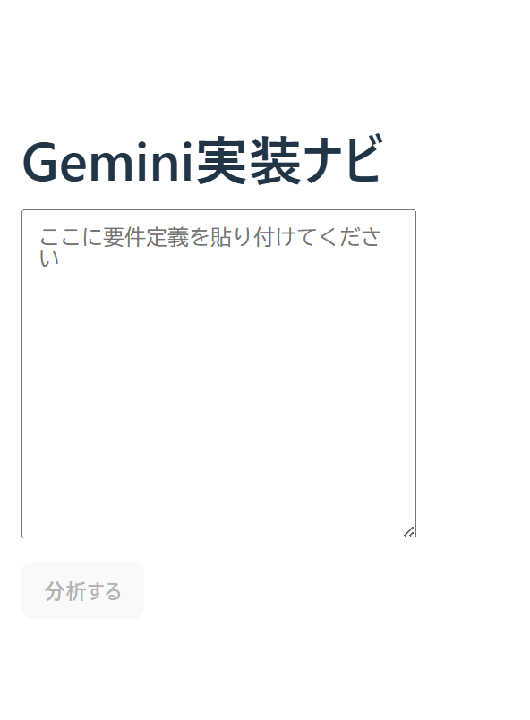
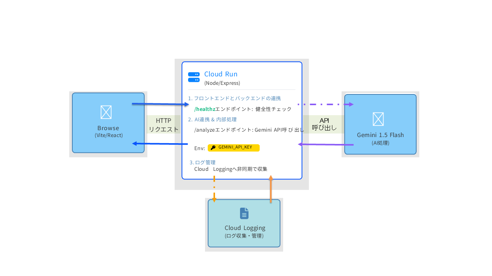

**注意** ：審査・課金リスク回避のため、**Cloud Run のURLは本文に記載していません** 。デモは下記の YouTube をご覧ください。

  * 要件テキストを貼るだけで、実装難易度（⭐1〜5）と概算（時間/費用）を返すミニツール
  * フロント：Vite + React、API：Node/Express（TypeScript）をCloud Runで運用
  * Gemini APIを使って要件を読み解き、判断材料をすばやく提示
  * API キーは**環境変数** で安全に管理（コード埋め込みなし）

##  対象ユーザー・課題・解決

  * **対象ユーザー** ：アイデアはあるが「自作できるか・外注するといくらか」が読みにくい個人/学生/非エンジニア
  * **課題** ：機能要件を実装する難しさや費用相場は、専門知識がないと見積もりにくい
  * **解決** ：要件テキストを与えると、Gemini が機能/非機能/連携の複雑さを要素分解し、 
    * ⭐難易度（1〜5）
    * 概算（時間/費用）
    * リスク/注意点  
を返却。**最初の判断材料** を短時間で得られる

> 200〜300字の概要（募集要項の記載用）：  
>  Gemini実装ナビは、アプリの実装難易度を見積もるツールです。要件テキストを貼ると、Gemini が機能・非機能・連携有無を読み解き、⭐評価（1〜5）と時間/費用の概算、注意点を返します。「自作できるか」がわからない課題に対し、最初の判断材料を提供するのが目的です。フロント（Vite + React）→ Cloud Run 上の API（Node/Express/TypeScript）→ Gemini API の構成で、API キーは環境変数で安全に管理。今後は、必要スキルの分解と学習ステップの提示、タスク分割、テンプレ設計書の自動生成まで広げ、“自分で作れる” を増やすことを目指します。

* * *

##  システムアーキテクチャ

> ・Client（Web）：Vite + React（フロント）  
>  ・API：Node.js + Express（TypeScript）、Cloud Run でコンテナ運用  
>  ・AI：Gemini API（Generative Language / Vertex 経由 or 直接）  
>  ・設定：GEMINI_API_KEY は Cloud Run の「環境変数」に保存（コードには書かない）  
>  ・監視：/healthz で死活監視、Cloud Logging でログ  
>  ・CD：gcloud run deploy（Buildpacks 利用）

> 参考：Mermaid 版（Zenn対応・図が崩れる場合の保険）  
>  flowchart LR  
>  user([User]):::client --> browser[Webブラウザ]:::client  
>  browser -->|HTTPS (GET/POST)| fe[Frontend  
> Cloud Run / Vite]:::frontend  
>  fe -->|/analyze (JSON)| api[API  
> Cloud Run / Node.js + Express]:::backend  
>  api -->|LLM 推論| gemini[Gemini API  
> Generative Language API  
> gemini-1.5-flash]:::external  
>  gemini -->|JSON 応答| api  
>  api -->|結果（⭐/概算/注意点/TSV）| fe  
>  api -.->|アプリログ| logging[(Cloud Logging)]:::logging  
>  secrets[[GEMINI_API_KEY  
> Env/Secret]]:::secret -.-> api

classDef client fill:#F3F4F6,stroke:#111827,stroke-width:1.5px;  
classDef frontend fill:#E0F2FE,stroke:#111827,stroke-width:1.5px;  
classDef backend fill:#DCFCE7,stroke:#111827,stroke-width:1.5px;  
classDef external fill:#FEE2E2,stroke:#111827,stroke-width:1.5px;  
classDef logging fill:#F3F4F6,stroke:#6B7280,stroke-dasharray:4 3;  
classDef secret fill:#F5F3FF,stroke:#A855F7,stroke-dasharray:4 3;

＃＃デモ動画（約3分）

<YouTube の URL を貼るだけで OK。Zenn が自動埋め込みします。>

> 使い方（ローカルで試す場合）

#  1) 依存インストール（web / api それぞれ）

cd web && npm i  
cd ../api && npm i

#  2) フロント環境変数（web/.env）

#  VITE_API_URL=http://localhost:8080

#  3) API 環境変数（ローカルのみ）

#  PowerShell 一時設定:

#  $env:GEMINI_API_KEY="あなたのAPIキー"

#  4) 起動

#  API

cd api  
npm run dev

#  フロント

cd ../web  
npm run dev

#  -> <http://localhost:5173>
