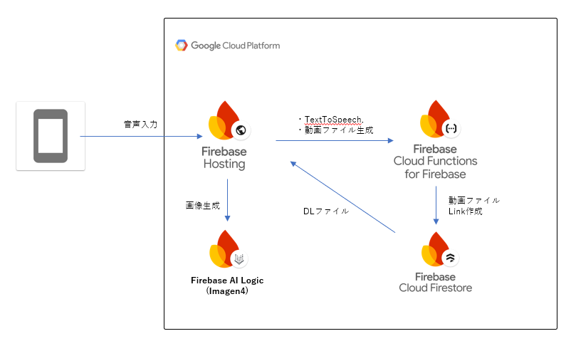

##  VoiceSketchAI: 声を元に絵と動画を生成するAIアプリの開発記録

子どもが言葉を話し始めた瞬間を、そのまま動画で残すのではなく、**音を元に絵を作り、いつもと違うものとして残す** ──そんな新しい体験を目指して開発したのが「**VoiceSketchAI** 」です。

本記事では、開発の背景からシステム構成、実装の工夫、そして今後の展望を解説します。

* * *

##  背景

最初にこのアプリを作ろうと思ったきっかけは、子どもが少しずつ意味のある言葉を話し始めたことでした。  
いつものカメラ動画とは違う、**声そのものをちょっとしたアートとして残せないか** と考えたのです。

子どもが発した「でんしゃ」や「ぱぱ」といった言葉を、音声はそのままにAIが絵に変えてくれる。そんなアプリがあったら、親子にとって特別な思い出になる、奇跡のアートが制作できるのではないか？と考え、開発してみました。

開発を進める中で気づいたことがあります。  
大人が考えて「お腹すいたア〇パ〇マ〇」などとしゃべると、思いがけない面白い絵が生成されるのです。  
そこでプロンプトをチューニングし、**子ども向けだけでなく、大人でも十分に楽しめるアートツール** として使えるようにしました。

VoiceSketchAIは、

  * **子どもの声を特別な形で残せる**
  * **大人もクリエイティブに遊べる**

そんな体験を提供するアプリへと進化しました。

* * *

##  紹介動画

<https://youtu.be/_SqwhTB0KuQ>

##  ユーザー像と課題、VoiceSketchAIのソリューション

###  想定ユーザー像

  * 1歳前後〜幼児期の子どもを育てている家庭
  * 子どもの「こえ」を残したい保護者
  * 普通の録音や写真だけでなく、遊び心のある記録を求めている人

###  抱えていた課題

  * いつもの録画だけでは、子どもの初めての言葉の思い出を十分に表現できない
  * AI画像生成は面白いが、使うには手間や知識が必要
  * 動画として残せるツールは少なく、家庭で気軽に使えるものがない

###  VoiceSketchAIのソリューション

  * **音声 → AI画像生成 → 動画合成** をワンフローで実現
  * **絵柄や色彩にランダム性** を取り入れ、同じ言葉でも毎回異なる雰囲気の絵ができる
  * 絵と音声を**合成した動画をDLして保存可能**

* * *

##  システムアーキテクチャ

VoiceSketchAIは **Firebaseを基盤としたWebアプリケーション** として設計されています。

###  使用技術の概要

技術 | 用途  
---|---  
React (TypeScript) | UI 実装・状態管理  
Firebase Hosting | PWAのホスティング先  
Firebase AI Logic (Imagen4) | 音声から生成したテキストを基に画像を生成  
Firebase Functions | サーバー側で音声認識・動画合成処理を実行  
Firebase Storage | 音声ファイル・生成画像・動画の一時保存先  
  
###  主なデータフロー

  1. 声を録音し、Speech-to-Textで文字起こし
  2. 文字起こししたテキストをAI Logic（Imagen4）に渡して画像を生成
  3. 生成された画像と音声をFirebase Functionで合成し、短い動画を作成
  4. 動画をFirebase Storageに保存し、ユーザーはDL可能（Storageのライフサイクルで自動的に削除）

これにより、**「しゃべった言葉がそのまま映像になる」体験** を実現しました。

* * *

##  実装の工夫

###  AIにできるだけ任せるが、デバッグが可能な仕様ごとに指示する。

実装は、プロジェクト構成が似ている過去のソースコードをコピーし、それをGemini CLIに書き換えてもらいました。  
ただ、あまりにたくさんの指示を出すとうまくいかないので、ステップバイステップで、デバッグしていきました。  
実際のステップとしては、

  1. Firebase AI Logicで画像を生成するだけのアプリを作り、
  2. マイク入力とTTSの仕様を追加し、
  3. 1.と2.を結合し、
  4. 動画合成の仕様を追加

という形で進めました。  
一日の作業時間が限られる中で、1時間か2時間程度の時間である程度デバッグができる単位で区切りよく作業をすることを心掛けました。

###  ローコードで画像生成を実現

Firebase AI Logicを利用することで、Imagen4による画像生成をローコードで実現しました。

###  Functionsは最小限に

Firebase Functionsでは、**Speech-to-Text** と **動画合成処理** のみを実装。  
画像生成はAI Logicに任せることで、サーバーサイドのコードをシンプルに保ちました。

###  ランダム性による遊び心

プロンプトにランダム性を持たせることで、同じ言葉をしゃべっても、**絵柄や色彩が毎回異なる** ため、予測不能な楽しさが生まれます。  
親子で「今回はこんな絵になったね」と笑い合える体験を意識しました。

* * *

##  今後の展望

VoiceSketchAIはまだプロトタイプ段階ですが、今後以下の方向に進化させたいと考えています。

###  Veoによるアニメーション対応

静止画ベースの動画合成機能を今回は実現しましたが、**Google Veo** を活用した本格的な動画生成を行うことで、言葉を「動きのある映像」として残せるようになります。

###  音声・動画ファイルの拡張サポート

現状は短い録音のみ対応ですが、将来的には**長めの音声ファイルや外部の動画ファイル** をアップロードして合成可能にしたいと考えています。

* * *

##  おわりに

VoiceSketchAIは、子供のこえをいつもとは違う形で残すことを着想として、新しい記録の形を目指し開発し、結果として、大人も楽しめる、録音や動画撮影では得られない、特別なデジタル体験を得らえるアプリケーションになりました。

今後もAI関連の情報をキャッチアップし、改善していきます。

(Link)

  * アプリURL : <https://voiceskechai-63ad3-bc0a4.web.app/>
  * Github : <https://github.com/mikkikimasutaro/voicesketchai>

* * *
