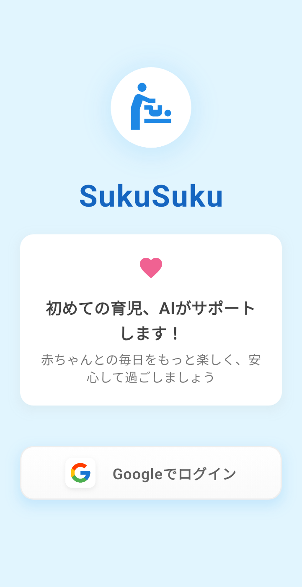
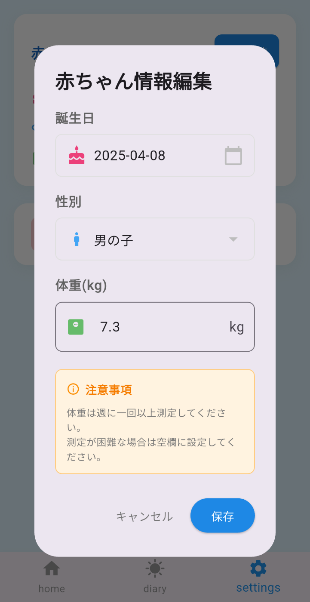
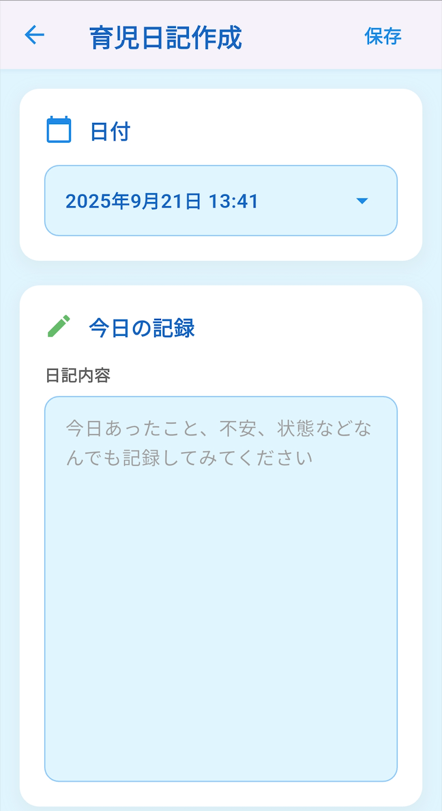
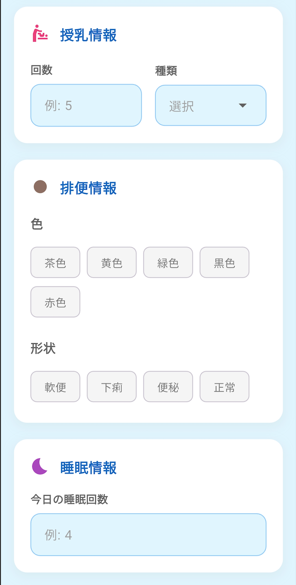
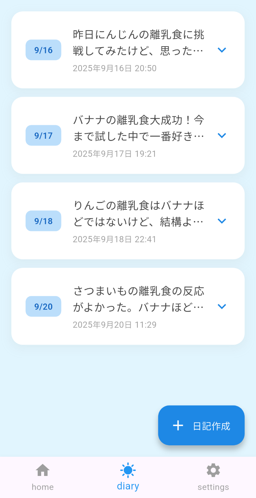
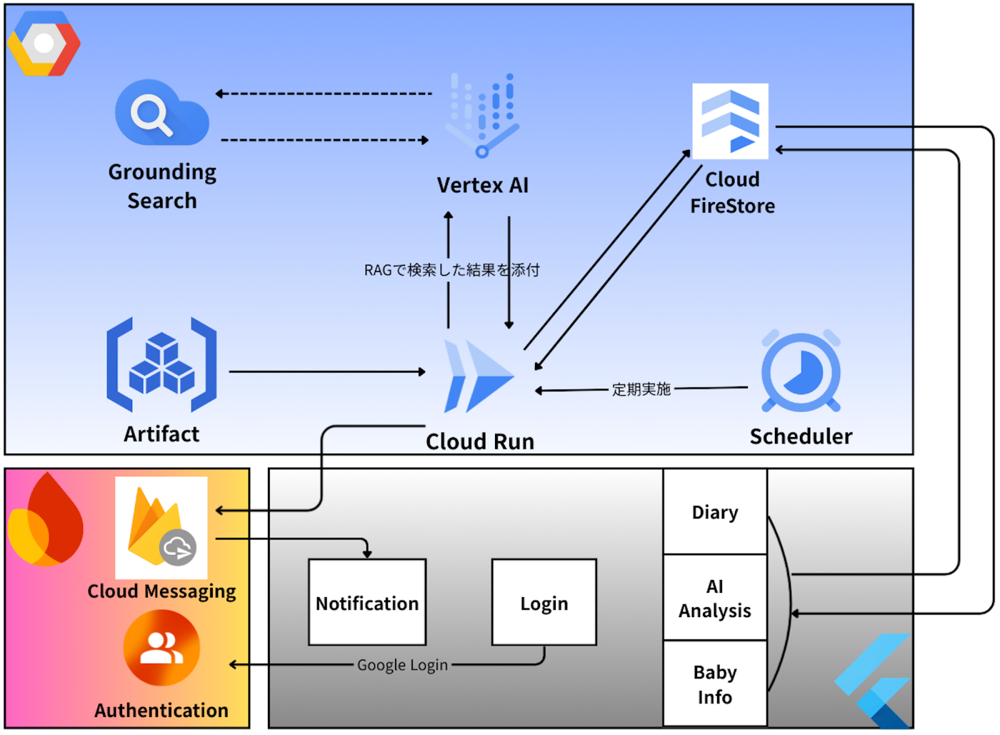
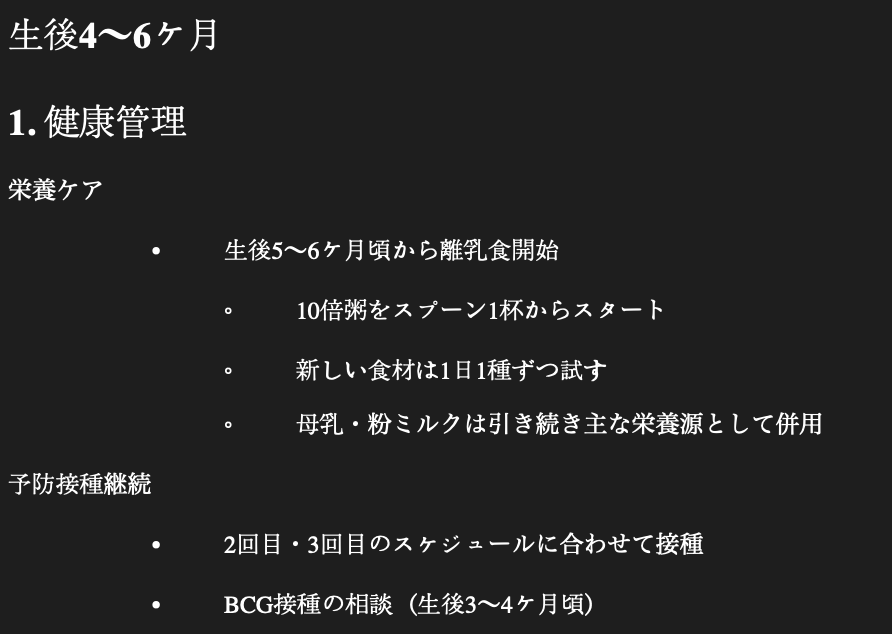

#  デモ動画

<https://youtu.be/oGV0vdi55FM>

#  対象ユーザー

  1. 初めての育児で不安な方
  2. 育児が怖い方
  3. 育児で忙しく、複雑な記録や分析に時間を割けない働く親御さん
  4. 育児をやっている全ての親

#  1\. 背景・課題

来年（2026年）子供が生まれる予定ですが初めての育児になるため嬉しい気持ちと同時に怖い気持ちもありました。  
その時思ったのは私の両親また他の両親はどんな気持ちで、どんな方法で育児をしたか気になりました。  
そのため初めて育児をする人は他の経験者に相談することが多いと思います。

しかし、育児経験者に直接相談するのは時間や場所の制約があり、また個人的な悩みを打ち明けるのに躊躇することもあります。  
さらに、育児は24時間365日続くものであり、深夜や早朝など相談したい時にすぐに答えを得られないことが多いのが現実です。

そこで私は「いつでも、どこでも気軽に育児の相談ができるAIアシスタント」があれば、多くの親御さんの助けになるのではないかと考えました。  
さらに、子供に関するアドバイスを提供するためには、より正確で科学的な情報が必要でした。  
そのため[厚生労働省](https://www.mhlw.go.jp/stf/seisakunitsuite/bunya/0000130583.html)を参考にしたデータベースを元にRAGを実装し、不足した情報については追加でネット検索を行うようにしました。

#  2\. Sakusakuアプリ

このような背景から、育児日記とAIを組み合わせた育児AIアシスタントの「**Sakusaku アプリ** 」を開発しました。  
本アプリは親御さんが日々記録する育児日記の内容を分析し、個別の状況に応じたパーソナライズされたアドバイスを提供します。  
また、Google Vertex AIの技術を活用することで、自然な対話形式で相談ができ、まるで経験豊富な育児の専門家からアドバイスをもらっている感覚でサポートを受けることができます。

#  3\. アプリ機能や使い方

Sakusakuアプリは従来のチャット型AIとは異なり、育児日記と子供の情報を元に毎日自動で分析を行います。  
育児で**忙しい** 親御さんの負担を最小限にするため、操作は簡単な2つのステップのみです。

  1. 子供の情報入力
  2. 育児日記作成

この２つの情報からAIが自動的にパーソナライズされたアドバイスを**毎日自動提供** します。

##  3-1. Googleログイン

Googleアカウントを利用してログインができます。

##  3-2. 子供情報入力

以下の子供の情報を入力できます。

  * 誕生日
  * 性別
  * 体重

##  3-3. 育児日記作成

日記作成1 | 日記作成2  
---|---  
 |   
  
日記作成では以下の項目を記録できます。

  * 日付
  * 日記内容
  * 授乳情報 
    * 授乳回数や種類を記録します。
  * 排便情報 
    * 形や色などを記録します。
  * 睡眠情報 
    * 睡眠回数を記録します。

（上記の項目は厚生労働省の[乳幼児健診における標準的な項目一覧](https://www.mhlw.go.jp/content/11908000/001028426.pdf)を参考にしました。）

##  3-4. 育児日記一覧

作成した日記の内容を確認できます。

##  3-5. 分析結果確認

毎日朝6時にCloud Run上のサーバーが自動で分析を実施します。  
AIは最新の2つの育児日記を取得して総合的な分析を行い、より正確で継続性のある育児アドバイスを提供します。  
分析完了後、モバイルアプリにプッシュ通知が送信されます。

  * 赤ちゃん状態スコア 
    * 現在の赤ちゃんの総合的な状態を分析して数値で表現します。
  * AIアドバイス 
    * 育児日記に基づいてアドバイスや疑問がある場合のみ解決策を提示します。
  * 成長パターン 
    * 成長パターンの分析結果を表示します。
  * 優先行動項目 
    * 現在の赤ちゃんの状態に合わせたカスタマイズされた推奨事項リストです。
  * 推奨事項 
    * 今後実施すると良いことの提案を行います。
  * リスク要因 
    * 潜在的リスク要因が見られる場合の解決策を提示します。

#  4\. システムアーキテクチャ

##  Flutter

Webとモバイルのフロントエンドとしての役割を担っています。

  * ログイン機能 
    * Firebase Authenticationを利用して実装しました。
  * AI分析結果、育児日記、赤ちゃん情報 
    * Google CloudのFirestoreを利用しデータを更新しています。
    * 作成した日記の修正も可能です。
  * プッシュ通知機能 
    * AI分析が完了すると通知を受け取れます。
    * 現在はAndroidアプリのみ実装されています。

##  Google Cloud

###  Cloud Run

Artifact Registryのコンテナイメージを使用してCloud Run上で動作しています。

**主な処理フロー**

  1. Schedulerから決まった時間に自動起動されます。
  2. Cloud Firestoreから各ユーザーの育児日記と子供の情報を収集します。
  3. 収集したデータを基にRAGを使用し、客観的で科学的な情報をAIが参考データとして活用します。 
     * コンテナイメージに内蔵されているエンベディングデータをRAGで取得します。  
  
_(エンベディングされているデータの例)_
  4. ユーザーデータとRAGで収集したデータをまとめてAIに転送します。
  5. AIからもらったデータを再度Cloud Firestoreに保存します。 
     * （今はDemo版のためデータの暗号化などは行なっていません。日記と子供情報は個人情報になるため製品化するには暗号化が必要だと思います。）
  6. 分析が終わったらFirebase Cloud Messageを利用して通知します。 
     * Demo版ではAndroidのみ実装しました。  

**Cloud FunctionsではなくCloud Runを選択した理由**

  1. エンベディングデータをプロジェクト内に内蔵させることが簡単
  2. Cloud Functionsより大きいリソースを扱える

###  Vertex AI

ユーザーデータやコンテキストを利用して分析し現在の子供の状態・今後必要なモノに対するアドバイスを作成する役割です。  
コンテキストで不足した情報もあるためAIが動的にGrounding with Google Searchを利用できるようToolsを設定しました。  
（動的Grounding with Google Searchの実現のためGemini 2.5 Flash-Liteを利用しています。）

#  5\. 今後追加できそうな機能

  1. 他の人と日記やAI分析結果を共有する機能 
     * 育児は２人以上で実施するケースもあるため日記やAI分析結果を共有する機能が考えられる
  2. 成長を確認できるグラフ 
     * 現状は子供の体重のみ記入していますが、身長なども追加し成長をグラフで確認できる機能
  3. 二人以上の子供の育児日記作成 
     * 子供を二人以上同時に育児している親もいると思うため子供ごとに日記を管理できるようにする
  4. パーソナライズAI分析強化 
     * 日記の中にある大事なイベントをFireStoreになどに保存して個人データとしてAI分析に利用

#  6\. まとめと感想

今回のハッカソンで、Flutter、Firebase、Google Cloudを同時に使ってサービスを作った際、そのシンプルさと柔軟な連携に改めて驚きました。  
特にFirebaseの一部の機能がGoogle Cloudに統合されたことでGoogle CloudのサービスからFirebaseのサービスに簡単にアクセスできることで、より早い、より簡単な開発が出来ました。

今回開発したSakusakuアプリは今後親になる自分自身の悩みや不安を含めて作りました。  
そのため今後の育児の経験を生かしてもっといいアプリに発展させたいと思います。その結果、全ての親が安心して手軽に使えるアプリを作りたいと思いました。
