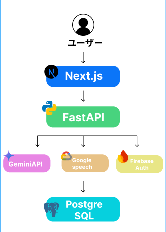

##  1\. プロジェクト概要

BUDは「芽（bud)」を育てるという意味が込めた、  
**正解を覚える教育から、伝わる楽しさを体験し、学びへと変えるアプリ** です。  
完璧さよりも伝わったという楽しさを大切にしています。

###  対象ユーザー

  * 小学1〜3年生の子どもとその親（特に英語が得意でない保護者）

###  ユーザー課題

  * 外国人に声をかける体験が少ない
  * 発音や表現の間違いを恥ずかしがる
  * 親が英語に苦手意識を持つと行動が続かない
  * 挑戦が記録に残らず、自信や学びに結びつきにくい

###  ソリューション

  * 録音＋文字起こしによる体験記録
  * AIフィードバック
  * 保護者用お助けフレーズ表示
  * 記録の保存と履歴閲覧

###  特徴

  * 発音の正確さよりも「伝わった喜び」と「勇気ある一歩」を重視
  * AIが褒めたり別表現を提案して、子どもの挑戦を後押し
  * 親が英語苦手でも安心して見守れる仕組み
  * 録音＋文字起こしで体験を記録、振り返りができる

* * *

##  システムアーキテクチャ

  * フロント：Next.js / TypeScript / Tailwind CSS
  * 音声入力・文字起こし：Google Speech-to-Text
  * AIフィードバック：Gemini API
  * バックエンド：FastAPI (Python) / PostgreSQL
  * 認証 : Firebase Authentication（Googleログイン）
  * 開発環境：Docker、GitHub Actions（CI）、Conventional Commits

* * *

##  デモ動画

<https://youtu.be/-k5iV_b7Doo>
