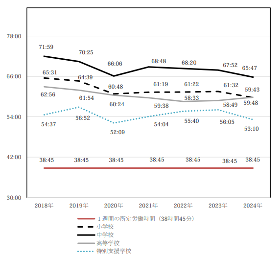

#  デモ動画

<https://youtu.be/B6y4ru0EH8I>

#  ユーザー像

  * テストや問題演習において、生徒に十分なフィードバックを与えたい教員や塾講師

  * テストや問題演習の答案に対して、復習のために先生からの十分なフィードバックを得たい生徒

#  課題

昨今、文部科学省は「指導と評価の一体化」や「思考力」の育成を推進しています。

これらをどちらも満たすソリューションとして、**テストの回答に対する十分なフィードバック** が考えられます。テストにおける「よい考え方」や「誤りの原因」を丁寧にフィードバックすることで、生徒の「長所」と、「つまずきポイント」が明確化され、復習がしやすくなります。それにより、学習のPDCAが自然と回っていきます。

実際に、テストの振り返りというのは生徒の成績に大きくかかわっているということがBenesseなどの調査で判明しています。それを補助し、促すことができる添削という形のフィードバックは生徒の成長のためには非常に重要であると考えられます。

一方で、テストの評価ではそのほとんどが**ただの採点に留まっている** のが現状です。  
これを"言葉"を綴る**添削** の形にすることで、生徒の思考力の増強につながっていきます。

採点に留めざるを得ない原因の一つとして、現実に教員の平均残業時間は月88時間を超えており、採点から添削に移行するためには工数不足という非常に大きな壁が存在します。  
（引用：日本教職員組合「2024 年 学校現場の働き方改革に関する意識調査」）

#  課題へのソリューションと特徴

##  アプリケーションの概要

今回はAIを用いることで、答案の添削にかかってしまう**時間と労力の削減** に挑戦しました。

私が制作したアプリケーションは、端的に言えば、

**"手書き答案の添削をAIがアシストしてくれるアプリケーション"**

です。

生徒と先生の双方を、コメントという名の"言葉"で支援するAIであるため、  
"添削AI 言の葉"  
と名付けました。

基本的な使用方法：

  * 事前に問題文と採点基準のpdfをアップロードし登録する（問題用紙.pdf、採点基準.pdfという名前で登録してください。）
  * 生徒の手書き答案のpdfをアップロードし、処理ボタンを押すと、生徒に対する添削コメントがGemini 2.5 Proによって生成される
  * 先生が答案編集画面にてAIが生成した添削コメントを適宜修正しながら配置していく
  * 完成したら、pdfとしてエクスポートし、完了ボタンを押す。  
※ 現状は答案編集中に自動保存はされないので、適宜保存ボタンを押してください。

他にも、以下のような機能があります。

  * 添削時には、その答案と添削結果に関してのコンテキストを持つGemini 2.5 Proに質問をすることができる（例：なぜこの結果は間違っているのでしょうか？）
  * タイマー機能で、添削に何分かかっているかが一目瞭然になる  
等々。

尚、実際に100問ほど大学数学の問題を添削した結果、**1問あたり平均4分** ほどで添削が完了しました。  
そのため、AI処理を大量の答案に対して並列で行っておけば、大きな時間の短縮になります。

デモ動画を見ていただければ実際の挙動はわかりやすいと思いますので、ぜひご覧いただければと思います。

デモ用のデプロイ先では、Math-Aquarium様の実力テストをお借りしております。  
もしよければ何問か解いて添削にかけてみてください！  
↓問題用紙  
<https://web.math-aquarium.jp/1a-zituryokutesuto-hyoujunn-1.pdf>

※下記の通り、種別の特定がうまくいかない場合があります。その場合は、編集画面にて、種別選択を行い、答案の種別を採点基準と結び付けたのち、再処理で添削を行ってください。

尚、特に数学の答案を想定して開発を行っていましたが、数学に限らず使えるはずです。  
しかし、縦書きには対応していないため、国語だけは難しいと思われます。  
また、元々大学の過去問の添削を意識して開発を行っていたため、そうでないときシステムが試験種の特定に失敗する場合があります。その場合は、編集画面にて、種別選択を行い、答案の種別を採点基準と結び付けてください。

##  システムアーキテクチャ

GCPのシステム構成要素としては、

  * Gemini API（gemini-2.5-pro) - AI機能全般
  * GCS - pdfやmdなど、ファイル類の保存
  * Cloud run - サービスのデプロイ  
を用いています。

また、今回は様々な役割を持ったAIが協業している形をとっています。

  1. 仕分けAI：書き起こし可能かを判定する
  2. 書き起こしAI：書き起こしを行う
  3. 添削AI：添削コメントを生成する  
フローとしてこれで十分だと判断したため、それぞれをツール化しエージェントに持たせるということを行わないませんでしたが、例えば試験種の検索や、既知でない試験種のweb検索など、より柔軟さを与えたい場合には、今後エージェント化する選択肢もあると考えています。

###  システムアーキテクチャ図

##  開発で意識したこと

今回意識したことは、**AIと先生の協業** です。

手書き答案の添削には、どうしてもAIの認識精度の不安が残りますし、さらに生徒の答案にしっかり目を通すのも先生の務めであると考えます。そのため、完全自動化というよりも**協業** という形を目指しました。

主に、AIが十分にその実力を発揮できるようにすることと、先生がAIが出力した結果を用いながらできるだけ快適に添削を進められるようにという"AI first"＋"Human first"な考え方で工夫を凝らしました。

具体的な工夫点を以下に述べます。

  * AI：

    * 手書き答案の書き起こしの精度に関する検証の末、**pdfをそのまま読み込ませるよりpdfをpngに変換してから渡す方が精度が高くなる** ことを発見しました。そのため、pngへの変換を挟んでいます。
    * コストパフォーマンスの観点から、問題と採点基準は添削のたびにpdfで読み込むのではなく、Markdown形式に変換しておいた方がよいです。そのため、添削用の資料登録では、Markdown生成機能がついています。
    * コストパフォーマンスの観点から、答案書き起こしを行う前に簡易的な「仕分け」が挟まります。これは、手書き答案の書き起こしが可能かどうかを判定するものです。
    * プロンプトにも工夫を凝らしています。Gemini 2.5 Proは非常に賢く、手書き答案を読み取りにくい場所でも文脈と論理性を加味して補完してくれます。しかし、生徒の答案にはもちろん誤りが含まれていることがあります。そのため、Geminiには「誤りを含んでいる可能性があるため、それを正さずにそのまま書き起こして下さい。」といった旨の指示が入っています。これを入れないと、誤っている答案も「よかれと思って」正しい答案になってしまうことがあります。
  * 先生：

    * 添削をできるだけ効率的に進められるように、操作性にはできる限り気を使っています。実用的なものに仕上がっているはずです。
    * Geminiがコメントを用意したのが、答案上のどういった部分に対してなのかがわかるように、そのコメントの対象部分が書かれています。これにはもう一つの付随効果があり、**Geminiの添削コメントの対象となった部分が、本当に正しく書き起こされたのか** が確認できます。
    * Geminiの判断に疑問を感じた際や、生徒の回答に対し悩んだ際に、Geminiに質問できる機能がついています。
    * 何度も繰り返し使いたいコメントはお気に入りに追加することができます。

正直、「手書き答案をAIが添削する程度なら、簡単にできそう」だと思った方も多いと思います。  
私も最初はそう思っていました。実際に、問題文、採点基準、答案をGemini 2.5 Proに投げればそれなりの添削は返ってきます。  
しかし、試していく中で実際には「AIを用いて添削業務を**時間的に真に効率化** 」しようとすると、それだけでは足らないと気づきました。  
AIが出力した結果を、如何に先生がシームレスに素早く正確に答案に反映させるか。そしてそのコメントが適していることをいかに簡単に判断できるか。そういった実用性を非常に重視して開発を行いました。

#  今後の展開

現状追加したいと考えている機能は以下です。

  * AI添削が完了している答案に対し、コメントの配置場所をAIが特定し、配置してくれる機能（現在はβ版として実装してあるが、精度がわるい）

  * iPadアプリ化することで、手書き添削とのハイブリッドの実現。

  * 添削中のAIチャットのRAG化（コスト効率化）

  * 生徒毎の添削結果のデータベース化と傾向監視機能

  * 生徒用のAI質問機能

  * 試験種特定機能の改善

  * AIエージェントとしての高度化 - 一人のオーケストレーターにより、包括的に添削に関連するサポートが可能になるような構成へのリメイク

#  最後に

本アプリケーションが、学校教師や塾の先生、そして生徒たちのより良い教育・学習に少しでも寄与できれば幸いです。  
今後もブラッシュアップを続け、究極に使いやすい添削アプリケーションを作っていきたいと思っています。

最後まで読んで下さりありがとうございました！
