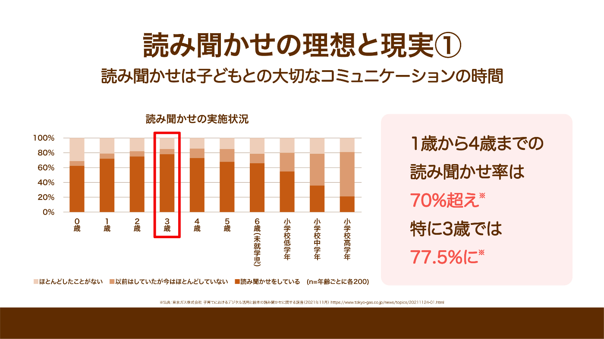
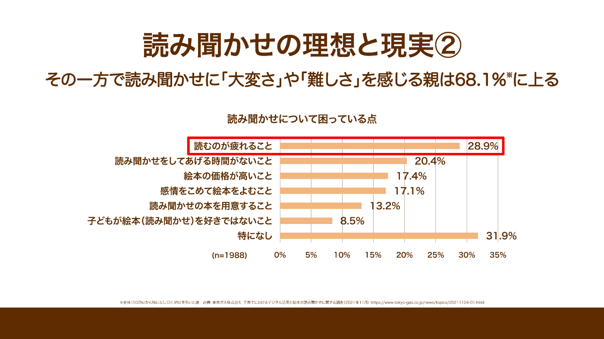
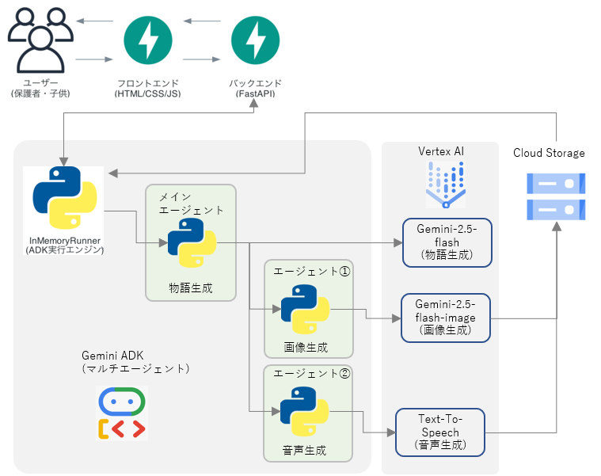

<https://www.youtube.com/watch?v=dbv53B5cW1k>

####  スライド版はこちら

[おはなしまもりん：課題発見からプロダクトが生まれるまで](https://docs.google.com/presentation/d/e/2PACX-1vQYzBX-M5eKw1Jyv_9p36Ewtb_ZbUmCmK1d17i3yt1TYVU1LF2rpPvCvSsQLcIUZxBqX11DWs3_pb8e/pub?start=false&loop=false&delayms=3000)

##  はじめに：子育ての「目が離せない」が、親子の笑顔を奪ってしまう現実

####  家族の実体験から見えた子育ての不安

すべての始まりは、開発メンバーの家族が経験した、ある日の出来事でした。外出先の待ち時間、ほんの少し目を離した隙に子どもがどこかへ行ってしまい、ヒヤリとした経験。多くのご家庭で「あるある」ではないでしょうか。

現代の子育ては、こうした「少しも目が離せない」緊張感と常に隣り合わせです。この緊張感が、時に親子の笑顔を奪ってしまう現実を、私たちはテクノロジーで解決したい。その想いから、このプロジェクトはスタートしました。

##  現代の子育てが抱える課題

私たちは、現代の子育てが直面する課題を「既存の解決策が持つ副作用」という新しい視点で捉え直しました。

####  1\. 従来の解決策（動画・絵本）が抱える課題

子どもを静かに待たせるための選択肢として「動画コンテンツ」や「紙の絵本」がありますが、それぞれに課題が存在します。

!

  * 動画コンテンツへの依存: 手軽さゆえに多用しがちですが、一方的な情報を受け取る受動的な時間が増え、親子のコミュニケーション機会が失われるという懸念があります。また、長時間視聴による視力への影響も心配です。
  * 紙の絵本の限界: 読み聞かせは理想的なコミュニケーションですが、親には「読むのが疲れる」「感情を込めるのが大変」といった身体的・精神的負担が伴います。さらに、絵本は「高価」「かさばる」「子どもがすぐに破ってしまう」といった物理的・経済的な制約も無視できません。

課題項目 | 関連データ | 出典  
---|---|---  
精神的負担 | * 子育てに「悩みがすごくある」と感じる親の割合：5.0%  
* 子育て中に孤独を感じる女性の割合：74.2%   
* 第一子0歳時に孤独を感じる割合：57.9%  
* 産後1年未満の「うつリスク」父親：11.0%、母親：10.8% | [1]  
時間的負担 | * 6歳未満の子を持つ夫婦の家事・育児時間（1日あたり）：   
妻：7時間28分、夫：1時間54分  
* 家事・育児分担で不満を感じる女性の理由：「手伝うものと思っている」：43% | [2]  
  
####  2\. 読み聞かせの理想と現実

多くの親にとって、読み聞かせは子どもとの大切なコミュニケーションの時間です。1歳から4歳までの読み聞かせ率は70%を超え、特に3歳では77.5%に達します[3]。  
  
_読み聞かせの実施状況[3:1]_

しかし、その一方で、読み聞かせに「大変さ」や「難しさ」を感じる親は68.1%に上ります[3:2]。また、子どもが読み聞かせに夢中になり、なかなか終わらせてくれないという悩みも一般的にあります[4]。  
  
_読み聞かせについて困っていること[4:1]_

####  3\. 私たちの定義する「真の課題」

既存のソリューションは、親の負担を軽減する代わりに親子のコミュニケーションを犠牲にするか、コミュニケーションを重視する代わりに親に多大な負担を強いるかの、トレードオフの関係にありました。

私たちは、このトレードオフを解消することこそが、取り組むべき「真の課題」だと定義しました。  
このような背景から、親子の笑顔を増やすための新しい解決策が必要だと私たちは考えました。

##  解決策：『おはなし まもりん』が創出する「親子のあんしん時間」

そこで私たちが提案するのが、**「動画」の手軽さと「読み聞かせ」の温かさを両立** する、AI読み聞かせアプリ『おはなし まもりん』です。

####  1\. コンセプトは「親子の共創体験」

『おはなし まもりん』は、「動画を見せる」代わりに「物語を聴かせる」という新しいアプローチで、親子の時間を豊かにします。

  * **1タップで始まる、あなただけの物語** : 「どうぶつ」「ぼうけん」といったジャンルを選ぶだけで、AIがイラスト付きの物語を即座に生成し、読み聞かせを開始。準備の手間は一切不要です。

  * **親子で創る、世界に一つのおはなし** : 子どもの名前や好きなものをキーワードに入れると、その子が主人公のオリジナルストーリーが生まれます。これは単なる読み聞かせではなく、親子で物語を創り上げる「共創体験」です。この体験が自然な会話を生み、親子の絆を深めます。

####  2\. 「あんしん」を支えるデザイン

  * **音声中心の設計** : 画面を見続けなくても体験が成立するため、スマートフォンの長時間注視を防ぎます。家事をしながら、移動しながらでも、耳で物語を楽しめます。

  * **アクセシビリティへの配慮** : 私たちは「誰もが使えるアプリ」を目指し、音声読み上げ機能（スクリーンリーダー）への対応、キーボード操作の担保、テーマカラーの選択機能など、インクルーシブなデザインを実装しました。これはJIS X 8341-3:2016 適合レベルAに準拠する思想で設計されています。

これにより、『おはなし まもりん』は、親が少し手を離さなければならない瞬間を、**罪悪感の時間から「親子のあんしん時間」へと変える** 有効なソリューションとなります。

##  実装品質と拡張性：コンセプトを最高品質で実現する技術

私たちのアイデアを形にするため、技術選定と開発プロセスにもこだわりました。

####  1\. システムアーキテクチャと技術選定の思想

本アプリは、フロントエンド、バックエンド、AIサービスの3層構造で構成されています。  
  
_おはなしまもりんシステムアーキテクチャ図_

####  技術選定の思想：「読み聞かせコンセプト」の実現

私たちの技術選定は、すべて「最高の読み聞かせ体験」というコンセプトから逆算されています。

目的 | 採用技術 | 選定理由  
---|---|---  
物語生成の速度 | Gemini-2.5-flash | ユーザーを待たせない圧倒的な応答速度を最優先  
イラストの一貫性 | Gemini-2.5-flash-image | 前のページの画像をプロンプトに含めることで、**物語を通してキャラクターや画風の統一性** を維持  
自然な読み聞かせ | Google Text-to-Speech | 機械的ではない、人間の発音に近い温かみのある音声を実現  
快適なUX | Google ADK(Agent Development Kit) | 物語・画像・音声生成のエージェントをADKで連携。裏側で**先行生成** するマルチエージェントシステムにより、ユーザーの待ち時間を極小化する体験を実現  
高可用な実行環境 | Cloud Run | FastAPIをホスティング。サーバーレスで運用負荷を削減しつつ、リクエストに応じて自動スケールするため、コスト効率と可用性を両立  
  
####  2\. 専門性を最大化する開発プロセス

チームはグラフィックデザイナー、マークアップエンジニア、AIエンジニアで構成されていました。この多様性を活かすため、「完全な役割分離」を重視。

フロントエンドを標準的なVanilla.js（HTML/CSS/JS）で構築し、バックエンドとはAPIで疎結合に連携させました。これにより、各専門家が他のメンバーの作業を待つことなく並行して開発を進めることができ、短期間で高品質な実装を実現しました。

##  終わりに：AIと人間が共創する、新しい子育ての形

####  AIは「平均点」、100点を創るのは「人間の力」

今回の開発を通して、私たちはAIの驚異的な能力と、その限界を同時に実感しました。

!

AIは、手早く"それなり"のものを形にする上で強力な武器です。しかし、その出力はあくまで「最も確率の高い平均点」。人の心を動かす"100点"のプロダクトを創るには、プロフェッショナルの人間の力が不可欠です。AIが生成した無機質なUIと、プロのデザイナーが想いを込めて作ったUIとでは、ユーザー体験に雲泥の差が生まれました。

これは、デザインだけでなく、コンセプト設計、コーディング、その全てにおいて言えることです。AI時代だからこそ、私たち作り手自身のスキルを磨き続ける重要性を再認識させられました。

####  『おはなし まもりん』が目指す未来

『おはなし まもりん』の「AIと楽しく物語を創る」というコンセプトは、**語学教育** など他分野への拡張性も秘めています。生成された物語を外国語で読み上げ、字幕を表示すれば、親子で楽しく学べる教材にもなり得ます。

このアプリが、AIという強力なツールと人間の創造性を掛け合わせることで、世界中の親子に「あんしん時間」を届ける一助となることを、チーム一同心から願っています。

##  引用文献

脚注

  1. [厚生労働省：第4回21世紀出生児縦断調査結果の概況１５ 子育ての不安や悩み](https://www.mhlw.go.jp/toukei/saikin/hw/syusseiji/02/kekka15.html) ↩︎

  2. [我が国における家事関連時間の男女の差～生活時間からみたジェンダーギャップ](https://www.stat.go.jp/info/today/pdf/190.pdf) ↩︎

  3. [最新調査：3歳の半数以上がスマホやタブレットを使用！子どもによるデジタルデバイス利用状況と絵本の読み聞かせに関する調査（東京ガス調べ）](https://www.tokyo-gas.co.jp/news/topics/20211124-01.html) ↩︎ ↩︎ ↩︎

  4. [すんなり終わらない子どもの読み聞かせにイライラ！「スッと入眠」が叶うオススメ絵本とその方法を児童書編集者が教えます | HugKum（はぐくむ）  
](https://hugkum.sho.jp/566469) ↩︎ ↩︎

