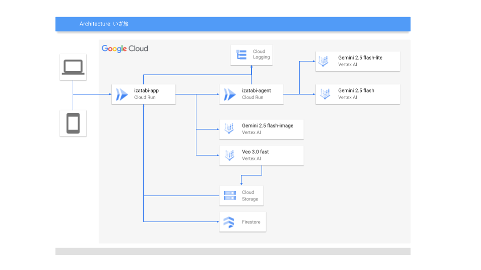
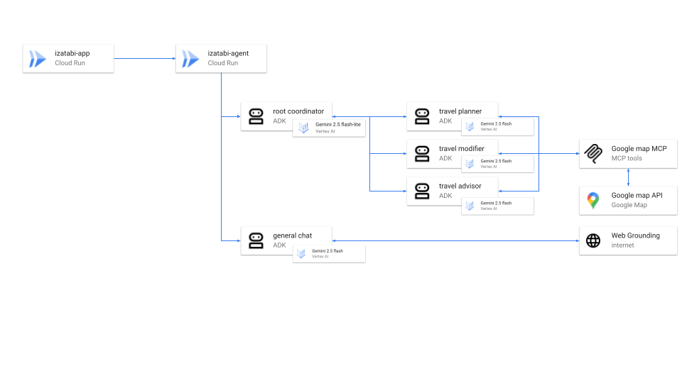

##  はじめに：「あなたは本当は、どんな旅を求めてる？」

「どこか、良いところに行きたいな」

忙しい日常のふとした瞬間、そう思うことはありませんか？  
けれど、いざ旅行を計画しようとすると、無数の選択肢を前に途方に暮れてしまう。

「絶景が見たい」  
その言葉の裏には、どんな想いが隠れているのでしょう。  
心を空っぽにしたいほどの**静寂** ？  
魂が震えるような**感動** ？  
それとも、**知的好奇心が満たされる深い学び** ？

私たちは、自分でも気づかないうちに「みんなが良いと言う場所」や「いつものパターン」を選びがちです。  
**あなたが心の底から求めている旅の体験は、まだあなた自身も知らないのかもしれません。**

この記事では、そんなあなたのためのAI旅のソムリエ「いざ旅」をご紹介します。これは単なる旅行計画アプリではありません。AIエージェントとの対話を通じてあなたの深層心理を読み解き、運命の旅と出会わせ、最高の体験を共に創り上げる、新しい旅のパートナーです。

##  1\. 課題：本当の「旅の目的」は、自分でもわかっていない

私たちが解決したい課題は、旅行計画の「面倒さ」のさらに奥深くにある、**「自分の理想の旅がわからない」という潜在的な課題** です。

  * **ユーザー像:** 忙しい日常から解放されたいが、計画を立てる時間や気力がない。いつもとは違う特別な体験をしたいが、何から探せば良いかわからない。そんな旅行をしたい人たちを想定しています。
  * **課題:** 情報過多の時代、私たちは選択肢が多すぎて逆に選べなくなっています（選択のパラドックス）。結果として、無難な選択に落ち着き、本当に満足できる旅に出会える機会を失っているのではないでしょうか。

##  2\. 解決策：あなたの旅のソムリエ AIエージェント『いざ旅』

『いざ旅』は、ADK (Agent Development Kit) を用いて構築された自律型マルチエージェントAIシステムです。まるで優秀な執事やソムリエのように、3つのフェーズであなたをサポートします。

  1. **【診断】あなたの知らないあなたに出会う**
  2. **【提案】運命の旅と出会う**
  3. **【伴走】最高の旅を共創する**
  4. **【思い出】感動を色褪せない記憶に**

##  3\. 『いざ旅』の主な特徴

####  特徴1: あなたの旅の価値観を可視化する「10タイプ対話診断」

『いざ旅』の最大の特徴は、独自の対話診断機能です。選択肢や`Gemini`との自然言語での会話を通じて、あなたの旅の価値観を10のパラメータで分析・スコア化します。

**【診断パラメータの例】**

  * **冒険心** : 未知の体験や非日常的な環境を求める度合い
  * **活動ペース** : 旅程に多くの体験を詰め込むか、ゆったり過ごすことを好むか
  * **こだわり消費度** : 旅の体験に費用をかけるか、コストパフォーマンスを重視するか
  * **交流志向性** : 現地の人や他の旅行者との交流をどれだけ重視するか
  * **文化探求心** : その土地の歴史や芸術、文化に触れることへの興味の深さ
  * **美食グルメ度** : 現地ならではの食事へのこだわりと、それにかける投資意欲  
...など、合計10項目。

診断の最後に、あなたの「**趣味** 」を選択します。すると、AIが趣味の特性を解釈し、10のパラメータスコアに最終的な重み付けを行います。例えば、同じ「アクティブ度」が高い人でも、趣味が「登山」なのか「美術館巡り」なのかで、提案される旅の形は全く異なります。

これにより、あなただけの**旅の価値観チャート** が完成。漠然としていたあなたの理想の旅が、初めて客観的な形で可視化される瞬間です。

####  特徴2: 運命の旅と出会う「3つのコンセプト提案」

診断結果に基づき、専門のAIエージェントチームがコンセプトの異なる3つの旅行プランを設計します。`Nano Banana`で自動生成された旅のコンセプト画像は、あなたの心を次の旅へと誘います。

  * **王道プラン:** あなたの好みをストレートに反映した、満足間違いなしのプラン。
  * **発見プラン:** あなたがまだ知らない、でもきっと好きになる隠れた名所や体験を提案。
  * **挑戦プラン:** 少しだけ勇気を出して、新しい世界の扉を開く冒険的なプラン。

####  特徴3: 最高の体験を共創する「リアルタイム・コンシェルジュ」

旅行当日、このエージェントがあなたの最高のパートナーになります。Google Maps Platformと連携し、リアルタイムの状況に応じて最高の選択肢を提案します。

  * 「急な雨…どうしよう？」→ 現在地近くの魅力的な屋内施設を即座に提案。
  * 「予定のお店が休みだった！」→ あなたの好みに合う、近くの別のお店をレコメンド。

####  特徴4: 旅の感動を永遠に「AI思い出ジャーナル」

旅は、帰ってきてからも続いていきます。  
『いざ旅』では、旅行プランの日付と、旅先で撮影した写真を手軽に登録するだけで、その日の出来事を自動で整理し、**思い出ジャーナル** として記録できます。

さらに、登録された写真から、Veoを活用して旅のハイライトの短い動画（ショートムービー）を自動生成。あなたの感動を、より鮮やかな形で記憶に刻み、いつでも友人や家族と共有できるようになります。単なる写真の羅列ではない、AIが紡ぎ出す「動く思い出」が、あなたの旅の価値をさらに高めます。

##  4\. デモ動画

『いざ旅』が実際にどのように動作するのか、ぜひこちらのデモ動画をご覧ください。

<https://youtu.be/yCU3iAQIeRU>

##  5\. システムアーキテクチャ

本プロジェクトは、Google Cloudの強力なサービス群と、ADKによるマルチエージェントシステムを組み合わせて構築されています。

  * **Frontend:** Vue
  * **Backend:** Flask
  * **Database:** Firebase (リアルタイム同期とユーザー管理)
  * **AI Agents:** ADK (Agent Development Kit) で構築された自律型マルチエージェント  

##  6\. 使用した技術スタック

  * **クラウド:** Google Cloud (Cloud Run, Firebase)
  * **AI:**
    * Vertex AI
    * Veo3
    * Agent Development Kit (ADK)
  * **その他:**
    * Google Maps Platform
    * web Grounding

##  7\. 今後の展望

『いざ旅』は、旅の体験を革新する第一歩です。将来的には、以下のような拡張を構想しています。

  * **予約連携:** 旅の計画から、航空券・ホテル・レストランの予約までをワンストップで実現。
  * **エージェントの成長:** あなたの旅のフィードバックを学習し、使えば使うほど賢くなる、あなただけの専属エージェントへ。

##  まとめ：私は、人生を変える「体験」を届けたい

いつから「旅」は、完璧な計画を立て、それをこなすタスクになってしまったのでしょうか。

情報の洪水の中で、私たちは「失敗しない選択」を探し求め、無数のレビューを比較し、いつしか「選ぶこと」に疲れ果ててはいないでしょうか。その結果たどり着くのが、誰かが良いと言った「無難な正解」だとしたら、それはあまりにも寂しいことだと私たちは考えます。

私たちが『いざ旅』で実現したいのは、単なる旅行計画の効率化ではありません。AIというテクノロジーの力で、**人々を「選択の呪縛」から解放し、旅の本質である「偶然の出会い」や「自己発見の喜び」を取り戻すこと** です。

『いざ旅』があなたに届けるのは、最適化された旅行プランという「モノ」ではありません。  
AIとの対話を通じて、あなた自身も知らなかった心の声に耳を澄ます**時間** 。  
計画通りにいかないハプニングさえも「面白い」と笑い飛ばせる**心の余裕** 。  
そして、旅から帰ってきたとき、出発する前よりも少しだけ自分のことが好きになっている、そんな「人生を変えるかもしれない**体験** そのものです。

AIは、人間の仕事を奪う冷たい存在であってはならない。むしろ、人間が本来持っている好奇心や遊び心を増幅させ、人生を何倍にも豊かにしてくれる最高のパートナーになれるはずです。

このハッカソンでの挑戦は、その大きなビジョンのまだ小さな一歩にすぎません。  
さあ、私たちと一緒に、テクノロジーで人生という名の旅を、もっと面白く、もっと愛おしいものにしませんか？

本当のあなたに出会う旅へ。いざ。
