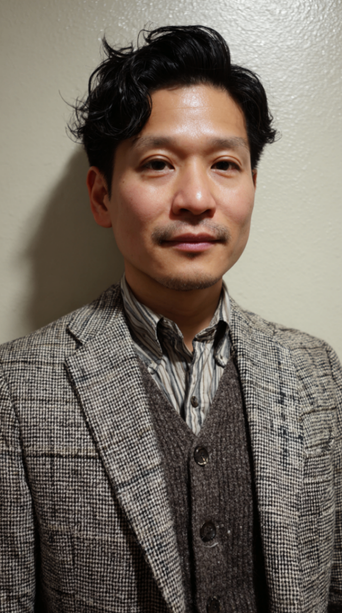
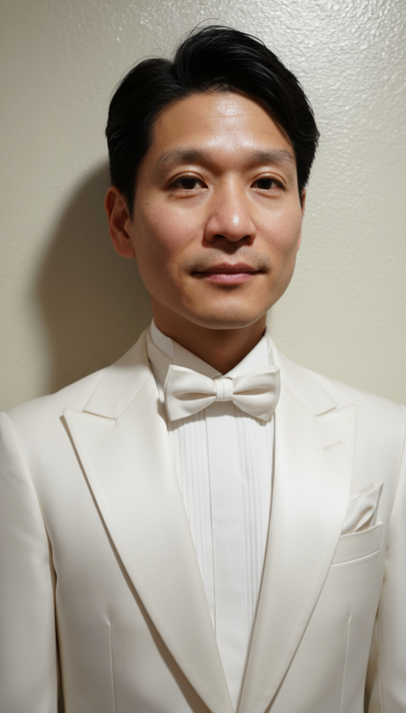
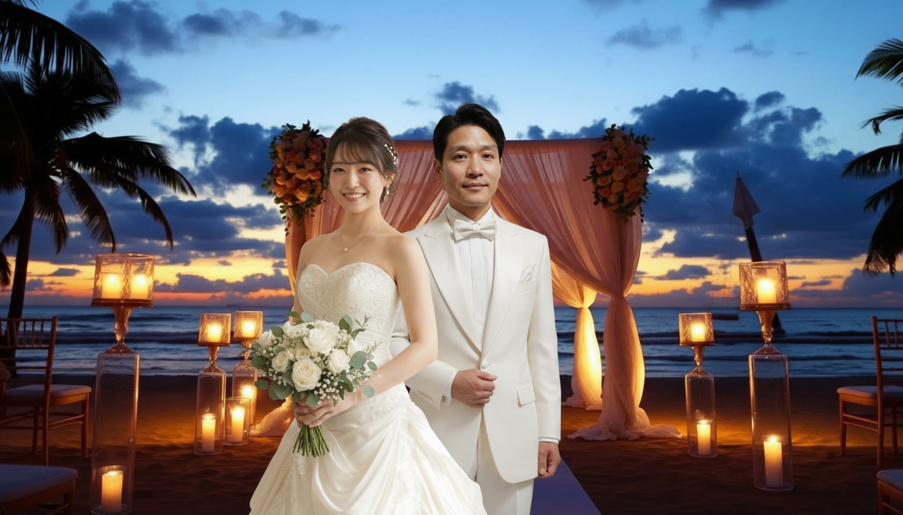
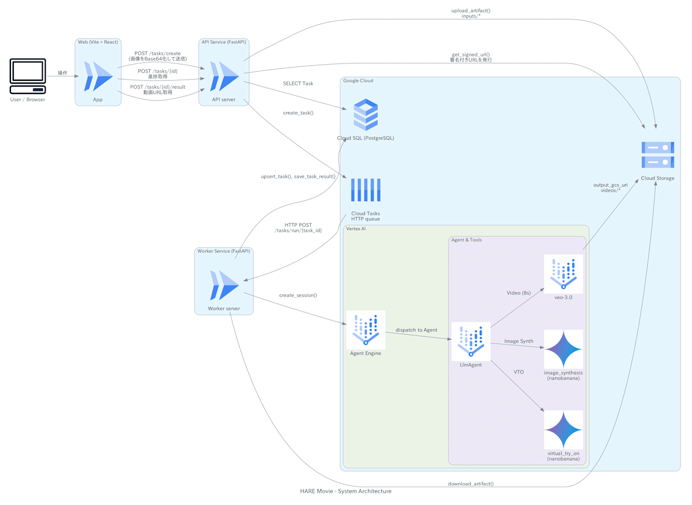

!

この記事は「[第3回 AI Agent Hackathon](https://zenn.dev/hackathons/google-cloud-japan-ai-hackathon-vol3)」の提出用記事です。

#  はじめに

近年、結婚式市場は少子高齢化・未婚化・晩婚化の進行により縮小している一方で、**結婚式にかかる費用は増加傾向であり、準備にかかる手間も大きいと多くの人が感じています。**  
<https://zexy.net/article/app000100792/?utm_source=chatgpt.com>

特に式場や衣装選びといった準備の部分は、週末にユーザが実際にその式場に足を運んだり、試着をしたりと非常に負担が大きいです。  
**"HARE Movie(晴れムビ)"は衣装や式場の写真から、それに合わせた結婚式のイメージ動画を本人画像を用いてAIが作成します。** まるで実際に式場で結婚式を挙げているかのような動画を作ることで、ユーザに具体的な式のイメージを持ってもらうことができます。  
これにより **結婚式の準備にかかる負荷を減らし、さらに自分が理想とする結婚式のより具体的なイメージを描けるようになります。**

#  プロジェクトの概要と解決する課題

##  ターゲットユーザ

  * どんな結婚式をしたいのか全くイメージがつかない人
  * いろんな式場、いろんな衣装を見たり試したりしたいけど、そんな時間や手間を掛けられない人
  * いろんな式場と衣装で結婚式をやってみたら...という妄想を動画として思い出に残したい人

##  解決する課題

  * **どんな結婚式をすればいいのかイメージが沸かない**
    * 結婚式は多くの人にとって初めてのことで、どんな結婚式をすればいいのかイメージが付きづらいです。動画で実際に自分の結婚式をシミュレーションすることで、具体的なイメージを持つことができるようになります。
  * **式場や衣装の選択肢が多くて選べない**
    * 式場に足を運んで、下見や衣装の試着などを繰り返し行うのは、とても時間が掛かります。現場に行くことなく、実際に着ることなく、結婚式を「試す」ことができます。
  * **他の結婚式の雰囲気もちょっと味わいたい**
    * 多くの人が1回の結婚で結婚式は1度しか行いません。いろんな雰囲気や衣装での結婚式を妄想だけでなく、思い出として動画で残します。

##  ソリューション

HARE Movieは式場と衣装の写真を選んで本人がそこで結婚式を挙げているような動画を作れるアプリです。  
実際のアプリの紹介＆デモ動画が以下になります。

<https://www.youtube.com/watch?v=KtnP6J_9k68>

##  特徴

あたかも本人たちが結婚式を挙げているかのような動画にするために、以下の技術を用いて動画生成を行いました。

  * Nano Banana
  * Veo3(画像入力)

これらを用いて以下のようなフローで動画が生成されます。

  1. 入力として、新郎新婦それぞれの画像、ドレスの画像、タキシードの画像、式場の画像の5枚の画像を用意する。
  2. Nano Bananaで新婦の画像とドレスの画像を用いて新婦がドレスを着た画像を生成する。
  3. Nano Bananaで新郎の画像とタキシードの画像を用いて新郎がタキシードを着た画像を生成する。
  4. Nano Bananaで2と3で生成した画像と背景画像を合わせる
  5. Veo3で4の画像を入力として動画を生成する。

これらの手順をAIエージェントを用いて行うために、 **[Google ADK](https://google.github.io/adk-docs/)をフレームワークとして用いました。**  
上記のようなシーケンシャルな動作をワークフローとして組んでも良かったのですが、これくらいの簡単なワークフローであればツールを使ってAIが自動でシーケンスを組んでくれるため、今回はツールを使った実装でAIエージェントを構築しました。

AIエージェントに与えられているツールは以下の3つです。

  * Virtual Try On ツール(人物の着せ替え)
  * 背景合成ツール(人物と背景を合成)
  * 動画生成ツール

またAIエージェントのルートのLLMとしてはgemini-2.5-proを用いています。

##  生成結果の例

生成結果のサンプルを示します。  
まず、入力として以下のような写真を花嫁、花婿の写真としてそれぞれ用意します。  
  

ドレスとタキシードは自分で用意したもの、もしくは予めアプリ側で用意したものを使用することができます。

  

これらの衣装を花嫁、花婿それぞれにnanobananaを使って着せた画像が以下になります。

  

この衣装を着た二人の画像をさらに式場の画像と合成します。(ちょっと合成感があり、AIエージェントの調整が必要)

最後にこの合成した画像を用いて動画を生成します。

<https://www.youtube.com/watch?v=G0ziXTjxUrU>

#  システムアーキテクチャ

全体のシステムアーキテクチャ図を以下に示します。  
計算環境はAPIサーバ、AIエージェント本体、AIエージェントとやり取りを行うワーカ、フロントエンドの4つになります。  
外部記憶はCloud SQL(PostgreSQL)とCloud Storageを使用しており、それぞれ動画生成タスクの進捗管理と画像や動画といったアーティファクトの保存に使用しています。

#  技術スタック

今回使用した技術スタックは以下になります。  
この中で、ADKはフレームワークとして、AIエージェントの構築、Agent Engineへのデプロイ、クライアントからの呼び出し周りが網羅的にサポートされており、画像や動画といったマルチモーダルなエージェントの構築も行いやすく、効率的に実装が進められたと思います。

  * バックエンド 
    * Python
    * FastAPI
    * sqlmodel
    * alembic
  * AIエージェント 
    * Python
    * Google ADK
    * google-genai(Nano Banana, veo3)
  * フロントエンド 
    * Typescript
    * Next.js
    * vite
  * インフラ 
    * Google Cloud
    * Terraform
  * AI開発 
    * Cursor
    * Gemini/ChatGPT
    * Lovable

HARE Movieのコードは以下に公開しています。

<https://github.com/neka-nat/haremovie>

#  今後の課題

結婚式をシミュレートするという観点から今後もいろいろな機能追加によって発展できると考えています。

  * 複数のシーンのつなぎ合わせでより長尺な動画を生成する
  * 背景と衣装だけでなく、髪型や式場の小物、料理、参加者なども指定して、シミュレートできるようにする。
  * 字幕やフェードなどの動画の効果を入れることで、より魅力のある動画の生成を行う。

#  まとめ

今回のアプリではADKをうまく使いこなすことで、AIエージェントの構築やデプロイ周りが非常に効率化できたと思います。  
マルチモーダルなAIエージェントに関してはまだ情報として少ない部分はありますが、Zennにもいくつか記事があり、それらを参考にすることでうまく進めることができました。

<https://zenn.dev/google_cloud_jp/articles/fe964db69010db>  
<https://zenn.dev/google_cloud_jp/articles/97002c462e9025>  
<https://zenn.dev/soundtricker/articles/fba90dc901ab46>

そして、Nano Bananaと動画生成の組み合わせは今回のような何かをシミュレーションするようなアプリにとって、非常に強力なツールだと感じました。これからも画像編集や動画を扱ったアプリのアイデアはいろいろと考えていきたいなと思っています。
