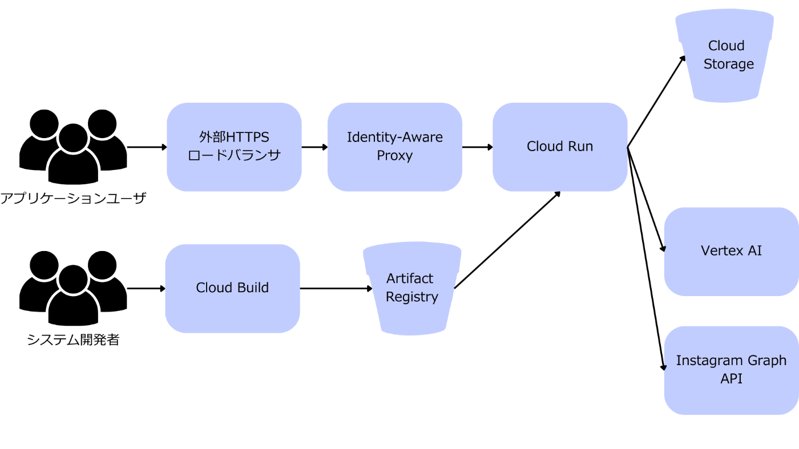

#  ADKとVertex AIで作る小規模店舗のInstagram投稿支援エージェントシステム

<https://youtu.be/uAbU-I5TDyw>

##  はじめに

Google Cloud Japan AI Hackathon Vol. 3への参加作品として、Agent Development Kit (ADK) とVertex AIを活用した小規模店舗のInstagram投稿支援エージェントシステムを開発しました。本記事では、その開発過程と技術的な実装、そしてハッカソンで得られた知見について詳しく解説します。

##  プロジェクト概要と背景

現代のSNSマーケティングにおいて、ユーザーに発見され、継続的に関心を持ってもらうためのSNS活用は、ビジネスの成長に不可欠です。しかし、その鍵となる魅力的で継続的なコンテンツ制作は、特にリソースが限られる個人事業主や小規模な事業者にとって大きな負担となっています。日々の投稿のための画像作成、キャプション考案、ハッシュタグ選定といった一連の作業は、多大な時間と専門スキルを要求します。

さらに、数多の競合の中から差別化を図り、顧客とのエンゲージメントを深めるためには、独自のキャラクターやロゴを用いたブランドアイデンティティの確立が極めて効果的です。ですが、これらのブランド要素を一貫性を持って日々のコンテンツに反映させることは、従来の制作フローにおいて更なる負担増となるのが実情です。

この課題を解決するため、私は以下の技術を組み合わせたエージェントシステムを構築しました。

  * **Agent Development Kit (ADK)** : Googleが提供するAIエージェント開発フレームワーク
  * **Vertex AI Imagen** : 高品質な画像生成AI
  * **Vertex AI Gemini** : 高度なテキスト生成AI
  * **Instagram Graph API** : Instagram投稿の自動化

本システムは、ユーザーが入力したプロンプトに基づき、AIが画像とキャプションを生成し、Instagramに自動投稿するまでの一連のプロセスを効率化します。さらに、お店のコンセプトやキャラクターを反映させることで、よりパーソナライズされたコンテンツ生成を可能にしました。

##  システムアーキテクチャ：マルチエージェントの力

本システムは、ADK（Agent Development Kit）を活用したマルチエージェントアーキテクチャを採用しています。これは、複雑なタスクを複数の専門AIエージェントに分割し、それぞれが連携して目標を達成するアプローチです。人間社会のチームワークのように、各エージェントが専門性を発揮し、協調することで、効率的で拡張性の高いシステムを実現しています。

###  エージェントの役割分担

主要なエージェントは以下の通りです。

  1. **ContentGeneratorAgent**

     * **役割** : Instagram投稿に必要な画像、キャプション、ハッシュタグを生成します。
     * **専門性** : Vertex AI Imagenによる高品質な画像生成と、Vertex AI Geminiによる自然で魅力的なテキスト生成。
     * **特徴** : お店のコンセプトをシステムプロンプトとして受け取り、キャプションのトーンや言葉遣いに反映させます。また、指定されたキャラクターやマスコットを画像に登場させるためのプロンプト調整も行います。
  2. **InstagramPosterAgent**

     * **役割** : ContentGeneratorAgentが生成したコンテンツを、Instagram Graph APIを通じて実際に投稿します。
     * **専門性** : Instagram APIの操作、画像アップロード、投稿作成、公開といった一連の投稿プロセスを安全かつ確実に行います。
  3. **VideoGeneratorAgent（将来拡張）**

     * **役割** : ショート動画コンテンツを生成します。
     * **専門性** : Veo 3などの最新動画生成AIを活用し、Instagram StoriesやReelsに最適化された動画を作成します。
     * **現状** : 今回のハッカソンでは実装まで至りませんでしたが、将来的な拡張性として検討しています。

###  エージェント間の連携フロー

  1. **ユーザー入力** : Webインターフェースから、投稿テーマ、スタイル、お店のコンセプト、登場させたいお店のキャラクター/ロゴをプロンプトとして入力します。
  2. **ContentGeneratorAgentの起動** : 入力されたプロンプトに基づき、ContentGeneratorAgentが起動します。
  3. **コンテンツ生成** : ContentGeneratorAgentは、Vertex AI ImagenとGeminiを呼び出し、画像、キャプション、ハッシュタグを生成します。この際、お店のコンセプトやキャラクター情報がプロンプトに動的に組み込まれます。
  4. **InstagramPosterAgentへの引き渡し** : 生成された画像データとテキストデータは、InstagramPosterAgentに渡されます。
  5. **Instagram投稿の実行** : InstagramPosterAgentは、受け取ったコンテンツをInstagram Graph APIを通じてアップロードし、投稿を公開します。

##  技術的詳細

###  1\. システムアーキテクチャ

####  1-1. インフラシステム構成

##### 概要

Identity-Aware Proxy (IAP) を利用してCloud Run上にデプロイされたサービスを保護し、カスタムドメインを持つ外部HTTPSロードバランサ経由でアクセスするシステム。

##### 構成要素

  * **Cloud Run** : コンテナ化されたアプリケーションを実行するためのサーバーレスプラットフォーム。
  * **Identity-Aware Proxy (IAP)** : Google Cloud上で実行されるアプリケーションへのアクセスを安全に管理するサービス。
  * **外部HTTPSロードバランサ** : Cloud Runサービスへのトラフィックを分散し、IAPと連携してアクセス制御を行う。
  * **カスタムドメイン** : 外部HTTPSロードバランサに設定されるユーザー所有のドメイン。
  * **Google Cloud Build** : コンテナイメージのビルドとプッシュを自動的に行うサービス。
  * **Artifact Registry** : ビルドしたコンテナイメージを保管するためのリポジトリ。
  * **Cloud Storage** : キャラクター/ロゴ用の画像や、Instagram投稿用の一時ファイルを保管するためのオブジェクトストレージ。
  * **Googleアカウント / Googleグループ** : IAPがアクセス権限を付与するために使用するユーザーまたはグループのID。

####  1-2. Webアプリケーション構成

##### 概要

Google Cloud PlatformのADK（Agent Development Kit）を活用し、Vertex AI、Instagram Graph API、Google Cloud Storageを統合したInstagram投稿自動化Webアプリケーション。FlaskベースのWebインターフェースを通じてAI生成コンテンツによる効率的なInstagram投稿を実現する。

##### 構成要素

  1. フロントエンド層

  * **静的Webインターフェース** : HTML5/CSS3/JavaScriptによるSPA（Single Page Application）形式のユーザーインターフェース。
  * **レスポンシブデザイン** : モバイル・デスクトップ両対応のモダンUI。
  * **リアルタイムプレビュー** : 生成された画像とキャプションの即座確認機能。

  2. アプリケーション層

  * **Flask Webフレームワーク** : Python製軽量Webフレームワークによるバックエンドアプリケーション。
  * **ADKエージェント統合** : Google Agent Development Kitを活用した自律型エージェントシステム。
  * **ContentGeneratorAgent** : Vertex AIと連携してコンテンツ生成を行うエージェント
  * **InstagramPosterAgent** : Instagram Graph APIと連携して投稿処理を行うエージェント

  3. 生成AI層

  * **Vertex AI Imagen** : 高品質な画像生成のためのGoogle製生成AIモデル。
  * **Vertex AI Gemini** : 魅力的なキャプション・ハッシュタグ生成のためのGoogle製大規模言語モデル。

  4. 外部API統合層

  * **Instagram Graph API** : Meta（Facebook）提供のInstagram Business Account連携API。
  * **Facebook Developer Platform** : アクセストークン・ページID管理のための開発者プラットフォーム。

###  2\. ADKの活用：エージェント指向開発

ADKは、AIエージェントの概念を直接的にコードに落とし込むことができるため、各エージェントの役割と責任を明確に分離し、モジュラーな設計を促進します。`@tool`デコレータを使ってPython関数をエージェントが利用できるツールとして簡単に登録できるため、Vertex AIやInstagram Graph APIといった外部サービスとの連携が非常にスムーズに行えました。

###  3\. Vertex AIの活用：高品質なコンテンツ生成

本プロジェクトでは、Google CloudのVertex AIを最大限に活用し、高品質なコンテンツ生成を実現しました。

####  Vertex AI Imagenによる画像生成

Imagenはテキストプロンプトから画像を生成する強力な基盤モデルです。Instagram投稿の視覚的魅力を高めるため、以下の点を意識して実装しました。

  * **プロンプトエンジニアリング** : ユーザーが指定した「キャラクターやロゴ」をプロンプトに含めることで、一貫性のあるブランドイメージを画像に反映させます。
  * **アスペクト比の最適化** : Instagramの正方形投稿に合わせて`aspect_ratio="1:1"`を指定し、後処理の手間を省きます。

####  Vertex AI Geminiによるテキスト生成

Geminiはテキスト生成、要約、コード生成など多岐にわたるタスクに対応するマルチモーダルモデルです。キャプションとハッシュタグの生成に活用し、特に以下の工夫を凝らしました。

  * **お店のコンセプト反映** : ユーザーが入力した「お店のコンセプト」をシステムプロンプトとしてGeminiに渡すことで、キャプションのトーンや言葉遣いをブランドイメージに合致させます。
  * **ハッシュタグの自動生成** : 関連性の高いハッシュタグを複数提案し、投稿のリーチを最大化します。

###  4\. Instagram Graph APIとの連携

生成されたコンテンツをInstagramに投稿するため、Instagram Graph APIを利用しました。画像アップロード、投稿作成、公開という一連のワークフローを`InstagramPosterAgent`が担当します。

####  課題と解決策：400エラーとの戦い

開発中に、Instagram Graph APIでの画像アップロード時に`400 Bad Request`エラーに直面しました。

**主な原因と解決策**

  * **権限（パーミッション）不足** : `instagram_basic`, `pages_show_list`, `instagram_content_publish`, `pages_read_engagement`などの必要な権限がアクセストークンに付与されているか確認し、不足している場合は再取得しました。
  * **アカウントタイプ** : Instagram Graph APIはビジネスアカウントまたはクリエイターアカウントでのみ機能するため、対象アカウントが適切に設定されているか確認しました。
  * **リクエスト形式** : 画像のBase64エンコードやMIMEタイプ、ファイルサイズなどのリクエストパラメータがAPIの要件を満たしているか詳細に検証し、修正しました。
  * **`account_type`の取得**: `IGUser`ノードから直接`account_type`を取得しようとするとエラーになるため、Facebookページに紐づくInstagramビジネスアカウントIDを介して取得する手順を踏みました。

これらのデバッグプロセスを通じて、APIの仕様を深く理解し、堅牢な投稿機能を実装することができました。

###  5\. フロントエンド実装

ユーザーが直感的に操作できるよう、シンプルなWebインターフェースをFlaskのテンプレートエンジンとJavaScriptで実装しました。プロンプト入力、スタイル選択、お店のコンセプトやキャラクターの指定、生成されたコンテンツのプレビュー、そして投稿実行までの一連の操作をサポートします。

##  開発で得られた知見と学び

  1. **ADKによるモジュラー設計の優位性** : 複雑なシステムをエージェント単位で分割することで、開発、テスト、メンテナンスが格段に容易になりました。特に、機能追加や変更の際に、他のエージェントへの影響を最小限に抑えられる点が大きなメリットです。
  2. **Vertex AIの強力な生成能力** : ImagenとGeminiの組み合わせにより、テキストと画像のマルチモーダルなコンテンツ生成が非常に高品質かつ効率的に行えることを実感しました。特に、プロンプトエンジニアリングの重要性を再認識しました。
  3. **API連携の奥深さ** : Instagram Graph APIのような外部APIとの連携では、ドキュメントの正確な理解と、エラーメッセージからの原因特定、そして地道なデバッグが不可欠であることを学びました。

##  今後の展開

本プロジェクトは、さらなる機能拡張と改善の可能性を秘めています。

  1. **他のSNSプラットフォーム対応** : TikTok、X（旧Twitter）など、他のSNSプラットフォームへの投稿エージェントを追加。
  2. **動画コンテンツ生成の強化** : Veo 3などの動画生成AIを本格的に統合し、Instagram StoriesやReels向けのショート動画を自動生成する機能の強化。
  3. **スケジュール投稿機能** : 特定の日時に自動で投稿を行うスケジュール機能の追加。
  4. **投稿分析と最適化** : 投稿のパフォーマンス（エンゲージメント率など）を分析し、次回のコンテンツ生成にフィードバックする機能。
  5. **UI/UXの改善** : より直感的でリッチなユーザーインターフェースの提供。

##  まとめ

本プロジェクトは、ADKとVertex AIを組み合わせることで、Instagram投稿のコンテンツ生成から投稿実行までを自動化するマルチエージェントシステムを構築しました。お店のコンセプトやキャラクターを反映できるパーソナライズ機能は、SNSマーケティングの効率化とブランドイメージ向上に大きく貢献します。

Google Cloud Japan AI Hackathon Vol. 3のテーマである「AI Agentが、現実を豊かにする」に合致し、個人事業主や小規模企業のSNSマーケティングを強力に支援する実用的なソリューションを提供できると確信しています。

##  参考資料

  * [Agent Development Kit Documentation](https://google.github.io/adk-docs/)
  * [Vertex AI Imagen API Reference](https://cloud.google.com/vertex-ai/generative-ai/docs/model-reference/imagen-api)
  * [Vertex AI Gemini API Reference](https://cloud.google.com/vertex-ai/generative-ai/docs/model-reference/gemini)
  * [Instagram Graph API Documentation](https://developers.facebook.com/docs/instagram-api/)

