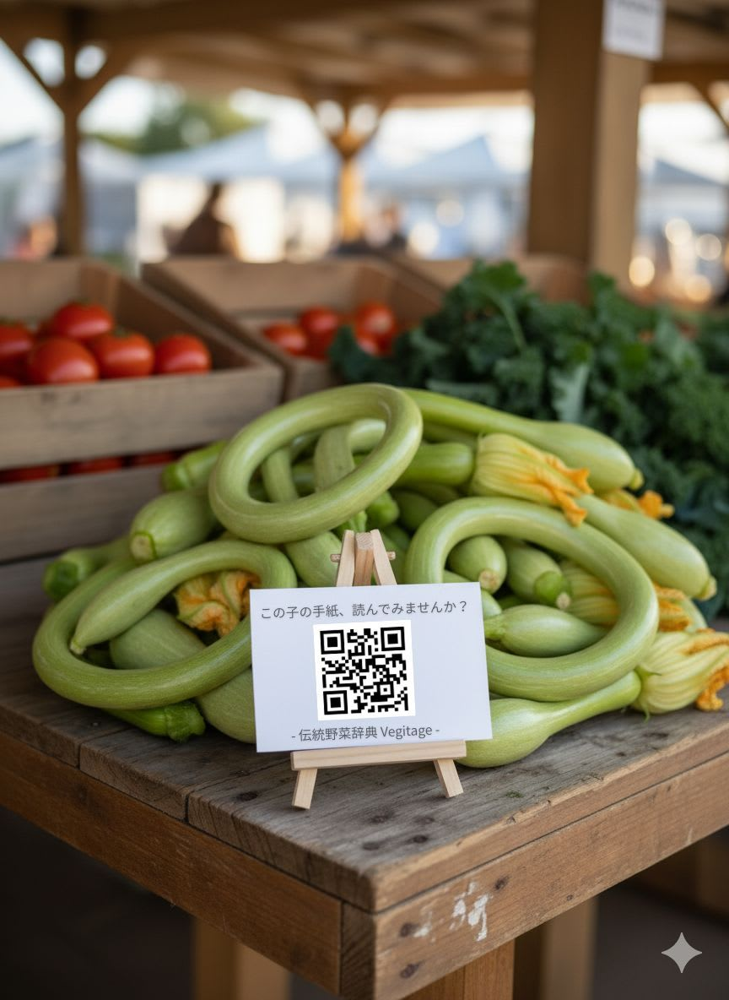

畑で生まれた、物語を持つ野菜。しかし、その声を伝える術がありませんでした。この経験から『Vegitage』は生まれました。AIが伝統野菜の歴史や個性を「手紙」として執筆し、QRコードがそれを直売所の野菜そのものに結びつけます。消費者はその場で物語を知り、生産者は想いを届けることができる。AIと人の協働で、私たちの食卓と、その背景にある文化を豊かにする挑戦です。

##  はじめに

私の挑戦は、風変わりなカボチャから始まりました。  
イタリアの伝統品種「トロンボンチーノ」と、日本の伝統品種「鶴首カボチャ」。

元田んぼの畑で、5月に緑肥用ソルガムと一緒に鶴首カボチャの種を播いたのですが、  
梅雨の多湿にも、夏の猛暑や少雨・乾燥にも負けずにたくましく育ったのは、トロンボンチーノとの交雑カボチャでした。  
昨年、蜂が自然に交配させてくれて生まれたものです。

イタリアと日本の血を引くユニークなカボチャには、語るべき物語があります。  
雑草のようにたくましく、それでいて栗カボチャのような甘さはないものの、豊かなコクを備えている――。  
「トロンボンチーノ」は、ズッキーニ兼カボチャで、いつ収穫しても美味しく食べられるし、長期間保存できるるし、皮が薄くて調理しやすいという、便利な特徴もあります。でも、形や大きさがバラバラなので、市場向けには全く向いていません。

日本では全く知られていないユニクークな形の「トロンボンチーノ」、このズッキーニ兼カボチャを人にあげても「奇妙なズッキーニ」でしかありません。

この体験は、私がずっと抱いてきた問題意識を、改めて強くするきっかけになりました。

私たちの食卓から、「野菜の物語」が失われつつある。

加工食品には派手なパッケージや宣伝がなされる一方、命を支える伝統野菜は、流通に乗らず、直売所やマルシェで偶にみかけることができる存在になっています。  
そこに込められた何千年もの歴史、育種家の情熱、生産者の努力――そのすべてが「効率化」という大きな流れの中で見えなくなっているのです。

もしAIという新しい技術が、声を失った野菜たちに、もう一度「物語」を語らせてくれるとしたら？  
そんな思いから、私はプロジェクト『Vegitage』を始めました。

##  1\. プロジェクト概要：「Vegitage」- 伝統野菜を愛する人のためのツール

###  1-1. はじまりは、一通の「手紙」から

『Vegitage』は、AIエージェントと共に「野菜の物語」を再発見し、共有するプロジェクトです。

かっての野菜は、一つひとつが異なる形や色を持ち、土地や気候、そして人の営みによって育まれてきました。けれども現代の市場流通では、見た目やサイズが規格から外れると、その物語ごと捨てられてしまいます。

私はここに、AIの力を重ねたいと考えました。  
AIは、文章や画像を生成するだけでなく、「**背景にある情報を結びつけ、意味を紡ぎ直す** 」ことができます。

『Vegitage』では、伝統野菜の歴史資料や栽培記録をAIに入力し、それを「**野菜自身からの手紙** 」として、私たちに届けてもらいます。  
たとえば、

> 「私は聖護院の里で生まれ、京の厳しい冬を越す人々のために、煮崩れせぬよう丸く、甘くなることを選びました。」  
>  「今年の夏は雨が少なかったけれど、ご先祖様譲りの深い根で、土の中の水を探し当て、なんとかここまで育ちました。」

といった形で、野菜が自らの生い立ちを語り出すのです。  
それは、直売所やマルシェで野菜を手に取った人が、その背景にある物語を知り、食べる体験を一層豊かにするための「**開封の儀** 」となります。

単なる「食材」としての野菜ではなく、「歴史を持ち、文化を支えてきた存在」として再認識する――。  
それが『Vegitage』の目指す未来です。

###  1-2. なぜ今、この辞典が必要なのか

現代の食卓は、これまでになく豊かで便利になりました。  
しかし、その効率化の影で、私たちは「食の多様性」や「文化としての食」を失いかけています。規格に合わないという理由だけで、地域の食文化を支えてきた在来野菜が、次々と姿を消しているのです。

さらに、気候変動は、これまでの農業の常識を覆そうとしています。  
そんな時代だからこそ、多様な環境に適応してきた**伝統野菜の「たくましさ** 」と、そこに秘められた「**知恵** 」に、私たちはもう一度、学ばなければなりません。

今、『Vegitage』が必要なのは、この二つの理由からです。

  1. **失われつつある野菜の物語を、AIを通じて可視化し、次世代に残すこと。**
  2. **多様性を持つ野菜の価値を再発見し、未来の食と農に活かすこと。**

AIは冷たい機械ではありません。  
適切に使えば、過去と未来をつなぐ「**最高の通訳** 」となり、私たちの食卓に再び多様性と物語を取り戻してくれるのです。

###  1-3. 今までの伝統野菜辞典との「決定的な違い」

では、既存の素晴らしい書籍と、私たちのアプリでは何が違うのか。  
それは、**知識への「壁」の高さ** と、**知識が「生きている」かどうか** です。

**【従来の辞典（例：地方野菜大全）】**

  * **更新性:** 数年、あるいは数十年に一度の改訂を待つしかない。情報は「**固定的** 」。
  * **入手性:** 専門家や熱心な愛好家だけのもの。
  * **体験:** 記憶に頼る、「**閉じた** 」学習体験。

**【Vegitageアプリ】**

  * **更新性:** **コミュニティ** の力で、日々、情報が追加・修正されていく。知識は「**成長し続ける** 」。
  * **入手性:** QRコードで、**誰もが、その場で、1秒** でアクセス。
  * **体験:** 実際の行動（購入、料理、栽培）へと繋がる、「**開かれた** 」物語体験。

要素 | 地方野菜大全 | Vegitage QRアプリ  
---|---|---  
**アクセス** | 注文し、数日待ち、目次で探す | その場でスキャンし、即座に開始  
**体験** | 文字を読む（受動的） | 物語を体験する（能動的）  
**知識の鮮度** | 出版された瞬間に古くなる | **コミュニティによって、常に最新に**  
**繋がり** | 著者と読者 | **生産者と消費者とコミュニティ**  
  
『Vegitage』は、単に知識を民主化するだけではありません。  
GitHubをベースとした編集システムにより、農家の方の新しい栽培の知見や、料理家の新しいレシピが、**日々追加・更新されていく「生きた辞典** 」となります。

それは、**直売所の野菜売り場そのものを、常に新しい発見がある、生きた学校に変える** 挑戦なのです。  
  
直売所で、野菜自身が「手紙」を差し出す。書籍では決して得られない、その場での「発見」と「感動」の体験。

##  2\. システムアーキテク-チャ

###  2-1. 私たちのアーキテクチャ：AIの力と、現実的な選択

ハッカソンという短期間で、このビジョンを形にするため、私は「**AIの力を最大限に借り、人間の作業を最小限にする** 」という思想のもと、アーキテクチャを設計しました。  
しかし、その道のりは一直線ではありませんでした。AIとの対話、そして自問自答を繰り返す中で、当初の計画は何度も姿を変えていきました。

これは、その「**思考と選択の旅** 」の記録です。

###  2-2. 知識の源泉：2段階AIパイプライン

まず考えたのは、どうやって辞典の「中身」を作るかです。  
当初は、1回のAPIコールで全てを生成しようとしましたが、品質が安定しませんでした。AIは時として、もっともらしい嘘（ハルシネーション）をつくからです。

そこで、プロセスを2段階に分けました。

  1. **第1段階 (Geminiによる分析):** まず、私が設計した詳細なプロンプトを使い、Gemini APIの**Batch API** で、数百種類の野菜に対する網羅的な「**分析データ」を低コストで一括生成** します。これは、プロジェクトの**揺るぎない「事実の骨格** 」となります。
  2. **第2段階 (Geminiによる執筆):** 次に、第1段階で得られた分析データを「**唯一の情報源** 」として、読者の心に響く「**ファーストビュー用記事** 」をAIに執筆させます。

この「分析」と「執筆」を分離することで、AIが勝手に物語を作り出すリスクを大幅に削減し、**信頼性と物語性を両立** させることに成功しました。

###  2-3. フロントエンドとバックエンド：壮大な計画からの、賢明な撤退

当初、私は本格的なWebアプリケーションを夢見ていました。  
`Flutter Web → FastAPIサーバー → PostgreSQLデータベース → 編集用管理画面`  
…しかし、すぐに気づきました。たった一人で、これを短期間に作るのは無謀だと。

ここで、私は大きな決断をしました。  
「**サーバーサイドアプリケーションを、作らない** 」と。

代わりに採用したのが、**Flutter Webの強力なアセット管理機能** を最大限に活用する「**インテリジェント・アセット方式** 」です。

  * **初回ロードは、超軽量なインデックスファイル (`_index.json`) のみ。** これで、アプリは瞬時に立ち上がります。
  * **詳細な野菜データは、ユーザーが項目をタップした瞬間に、オンデマンドで非同期に読み込む。**

これにより、FastAPIサーバーが担うはずだった役割を、**NginxというWebサーバー** だけで実現してしまったのです。  
データベースも、管理画面も、今は必要ありません。**コンテンツの更新は、GitHubで行えばいい。** `git push` すれば、GitHub ActionsがGCEに自動でデプロイしてくれる。

この「**壮大な計画からの、賢明な撤退** 」こそが、ハッカソン期間内に、スケーラブルで高速なプロトタイプを完成させるための、最大の鍵となりました。

###  2-4. インフラ：GCEという名の「自由な大地」

インフラには、**Google Compute Engine (GCE)** を選択しました。  
なぜなら、このプロジェクトの未来には、**最高の検索体験を実現するための『Elasticsearch』**の導入が不可欠だと考えているからです。GCEが提供する** 完全なコントロールと柔軟性**は、そのための最高の「土台」となります。

完成したFlutter Webアプリは、このGCE上のNginxでホスティングし、Let's EncryptでHTTPS化をしました。

###  2-5. 技術選択の振り返り：AI時代に学んだこと、そして次の一歩

この3週間は、まさに発見の連続でした。  
当初の計画は、今振り返ると、いかに自分が「過去の常識」に囚われていたかを教えてくれます。

当初の計画 | → | **最終的な選択** | 学んだこと  
---|---|---|---  
**FastAPI + PostgreSQL** | → | **インテリジェント・アセット方式** | 「サーバーレス」の本質は、サーバーがないことではなく、**サーバーの存在を意識しない** ことだと学びました。  
**Webサイトとアプリを別々に開発** | → | **Flutter Web** | QRコードを起点とするこのプロジェクトでは、モバイル体験が最優先。Flutterの「ワンコードベース」が、それを可能にしてくれました。  
**AIに全てをお任せ** | → | **2段階AIパイプライン** | AIは万能ではありません。**適切な問いを立て、役割を分ける** ことで、初めて最高のパートナーになることを知りました。  
**伝統野菜のデータのみ** | → | **野菜と伝統料理のデータ** | 野菜の物語は、それがどう食べられてきたかという**食文化** と不可分であることに気づきました。  
**一人で黙々と開発** | → | **AIとの協働開発** | AIは、私の曖昧な指示を具体的なコードにし、私の間違いを指摘してくれる**最高の「ペアプログラマー** 」でした。  
  
技術はあくまで手段です。しかし、適切な技術を選択し、組み合わせることで、夢が現実の形になる。AI時代とは、そういう時代なのだと、私はこのハッカソンを通じて、身をもって体験しました。

そして、この「**野菜と料理を繋ぐ** 」という発見は、私たちの次の一歩を、より明確なものにしてくれました。

**現在のアーキテクチャ** | → | **将来の拡張計画** | 目的  
---|---|---|---  
**JSONファイル検索** | → | **Elasticsearch 導入** |  **最高の検索体験** を実現するため。「京都の蕪を使った煮物」のような、複雑な検索にも応えられるようにします。  
**オフライン・アセット** | → | **PostgreSQL & Firebase Auth & AIエーゼント** |  **コミュニティ機能** を実装するため。生産者**や料理人の方々** が安全にログインし、自身の物語、育成記録、**そして伝統料理のレシピ** を投稿できる、**生きたプラットフォーム** へと進化させます。  
  
このハッカソンで構築した堅牢な土台があるからこそ、私たちは自信を持って、この壮大な未来図を描くことができます。

##  3\. デモ動画

このプロジェクトが、どのようにして野菜の「声」を聴かせてくれるのか。3分間のデモ動画をご覧ください。  
<https://www.youtube.com/watch?v=twasnvXJxDU>

##  おわりに：AIと伝統野菜から学んだこと

この3週間は、まさに発見の連続でした。  
当初、私はただ「伝統野菜の情報を集めれば、辞典になる」と単純に考えていました。しかし、AIとの対話、そして試行錯誤を繰り返す中で、自分の考えがいかに浅はかだったかを思い知らされました。

珍しい伝統野菜についてAIに尋ねても、**ハルシネーション（AIがもっともらしい嘘をつくこと** ）が頻繁に起こります。AIは、知らないことを「知らない」と言うのが苦手なのです。  
そして、「**聖護院大根」のことだけを調べても、「ダイコン」という親品目のことを知らなければ、その本当の個性は理解できない** ことに気づきました。さらに、野菜を知ることは、それをどう食べてきたか、すなわち「**伝統料理** 」の知恵と分かちがたく結びついていることも。

そう、**知識とは、一つの点ではなく、無数の点が繋がった「ネットワーク」なのです。**  
この発見こそが、私たちの『Vegitage』の設計思想の核となりました。

AIが生成したデータも、あくまで「プロトタイプ」です。その情報を精査し、魂を吹き込み、本当に正しいものにしていくのは、私たち人間の役割です。

今までは、指示通りに素早くコードを書くことがエンジニアの価値でした。  
しかし、その仕事は今、AIが最も得意とするところです。

AIは、私たちをそうした「作業」から解放し、「**何を、なぜ作るのか** 」という、より創造的で、より本質的な仕事へと誘ってくれます。

これを素晴らしい機会だと感じる人がいる一方で、それを嫌う人も多いと思います。正解のない問いに向き合うことへの戸-惑い。新しい働き方への、漠然とした不安。

しかし、このVegitageプロジェクトを通じて、私は一つの希望を見つけました。

私たちのアプリは、AIという新しい技術を使って、忘れ去られようとしていた「伝統野菜」という古いものの価値を、もう一度見つけ出そうとしています。  
それは、**新しい時代に適応することと、古き良きものを大切にすることが、決して矛盾しない** ということの証明なのかもしれません。

昨年の猛暑で、私の畑で**偶然生まれた、イタリアと日本の血を引くカボチャ** が、他の野菜よりも元気に育ったように、古い品種の遺伝子には、現代の気候変動に立ち向かうヒントが隠されているのかもしれません。  
そうした**畑の片隅での小さな発見** も、このプラットフォームを通じて他の人と共有できれば、それは未来を拓く、大きな知恵になるでしょう。

このプロジェクトが、テクノロジーの変化に戸惑う全ての人々にとって、新しい時代への一歩を踏み出す、小さな勇気となれたなら、これ以上の喜びはありません。

##  **あとがき：71歳の私が、再び「プロダクトマネージャー」になった日**

実は、私がソフトウェア開発のプロジェクトに関わるのは、これが初めてではありません。  
今から30年前には、県の職員として、県の財務会計システムの開発プロジェクトを、プロジェクトリーダーとして率いていました。プログラミングは大手業者に委託しており、私の役割は、コードを書くことではなく、**システムのユーザーに配慮し、「何を、なぜ作るのか」というシステムの全体像を描き、指揮する** ことでした。

それから30年の時が経ち、AIという新しい時代の幕開けと共に、私はもう一度「創り手」になれるかどうか試してみようと思い立ち、AIとともにFlutterの学習を始めました。

日本の学校で、何年も英語を勉強しても話せるようにならないのは、それが「**実践」に紐付いていない、断片的な「知識** 」だからです。  
しかし、AIとの学習は、全く違いました。

AIは、私が「こんなアプリを作りたい」という具体的な「実践」の目的を伝えると、必要な「知識（コード）」を、その場で、文脈と共に教えてくれる。それはまるで、ネイティブスピーカーの友人と、会話しながら言語を覚えていくような体験でした。

この「**実践と知識が、常につながっている」学習プロセスが、いかに効率的で、そして楽しいか。  
その学習の記録が、この『AI x Flutter Cookbook**』です。

**▶ AI x Flutter Cookbook (GitHub):**  
<https://github.com/ai-x-flutter/cookbook>

この経験があったので、このハッカソンで『Vegitage』というアイデアにすぐ気づき、短期間で形にすることができました。  
AI時代に本当に重要になるのは、断片的な「知識」の量ではありません。**プロジェクトを前進させようとする熱意と忍耐力、そして、AIと対話しながら「実践」の中で知識を学んでいく能力なのだ** と、私は確信しています。

AIは、プログラミングの「作業」を民主化し、年齢に関係なく、その「熱意」があれば、誰もが再び「創り手」になれることを可能にしてくれました。

**Vegitageは、まだ生まれたばかりの「種」です。**  
この種を、共に水やりし、育ててくれる仲間を、募集しています。  
少しでもこの活動に興味を持ってくださった方は、ぜひGitHubリポジトリを覗いてみてください。共に、新しい時代の畑を耕しましょう。

**▶ Vegitage Web:**  
<https://aiseed.page>

**▶ Vegitage Project (GitHub):**  
<https://github.com/aiseed-dev/vegitage>
