##  概要

今回、AI Agent Hackathon with Google Cloudに参加させていただきました。

AdCraft AIは、商品画像1枚からプロフェッショナルなコマーシャル動画を自動生成する革新的な次世代AIシステムです。Google Veo 3、Imagen API、Gemini Proといった最新のAI技術を統合し、誰でも簡単にブランドに最適化されたプロ品質の動画コンテンツを制作できる、まさに動画制作の未来を体現したソリューションです。

<https://youtu.be/5xkQc6CTetU>

##  なぜこのアプローチを選んだのか

開発のきっかけは、Veoの映像クオリティの高さに感動したことでした。

最初、「この画像で商品CMを作って」とシンプルなプロンプトを試しました。  
しかし、結果はただ画像が動くだけのアニメーションでした。

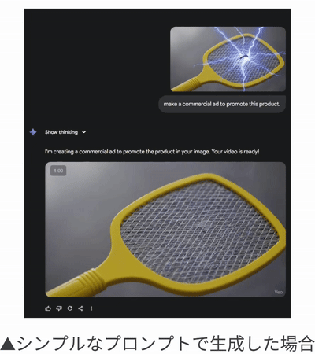

そこで気づいたのです。最適なプロンプトを段階的に構築するAIエージェントシステムが必要だと。

さらに、各エージェントにペルソナと表情豊かなアバターを実装しました。  
待機中、思考中、会話中、それぞれ異なる表情を見せます。

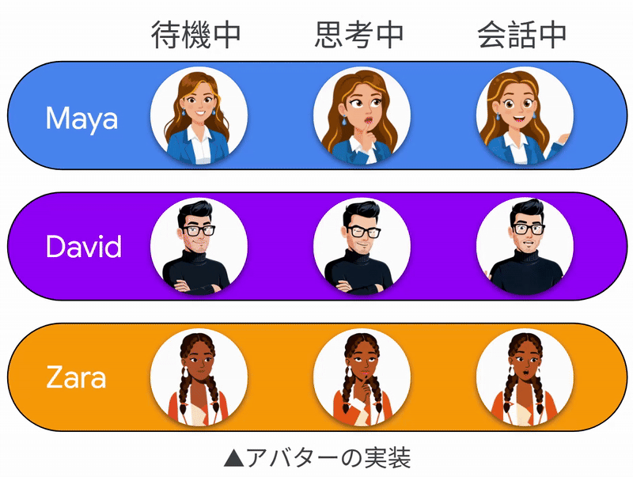

結果、ユーザーは本物の専門家チームと対話しているような体験を得られるようになりました。

##  背景・課題

現在の商品プロモーション動画制作には以下の課題があります：

**💰 高いコスト**

>   * プロの動画制作会社への依頼費用：1本あたり10万円〜50万円
>   * 撮影機材、スタジオレンタル費用
>   * 編集ソフトやライセンス費用
> 

**⏰ 長い制作期間**

>   * 企画・撮影・編集・納品まで2週間〜1ヶ月
>   * 修正対応による追加時間
>   * クリエイターとのスケジュール調整
> 

**🎯 品質のばらつき**

>   * 制作者のスキルレベルに依存
>   * ブランドイメージとの不一致
>   * 商品の魅力を適切に伝えられない
> 

**🔄 スケーラビリティの欠如**

>   * 大量の商品に対応するのが困難
>   * シーズン商品や新商品への迅速な対応ができない
> 

##  AdCraft AI のソリューション

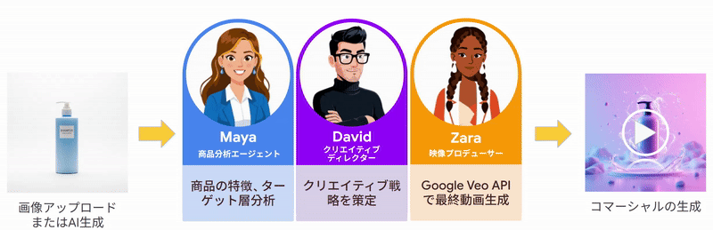

**AdCraft AI** は**マルチエージェントAIシステム** により、これらの課題を革新的に解決します：

**🤖 3つの専門AIエージェント**

>   1. **Maya（商品分析エージェント）** : 商品画像・説明から詳細な商品分析を実行
>   2. **David（クリエイティブディレクター）** : ブランド戦略と映像コンセプトを策定
>   3. **Zara（映像プロデューサー）** : Google Veo APIを活用した高品質動画生成
> 

**⚡ 革新的な制作プロセス**

>   * **デュアル入力モード** : 画像アップロードもテキストも動画生成可能
>   * **自動最適化** : 各エージェントが連携して最適な動画を生成
>   * **多言語対応** : 日本語・英語でのナレーション生成
> 

**💡 独自技術**

>   * **画像to動画生成** : 商品写真1枚から魅力的なプロモーション動画を作成
>   * **プロンプト最適化** : Gemini AIによる動画生成プロンプトの自動最適化
>   * **リアルタイム品質管理** : 生成過程での品質チェック機能
> 

##  ターゲットユーザー

**AdCraft AI** は以下のユーザー層を対象としています：

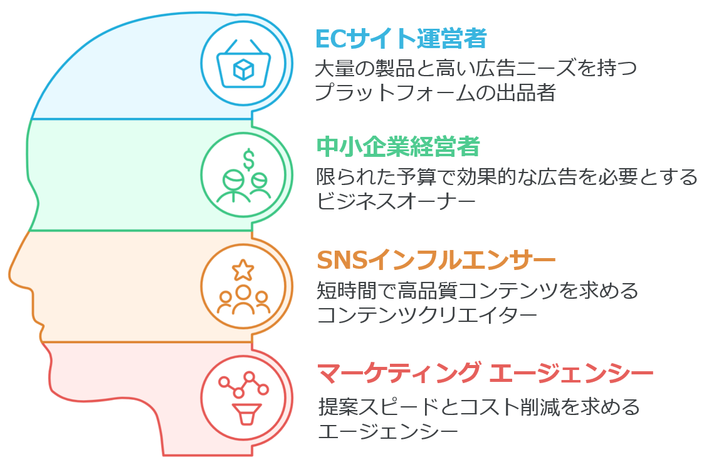

##  システムアーキテクチャ

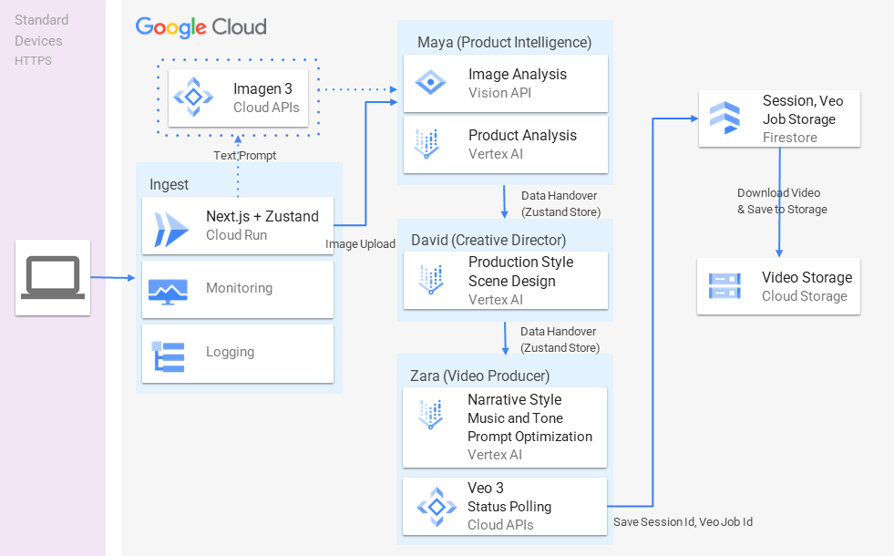

###  技術スタック

**💻 フロントエンド**

>   * **Next.js 15** (App Router) + TypeScript
>   * **Tailwind CSS** \- レスポンシブデザイン
>   * **Zustand** \- 状態管理
>   * **dictionary** \- 多言語対応
> 

**👨🏻‍💻 バックエンド・AI**

>   * **Google Vertex AI Gemini Pro Vision** \- 商品分析・画像認識
>   * **Google Veo 3 API** \- 高品質動画生成
>   * **Google Imagen API** \- テキストから画像生成
> 

**🧱 インフラ**

>   * **Google Cloud Run** \- コンテナベースデプロイメント
>   * **Google Cloud Storage** \- 動画・画像保存
>   * **Firestore** \- リアルタイムデータベース
> 

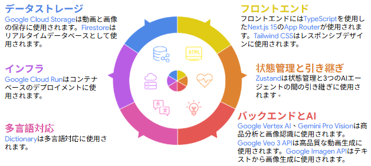

###  マルチエージェント動作フロー

##  主要機能

###  1\. インテリジェント商品分析（Maya）

>   * **商品画像認識** : Gemini Pro Visionによる高精度商品分析
>   * **特徴抽出** : 商品の形状、色、材質、用途を自動識別
>   * **ターゲット分析** : 商品特性から最適なターゲット層を提案
>   * **競合分析** : 類似商品との差別化ポイントを特定
> 

###  2\. クリエイティブ戦略立案（David）

>   * **ブランドポジショニング** : 商品の市場での位置づけを分析
>   * **映像スタイル選択** : 商品に最適な映像表現手法を提案
>   * **ナラティブ構成** : 8秒で効果的に商品の魅力を伝える構成を設計
>   * **音楽・色彩選択** : ブランドイメージに合った音響・視覚要素を選定
> 

###  3\. 高品質動画生成（Zara）

>   * **プロンプト最適化** : Gemini AIによるVeo 3向けプロンプトの自動最適化
>   * **リアルタイム生成** : Google Veo 3 APIでの高品質動画生成  
>  ?- **品質管理** : 生成動画の品質チェックと自動再生成
>   * **フォーマット最適化** : SNS各プラットフォーム向けの最適化
> 

##  技術的な挑戦と解決策

###  1\. Veo APIの制限

**課題** :

  * Veoは8秒までの動画しか生成できない
  * 複雑な日本語音声指示がVeo生成を失敗させる

**解決策** :

  * ワンシーン・ハイインパクト構成にプロンプトを最適化
  * 英語プロンプトに最適化

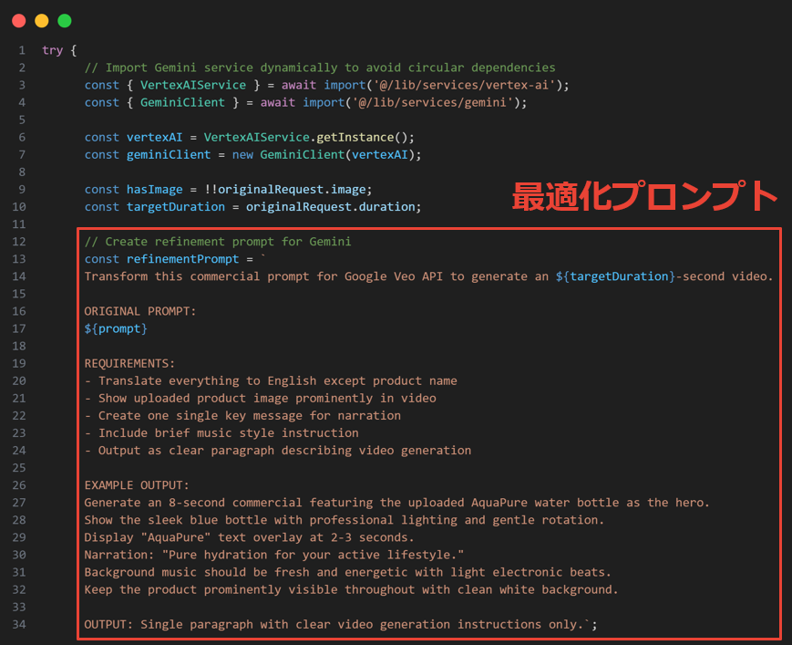

###  2\. 複雑なジョブID管理

**課題** :

  * Veo APIは非同期処理のため、ジョブIDのポーリング管理が複雑
  * VeoのジョブIDはバックスラッシュ(`/`)が入っているため、ルーティングが崩れる

**解決策** :

  * 状態管理システムを設計し、ユーザーへのリアルタイム進捗表示を実現
  * カスタマイズしたジョブIDを実装

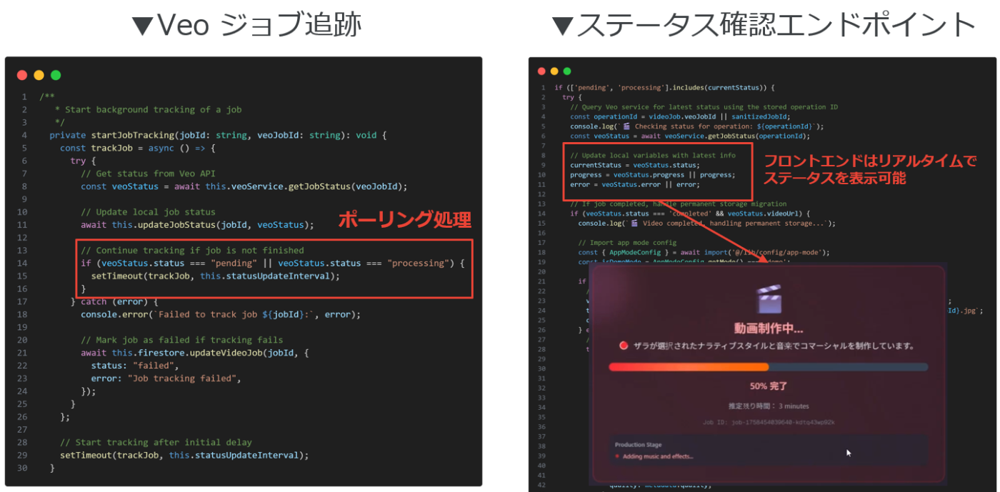

###  3\. Gemini利用のコスト

**課題** : 開発中頻繁にGemini APIを呼び出すため、コストがかかる

**解決策** :

  * **デモ/リアルモード二重実装** : 機能開発時は低コストなデモモードで迅速に検証し、承認後にリアルモードに同期展開
  * **ゼロコスト開発環境** : デモモードでの完全な機能テストにより、AI APIコストを発生させずに開発・デバッグを実現
  * **段階的実装戦略** : 核心機能から順次実装し、予算とスケジュールに応じて機能範囲を調整

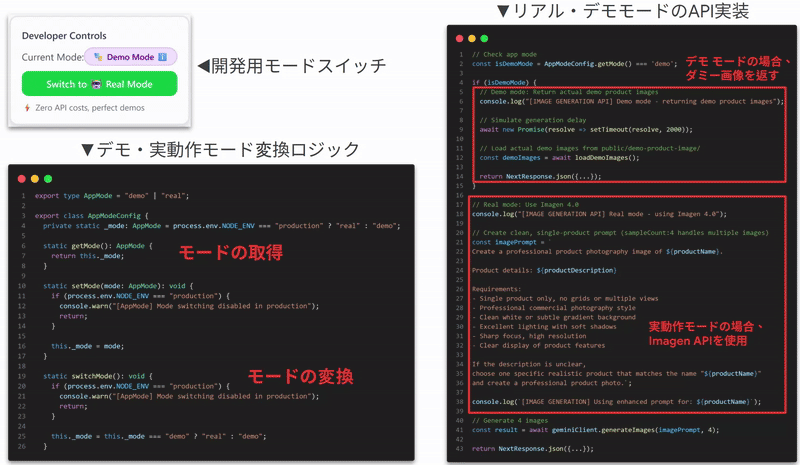

##  重要な学び

###  AIモデルの変動に強い設計が必須

ハッカソン期間中、使用していたモデルが廃止され、404エラーを返しました。  
新モデルへ移行しても、トークン数閾値の超過やJSONパースの失敗に直面。  
特にAdCraft AIみたいなAIネイティブなアプリケーションは対策必須だと痛感しました。

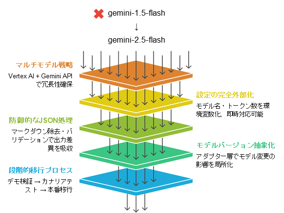

###  UX設計がユーザー継続率を左右する

次のステップが不明瞭だと、ユーザーは即座に離脱してしまいます。  
ボタンの色付けと強調、自動スクロール、テキストボックスのオートフォーカスなど、  
細部へのこだわりがユーザー体験の質を決定します。

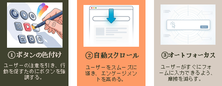  
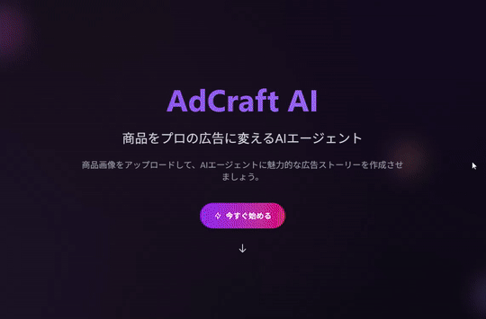

##  今後の展望

誰でも、どこでも、プロフェッショナルな商業ビデオを作れる世界

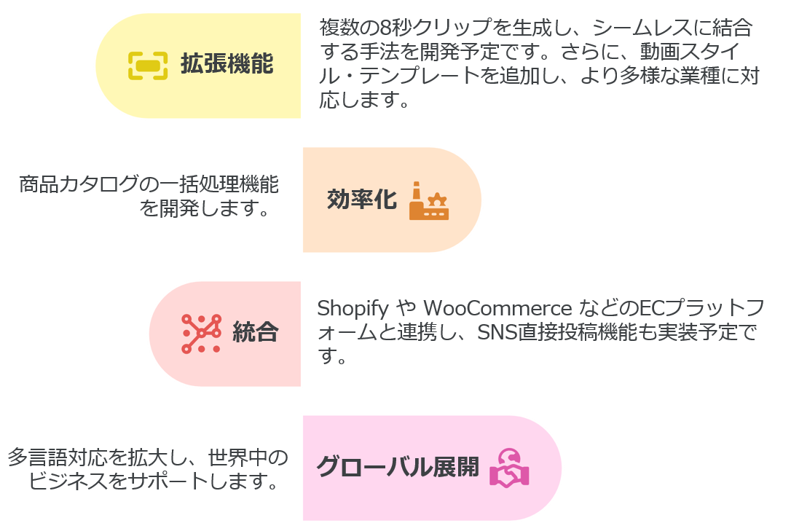

##  🏆 AI Agent Hackathon 2025での挑戦

このプロジェクトは**AI Agent Hackathon 2025** において、以下の技術的挑戦に取り組みました：

###  マルチエージェント協調

  * 異なる専門性を持つAIエージェントの効果的な連携
  * エージェント間でのコンテキスト保持と情報継承
  * 人間のクリエイティブワークフローの忠実な再現

###  最新AI技術の統合

  * Google Veo 3による最先端動画生成技術の活用
  * Gemini Pro Visionによる高精度画像理解
  * リアルタイム品質制御システムの構築

###  実用性の追求

  * 実際のビジネス課題解決への焦点
  * スケーラブルなアーキテクチャ設計
  * ユーザビリティを重視したインターフェース

##  おわりに

**AdCraft AI** は、AI技術の力で動画制作の民主化を実現するプラットフォームです。マルチエージェントシステムにより、従来の動画制作における時間・コスト・品質の課題を同時に解決し、誰もが高品質な商品プロモーション動画を簡単に作成できる未来を創造します。

このプロジェクトを通じて、AIエージェント技術の可能性と、実際のビジネス課題解決における価値を実証できたと考えています。今後も技術の進歩とユーザーニーズに合わせて、より良いプロダクトへと進化させていきます。

* * *

**技術詳細や実装について詳しくお聞きしたい方は、お気軽にお声がけください！**
