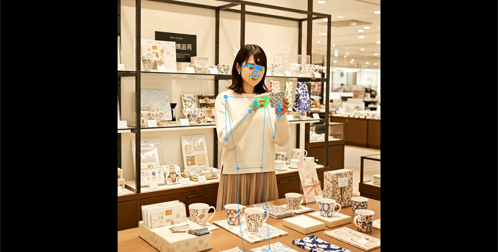
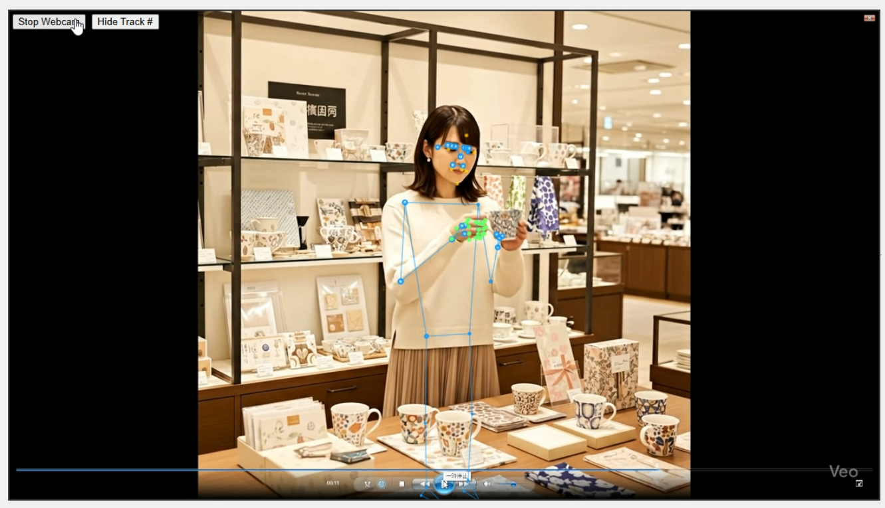
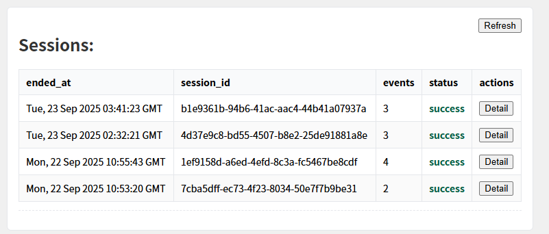
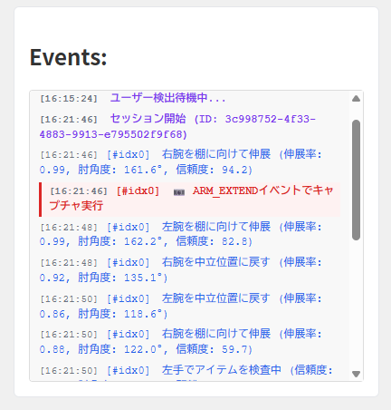
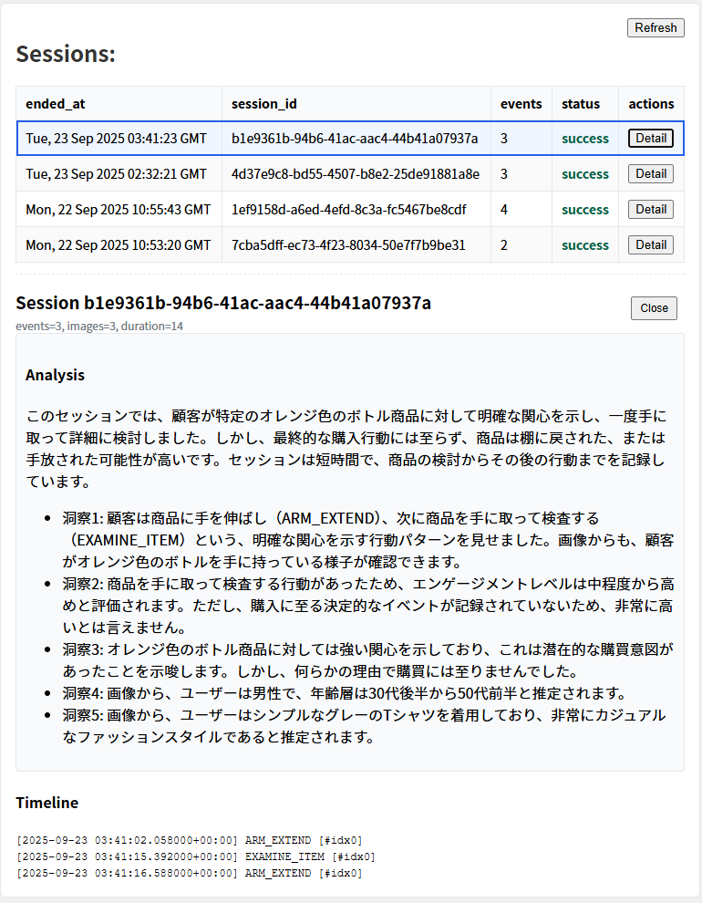

#  1\. プロジェクト概要（ユーザー像・課題・ソリューション）

##  対象ユーザー

  * **小売・百貨店・専門店の現場担当者**  
店舗の売場改善や商品配置の最適化に取り組む方
  * **マーケティング・データ活用部門**  
店舗のリアルな顧客行動データを分析し、意思決定に役立てたい方

##  課題

  * オンラインでは「クリック・スクロール・滞在時間」まで高解像度で分析可能だが、リアル店舗では「入店数・滞留時間」程度の低解像度なデータしか取れない
  * **どの商品に興味を持ち、手に取ったか、それはどんな人だったか** を把握できず、売場改善の打ち手が不明瞭

###  ソリューション「Genba Insight」

  * WebカメラとPCだけで稼働するシンプル導入
  * リアルタイム姿勢推定により「手を伸ばす」「商品を確認する」などの動作を自動認識
  * Geminiによる包括分析で、セッション終了時に顧客行動を自然言語要約＋数値化
  * BigQuery連携により、Looker StudioやTableauでのダッシュボード分析も可能
  * プライバシー保護・低コスト設計（画像は即時破棄、構造化データのみ保存）

* * *

#  2\. システムアーキテクチャ図

> 特徴：エッジAIで姿勢検知 → イベント化 → Geminiで包括分析 → BigQueryでデータ活用

* * *

#  3\. 技術解説

Genba Insightの中核は 「ブラウザ内AI推論」 と 「イベント駆動型のサーバ通信」 にあります。

##  クライアントサイド

  * **MediaPipe Pose/Hands** を利用し、骨格・手のランドマークをリアルタイムで検出
  * 定義済みのイベント（例: ARM_EXTEND, EXAMINE_ITEM, BROWSE_ITEMS）をロジックで判定
  * イベント検出時のみ、静止画＋メタデータをバックエンドへ送信
  * デフォルトでは映像・画像は保存せず、デバッグ時のみ「?saveImg=1」パラメータで保存可能

##  バックエンド

  * **Flask API** （本番は**Cloud Run** に構築）
  * 受信データをインメモリで処理し、セッション終了時に Gemini (gemini-2.5-flash) へ送信
  * 分析結果をBigqueryへ格納、さらにフロントへ返却

##  分析基盤

  * **BigQuery** への連携を前提に設計
  * 分析結果（例: セッションID、イベント種別、滞留時間など）をSQLやBIツールで多角的に活用可能

##  技術的な特徴

  * コスト効率: 常時ストリーミングせず「イベント発火時のみ通信」→ 動画をストリーミングするコスト99%以上削減
  * パフォーマンス: AI推論をブラウザで実行 → ネットワーク遅延に左右されないUX
  * プライバシー: 映像はメモリ内で破棄 → 個人情報リスクを最小化
  * スケーラビリティ: 軽量リクエスト設計により Cloud Run で容易に水平拡張可能

* * *

#  4\. Genba Insight紹介デモ動画

<https://youtu.be/LSTf1DVaA8c>  
内容：

  * Webカメラだけで棚前行動を検知
  * 顧客が「立ち止まる→手を伸ばす→商品を確認」する流れをイベント化
  * セッション終了後(ユーザーがカメラから消えて2秒後)にGeminiが分析し、ユーザー行動のインサイトを生成

* * *

#  5\. 使い方と見方

##  5.1 初期画面の設定をURLクエリパラメータで設定

  * ページを開くと自動でカメラが起動し(?autoCam=1)、リアルタイム映像と骨格ランドマークが表示されます。
  * 複数人がフレームに映った場合はマルチ対応(?multi=1)により人物ごとに別セッションとして管理されます。  
※そのほかにも様々なパラメータを提供しています。

##  5.2 映像エリア

  * 映像プレビューの上に骨格や手のランドマークが重畳されます。

  * 検出された人物ごとに Track ID が割り当てられます。  

  * イベントが発生すると、例えば「ARM_EXTEND（腕を伸ばす）」や「EXAMINE_ITEM（商品を手に取る）」などが画面(Eventsパネル)にリアルタイム表示されます。

##  5.3 パネルエリア

###  Sessions パネル

検知された顧客ごとにセッションが一覧化されます。  
各行には session_id, ended_at, events, status が表示され、終了直後は runnning → Gemini分析完了後に success に変わります。  

###  Events パネル

セッションごとの時系列イベントが表示されます。  
  
行動の流れをタイムライン形式で確認可能です。

##  5.4 分析結果ビュー

セッション終了後(ユーザーがカメラから消えて2秒後)、Geminiが自動で分析を実施します。  
数秒後に status = success となり、自然言語による要約と滞留時間やイベント回数などの定量情報が返却されます。  

##  5.5 パラメータでの調整

URLのクエリで挙動を制御できます。

パラメータ | 既定値 | 許容値/範囲 | 目的/意味 | 備考  
---|---|---|---|---  
`camera_name` | `camera` | 1〜128文字の文字列 | カメラ識別名（固定設置/マルチカメラ用） | URLから読み取り。空/未指定は`camera`。前後空白はtrimし128文字に切詰め。イベント/セッション/分析結果/BigQueryに保存  
`multi` | 0 | 0 or 1 | マルチ人物モードの有効化 | 1で人物ごとに独立セッション。  
`track` | 1 | 0 or 1 | 簡易トラッキング（最近傍）の有効/無効 | 主にマルチ人物時にON推奨  
`trackTTL` | 800 | 200–3000(ms) | 再検出が途切れてからトラックを破棄するまでの時間 | 遮蔽耐性と残像のトレードオフ  
`trackMaxDist` | 0.2 | 0.02–0.6 | 再割当の最大距離（正規化） | 大きいと維持しやすいが誤割当増。通常0.15–0.25  
`startSnap` | 0 | 0 or 1 | セッション開始スナップの取得 |  `warmFrames`と併用推奨  
`autoCam` | 0 | 0 or 1 | ライブラリ初期化後にカメラ自動開始（デモ用） | 失敗時はUIでワンクリック開始にフォールバック  
`warmFrames` | 0 | 0–120 | 連続検出フレーム数を満たしてから初回スナップ | 5–15が目安（環境依存）  
`maxPoses` | 2 | 1–10 | 複数人物検出の最大人数（フォールバック時） | Holistic不可時に有効  
`maxHands` | 4 | 1–10 | 検出する手の最大数（フォールバック時） | Holistic不可時に有効  
`saveImg` / `debugSave` | 0 | 0 or 1 | 受信画像をディスクへ保存（デバッグ用途） | 既定は保存しない  
`session_panel` | 1 | 0 or 1 / true or false | Sessions パネルの表示/非表示を切替 |  `0/false` で非表示  
`events_panel` | 1 | 0 or 1 / true or false | Events パネルの表示/非表示を切替 |  `0/false` で非表示  
  
* * *

#  6\. まとめ

**Genba Insight** は、オンラインとオフラインの分析ギャップを埋め、店舗での「リアルなコンバージョン」を可視化する革新的なリテール分析アプリです。  
**特別なハード不要・低コスト・プライバシー配慮** を特徴に、実店舗のデータドリブン経営を加速します。
