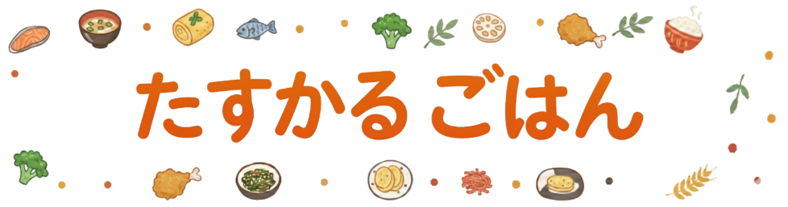
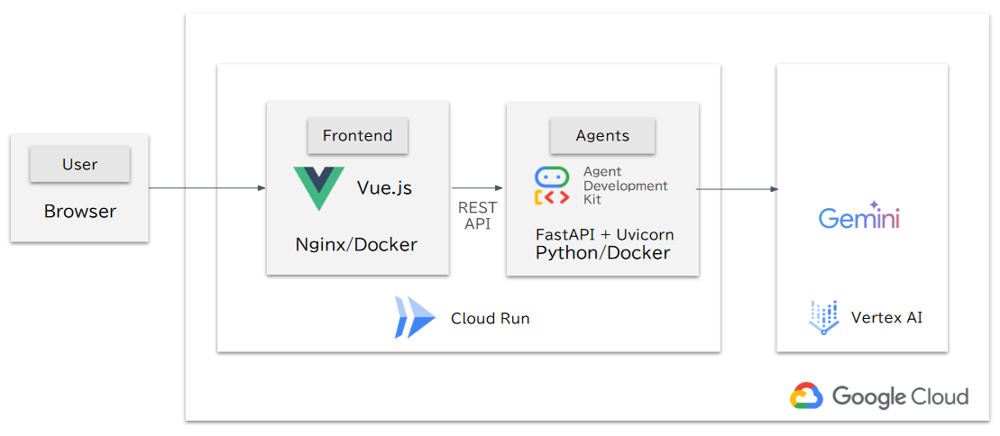
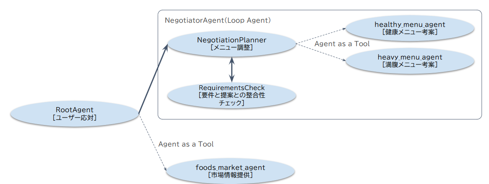

##  ハッカソン提出「たすかるごはん」紹介

#  背景：日本の健康寿命と食生活の課題

「健康寿命」という言葉をご存知でしょうか。これは、健康上の問題で日常生活が制限されることなく生活できる期間を指します。2022年の日本において、平均寿命と健康寿命の間には、**男性で約8.49年、女性で約11.63年** もの差が存在します。この期間をいかに短くし、誰もが長く健康でいられる社会を築くかが、現代日本の大きな課題です。

健康寿命の延伸は、個人の生活の質（QOL）向上はもちろん、社会全体の活力にも繋がります。増え続ける国民医療費（2022年度で約46.7兆円）の中で、国庫が負担する割合は約25.7%にのぼり、病気を未然に防ぐ「予防医学」の重要性が叫ばれています。

健康に影響を及ぼす三大習慣として「食事」「運動」「喫煙」が挙げられますが、私たちはその中でも特に、多くの人が毎日必ず向き合う「**食事** 」に着目しました。

##  現役世代が抱える自炊のジレンマ

日々の生活で、多くの社会人が健康と食費節約のために自炊を選択しています。調査によると、**自炊をする理由の第一位は「食費節約のため」(56.79%)** であり、特に女性では次いで「健康のため」(26.1%) が多く挙げられています。

しかし、その実態は理想とはほど遠いものです。

  * **栄養バランスの偏り** : 多くの人が自身の食生活に偏りを感じています。実際、成人の1日あたりの野菜摂取量の平均は約280gであり、目標の350gに大きく届いていません。また、塩分摂取量も1日あたり平均約10.1gと、目標値（男性7.5g未満、女性6.5g未満）を大幅に上回っています。
  * **時間とスキルの壁** : 仕事で疲れて帰宅した後、食事作りに多くの時間はかけられません。さらに、調理スキルや自信の欠如も大きな障壁となっています。実際に、**一人暮らしを始める新社会人の78.2％が食生活に不安を感じる理由として「自炊をしたことがないから」と回答** しています。スキルが不足していると、メニューがマンネリ化しがちです。
  * **自炊疲れと悪循環** : 同じようなメニューに飽きると、結局は美味しさや手軽さが優先されがちな外食や中食に頼ってしまいます。すると、使い切れなかった食材が無駄になり、かえってコストがかかるという悪循環に陥ることも少なくありません。

私たちは、この「**忙しい中で節約や健康のために自炊をしたいが、スキルや時間の制約で続かず、結果的に不健康な食生活に陥ってしまう** 」という現代社会人のジレンマを解決したいと考えました。

#  私たちのソリューション：「たすかるごはん」

そこで私たちが開発したのが、マルチAIエージェントによる食事メニュー提案Webアプリ「たすかるごはん」です。

「たすかるごはん」は、忙しい毎日の中でも、無理なく、美味しく、そして健康的な食生活を続けられるようサポートすることを目指します。

##  デモ動画

<https://youtu.be/cXZnHFTJrYo>

#  主な機能とそれを支える技術

##  旬の食材を賢く活用

旬の食材は栄養価が高く、安価に手に入ることが多いというメリットがあります。「たすかるごはん」は、農林水産省の市況データを参照する**市場情報提供エージェント: foods_market_agent** を搭載。今、価格が手頃になっている旬の食材を特定し、それらを使ったレシピを提案することで、食費を抑えながら季節感あふれる食卓を実現します。

##  AIエージェントの合議制による、健康と満足度の両立

自炊を長続きさせるには、健康だけでなく「美味しさ」や「満足感」も不可欠です。「たすかるごはん」では、複数の専門AIエージェントが協力してメニューを考案します。  
**健康志向メニューエージェント (healthy_menu_agent)** : 栄養バランスを最優先に考えたメニューを提案します。  
**味/ボリューム満足メニューエージェント (heavy_menu_agent)** : 時には食べ応えのある「がっつりメニュー」など、食事の楽しみや満足感を重視したメニューを提案します。  
**交渉エージェント (negotiator_agent)** : 両者の意見を調整し、健康と満足度のバランスが取れた、ユーザーが「これなら続けたい」と思える最適なメニューを最終決定します。

##  時短とスキルアップを両立するレシピ提案

調理法を考慮できるエージェントが、ユーザーのスキルレベルや調理時間に合わせた最適なレシピを提案。これまで挑戦したことのなかった食材や調理法にも気軽にトライでき、日々の料理体験を豊かにします。

#  システム構成

本システムは、フロントエンドにVue.js、バックエンドにPython FastAPI + Agent Development Kitを使用し、Google Cloud Run上で動作。中心的なAI機能はVertex AIを活用して構築しています。  

##  処理フローの概要

ユーザーからのメッセージは、以下の流れで処理され、最終的なメニューが提案されます。

  1. **API Gateway (api.py)** : フロントエンドからのリクエストを受け付け、root_agent を呼び出します。
  2. **司令塔 (root_agent)** : ユーザーとの対話を通じて、食事の好みや要望をヒアリングし、必要に応じて市場の旬な食材情報を収集します。
  3. **交渉と合議 (negotiator_agent)** : root_agent から受け取った要望を基に、専門家エージェント間でメニュー案の交渉と合議を行います。
  4. **最終提案** : 合議によって決定された最適なメニュー案が root_agent に返却され、ユーザーに分かりやすい形で提示されます。

##  主要エージェントの役割

  1. **root_agent (agent.py)**  
ユーザーとの対話の起点となる司令塔エージェントです。主な役割は以下の通りです。

  * **ユーザーの要望ヒアリング** : 人数、食事の傾向（ヘルシー/ガッツリ）、調理スタイル、希望ジャンルなどをヒアリングし、設定を管理します。
  * **ツール（Tools）の活用** : 
    * set_user_preferences: ユーザーの好みを設定・保存します。
    * foods_market_agent: 旬の食材情報を市場データから取得します。
  * **専門エージェントへの委任** : 収集した情報を基に、後述する negotiator_agent に具体的なメニュー作成を委任します。

  2. **negotiator_agent (negotiator_agent.py)**  
root_agent から委任を受け、複数の専門家エージェントによる合議を進行する交渉役エージェントです。このエージェントは LoopAgent として実装されており、最適なメニュー案が見つかるまで以下のプロセスをループ実行します。

##  loop_agent による合議の仕組み

negotiator_agent は、内部に2つのサブエージェント（NegotiationPlannerAgent と RequirementsCheckAgent）を保持しており、これらが連携することで合議制を実現しています。

###  提案フェーズ (NegotiationPlannerAgent):

healthy_menu_agent: 栄養バランスを最優先に考えた健康志向のメニューを提案します。  
heavy_menu_agent: 食事の楽しみや満足感を重視した、食べ応えのあるメニューを提案します。  
NegotiationPlannerAgent は、上記2つのエージェントからそれぞれメニュー案を収集し、一つのプランにまとめます。

###  評価・判定フェーズ (RequirementsCheckAgent):

RequirementsJudgeAgent を用いて、healthy と heavy の両案がユーザーの要望をどの程度満たしているかを評価します。

評価の結果、要望を満たす案があれば、それを最終的なメニューとして採択し、ループを終了します。  
どちらの案も要望を満たさない場合は、再度提案フェーズに戻り、より良いメニュー案の作成が試みられます。（このループは最大4回まで）  
このように、異なる視点を持つ複数のAIエージェントがそれぞれの専門知識を活かして提案を行い、それを別のエージェントが客観的に評価・判断するという「合議制」の仕組みによって、ユーザーの多様なニーズに応えるバランスの取れたメニュー提案を実現しています。

#  今後の展望

「たすかるごはん」の今後、以下の機能強化があるとより効果的と考えます

  * **メニューの履歴管理:** 過去のメニューの履歴を管理することで、旬なメニューの被りを防止し、レパートリーを提供します。
  * **調理法の高精度化** : 美味しく作るためのコツや科学的な調理理論などを、RAG（Retrieval-Augmented Generation）を用いてメニュー提案AIに組み込み、レシピの質をさらに向上させます。
  * **栄養管理のパーソナライズ化** : 日本食品標準成分表や厚生労働省の食事摂取基準データと連携し、個々のユーザーの健康状態や目標に合わせた、より高精度な栄養管理機能を提供します。

私たちは「たすかるごはん」を通じて、誰もが自炊のハードルを越え、楽しみながら健康的な食生活を送り、ひいては日本の健康寿命延伸に貢献することを目指します。

#  出典一覧

  1. **平均寿命と健康寿命の差**
     * **数値** : 男性で約8.49年、女性で約11.63年の差
     * **出典** : 厚生労働省「健康寿命の令和4年値について」（令和6年公表データに基づく）  
<https://www.mhlw.go.jp/content/10904750/001363069.pdf>
       * 平均寿命（2022年）：男性 81.05歳、女性 87.09歳
       * 健康寿命（2022年）：男性 72.57歳、女性 75.45歳
  2. **国民医療費**
     * **数値** : 約46.7兆円（2022年度）
     * **出典** : 厚生労働省「令和４(2022)年度 国民医療費の概況」  
<https://www.mhlw.go.jp/toukei/saikin/hw/k-iryohi/22/dl/data.pdf>
  3. **国民医療費における国庫負担割合**
     * **数値** : 約25.7%
     * **出典** : 公益社団法人全日本病院協会「みんなの医療ガイド - 医療費の仕組み」  
<https://www.ajha.or.jp/guide/1.html>
  4. **自炊をする理由**
     * **数値** : 「食費節約のため」が56.79%、「健康のため」（女性）が26.1%
     * **出典** : Freeasy社運営メディア「HINT」掲載「自炊に関するアンケート結果」  
<https://hint.freeasy-survey.com/articles/16>
  5. **野菜摂取量および食塩摂取量**
     * **数値** : 野菜摂取量 約280g（目標350g）、食塩摂取量 約10.1g（目標 男性7.5g未満/女性6.5g未満）
     * **出典** : 厚生労働省「令和元年 国民健康・栄養調査報告」  
<https://www.mhlw.go.jp/content/10900000/000687163.pdf>
  6. **調理スキルに関する不安・意識**
     * **数値** : 新社会人の78.2%が食生活に不安を感じる理由として「自炊をしたことがないから」と回答
     * **出典** : カゴメ株式会社「新社会人への新生活での不安と 食生活に関する調査」  
<https://www.kagome.co.jp/library/company/news/2016/img/160405001.pdf>

