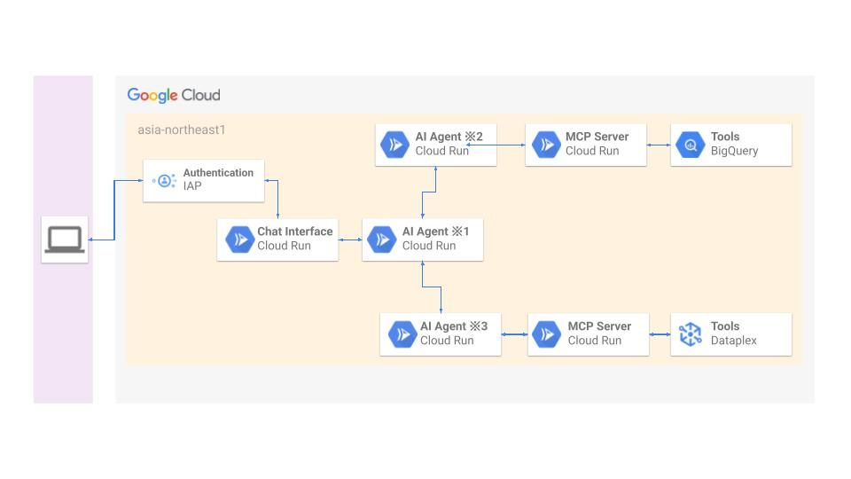

##  デモ動画

<https://www.youtube.com/watch?v=ybMR-SOQqpk>

##  はじめに

デジタル変革（DX）が加速する現代において、データは企業の最も重要な資産の一つとなっています。しかし、多くの企業がデータ活用を推進する際に、データガバナンスという大きな壁に直面しています。そこで、最新のAIエージェント技術であるA2A（Agent-to-Agent）とMCP（Model Context Protocol）を活用し、Google Cloud上でデータガバナンスを自動化するマルチエージェントシステムを構築しました。

##  課題

DXを推進し始める、またはDXを推進していると以下のような課題が出てくるのではないでしょうか。

  * データ活用するための土台ができていない
  * データ活用しているが保有しているデータを把握しきれていない
  * データ活用したものの想定した成果が出ない

[Gartner社](https://www.gartner.co.jp/ja/newsroom/press-releases/pr-20240129)の調査では日本企業の約6割がデータ活用の組織体制が整っておらず、データ活用し始めている日本企業でも97%は十分な成果を上げられていないと感じています。実際のところ、企業が扱うデータを整備している担当者だったとしても、今ほしいデータを迅速に抽出、分析するのが難しい状態であったりするのも珍しくないと思います。

また、[PR TIMES社](https://prtimes.jp/main/html/rd/p/000000182.000058707.html)の調査では約3割の企業が「DX進捗は全体的にまだ不十分」と回答していることから、データを正しく、安全に、価値あるものにするためのルール作りと管理が不十分であることがわかります。

AI時代に突入した昨今、AIを最大限に活用するには「コンテキスト」が重要だと耳にすることがありますが、そのコンテキストを適材適所で活用できる環境を整えるには、保有しているデータを把握していることが前提となります。

これらのようにデータ活用をするうえで、フェーズごとに様々な課題を抱えることになります。そういった課題を迅速に解決し続け、想定した成果につなげていくことが急務となっています。

データエンジニアである自身も、データガバナンスの必要性を痛感しながらも、日々の業務に追われる中で手動作業の負荷から後回しになりがちな現実に直面しており、この課題意識が本システム開発のきっかけとなりました。

##  対象ユーザー

業界は関係なく、データを活用するための仕組み・ルール・体制を整える（データガバナンス）方に向けた内容になります。主にエンジニア経験のある方を想定しておりますが、クラウド(本記事はGoogle Cloud)の知見がある非エンジニアの方も対象としています。

  * データガバナンス担当者
  * データエンジニア
  * データアナリスト
  * MLエンジニア
  * IT管理者・システム管理者

##  主要機能

BigQueryテーブルのメタデータとテーブルの品質チェックに焦点を当てた機能を搭載しています。

  * メタデータ不足の自動検出: 説明や論理名が不足しているBigQueryテーブルを特定
  * AIによる自動提案: BigQueryのテーブル名とスキーマから適切な論理名・説明を生成
  * ガバナンススコア算出: 総合的なBigQueryテーブルのデータ品質評価
  * データ品質ルール提案: 統計情報に基づく品質チェック設定
  * マルチエージェント連携: 専門エージェントによる協調分析

MCPサーバーにメタデータ追加、更新、削除系のツールも追加しようか検討しましたが、大抵はテーブルのメタデータもコード管理しているかと思います。その状況を考慮するとこのシステムでは提案まで行い、反映は担当者が行うといった棲み分けをした方が現状の運用に影響を与えることなく導入できると考えました。

##  アーキテクチャ

  
マイクロサービス構成でCloud Run (Debian12、Python3.12)を使用しています。

  * Cloud Runの役割: 使用サービス名
  * Chat Interface: Chainlit
  * AI Agent ※1~※3: Google ADK + FastAPI
  * MCP Server: Google ADK + FastAPI (FastAPI-MCP)

なお、※1は親エージェント、※2、※3は子エージェントA、Bと称します。

###  Cloud Runと周辺サービス

Chatインターフェイスでは認証・認可にIdentity-Aware Proxy(IAP)を使用し、Cloud Runサービス間の認証はOIDC、認可はIAMを使用しています。Cloud Runのインスタンスは全てリクエスト課金に設定しており、初回起動のランタイムでタイムアウトする可能性を考慮し、子エージェントとMCPサーバーのみ最小インスタンス数を1に設定しています。なお、VPC Service Controlsでサービス境界を構築しているので、Chatインターフェイスサービス以外は内部ネットワークを使用するよう統一しています。今回はハッカソン用にドメインを用意し、Cloud Runのドメインマッピングを使用してハッカソン用ドメインをChatインターフェイスにマッピングしています。  
※デモサイト公開中は必ずunknownユーザーとなるようにしています

###  エージェントとMCPサーバー

基本的には親エージェントがプロンプトによってどちらかの子エージェントとA2A、子エージェントとMCPサーバー間はMCPで連携し、最終的には親エージェントが端的にまとめた回答をユーザーに返します。ただし、親エージェントが「データ品質ルール提案」のプロンプトと判断した場合に、子エージェントA、Bとシーケンシャルに連携します。なお、子エージェントはMCPサーバーと連携する前に意図しない動作をしないよう、ガードレールを設けています。今回はエージェントでInMemorySessionServiceを使用しており、親エージェントは履歴を追えるようにしてますので、より対話形式で作業を進めていけるようになっています。

###  A2A（Agent-to-Agent）

A2Aでエージェント間の連携をしていますが、標準化に準拠するために必要だった実装ポイントをまとめました。

  1. 階層構造による役割分担

    
    
    親エージェント
    ├── 子エージェント A
    └── 子エージェント B
    

  2. 4つの設計原則

  * 専門化（Specialization）: 各エージェントが特定領域に特化
  * 自律性（Autonomy）: 独立したサービスとして動作
  * 協調性（Collaboration）: 親エージェントによる調整
  * 拡張性（Scalability）: 新エージェント追加が容易

  3. 認証付きHTTPS通信（OIDC）

    
    
    token = self.auth_service.get_identity_token(target_agent_url)
    headers = {
        "Authorization": f"Bearer {token}",
        "Content-Type": "application/json"
    }
    

  4. 標準化されたメッセージ形式（json）

    
    
    {
      "message": "分析対象のユーザーメッセージ",
      "session_id": "セッション識別子",
      "user_id": "ユーザー識別子"
    }
    

###  MCP（Model Context Protocol）

MCPでエージェント、MCPサーバー間の連携をしていますが、標準化に準拠するために必要だった実装ポイントをまとめました。

  1. 3層構造

    
    
    AIエージェント → MCPサーバー → BigQuery, Dataplex
    

  2. 標準プロトコル準拠

  * JSON-RPC 2.0ベースの通信
  * OpenAPI仕様による標準化
  * FastAPI MCPフレームワーク活用

  3. ツール定義の標準化

    
    
    @router.post("/datasets", operation_id="get_bigquery_datasets")
    async def get_bigquery_datasets(request: dict) -> str:
        """BigQueryデータセット一覧取得"""
        return await bigquery_service.get_datasets(project_id)
    

  4. ガードレール  
子エージェントがユーザーの期待していない動作をしないよう、Function Calling前にガードレールを用意しています。

    
    
    def security_guardrail(self, tool: BaseTool, args: Dict[str, Any]):
        # 本番環境での危険なproject_id制限
        restricted_projects = ["production-critical", "financial-data"]
        if args.get("project_id") in restricted_projects:
            return {"error": "プロジェクトへの操作は制限されています"}
    

###  CI/CD

デプロイフローについてですが、GitHub ActionsでArtifact Registryにイメージpush、その後Cloud Runデプロイの順に実行しています。

##  ビジネス価値の定量化

実際にこのシステムが実務でどれだけの価値を見出せるか、定量的に考察してみました。今回はデータ活用を開始できてはいるが、データガバナンスが行き届いていないと感じでいる企業をモデルとして計測していきます。

###  対象企業プロファイル

  * データ担当者: 2名（専任1名 + 兼任1名）
  * BigQueryテーブル数: 300テーブル
  * 年間新規テーブル: 50テーブル
  * メタデータ不足テーブル: 80テーブル
  * 品質ルール未設定テーブル: 120テーブル
  * 初回は全300テーブルのスコアリングをしたい

###  工数削減効果（機能別）

  1. メタデータ不足検出・修正

    
    
    【従来】
    - 手動メタデータチェック: 15分/テーブル
        - テーブル構造確認: 3分
        - 既存ドキュメント確認: 4分
        - 関連システム調査: 5分
        - 記録・報告: 3分
    - 論理名・説明文作成: 40分/テーブル
        - 業務ヒアリング: 15分
        - ドキュメント作成: 20分
        - レビュー・修正: 5分
    - 全テーブルチェック: 15分 × 300テーブル = 4,500分（75時間）
    - 不足分の修正: 40分 × 80テーブル = 3,200分（53.3時間）
    - 合計: 7,700分（128.3時間）
    
    【AI支援後】
    - 手動メタデータチェック: 8分/テーブル
        - AI分析結果確認: 3分
        - 手動検証: 3分
        - 記録: 2分
    - 論理名・説明文作成: 25分/テーブル
        - AI提案確認: 10分
        - 修正・調整: 10分
        - 最終検証: 5分
    - 自動検出 + 確認: 8分 × 300テーブル = 2,400分（40時間）
    - AI提案の修正: 25分 × 80テーブル = 2,000分（33.3時間）
    - 合計: 4,400分（73.3時間）
    
    削減効果: 55時間/年
    

  2. 新規テーブルの品質管理

    
    
    【従来】
    - 品質ルール設計: 75分/テーブル
        - データ分析: 30分
        - ルール設計: 30分
        - テスト・検証: 15分
    - 品質ルール設計: 75分 × 50テーブル = 3,750分（62.5時間）
    
    【AI支援後】
    - 品質ルール設計: 45分/テーブル
        - AI提案レビュー: 20分
        - カスタマイズ: 15分
        - テスト: 10分
    - AI提案ベース設計: 45分 × 50テーブル = 2,250分（37.5時間）
    
    削減効果: 25時間/年
    

  3. ガバナンススコア算出

    
    
    【従来】
    - チェックリスト作成・評価: 20分 × 300テーブル = 6,000分（100時間）
    
    【AI支援後】
    - スコア確認・分析: 5分 × 300テーブル = 1,500分（25時間）
    
    削減効果: 75時間/年
    

  4. 既存テーブルの品質向上（段階的実施）

    
    
    年間対象: 30テーブル
    ※上記の品質ルール設計で算出した時間を使用しています。
    
    【従来】
    - 75分 × 30テーブル = 2,250分（37.5時間）
    
    【AI支援後】
    - 45分 × 30テーブル = 1,350分（22.5時間）
    
    削減効果: 15時間/年
    

  5. 総合削減効果

    
    
    - メタデータ不足検出・修正: 55時間/年
    - 新規テーブルの品質管理: 25時間/年
    - ガバナンススコア算出: 75時間/年
    - 既存テーブルの品質向上: 15時間/年
    
    合計削減: 170時間/年
    

新規も含めた全テーブルの品質を向上させようとした際には**170時間** も工数削減が可能であることがわかりました！担当者はこれらの業務以外にも複数業務を担っていることがほとんどかと思いますので、これだけの時間を短縮しつつ、メタデータの品質向上とデータ自体の品質チェックが行える状態になるということで、実務で活用するメリットはあると言えそうです。

###  現実的なROI計算

  1. 人件費設定

    
    
    データ担当者:
    - データエンジニア平均年収: 700万円
    - 月労働時間: 160時間
    - 実効時給: 4,400円/時間
    

  2. 年間削減効果

    
    
    【直接効果】
    - 工数削減170時間 × 4,400円 = 74.8万円/年
    
    【間接効果】
    ※間接効果は現実的に想定できる額を使用しています
    - データ品質問題による手戻り削減: 年間80万円
        - データ不整合による分析やり直し: 40万円
        - 品質問題による意思決定遅延コスト: 40万円
    - 意思決定速度向上: 年間60万円
        - メタデータ検索時間短縮: 30万円
        - データ理解時間短縮: 30万円
    - コンプライアンス対応効率化: 年間40万円
        - 監査対応時間短縮: 25万円
        - ドキュメント整備効率化: 15万円
    - データ活用促進による売上向上: 年間120万円
        - 迅速な分析による機会損失回避: 80万円
        - データ品質向上による分析精度向上: 40万円
    - 間接効果合計: 300万円/年
    
    総効果: 74.8万円 + 300万円 = 374.8万円/年
    

  3. 初期投資額

    
    
    - システム設計・開発: 280万円
        - A2A含むエージェント実装: 90万円
        - MCPサーバー開発: 80万円
        - UI/UX開発: 60万円
        - テスト・デバッグ: 50万円
    - インフラ構築: 60万円
        - Cloud Run環境設定: 25万円
        - セキュリティ設定: 25万円
        - 監視・ログ設定: 10万円
    
    初期投資額合計: 340万円
    

  4. 年間運用額

    
    
    Cloud Run運用費:
    - インフラ・ライセンス費用
        - Cloud Run利用料: 月1.5万円 × 12ヶ月 = 18万円/年
        - その他GCPサービス: 月0.8万円 × 12ヶ月 = 9.6万円/年
    - 保守・サポート費用
        - システム保守: 月2万円 × 12ヶ月 = 24万円/年
        - セキュリティ更新: 月1万円 × 12ヶ月 = 12万円/年
    - 運用人件費
        - システム管理（月5時間）: 4,400円 × 5時間 × 12ヶ月 = 26.4万円/年
    
    年間運用額合計: 90万円/年
    

  5. ROI計算結果

    
    
    【年間利益】
    3年間で先に算出した総効果へ段階的に近づいていくと想定すると...
    1年目: 総効果の60% = 224.9万円
    2年目: 総効果の80% = 299.8万円
    3年目: 総効果の100% = 374.8万円
    
    【総投資額】
    年間運用費90万円は固定とし、2年目からエージェントとMCPサーバーの追加開発費で100万円かかると仮定すると...
    ※追加開発費は現実的に想定できる額を使用しています
    1年目: 初期投資340万円 + 90万円 = 430万円
    2年目: 追加開発費100万円 + 90万円 = 190万円
    3年目: 追加開発費100万円 + 90万円 = 190万円
    
    (年間利益−総投資額)÷総投資額×100%=ROI
    1年目ROI: (224.9万円 - 430万円) ÷ 430万円 × 100% = -47.7%
    2年目ROI: (299.8万円 - 190万円) ÷ 190万円 × 100% = 57.8%
    3年目ROI: (374.8万円 - 190万円) ÷ 190万円 × 100% = 97.2%
    

1年目はROI-47.7%と大幅な赤字となり、投資回収には約2.3年を要します。初期投資340万円の負担に加え、システム習熟やデータ整備に時間を要するためです。しかし段階的な効果発現により2年目で黒字転換し、3年目には97.2%の高ROIを達成するため、投資対象としても検討できそうです。なお、間接効果や2年目以降の追加開発費を始め、各項目の金額は楽観的な側面があるため、改善の余地があるかと思います。

##  今後の展望

今回はBigQueryテーブルのメタデータとテーブルの品質チェックに焦点を当てた機能を多く実装しました。今後は以下に記載している機能を追加していき、活用するデータの精査と迅速なデータ分析や意思決定が促進できるような環境を構築していきたいと考えています。

  * Vertex AI Agent EngineのSessionServiceを使用してテーブルの改善記録と傾向の追跡
  * Agentspaceとエージェントの連携（インターフェースの切り替え）
  * BigQueryで活用されていないデータ抽出
  * BigQueryのデータの活用方法を提案
  * BigQuery以外のDBデータ抽出と分析
  * BigQueryのコスト最適化の提案（できればサービスのSKU単位の情報から提案）
  * Dataplexのゾーン、アセット取得と提案
  * Dataplexでのデータ品質スキャン実行

##  まとめ

「データガバナンス」と耳ににすると、どこか取りかかりにくい印象を受けます。この自動化システムを通して、その取りかかりにくい印象をタスクに分解しながら迅速に課題を解決していければと思いこのシステムを構築しました。データ活用という「攻め」の試行回数を増やすために、ガバナンスという「守り」を迅速に行える環境作りができれば、結果的にデータ活用で成果を上げることにつながると信じています！
