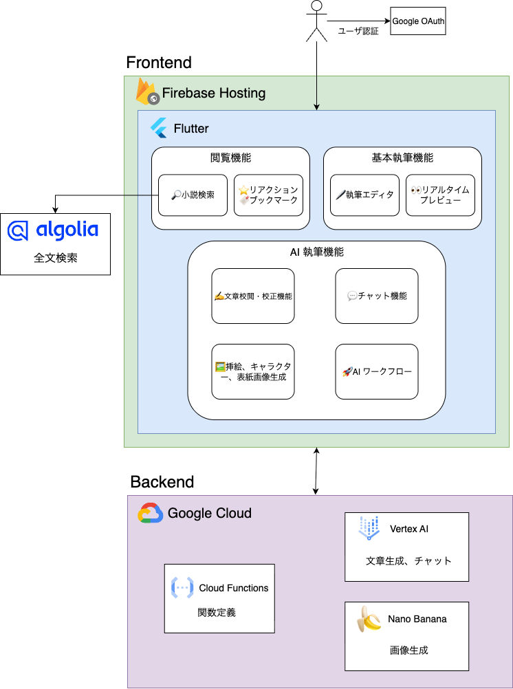

#  デモ動画 (3分)

<https://youtu.be/1vHz_Y124B8>

#  はじめに - 小説の現状について

言葉で紡がれる物語は、普遍的な魅力を持つ芸術であり、現代においても多くの人々に感動を与え続けています。娯楽が多様化した現代においても、その需要は決して衰えていません。

事実として レジャー白書2025(全国15～79歳を対象とした余暇活動調査) によると、余暇活動参加率上位5は以下の通りになっています。

順位 | 項目 | 参加率  
---|---|---  
1 | 国内観光旅行 | 48.3%  
2 | 動画鑑賞(レンタル、配信含む) | 38.1%  
3 | 外食(日常的な物を除く) | 35.6%  
4 | 読書(勉強などを除く娯楽としての) | 33.8%  
5 | 音楽鑑賞 | 33.3%  
  
※ 参加率: ある余暇活動を1年間に1回以上行った人（回答者）の割合。  
※ 娯楽項目は108種目  
※ 2024年度のランキング

このデータは、デジタルコンテンツが主流の現代においても、物語に触れる「読書」という行為が多くの人々にとって重要な娯楽であることを示しています。  
特に、アプリとして提供が難しい「国内観光旅行」や「外食」を除けば、読書は上位2位に位置し、オンライン上のエンターテイメントコンテンツとしても高いポテンシャルを秘めていると言えるでしょう。

#  このアプリについて

「Yukuri NOVEL」は、AI技術で小説が抱える様々な課題を解決するために開発された、次世代の小説投稿・閲覧プラットフォームです。  
  
「読む人も、書く人も。AIと共に。」

このコンセプトのもと、これまでにない執筆体験と読書体験を提供し、小説の多くの課題を解決します。

#  プロジェクトが対象とするユーザー像と課題

「Yukuri NOVEL」は、AIの力で全く新しい読書・執筆体験を提供します。対象ユーザーは小説の読者と作者です。

##  対象ユーザーと具体的な課題

###  読者

  * **普段小説を読まない層** : 長文を読むのが苦手、活字だけでは感情移入しにくいと感じる方。
  * **感情豊かな作品を求める層** : アニメや漫画のように、キャラクターの感情表現が豊かな物語を楽しみたい方。
  * **良質な作品を探している層** : 数多くの作品の中から、本当に面白い作品に出会うのが難しいと感じている方。

###  作者

  * **執筆初心者** : 小説を書き始めたばかりで、物語の構成や表現、効率的な執筆にサポートが必要な方。
  * **経験者** : より効率的に、質の高い作品を生み出したいと考えるプロ・セミプロの書き手。
  * **客観的なフィードバックを求めるクリエイター** : 読者からの評価や感想が少なく、創作活動のモチベーション維持に課題を感じている方。

###  具体的な課題

順位 | 項目  
---|---  
読者 | 読書のハードル: 長文のテキストを読むのが苦手、活字だけでは感情移入しにくい  
| 作品発見の困難: 作品数が多すぎて、面白い作品に出会えない  
作者 | 執筆の困難: 物語が破綻する、表現に行き詰まる、効率的に執筆できない  
| モチベーションの低下: 読者からの評価や感想がもらえず、孤独を感じる  
  
#  課題へのソリューション

「Yukuri NOVEL」は、**Google Cloudの最先端AI技術、特にGemini 2.5 Pro/Flashを核として** 全面的に活用し、読者と作者双方の課題に対する革新的なソリューションを提供します。

###  【読者向け】AIが可能にした、新しい「読む」体験

  * **キャラクターが生きる「会話形式ビューア」**
    * テキストだけでなく、キャラクターの表情イラスト付きで会話が展開され、登場人物の感情が視覚的に伝わります。活字が苦手なユーザーでも物語に深く没入でき、アニメや漫画を読むような感覚で小説を楽しめます。
    * アイコンタップでキャラクター情報を確認できるため、「このキャラ誰だっけ？」といった読書の途切れるストレスも解消します。
  * **AIによる高品質な「音声読み上げ」 (β機能)**
    * **TTS** を活用し、人間のように自然で感情豊かな音声読み上げ機能を提供。移動中や作業中でも、耳で物語を楽しむ「聴く読書」という新しい体験を実現します。
  * **AIによる客観的な「作品スコアリング」**
    * **Google Gemini API** が小説の構成力、キャラクター、表現力などを多角的に分析・評価し、客観的なスコアを提示します。スコアは星の数で表示され、これにより読者は質の高い作品を効率的に発見し、時間を無駄にせず感動的な物語に出会うことができます。

###  【作者向け】AIが執筆を加速させる「書く」体験

  * **強力な「AIライティングアシスタント」**
    * 実際の書き手が「こんな機能が欲しかった」とデザインしたアシスタント機能を提供します。
    * **校閲・校正** : 文章の誤字脱字、文法ミスを修正し、表現力を向上させます。
    * **AI相談機能** : キャラクターになりきってセリフや行動を提案するなど、物語の創作をサポートします。また小説を理解している通常のAIとしても運用できます。
    * **物語の自動生成・補完** : 物語の続きを自動生成したり、仮置きした描写をAIが詳細に補完したりすることで、執筆のあらゆる段階を強力にサポート。物語の破綻を防ぎ、執筆効率を飛躍的に向上させます。
    * **革新的な文体変換** : 既存の小説を別の文体に変換する機能により、例えば途中から一人称小説を三人称小説に変更するといった、これまで困難だった挑戦も可能にし、クリエイティブの幅を広げます。
    * **使いやすいノート機能とUI** : ２ペインというわかりやすいUIによって、キャラクター設定やその関係性、世界観、プロットなどをメモを確認しながら執筆することができます。
    * **強力な挿絵生成機能** : 設定したキャラをそのまま登場する挿絵などのイラストを生成できます。これにより、課題だった「絵をかけない」「文字では表現できない」を解決します。
  * **アイデアゼロから小説を創る「AI小説作成ワークフロー」**
    * **キャラクター設定 → プロット生成 → 本文生成 → 挿絵生成** まで、わずか**5ステップ** でAIが小説を自動作成します。誰でも気軽に小説創作の楽しさを味わえ、創作のハードルを大幅に下げます。
    * この機能は続編を書くことも可能で、行き詰まった際の打開策としても活用でき、創作のプロセスを強力にアシストします。
  * **モチベーションを高める「AI評価・分析」**
    * 自分の作品をAIが客観的に評価・分析し、具体的なアドバイスや感想を提供します。これにより、改善点を見つけやすくなるだけでなく、クリエイターが最も欲している「感想」をAIが提供することで、創作活動のモチベーション維持に繋がる画期的な機能です。

#  システムアーキテクチャ

##  システムアーキテクチャ

「Yukuri NOVEL」は、Google Cloudが提供するフルマネージドでスケーラブルなサービス群を全面的に採用することで、アイデアの迅速な実現と安定したサービス提供を両立しています。

###  フロントエンド

  * **Flutter (Web)** : フロントエンドはFlutterで開発されており、Webアプリケーションとしてユーザーに提供されます。これにより、レスポンシブで表現力豊かなUIを効率的に構築しています。
  * **Firebase Hosting** : ビルドされたWebアプリケーションはFirebase Hostingを通じて配信されます。グローバルなCDNを利用することで、世界中のユーザーに高速かつ安定したコンテンツ配信を実現します。

###  バックエンド

  * **Cloud Functions for Firebase** : バックエンドロジックはすべてCloud Functionsによるサーバーレスアーキテクチャで構築されています。これにより、サーバー管理のオーバーヘッドをなくし、リクエスト数に応じた自動的なスケーリングを可能にしています。
  * **Firebase Authentication** : ユーザー認証機能を提供し、安全なログインとユーザー管理を実現します。

###  データベースとストレージ

  * **Cloud Firestore** : 小説のテキストデータ、ユーザー情報、コメントなど、アプリケーションの主要なデータはCloud Firestoreに保存されます。リアルタイム同期機能を活用し、インタラクティブなユーザー体験を提供します。
  * **Cloud Storage for Firebase** : ユーザーがアップロードした画像やAIが生成したキャラクターイラスト、挿絵などのメディアファイルはCloud Storageに安全に保管されます。

###  AI機能の中核

  * **Vertex AI** : 本アプリケーションの核となる全てのAI機能は、Vertex AIプラットフォーム上で実行されます。 
    * **Gemini API** : 小説の評価、文章の校正、物語の自動生成、AI相談機能など、テキストに関連する高度な処理はすべてGeminiモデルを介して行われます。
    * **nano banana** : キャラクターのイラストや小説の挿絵生成には、高品質な画像を生成できるnano bananaモデルを活用しています。
    * **Text-to-Speech API** : AIによる音声読み上げ機能も、Vertex AIのTTS APIを利用して、自然で感情豊かな音声を生成しています。

このように、FirebaseとVertex AIをシームレスに連携させることで、複雑なAI機能を組み込んだリッチなアプリケーションを、少人数かつ短期間で開発することに成功しました。

##  Geminiについて

本プロジェクトがGeminiを全面的に採用した理由は、今回のハッカソンに出るための条件以外にも、必然性がありました。それは、その**卓越した長文読解能力** にあります。

小説というコンテンツは、数万から数十万字にも及ぶ長大なテキストで構成されます。キャラクターの一貫性、伏線の配置、物語全体の整合性を保ちながら作品を分析・評価したり、執筆をサポートしたりするためには、AIが作品全体を一つの文脈として理解する能力が不可欠です。

多くのAIモデルは一度に扱えるテキスト量（コンテキストウィンドウ）に制限があり、小説のような長文を入力すると、物語の冒頭部分を忘れてしまったり、文脈から外れた提案をしてしまったりする課題がありました。

その点、**Geminiは最大100万トークンという広大なコンテキストウィンドウ** を誇ります。これは一般的な長編小説を丸ごと扱えるほどの量であり、他のAIモデルでは実現が困難だった以下のような機能を可能にしました。

  * **作品全体の文脈を理解した上での的確な評価・分析**
  * **物語の序盤に張られた伏線を考慮した、一貫性のある続編の提案**
  * **全登場人物の関係性や性格を把握した上でのキャラクター会話の生成**

「Yukuri NOVEL」の革新的な機能は、Geminiが持つこの長文処理能力なくしては実現できませんでした。まさに小説というメディアを扱う上で、Geminiは最高のパートナーであると言えます。
