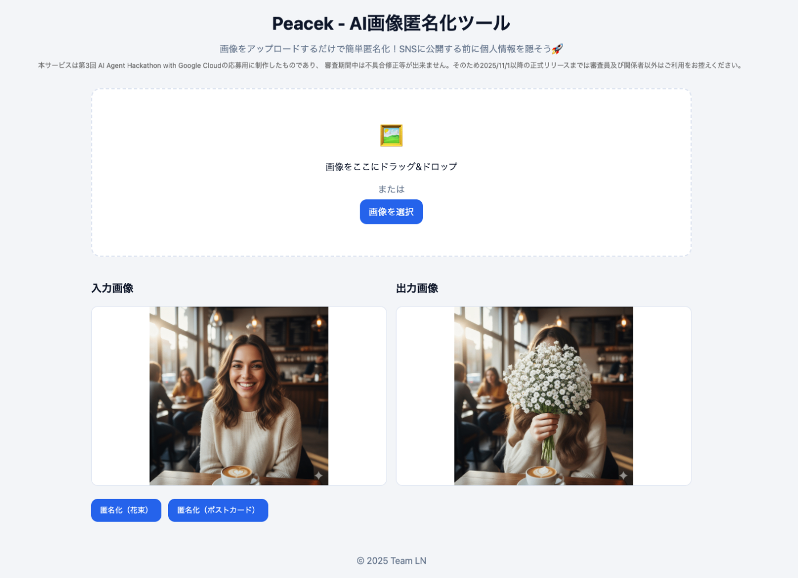
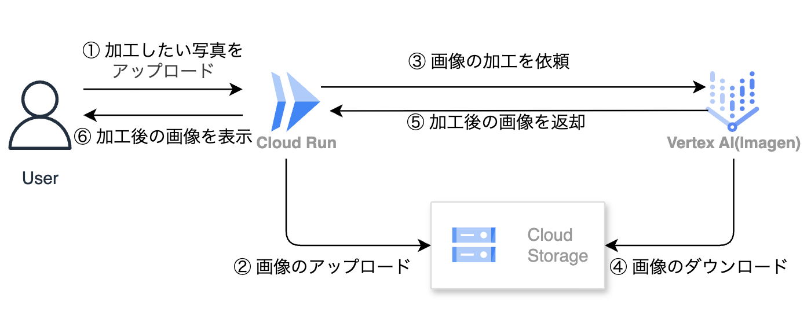

##  はじめに

近年、X や Instagram などの SNS は、誰もが日常的に自己表現を行う場となっています。しかし、何気ない投稿に写り込んだ顔や背景情報から、個人が特定されるリスクは見過ごせません。私たちは、「投稿を控える」のではなく、「誰もが安心して投稿できる」環境をつくりたいと考えました。その想いから開発したのが、**AI画像匿名化ツールPeacek（ピーセック）** です。

Peacek は、不自然なモザイクやスタンプではなく、**写真の雰囲気を壊さずに、匿名化させる** ことができます。ユーザーのプライバシーを守りながら、自由な発信を支援する──そんな新しい SNS 利用の形を提案します。

##  ユーザー像と課題

###  想定ユーザー

  * 一般SNSユーザー  
InstagramやTikTokで日常をシェアするのが習慣。顔出しには抵抗があるが、写真は投稿したい。
  * 学生・若年層クリエイター  
創作活動や趣味をSNSで発信。顔出しせずに自己表現したい。
  * 子育て世代  
子どもの写真をSNSに投稿したいが、顔出しは避けたい。

###  課題

  1. 「いいね」欲求による投稿の習慣化  
SNSでの承認欲求や交流のために、リスクを理解しながらも投稿してしまう。  
**⇒ピースポーズで自然に隠せるなど、匿名化が“映え”と両立できれば導入しやすい。**
  2. 子どものプライバシーに対する認識不足  
「小さいから大丈夫」「フォロワーしか見てない」という油断。  
**⇒自動で子どもの顔を検出・匿名化できる機能は、親の安心材料になる。**
  3. SNSの仕様による拡散リスク  
投稿後に誰かがスクショして拡散、意図しない文脈で使われることも。  
特定されると誹謗中傷やストーカー被害につながるケースも。  
**⇒投稿前に匿名化する習慣をつけることで、リスクを根本から減らせる。**

##  ソリューションと特徴

  * 顔を隠す際に、スタンプではなく被写体本人に花束やポストカードを持たせる加工 を行い、匿名化と“映え”を両立
  * プロンプト不要・即時加工で、誰でも手軽に使える匿名化体験を実現
  * Google Cloud の Vertex AI（Imagen） を活用し、Cloud Run / Cloud Storage / Vertex AI のシンプルな構成で動作するためクラウド利用料が低コスト

Peacek は、不自然なモザイクやスタンプではなく、写真の雰囲気を壊さずに、匿名化させることができます。ユーザーのプライバシーを守りながら、自由な発信を支援する──そんな新しい SNS 利用の形を提案します。

##  デモ動画

<https://www.youtube.com/watch?v=QvH3vsC2aOY>

##  機能

###  ユーザーインターフェース

###  技術構成

本アプリケーションは、ユーザーがアップロードした写真を Vertex AI (Imagen) によって自動的に加工し、結果を返す仕組みです。構成要素は Cloud Run / Cloud Storage / Vertex AI のみで、シンプルかつ拡張性のあるアーキテクチャとなっています。  

####  ハッカソン要件を満たす、Google Cloud製品の利用

  * Cloud Run
  * Cloud Storage
  * Vertex AI (imagen-3.0-generate-001, imagegeneration@006)

####  処理の流れ

  1. ユーザーが写真をアップロード
  2. Cloud Run が画像を Cloud Storage に保存
  3. Cloud Run から Vertex AI (Imagen) に加工を依頼
  4. Vertex AI が Cloud Storage から画像を取得し加工
  5. 加工後の画像を Cloud Run に返却
  6. ユーザーに加工済みの画像を表示

##  おわりに：安全なSNSライフをAIとともに。

現在、PeacekはWebアプリケーションとして公開しています。 ただ、私たちが守りたいのは、SNSに投稿される写真そのものです。 スマートフォンで撮った写真を、その場で匿名化してすぐ投稿できる。 そんな使い方がもっと自然にできるよう、今後はモバイル対応も検討しています。 写真による自己表現が**より自由で、より安心なものになるように** ——Peacekはその一歩を支えます。
