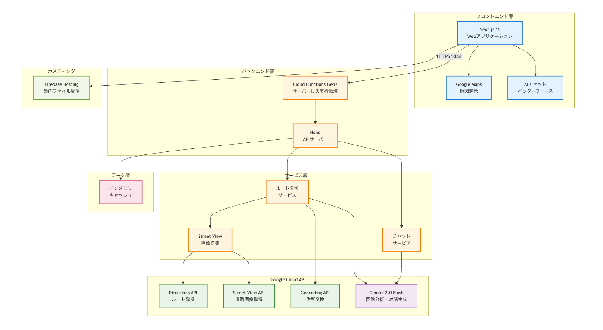

#  はじめに

第3回 AI Agent Hackathon with Google Cloudに参加し、「RouteKeeper AI」という道路の潜在的な危険を事前に検知するシステムを開発しました。

本記事では、Google Gemini 2.0 FlashとStreet View APIを組み合わせて、どのように道路の危険を可視化し、ドライバーや歩行者の安全を支援するシステムを構築したかを紹介します。

#  作品概要

##  デモ動画（3分）

<https://www.youtube.com/watch?v=uNqOhXd_DEc>

※ デモ動画では実際のルート分析から危険箇所の可視化、AIチャットによる安全アドバイスまでの一連の流れをご覧いただけます。

##  解決したい課題

日本では年間約30万件の交通事故が発生し、その多くは「危険箇所を事前に知っていれば防げた」可能性があります。

**既存の問題点：**

  * ナビアプリは最短ルートを案内するが、安全性は考慮されない
  * 事故多発地点の情報はあるが、具体的な危険要因が分からない
  * 初めて通る道では、どこに注意すべきか分からない

##  ソリューション

RouteKeeper AIは、以下の技術を組み合わせて課題を解決します：

  1. **Google Street View画像の自動収集**

     * ルート上の50m間隔で道路画像を取得
     * 複数の角度から危険要因を網羅的に確認
  2. **Gemini 2.0 Flashによる画像分析**

     * 交差点の死角、路面状況、視認性など13種類の危険要因を検出
     * 各地点に10段階のリスクスコアを付与
  3. **インタラクティブな危険マップ**

     * リスクレベルに応じた色分け表示
     * クリックで詳細情報と対策を確認可能
  4. **AIチャットアシスタント**

     * ルート固有の危険情報に基づく対話型アドバイス
     * 天候や時間帯に応じた注意点の提供

#  システムアーキテクチャ

![システム構成図]

##  技術スタック

  * **フロントエンド** : Next.js 15, shadcn/ui, Google Maps API
  * **バックエンド** : Cloud Functions Gen2, Hono (軽量Webフレームワーク)
  * **AI/ML** : Gemini 2.0 Flash (画像分析・自然言語処理)
  * **インフラ** : Firebase Hosting, Google Cloud Platform

#  実装のポイント

##  1\. Street View画像の効率的な収集

ルート分析の第一歩は、道路画像の収集です。Google Directions APIで取得したルートを基に、50m間隔でStreet View画像を収集します。
    
    
    // Street View画像収集の実装例
    async function collectStreetViewImages(route: Route): Promise<ImageData[]> {
      const points = extractPointsAtInterval(route, 50); // 50m間隔
      const images = await Promise.all(
        points.map(point =>
          fetchStreetViewImage({
            location: point,
            size: '640x640',
            fov: 90,
            heading: calculateHeading(point, nextPoint)
          })
        )
      );
      return images;
    }
    

**工夫点：**

  * 並列処理による高速化（Promise.all使用）
  * 進行方向に合わせたカメラアングル調整
  * 画像サイズの最適化（640x640で分析精度とパフォーマンスのバランス）

##  2\. Gemini 2.0 Flashによる危険検知

Gemini 2.0 Flashの高度な画像理解能力を活用し、構造化されたプロンプトで危険要因を分析します。
    
    
    // Gemini 2.0での危険分析
    const analysisPrompt = `
    この道路画像を分析し、以下の観点から危険要因を検出してください：
    
    1. 交差点の構造と死角
    2. 路面の状態（穴、濡れ、劣化）
    3. 視認性（信号、標識、見通し）
    4. 歩行者・自転車との交錯リスク
    5. 駐停車による影響
    
    各危険要因について：
    - リスクスコア（1-10）
    - 具体的な危険内容
    - 推奨される対策
    
    JSON形式で回答してください。
    `;
    
    const result = await gemini.generateContent([
      { inlineData: { data: imageBase64, mimeType: 'image/jpeg' }},
      { text: analysisPrompt }
    ]);
    

**Gemini 2.0を選んだ理由：**

  * 高速な推論速度（Flash版で1画像あたり約1秒）
  * 優れた日本語理解と生成能力
  * 構造化出力（JSON）のサポート
  * コスト効率の良さ

##  3\. リアルタイムプログレッシブ表示

長距離ルートでも快適なUXを提供するため、分析が完了した地点から順次表示する仕組みを実装しました。
    
    
    // プログレッシブな結果表示
    const [results, setResults] = useState<DangerPoint[]>([]);
    const [progress, setProgress] = useState(0);
    
    useEffect(() => {
      const eventSource = new EventSource('/api/analyze-stream');
    
      eventSource.onmessage = (event) => {
        const data = JSON.parse(event.data);
        if (data.type === 'result') {
          setResults(prev => [...prev, data.point]);
        } else if (data.type === 'progress') {
          setProgress(data.value);
        }
      };
    
      return () => eventSource.close();
    }, []);
    

##  4\. AIチャットによる対話的サポート

分析結果を基に、ユーザーの質問に答えるAIアシスタントを実装。Gemini 2.0のコンテキスト理解力を活用しています。
    
    
    // コンテキスト付きチャット
    const chatPrompt = `
    あなたはRouteKeeperAIの安全運転アドバイザーです。
    
    【ルート情報】
    ${JSON.stringify(routeData)}
    
    【検出された危険箇所】
    ${JSON.stringify(dangerPoints)}
    
    ユーザーの質問に対して、上記の情報を踏まえた
    具体的で実用的なアドバイスを提供してください。
    `;
    

##  5\. キャッシュによる最適化

同じルートの再分析を避けるため、結果をキャッシュする仕組みを実装。
    
    
    const cacheKey = `${origin}-${destination}-${mode}`;
    const cached = await cache.get(cacheKey);
    if (cached) return cached;
    
    const result = await analyzeRoute(route);
    await cache.set(cacheKey, result, 3600); // 1時間キャッシュ
    return result;
    

#  実装で苦労した点と解決策

##  1\. Street View画像の品質差

**問題:** 地域や撮影時期により画像品質にばらつきがある

**解決策:**

  * 複数角度からの撮影で情報を補完
  * Geminiへのプロンプトで画質考慮を明示
  * 低品質画像の場合は信頼度を下げる

##  2\. API利用料金の最適化

**問題:** 長距離ルートでAPIコストが高額になる

**解決策:**

  * 画像収集間隔の動的調整（都市部は密、郊外は疎）
  * 結果のキャッシング
  * Gemini 2.0 Flash（低コスト版）の採用

##  3\. リアルタイム性の確保

**問題:** 分析に時間がかかりUXが悪化

**解決策:**

  * 並列処理の最大活用
  * Server-Sent Eventsによるストリーミング
  * プログレッシブな結果表示

#  今後の展望

##  機能拡張

  1. **動画生成機能**

     * Veo 3を使った事故シミュレーション動画
     * より直感的な危険理解
  2. **リアルタイムデータ統合**

     * 交通情報との連携
     * 天候データの反映
     * 工事情報の自動取得
  3. **学習機能**

     * ユーザーフィードバックによる精度向上
     * 地域特性の学習

##  ビジネス展開

  * **B2C** : 一般ドライバー向けサブスクリプション
  * **B2B** : 運送業界向けエンタープライズ版
  * **B2G** : 自治体向け通学路安全対策ツール

#  まとめ

RouteKeeper AIは、最新のAI技術を活用して「事故を未然に防ぐ」という社会課題に挑戦しました。

**技術的成果：**

  * Gemini 2.0 Flashによる高精度な危険検知
  * スケーラブルなサーバーレスアーキテクチャ
  * 優れたユーザー体験の実現

**社会的インパクト：**

  * 交通事故の予防による人命救助
  * 安全運転意識の向上
  * データに基づく道路改善の促進

Googleの最新AI技術により、これまで個人の経験に依存していた「危険察知」を、誰もがアクセス可能な形で提供できるようになりました。
