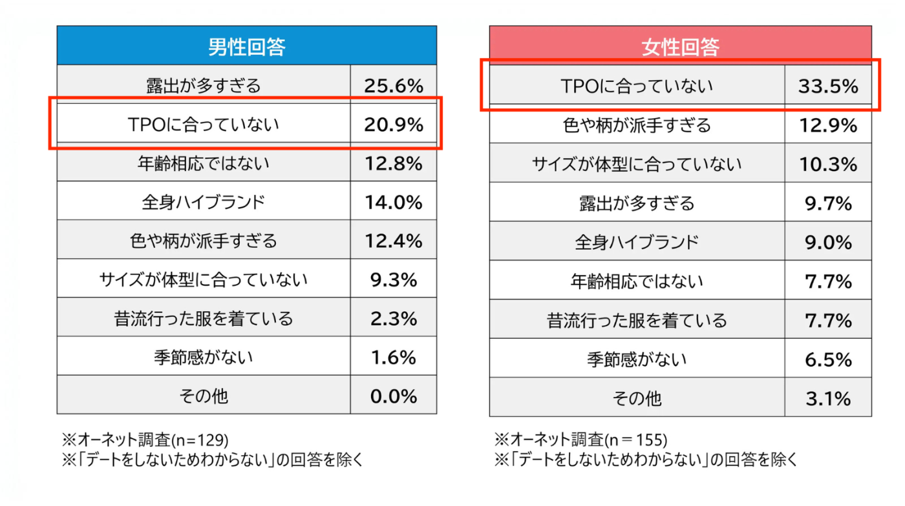
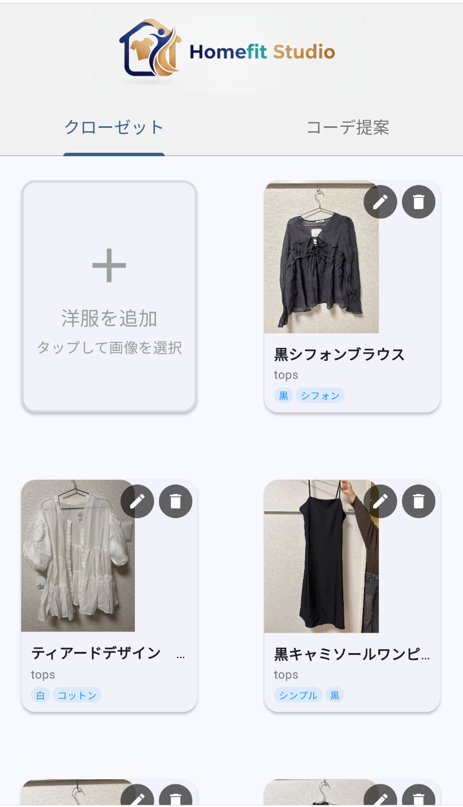
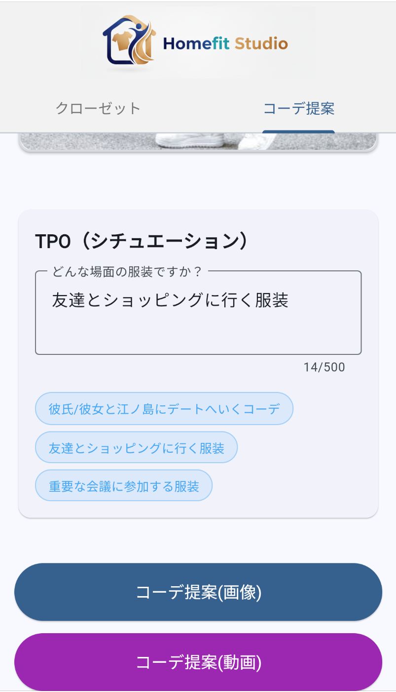
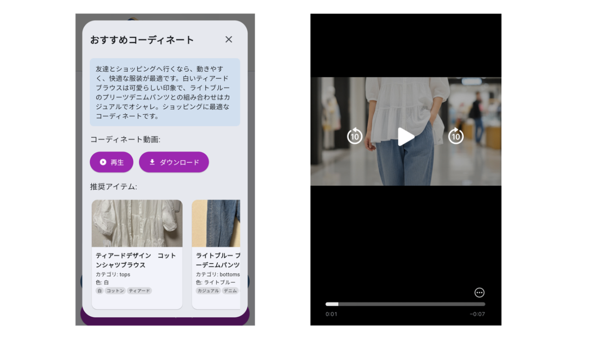
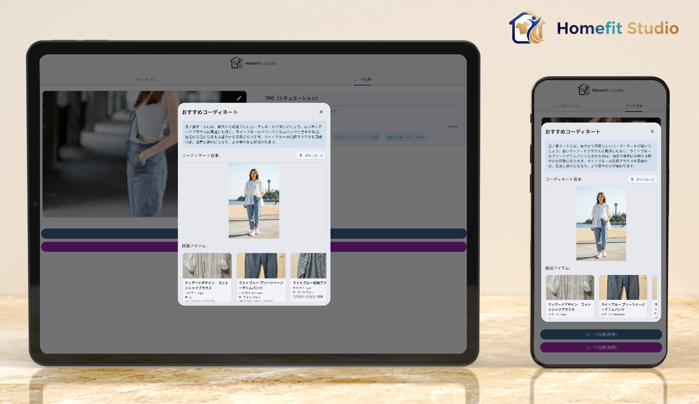
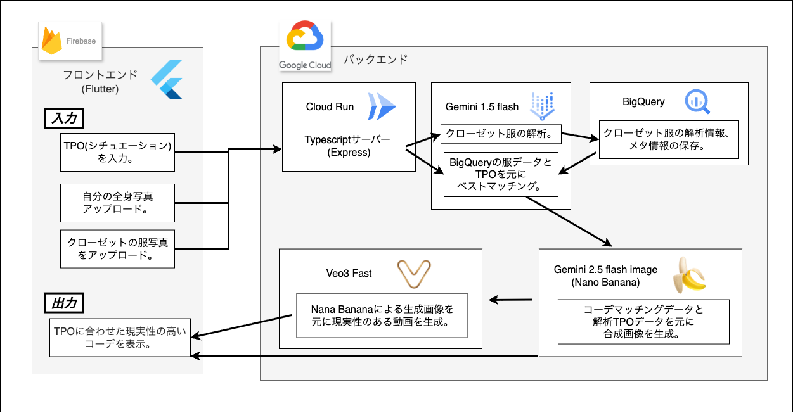
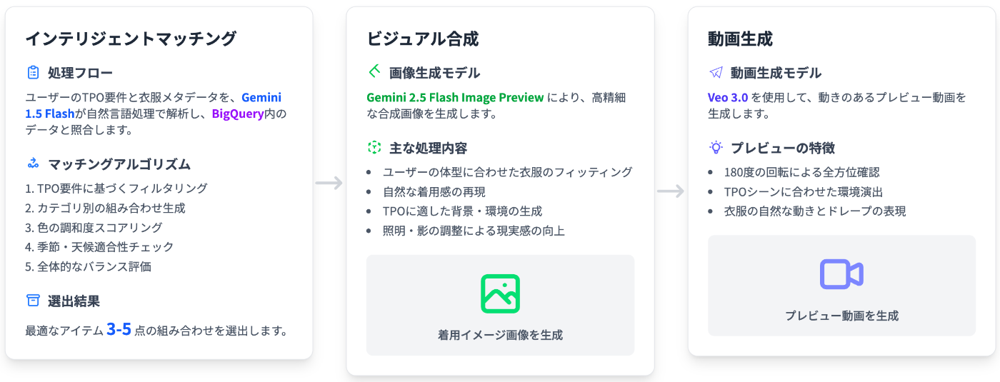

##  Youtube動画

<https://youtu.be/fQDfZlxqJks>

##  1\. 背景、課題

今年の5月にGoogleから発表された[Try It On](https://blog.google/products/shopping/google-shopping-ai-mode-virtual-try-on-update/)をはじめとして、AIを活用した試着体験アプリの普及が進んでいます。体型やポーズに合わせて着てみたい服をシミュレーションすることができ、服選びの課題解決において、画期的なツールと言えるでしょう。

服選びにおいて、自分に似合うかどうかというのは重要ですが、**TPOに合わせることも重要** です。

添付はデートをする際、異性のファッションについてNGなことについてのアンケート結果[1]です。男女ともに「TPOに合ってない」が上位の理由となっています。このようにTPOに合った服装というのは第三者からの印象に大きく影響を与えます。これはデート以外のシチュエーションにも共通していえます。

しかし、コーディネートが苦手な人、時間をかけたくない人にとっては服の組み合わせを考えたり、TPOに合わせたコーディネートを考えるのはそれなりの労力を要します。実際に、TPOにふさわしい服選びで困ったことはないでしょうか。

今回開発した**Homefit Studio** は以下の課題を解決します。

> TPOに合わせた服選びにかかる労力、時間。

このアプリは従来の試着アプリから視点を変え、イメージするシチュエーションを入力することでTPOに適したコーディネートを提案します。

* * *

##  2\. Homefit Studioとは

Homefit Studioは、ユーザーが所有する衣類をアプリに登録し、**目的のシチュエーションを入力することで、そのTPO（時間・場所・目的）に応じた最適なコーディネート** を提案します。

###  2-a. ターゲットユーザー

日頃から服選びに悩んでしまう方。（年齢問わず）

###  2-b. 解決する課題

TPOに合った服装を決めるのにかかる労力と時間。

###  2-c. 使用方法

  1. **手持ちの服の登録**  
ライブラリまたは写真撮影により手持ちの洋服をアップロードしておきます。

  2. **自身の写真のアップロード**  
全身がうつった自分自身の写真をアップロードします。

  3. **目的のＴＰＯの入力**  
自分が目的とするシチュエーション（場所、雰囲気、季節、好みの服装等）をできるだけ詳細に入力し、「コーデ提案」ボタンを押します。

  4. **コーデ提案(画像or動画)**  
入力したTPOに合わせてAIがコーデを提案します。自分自身が実際に、提案コーデを着ている様子を動画、または画像から確認できます。

###  2-d. 本アプリによるソリューション

既存のコーデ提案アプリとの相違点について整理すると、以下のような特徴があります。

  * **AIによるコーデ提案**

    * 従来のアプリ → 気温、天気、好みのジャンルに合ったコーデを提案。
    * 本アプリ → より詳細なシチュエーション(TPO)に合わせたコーデを提案（天候、雰囲気、シーン、イベントのフォーマル度、服や肌の色合いのマッチ度など）。
  * **シミュレーションの出力**

    * 従来のアプリ → 洋服の組み合わせ画像のみ（試着イメージ無し）。
    * 本アプリ → 実際に「自分自身」が提案コーデを着用しているイメージを生成。さらに動画として確認できるため、動きや雰囲気まで含めた現実的な検討が可能。
  * **自由度の高いシチュエーション指定**

    * 「週末の公園デート」「取引先との会食」「同窓会の二次会」など、具体的な場面を自然言語で入力可能。
    * 従来の一律的な提案ではなく、ユーザーのライフスタイルに密着したパーソナライズを実現。

本アプリが提供するのは単なる服の組み合わせではなく、**その場に立つ自分の姿を事前に確認できる安心感** でもあります。時間や労力を削減するだけでなく、外出時の自信や満足感を高めることができます。

* * *

##  3\. 機能

###  3-a. 機能要件

今回開発するにあたり、フォーカスしたのは**TPOに合わせた現実性の高いコーデの提案** です。  
以下が、今回私たちがまとめた要件達です。

  * シチュエーション(TPO)に合わせた最適なコーデを提案。 
    * 季節、雰囲気、シーン、シチュエーション、服や肌の色合いのマッチ度、などなど。
    * 日時指定、場所指定があった場合、その天候も考慮する。
  * 推奨コーディネートの試着イメージを通した、より現実性の高いシュミレーション。
  * アップロードした服の詳細な情報の分析とその保存。（どんな素材、どんな時期に適している服、など）

上記の要件を満たすべく、Homefit Studioのフロントエンドとバックエンドシステムを開発しました。

###  3-b. UI/UX

Homefit Studioのユーザーインターフェースは、直感性と効率性を重視し、「コーディネートを考える」という繊細なプロセスを可能な限りシンプルにすることを目指しました。

**デザインコンセプト**

  * 余計な装飾を排し、ユーザーが直感的に理解できるインターフェース。
  * 全画面を通じた統一されたデザインとカラーパレット。

**ユーザビリティへの配慮**

  * コーディネート生成まで、最小限のクリック数で完了。
  * アップロードした画像の即座確認と動画プレビュー表示。

**レスポンシブデザイン**

  * モバイル端末での使いやすさを重視しつつ、PC端末でも快適に操作可能。

これらのUI/UX設計により、ユーザーは技術的な複雑さを意識することなく、直感的にTPOに合わせたコーディネートを楽しむことができると考えました。

###  3-c. ソフトウェアアーキテクチャ

**フロントエンド**

  * Flutterで構築（Webビルド）。
  * Firebase Hostingにデプロイ。

**バックエンド**

  * Expressサーバーで構築（Docker）。
  * Cloud Runにデプロイ
  * Gemini 1.5 Flash 
    * アップロードされた服の画像を解析。
    * BigQueryに保存されている服のメタデータと、入力されたTPOを元に、最適なマッチングを計算。
  * Gemini 2.5 Image Preview (画像生成AI) 
    * Gemini 1.5 Flashによるコーデマッチングデータと、解析TPOデータを元に合成画像を生成。
  * Veo3 (動画生成AI) 
    * Gemini 2.5 Image Previewよる生成画像を動画化。

**データベース**

  * BigQueryを使用。 
    * アップロードされたクローゼットの服の解析情報や、メタ情報の保存。

###  3-d. コーデ提案AI ワークフロー

**ステップ1: 衣服解析とメタデータ生成**

  * Gemini 1.5 Flashが各衣服画像を解析。
  * 抽出される情報： 
    * カテゴリ分類（トップス、ボトムス、アウター等）
    * 色情報（プライマリ/セカンダリカラー）
    * 季節適性（春夏秋冬）
    * シーン適性（カジュアル、フォーマル、ビジネス等）
    * 素材・質感の推定
    * 天候適性（暑い、涼しい、雨天等）
  * 解析精度スコアと共にBigQueryへ保存。

**ステップ2: インテリジェントマッチング**

  * ユーザー入力されたTPO要件とBigQuery内の衣服メタデータをGemini 1.5 Flashが自然言語処理。
  * マッチングアルゴリズム： 
    1. TPO要件に基づくフィルタリング
    2. カテゴリ別の組み合わせ生成
    3. 色の調和度スコアリング
    4. 季節・天候適合性チェック
    5. 全体的なバランス評価
  * 最適なアイテム3-5点の組み合わせを選出。

**ステップ3: ビジュアル合成**

  * Gemini 2.5 Flash Image Previewによる、合成画像生成。
  * 処理内容： 
    * ユーザーの体型に合わせた衣服のフィッティング
    * 自然な着用感の再現
    * TPOに適した背景・環境の生成
    * 照明・影の調整による現実感の向上

**ステップ4: 動画生成（オプション）**

  * Veo 3.0 Fastによる、動画プレビュー生成。
  * 特徴： 
    * 180度の回転による全方位確認
    * TPOシーンに合わせた環境演出
    * 衣服の自然な動きとドレープの表現

* * *

##  4\. 実際に使用した方の感想

日頃服選びに悩んでしまいがちといった方々に、実際に使用して頂きました。

  * 思っていたより提案内容がリアルでイメージしやすい
  * 背景と服装のマッチングが確認できておもしろい

といった声があげられました。  
実際にアプリをご活用し、外出を試みられた方もおり、その利便性や実用性について高い評価をいただきました。私たちにとっても、Homefit Studio の持つ可能性を再認識する大変貴重な機会となりました。

最後に、ご協力いただいた皆さまに心より感謝申し上げます。

* * *

##  5\. おわりに

本アプリは、日常的な「服選びの負担」を軽減するだけでなく、第三者からの印象形成に大きな影響を与えるTPO対応をサポートします。  
つまり、単なるおしゃれ補助ツールではなく、**日常生活の質を向上させるパートナー** として機能することを目指しています。

> 数ある洋服からTPOに合う服を選ぶのがいつも大変、、、  
>  そもそもTPOにあう服って何を選べばいいんだろう、、

そんな悩みを解決するのがHomefit Studioです。

脚注

  1. [参考資料：「TPOに合っていない」服がトップ！中高年女性が思う異性のNGファッション](https://prtimes.jp/main/html/rd/p/000000197.000022091.html) ↩︎

