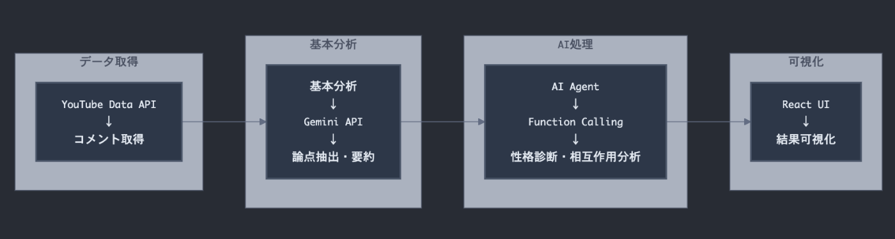
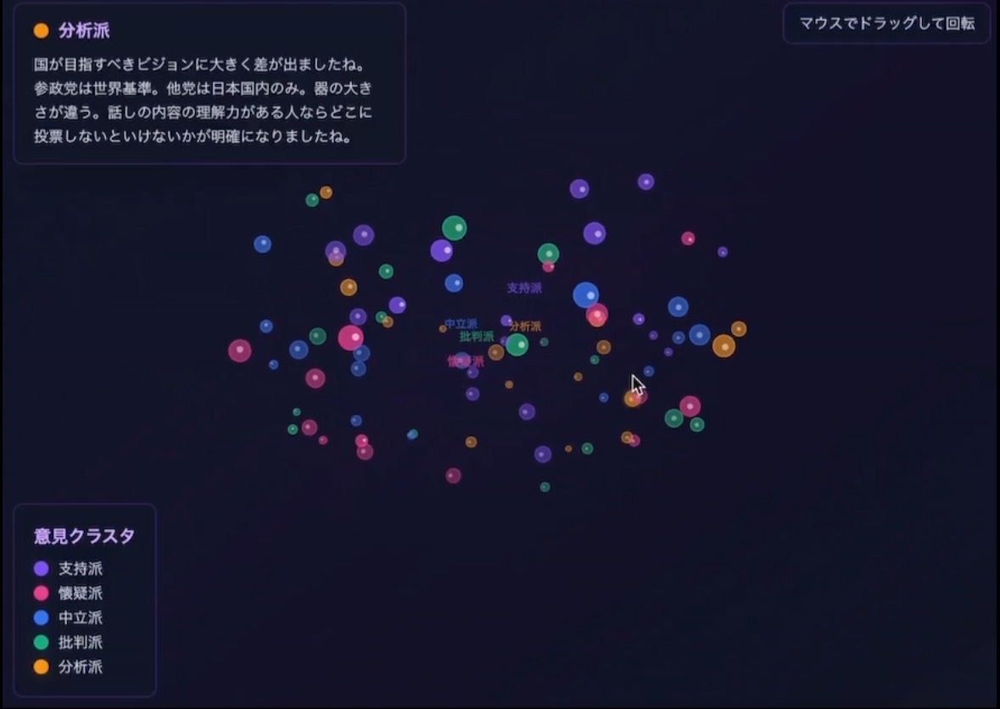

##  はじめに

YouTube動画のコメント欄には、商品レビューや社会問題に対する多様な意見が投稿されますが、数千件のコメントから全体の論調を把握するのは困難です。この課題に対して、Geminiを活用したコメント分析ツール「StanceScope」を試作しました。  
基本的なテキスト分析に加えて、Function Callingを使ったAI Agentの仕組みを導入し、コメント者の性格タイプ分析や議論の相互作用予測などの機能を実験的に実装しています。

##  アプリケーションデモ

Youtube限定公開のアプリケーションデモ  
<https://youtu.be/K1uQymayR5Q>

##  現状の課題

###  世論把握の困難さ

  * 人気動画には数千のコメントが投稿され、全体の論調把握が困難
  * 確証バイアスにより、自分の意見に近いコメントばかり目に入る
  * 声の大きい少数派と静かな多数派の区別ができない

###  既存ツールの限界

  * YouTube Analyticsはコメント内容の分析機能を提供していない
  * 一般的なテキスト分析ツールは日本語の議論構造に対応していない

##  アーキテクチャ設計

###  システム構成

###  技術スタック

  * React 19 + TypeScript 5
  * Google Gemini API (gemini-2.0-flash)
  * YouTube Data API v3
  * Tailwind CSS + Recharts

##  基本分析機能の実装

###  構造化レスポンス設計

Gemini APIの`responseSchema`機能を活用し、確実に構造化されたデータを取得：
    
    
    const schema = {
      type: Type.OBJECT,
      properties: {
        viewpoints: {
          type: Type.ARRAY,
          description: '主要な意見・論点のリスト',
          items: { type: Type.STRING }
        },
        summary: {
          type: Type.STRING,
          description: 'コメント欄全体の中立的要約'
        },
        sentiment: {
          type: Type.ARRAY,
          items: {
            type: Type.OBJECT,
            properties: {
              name: { type: Type.STRING },
              count: { type: Type.INTEGER }
            }
          }
        }
      }
    };
    

###  プロンプトエンジニアリング

AIに段階的なタスクを明示することで、分析の一貫性を保つよう設計：
    
    
    const prompt = `
    あなたは議論分析の専門家です。以下のタスクを実行してください：
    
    1. 主要な論点の特定（2〜4個程度）
    2. コメントの分類（各論点への支持・中立・その他）  
    3. 結果の集計（カテゴリー別コメント数）
    
    出力は提供されたJSONスキーマに従ってください。
    `;
    

###  性格カテゴリで可視化

##  AI Agent機能の実装

###  Function Callingの設計

3つの主要なAgent Toolを定義：
    
    
    const personalityTools = [
      {
        name: "analyze_personality_types",
        description: "コメントを性格タイプ別に分類",
        parameters: {
          type: "object",
          properties: {
            comments: { type: "array", items: { type: "string" }},
            focus_type: { 
              type: "string", 
              enum: ["basic", "detailed", "interaction"] 
            }
          }
        }
      },
      {
        name: "predict_interaction_patterns", 
        description: "性格タイプ間の相互作用を予測",
        parameters: {
          type: "object",
          properties: {
            personality_mix: { type: "array", items: { type: "string" }},
            context: { type: "string" }
          }
        }
      },
      {
        name: "generate_moderation_strategy",
        description: "最適なモデレーション戦略を生成", 
        parameters: {
          type: "object",
          properties: {
            dominant_types: { type: "array", items: { type: "string" }},
            conflict_level: { type: "number", minimum: 0, maximum: 10 }
          }
        }
      }
    ];
    

###  エージェントの自律的実行

AIが状況に応じて適切なツールを選択し、段階的に分析を実行：
    
    
    export const runPersonalityAnalysisAgent = async (
      comments: string[],
      videoTitle?: string
    ) => {
      const response = await ai.models.generateContent({
        model: "gemini-2.0-flash",
        contents: agentPrompt,
        tools: { function_declarations: personalityTools }
      });
    
      // Function Callの結果を処理し、必要に応じて追加分析を実行
      let analysis: PersonalityAnalysis | null = null;
      let interactions = "";
      let strategy = "";
    
      for (const part of response.candidates[0].content.parts) {
        if (part.functionCall) {
          const result = await executePersonalityTool(
            part.functionCall.name,
            part.functionCall.args
          );
          // 結果に応じた処理...
        }
      }
    
      return { analysis, interactions, strategy };
    };
    

##  性格タイプ分類システム

###  8つの性格カテゴリー

コメント者を以下の性格タイプに分類：

  * **理論派** : データや根拠を重視する論理的思考
  * **感情派** : 感情表現が多く、共感を重視
  * **平和主義者** : 仲裁や妥協案を提示する傾向
  * **煽り屋** : 論争を激化させる挑発的なコメント
  * **専門家** : 詳しい知識を披露する権威的な発言
  * **傍観者** : 他人の意見をまとめるだけの受動的姿勢
  * **懐疑派** : 批判的思考で反論が多い
  * **支持者** : 肯定的で賛同の表現が多い

###  相互作用パターン分析

性格タイプの組み合わせから、議論の発展パターンを予測：
    
    
    const predictInteractionPatterns = async (personalityMix: string[]) => {
      const prompt = `
      以下の性格タイプが混在する場合の相互作用を分析：
      ${personalityMix.join(', ')}
      
      分析項目:
      1. 協調的関係になりやすい組み合わせ
      2. 対立しやすい組み合わせ
      3. 議論の発展パターン予測
      4. 建設的な方向に導く方法
      `;
      
      return await ai.models.generateContent({
        model: "gemini-2.0-flash", 
        contents: prompt
      });
    };
    

##  期待されるユーザ活用シーン

###  マーケティング分野

  * 商品レビュー動画での消費者心理の傾向分析
  * ブランド認知度調査での定量的データ収集
  * キャンペーン効果測定でのフィードバック集約

###  コンテンツ制作

  * 視聴者層の性格特性を考慮したコンテンツ企画の検討
  * コミュニティ管理における参考情報の提供
  * エンゲージメント向上のための議論パターン分析

###  社会調査研究

  * オンライン世論の定量的分析手法の研究
  * 議論の対立構造に関する基礎データの収集
  * デジタルコミュニケーション研究における事例分析

##  今後の技術展開

###  検討したい機能拡張

  * 時系列分析による論調変化の追跡
  * 多言語対応による国際比較分析
  * 他のSNSプラットフォームとの横断分析

##  まとめ

本記事では、YouTube世論分析にFunction CallingベースのAI Agentを導入したStanceScopeの開発について紹介しました。従来のテキスト分析に加えて、コメント者の性格分析や議論の相互作用予測などの機能を実装してみました。  
AI Agentの活用により、単発の分析から段階的な洞察へと発展させることができましたが、実用性や分析精度についてはさらなる検証が必要と考えています。Function Callingの仕組みを理解し、適切なAgent Toolの設計を行うことで、類似の課題にも応用できる可能性があります。

##  参考資料

  * [Google Gemini API Documentation](https://ai.google.dev/api/generate-content)
  * [YouTube Data API v3](https://developers.google.com/youtube/v3)

