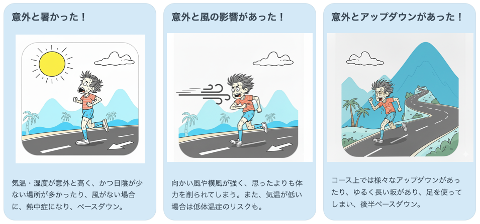
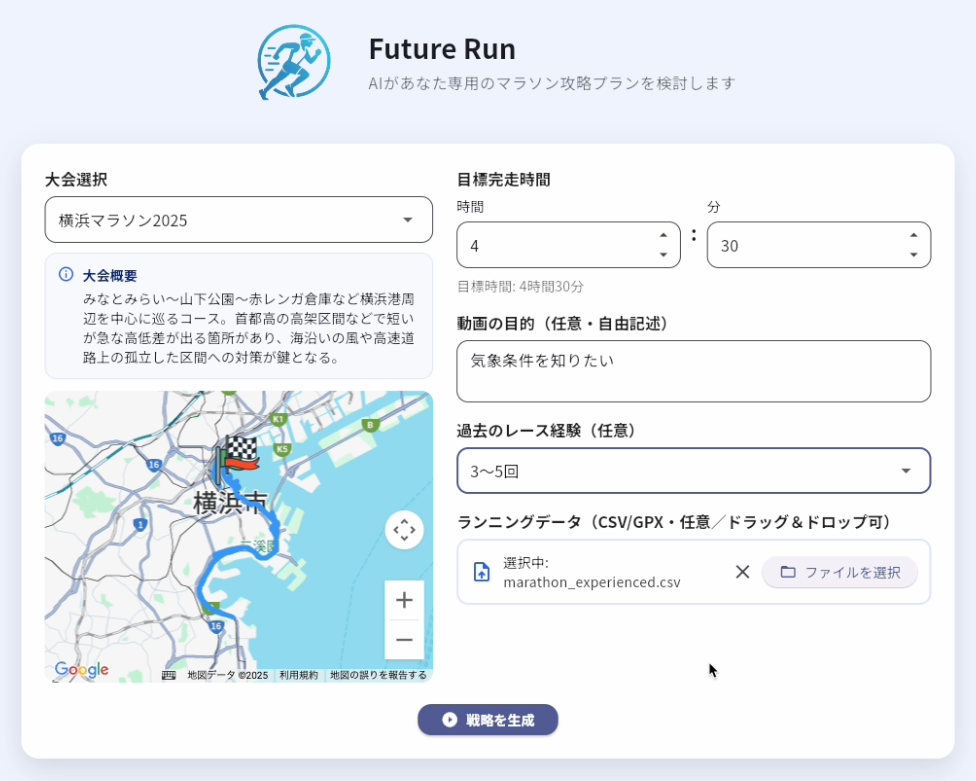
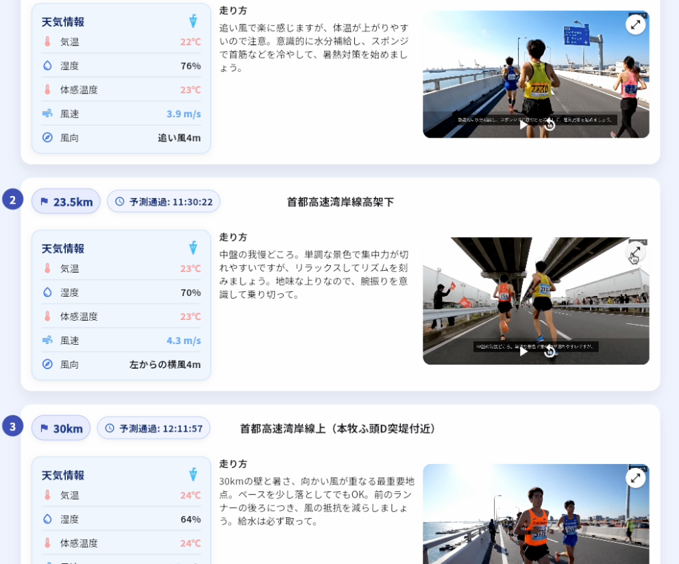

##  1\. はじめに

こんにちは！私は4年前ぐらいから趣味でマラソンを始め、フルマラソンにこれまで10回程度出場しています。マラソンを走る上で、天候やコースの特徴が自分の走りに大きく影響することを実感しています。

例えば、2024年の秋に出場した大会での出来事です。友人と一緒に同じペースで走っていたはずなのに、24km地点で友人がついて来れなくなり、最終的に28kmでリタイアしてしまいました。後で話を聞くと、気温は想定通りだったものの、レース前に小雨が降っており、後半が晴れたことで高温多湿となり、さらに追い風傾向であったため風の恩恵も受けることができなかったようです。

知識として対処方法を知っていたにもかかわらず、事前に十分なイメージが出来ていなかったため、その知識を活用する事が出来ず、結果的に体感温度が上がって熱中症気味になってしまったとのことでした。

このような経験から、マラソンでは個人の走力だけでなく、気象条件やコースの特徴を事前に把握し、適切な対策を立てるだけでなく、しっかりとイメージを持っておく事の重要性を感じました。  
そこで開発したのが「Future Run」というマラソン戦略シミュレーションアプリです。このアプリは、個々のランナーの目標や能力に合わせて、気象・コース条件を考慮した最適なレース戦略をイメージしやすい動画と共に提供します。

##  2\. アプリ紹介動画

<https://youtu.be/Rj3966bblwM>

##  3\. 解決したい課題とソリューション

###  3.1. マラソンにおける課題

マラソン大会は42.195kmを走る体力的にも精神的にも過酷なスポーツです。  
多くのランナーが途中で歩いてしまったり、残念ながらリタイヤせざるを得なくなることがあります。

熱中症、低体温症、体力の限界など、理由は様々です。

こういった課題の背景には「今回のマラソン意外と〇〇だったな」というあらかじめ想像していたイメージと実際のレースとのギャップが潜んでいます。

このギャップの背景には、文章や写真だけでは、ユーザーが十分に走るレースの気象条件やコースをイメージすることが難しいという課題があります。

気象条件やコース特性が走りに与える影響はデータ的にも証明されています。

例①：**気温と湿度の上昇による完走率の低下** (NAHAマラソン）[1]  
・2023年（気温21.5℃、湿度61%）：完走率72.68%  
・2016年（気温25.9℃、湿度75%）：完走率53.22%

例②：**風速による完走率の低下** (ボストンマラソン)[2][3]  
・2018年（風速最大10m/sの風） ：男子リタイア率 5.0%  
・2017年：男子リタイア率 2.7%

例③：**コース特性によるエネルギー効率の低下** [4][5]  
・上り基調のコースでのECR(エネルギーコスト)は約7.9J/kg·mであり、平地の約2倍の力が必要  
・凹凸路面では通常路面と比較してエネルギーコストが＋23％程度増加

上記のように気象条件やコース特性はレースに影響を与えるため、レース前に正確なイメージを持っておくことがマラソンにおいては重要です。

###  3.2. Future Runのソリューション

####  3.2.1. 概要

Future Runは、具体的に対象の大会に参加する際のリスクを統合的に分析し、事前にアドバイスと実際のイメージ動画を提供することで、未来のランをサポートします。

動画形式のアドバイスにより、気象条件、コースの勾配・曲がり・ランドマーク・風向きなどが直感的に理解でき、ペース調整、走行ポジションなどをイメージできます。また、映像で事前に「体験」することでレース中でも冷静に対応できたり、走る前の対策を練ることができます。

**動画という、視覚的に分かりやすく、記憶にも残りやすい形式でアドバイスを行うことによって、ランナーの走行時のギャップを大幅に軽減する事ができます。**

例えば、体感気温が高くなりそうな場所を事前にイメージできていれば、事前対策（例：[ウォーターローディング](https://up-run.jp/columns/column116/)）をしたり、レース中でも冷静な対応(例：こまめな給水、日陰を中心に走る)をすることができます。

####  3.2.2. アプリの使い方

アプリのトップ画面は下記の通りで、ここから大会選択や目標タイムを選択します。  
任意項目で、何を知りたいか、過去のレース経験、ランニングデータを登録することができます。  
※ランニングデータはGarminなどのランニングウォッチから取得できます([参考](https://support.garmin.com/ja-JP/?faq=W1TvTPW8JZ6LfJSfK512Q8))。

「戦略を生成」ボタンを押下すると分析が開始され、レースプランをAIが検討します。  
全体で7分程度処理に時間がかかりますが、下記のように結果が出力されます。  

体感の気温や走る方角に向かっての風向きなどがわかるため、具体的にどれぐらい汗をかきそうかや、どの程度風に煽られそうかなどが把握できます。それにより対策も事前に検討できます。例えば給水を多めにとったり、集団について風の影響減らして走るなど、様々な対応をとることができます。

また生成された動画のサンプルは以下に4つほど例を示します。  
気象条件やランドマークなどのについても動画内で表現されている様子がわかるかと思います。  
また、テロップで走り方のアドバイスをしているので、実際に走る際に参考にできます。

レースアドバイス動画サンプル① 大阪マラソン41.0km  
<https://youtu.be/toS896W6U1I>

レースアドバイス動画サンプル② 横浜マラソン16.0km  
<https://youtu.be/2uakxdEB0As>

レースアドバイス動画サンプル③ 金沢マラソン24.0km  
<https://youtu.be/3_pHYLacUmY>

レースアドバイス動画サンプル④ 大阪マラソン20.0km  
<https://youtu.be/-wpBjBZzgaU>

##  4\. システムの構成

###  4.1. インフラ

インフラはGCPを利用し、下記のような構成でシステムを実現しています。  
全体的にサーバレスの構成になるよう意識して構築をしました。

####  CloudRun

Cloud Runを利用することでバックエンドのAPIをサーバレスになるよう構成しています。  
API呼び出し時のみ処理が起動するので、余計なコストがかからないのが良いところです。

####  Vertex AI

ユーザーのトレーニング履歴からのインサイト抽出や気象条件・コース条件、ユーザー情報からの重要地点の検出と走り方のアドバイス検討はVertex AIのgemini-2.5-proを利用しています。

また、動画生成に関してはVeo3 Fastを利用しています。

####  CloudStorage

過去のマラソン大会のGPXデータ（各地点の緯度・経度・標高などを含むデータ）で公開されているものを加工してデータベースをCloudStorageに保存しています。DeepResearchなどを利用して、そのマラソン大会の給水や給食情報や各地点のランドマークなどの情報も付与しています。

また、バックエンドの処理の中で利用される一時ファイルの配置もしています。

###  4.2. フロントエンド

  * 技術スタック：Flutter
  * 機能： 
    * ユーザーインターフェースの構築
    * マラソン大会のコース表示（Google Mapを利用）
    * 結果の表示（重要地点の気象情報やアドバイス動画の表示）

###  4.3. バックエンド

  * 技術スタック：FastAPI
  * 機能 
    1. 気象情報取得分析 
       * ランナーのペースから各通過地点の緯度経度とその通過予定時刻を算出してその地点の気象条件の詳細を計算します（風向き、体感温度など） 
         * 5日以上先のマラソン大会の天気予報は取得できない、または精度が良くないので、そのマラソン大会の開催日の1年前の実測のデータを代わりに取得して代用します
    2. コース情報取得 
       * CloudStorageに保存してある大会情報データを取得します。ここには各地点の標高やランドマーク、給水・給食情報などが含まれます
    3. ユーザー情報分析 
       * 過去のトレーニングデータCSVがアップロードされた場合、Gemini-2.5-proを利用してランナーのCSVデータから取得できる情報（練習の特徴と傾向、身体的特徴と走法、強みと弱み）を分析します
    4. 重要地点の検討 
       * 気象情報、コース情報、ユーザー情報をもとにGemini-2.5-proを利用してこのランナーにとってのレースの重要地点を数件検出させるとともに、具体的にその地点でのアドバイスも検討させます
    5. 動画生成 
       * 気象情報、コース情報、アドバイスをもとにVeo3 Fastを利用して、動画を生成させます
    6. 動画編集 
       * 生成された動画に対して、地点情報やアドバイスをテロップに追加します

##  5\. 費用感

###  5.1. LLM料金

処理名 | モデル | 入力料金 ($) | 出力料金 ($) | 合計 ($)  
---|---|---|---|---  
トレーニングデータ検討 | gemini-2.5-pro | 0.0025 | 0.002 | 0.0045  
重要地点の検討 | gemini-2.5-pro | 0.0040 | 0.003 | 0.007  
  
合計で0.0115＄で、1＄=150円とすると約1.7円程度のコストになります。

参考：<https://cloud.google.com/vertex-ai/generative-ai/pricing?hl=ja>

###  5.2. 動画生成料金

Veo3 Fastの1秒あたりの生成の料金が0.15$で4秒の動画を4個生成させるとすると、2.4$になり、1＄=150円とすると約360円程度のコストになります。

参考：<https://ai.google.dev/gemini-api/docs/pricing>

※コストは最大限抑えることができるよう、安価なモデルを利用しています。

##  6\. 提供する価値

Future Runは全てのマラソンランナーに下記の価値を提供します。

###  大会当日の未来予測によるリスク最小化

大会コース特徴と気象条件をAIが分析し、当日の走りにどう影響するかということを予測することで、大会でのリスク回避をすることができます

###  個別レースプランによるパフォーマンスの最大化

ユーザー個別の情報をもとに、具体的なペース配分や走り方のアドバイスを行うことで、パフォーマンスの最大化が期待できます

##  7\. おわりに

今回はAI Agentの[ハッカソン](https://zenn.dev/hackathons/google-cloud-japan-ai-hackathon-vol3)が開催されるということを知り、チームで開発に取り組みました。

実際に私も2025/10/26に横浜マラソンに参加する予定なので、このアプリを利用して最大限のパフォーマンスを発揮して、自己ベストを更新してきます！

<https://github.com/sagara-221/FutureRun>

##  参考文献

  * [1] <https://www.naha-marathon.jp/history/history.html>
  * [2] <https://globe.asahi.com/article/11614946>
  * [3] <https://www.bbm-japan.com/article/detail/5880>
  * [4] <https://pubmed.ncbi.nlm.nih.gov/34853187/>
  * [5] <https://pubmed.ncbi.nlm.nih.gov/39970766/>

