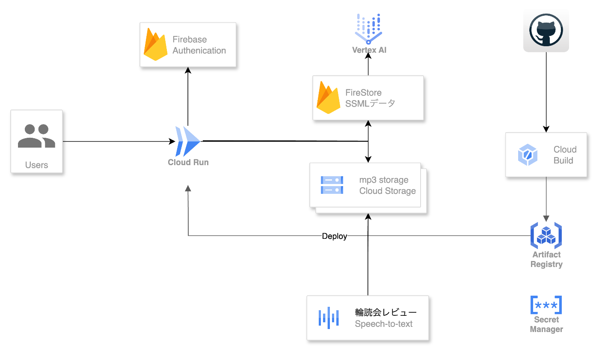

##  TL;DR

Re:Read は、「AI と遊ぶ、新しい輪読会」を掲げる参加型サービスです。Vertex AI (Gemini) が寄稿メモとチャットログを要約し、Podcast 音声まで生成。知識がその場限りで散逸する課題を、AI の再編集力とクラウド基盤で解決しました。

  * GitHub: <https://github.com/sakumoto-shota/re-read>
  * プロダクトURL（ハッカソン期間限定公開）: <https://reread.foodit.co.jp/>
  * 気軽に試してください（不具合があれば issue でお知らせください）。
  * デモ動画（2分43秒）: <https://youtu.be/2GZYhkAFkpA>

##  Demo

##  ターゲットと課題 ❗️

Re:Read が狙うユーザーは「輪読会を運営する学習コミュニティの主催者」と「議論をアーカイブしたい参加者」です。現場では以下のような課題が顕在化していました。

  1. **議論の属人化** : メモ共有が個人のノートに閉じ、参加しなかったメンバーに知見が伝わらない。
  2. **議論の温度差** : 発言の多い人・少ない人で記録が偏り、ディスカッションの全体像が掴みにくい。
  3. **振り返りコスト** : 音声配信や記事化をする余裕がなく、イベント後の情報発信が途切れてしまう。

##  ソリューションの特徴 💡

Re:Read は輪読会当日の「寄稿 → 議論 → 共有」フローを一つの画面に統合し、AI がレビューの第一稿を即時生成します。

  * 寄稿フォームで質問テンプレートを提示し、回答が自動で JSON に整形されるため AI が扱いやすい構造化データになります。
  * ディスカッションログは完了チェック付きで管理され、生成時に「良かった点」「改善点」「総括」という 3 セクションへマッピング。
  * Gemini から得た結果は Cloud Text-to-Speech で Podcast 風に音声化され、Slack や X にシェアしやすい形で保存されます。
  * AI Notes と音声の公開設定を個別にトグルでき、Zenn 記事やコミュニティサイトへの埋め込みもワンクリックです。

##  体験フロー 🎬

  1. 主催者が 6 桁 ID のルームを作成し、招待リンクを共有。
  2. 参加者は事前に寄稿フォームへ読みどころや疑問を入力。
  3. 当日は進行ログ画面で寄稿を順番に処理しながらディスカッション。
  4. 終了後、Gemini が寄稿＋チャットログからレビューを生成。
  5. 同期で Podcast 音声 (SSML) を生成し、Cloud Storage へ保存。
  6. 公開用 AI Notes 一覧に掲載し、SNS で共有。

##  システムアーキテクチャ 🏗

  * Mermaid 図でユーザーから生成までのフローを整理しました。

  * Next.js 15 (App Router) が UI / API を一体で提供し、Cloud Run 上でホスト。
  * Firestore がルーム・寄稿・生成結果を管理し、Secret Manager が API キー類を供給。
  * Vertex AI (Gemini 1.5) がレビュー文章を生成し、Cloud Text-to-Speech が Podcast 音声を作成。
  * Cloud Build が main ブランチへの push をトリガーに Cloud Run へ継続デプロイ。
  * Cloud Run は 1 vCPU / 1 GB 設定で運用し、Firestore・Vertex AI・Text-to-Speech も従量課金が小さい範囲に収まるよう実装。個人開発でも継続できるコストを重視しました。

##  コア機能の詳細 🔍

###  1\. ルーム運営と合意形成

  * ルーム作成と参加は URL + 6 桁 ID のみ。オンボーディングを 30 秒に圧縮。
  * 設定画面でユーザー名を変更すると、一覧やチャットの表示が即座に更新されます。
  * 進行ログは「寄稿→議論→クローズ」のステータス遷移を持ち、当日のファシリテーション履歴になります。

###  2\. AI Notes 生成パイプライン

  * 寄稿データを Vertex AI へ投げる前に Prompt Template で整形し、ファクト重視の応答を誘導。
  * Gemini のレスポンスは JSON Schema を検証して Firestore に保存。失敗時はリトライと手動再実行が可能。
  * Podcast 用スクリプトは Gemini で SSML を生成し、Cloud Text-to-Speech がナレーションと対話パートをミックス。

###  3\. 共有エクスペリエンス

  * AI Notes 画面で公開済みレビューをブラウズでき、OGP 画像はルーム固有カラーで自動生成。
  * 公開状態の切り替えは Firestore のフラグで管理し、操作ログを保持。SNS シェア時に活用します。

###  4\. 運用・セキュリティ

  * Secret Manager から Vertex AI / TTS の認証情報を取り出し、Cloud Run 環境変数にマウント。
  * IAM で最小権限を設定し、Cloud Logging で生成履歴とエラーを追跡。
  * Cloud Build → Cloud Run の CI/CD により、main ブランチが常に審査可能な状態を保持します。

##  技術的な工夫 ⚙️

  * Gemini へのプロンプトは「寄稿の要約」「議論からの抜粋」「議論全体の温度感」を個別のセクションに分け、重複防止とファクトチェックを促すために再入稿プロンプトを定義。
  * Firestore のスキーマは寄稿データと生成ノートを分けたシンプルなコレクション構成とし、同時生成でも衝突しにくい設計にしています。
  * Podcast 音声は Cloud Storage へ保存しつつ、生成直後に再生 URL を返却することでリアルタイムな試聴が可能。
  * Vitest + Playwright によるテストを一部実装し、寄稿フォームと API の型整合性をチェック。ローカルでは `npm run test:watch` で反復開発しています。

##  開発体制と AI アシスタント 🤖

今回の開発は個人プロジェクトとして進めました。要件定義からデザイン、実装、検証までワンオペで回しつつ、AI アシスタントをフル活用しています。

  * コーディング: Codex で API 実装とフロントの型定義を補完し、反復開発のスピードを維持。
  * 設計・ライティング: Claude にプロンプト案や記事構成のドラフトを相談し、レビュー観点を整理。
  * コードレビュー: GitHub Copilot (review) で差分チェックを行い、潜在的なバグや改善ポイントを抽出。

ソロ開発でも複数の視点を得られる体制を敷いたことで、限られた時間でも品質を追い込めました。

##  想定ユースケースと今後の展開 📚

  * **大学サークルの輪読会** : 毎週の読書会を Re:Read に記録し、合宿前に過去の議論を Podcast でおさらい。
  * **企業内勉強会** : インターン参加者の議論ログを Gemini でまとめ、オンボーディング教材として二次活用。
  * **コミュニティイベント** : Cloud Run のスケールアウトでアクセス集中にも耐えつつ、公開ノートをハブに外部共有。  
今後は生成内容のカスタムテンプレートや、Slack ボット経由で寄稿を受け付ける連携機能を追加予定です。誰でも「学びをもう一度味わえる」状態を作り、ハイブリッドな読書会文化を後押しします。

##  ハッカソンで得た学び 🧠

Vertex AI を使った要約生成は、寄稿データの構造化とプロンプト設計の良し悪しが品質を大きく左右することを再認識しました。同じ寄稿でも JSON のフィールド順序や説明の厚みによって出力の粒度が変わるため、用語とテンプレートを揃えるガイドラインを作成。さらに、実ユーザーの議論ログを投入して評価指標を洗い出すことで、特定の条件だけに最適化してしまう偏りを防ぎました。

また、短期間の開発では「使い切る設計」が重要でした。Cloud Run と Firestore を中心に据えることで、フロントエンドからバックエンドまで TypeScript で統一し、検証と修正のサイクルを 1 日 3 回回せるようにしました。Firestore は重厚なデータベースを構築するのではなく、素早く機能検証できるサーバーレス基盤として採用しており、インフラ作業よりプロダクト改善に集中できた点が大きな価値でした。学びを加速するサービスをつくるには、自分たちの開発も高速であるべきだという気づきが大きな財産です。

##  参加を振り返って ✍️

「学びを加速するには、記録が楽しくあるべきだ」という想いから Re:Read をつくりました。AI が要約や音声化を担うことで、人は「何を議論するか」に集中できます。ハッカソン期間中は気づいた点をノートにまとめ、Codex や Claude との対話を通じて改善のヒントを蓄積しました。

一方で、私は積読が多く「読もう」と決めた本を後回しにしがちでした。Re:Read は議論の予定を先に決めて自分を追い込むためのツールでもあり、「その日までに読み切る」というリズムを取り戻したいと考えています。

今後もコミュニティの声を拾いながら、より多くの人が輪読会を続けられる場を育てていきます。
