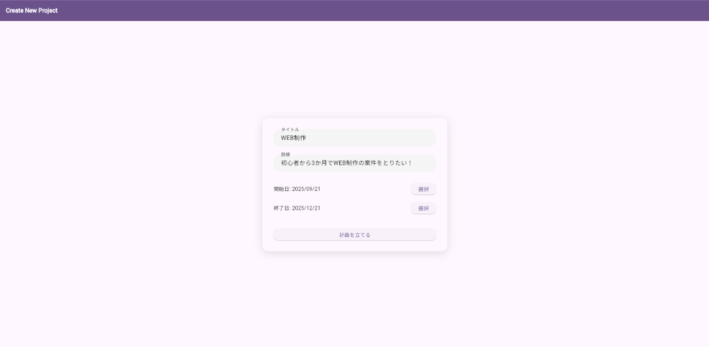
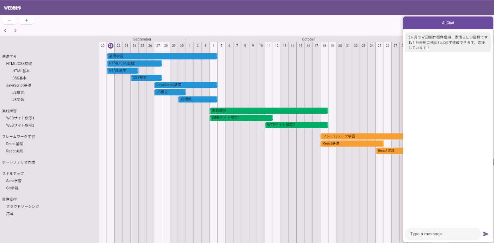
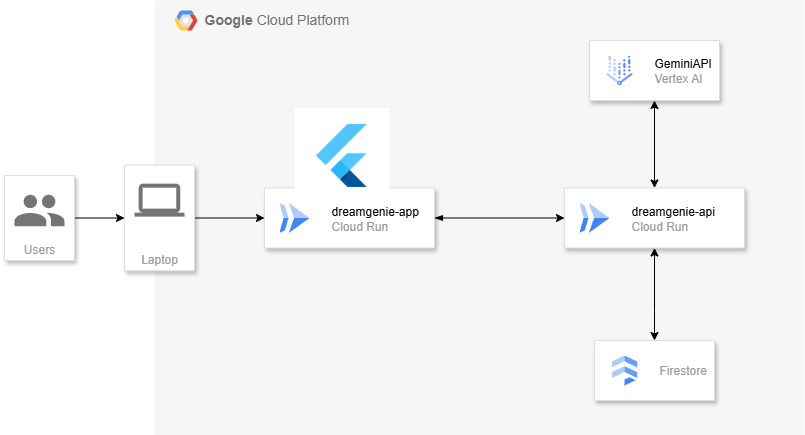

##  デモ動画(3分)

<https://www.youtube.com/watch?v=iLTyb5NqqfA>

* * *

#  🧠 はじめに：AIが「夢の設計士」になる時代へ

「やりたいことはある。でも、どう進めればいいか分からない」  
そんな声に、AIがそっと寄り添う時代が来ました。**DreamGenie** は、ユーザーが目標と期間を入力するだけで、達成までの道筋を自動で設計してくれるAIアシスタントです。さらに、「予定を変更したい」と伝えるだけで、AIがあなたの予定を再構築してくれる。

* * *

#  🔍 背景・課題・ユーザー像

##  背景：なぜ「計画」は続かないのか？

「今年こそは資格を取る」「新しいスキルを身につける」──私たちは誰もが、目標達成への意欲を持っています。しかし、いざ実行しようとすると、「具体的に何をすればいいのか」という実行計画の壁にぶつかりがちです。  
さらに、日々の生活は予測不可能な出来事で満ちています。急な仕事や体調不良で計画が狂うたびに、手動でスケジュールを調整するのは大きな負担です。市場には数多くのタスク管理ツールが存在しますが、その多くは静的なリスト管理に留まり、こうした動的な変化へ柔軟に対応できるものはまだ少ないのが現状です。

##  課題：目標達成を阻む3つの壁

この背景から、多くの人が直面する具体的な課題が浮かび上がります。

  1. **計画立案の心理的ハードル**  
壮大な目標を前に、「どこから手をつければいいか分からない」というプレッシャーは、行動への第一歩を重くします。この計画段階での挫折が、多くの夢を未達に終わらせる最初の関門です。

  2. **予定変更による「計画倒れ」**  
一度計画が狂うと、全体のスケジュールを見直す手間が発生します。この再調整のコストが積み重なることで、「もういいや」と計画そのものを放棄してしまう「計画倒れ」の悪循環に陥りがちです。

  3. **モチベーション維持の難しさ**  
目標達成までの道のりは長く、孤独な戦いになりがちです。進捗が見えにくかったり、適切なフィードバックがなかったりすると、当初の熱意は徐々に失われ、継続が困難になります。

##  想定ユーザー

  * **目標はあるが、計画立てに挫折しがちな方** ：資格取得やスキルアップを目指すも、「何から始めるか」で足踏みしてしまう社会人や学生。
  * **多忙で予定が変わりやすい方** ：急な仕事や用事で計画が崩れ、その都度スケジュールを組み直すことにストレスを感じている方。
  * **習慣化に再挑戦したい方** ：運動や学習などを始めたいが、三日坊主で終わってしまう経験があり、継続のきっかけを求めている方。

* * *

#  📱 アプリについて：DreamGenieとは？

DreamGenieは、目標達成のための「計画生成」と「柔軟な再調整」をAIが担う、クラウドネイティブなWebアプリです。ユーザーは「目標」と「期限」を入力するだけで、AIが自動的にステップを分解し、日々の予定に落とし込んでくれます。  
さらに、自然言語で「来週は忙しいから調整して」と伝えるだけで、AIが全体のスケジュールを再構成。ユーザーは計画に振り回されることなく、目標に集中できます。

* * *

#  ⚙️ 主な機能

機能名 | 説明  
---|---  
🎯 目標ベースの計画生成 | 目標と期限を入力するだけで、達成までのステップを自動設計  
🗓️ スケジュール自動生成 | 日々の予定に落とし込んだToDoリストを提示  
🗣️ 自然言語による再調整 | 「予定を変更したい」と話しかけるだけで、AIが再構成  
  
###  目標設定ページ

  * タイトル、目標、期間を入力

###  ガントチャート表示ページ

  * Create Pageの入力情報をもとにガントチャートが自動で作成される
  * AIとチャット形式でやり取りで計画の変更ができる

* * *

#  🏗️ アーキテクチャ

DreamGenieは、フロントエンドにFlutter Webを採用し、バックエンドはGCP Cloud Run上にFastAPI (Python)で構築されています。Dockerによるコンテナ化でスケーラブルな運用を実現しています。AIとの連携にはGemini APIを活用し、ユーザーの目標達成をサポートするタスクを生成・更新します。

##  技術スタック

  * **フロントエンド** :Flutter Web
  * **バックエンド** ：FastAPI (Python)
  * **ホスティング** ：GCP Cloud Run, Docker
  * **AI連携** ：Gemini API
  * **CI/CD** ：GitHub Actions, Artifact Registry
  * **認証** ：Firebase Authentication（予定）

##  システムアーキテクチャ

* * *

#  🗄️ データベース設計

  * Firestore（NoSQL）を採用し、ユーザーごとの目標・計画・進捗を柔軟に管理
  * スケジュールは「プロジェクトID」「ユーザーID」「日付」「タスク内容」「タイトル」「目標」で構成

* * *

#  🚀 拡張性と今後の展望

DreamGenieは、以下のような拡張性を持っています：

  * 🧠 パーソナライズ：ユーザーの過去の行動から計画精度を向上
  * 🔄 継続的なリマインド | モチベーション維持のための定期的な通知やフィードバック |
  * 📊 進捗トラッキング | 達成率や残タスクを可視化し、振り返りをサポート |
  * 🤝 パーソナルコーチング機能：AIとの対話を通じ、課題解決やモチベーション維持を支援
  * 📝 タスクの具体化：抽象的なタスクを、実行可能なサブタスクへAIが分解
  * 📈 進捗に合わせた計画最適化：進捗状況をAIが分析し、動的に計画を提案・修正
  * 📱 モバイル対応：Flutter Webによるクロスプラットフォーム展開
  * 🗣️ 音声入力対応：Speech-to-Text APIによる対話型操作

将来的には、「目標達成支援AI」として、教育・キャリア・健康など多様な領域への応用も期待されています。

* * *

#  🪄 おわりに：AIと夢を描く

DreamGenieは、ただのスケジュール管理ツールではありません。  
それは、あなたの「夢」に寄り添い、共に歩むAIです。  
「やりたいこと」を「できること」に変える──その一歩を、DreamGenieと踏み出してみませんか？
