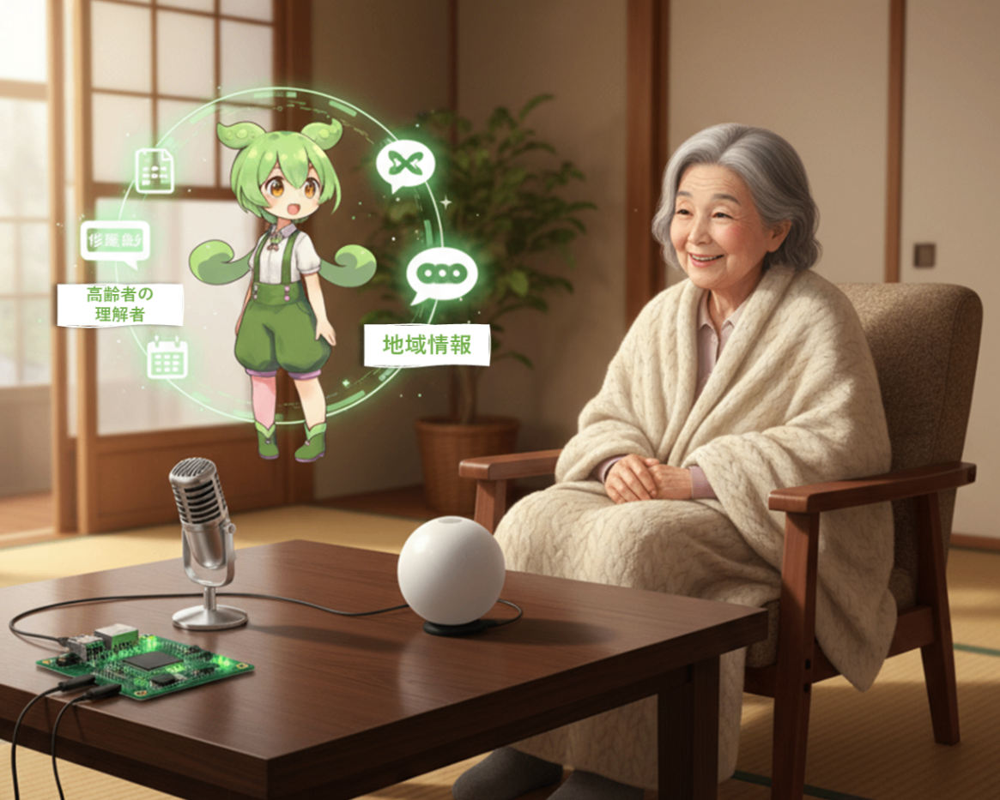
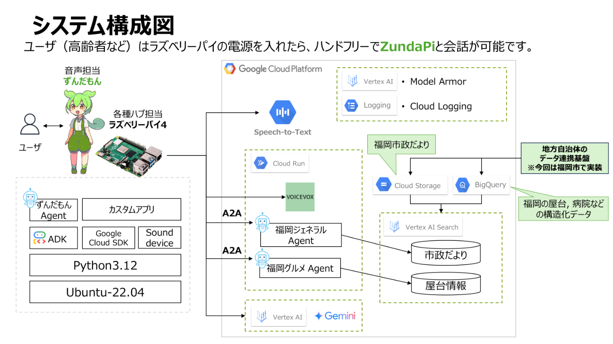
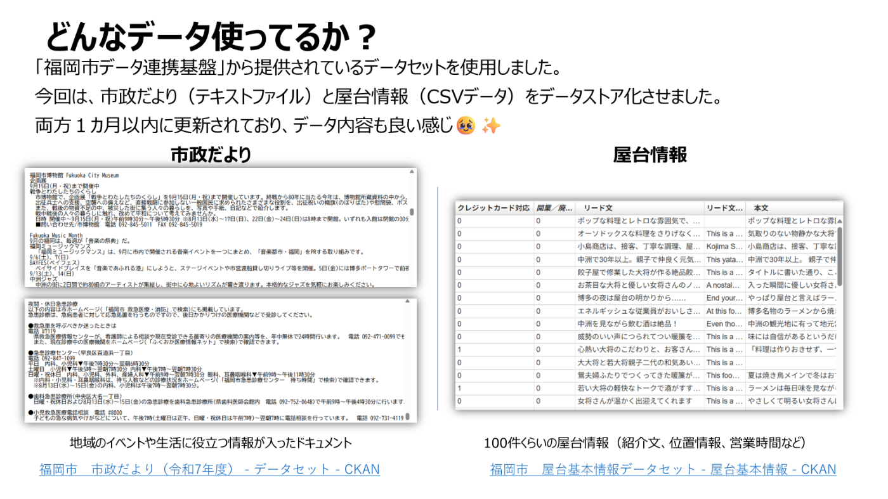
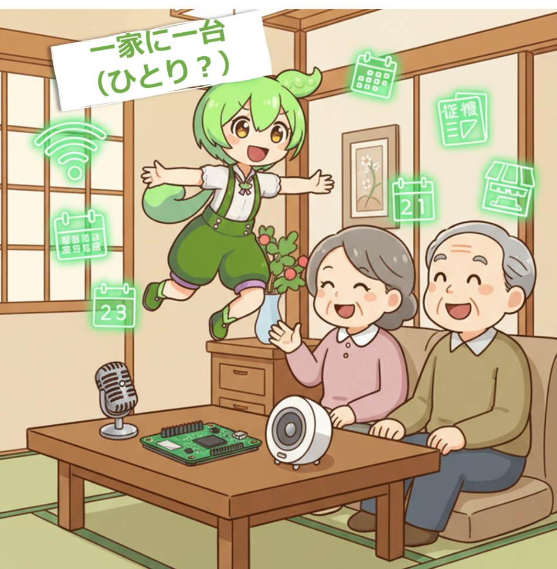

#  デモ動画（3分）

<https://www.youtube.com/watch?v=cfGY0U7cxGc>

#  ZundaPi（ずんだパイ）

**「安価なRaspberry Piで実現。Wi-Fiさえあれば動作する――  
高齢者に寄り添い、地域の情報をフォローし、孤独を減らすAIチャットボット  
『ZundaPi（ずんだパイ）』」**

* * *

##  目次

  1. 背景と課題（課題の新規性）
  2. 提案する解決策（解決策の有効性）
  3. ユースケース例
  4. 技術アーキテクチャ（実装品質と拡張性）
  5. 開発体制
  6. 今後の展望
  7. 実装したかったが見送った技術要素
  8. まとめ

* * *

##  背景と課題（課題の新規性）

**日本では高齢化が急速に進んでおり、特に高齢者の孤立化・情報格差（デジタルデバイド）は深刻な社会的課題となっています。**

  * **孤独や認知症リスク**  
会話する相手が少ないことで、精神的なストレスや認知機能の低下が懸念されます。

  * **情報格差**  
市政のお知らせ、地域イベント、生活支援の情報などはWebやスマホで発信されるものの、これらを利用できない高齢者が多数存在します。

  * **高コスト・操作の煩雑さ**  
高額な専用デバイスや複雑な操作が必要なアプリケーションは、高齢者への普及が難しい。

特に認知症への対応策は、いまだに決定的な解決法がないのが実態です。  
私自身の母方の祖母も認知症を患い、当時、母は片道2時間かけて介護や施設へのお見舞いに通っていました。日常の介護負担だけでなく、移動の時間や精神的な負担も大きく、家族にとって大きな課題でした。

また、過去に同僚から「身内の介護をしている」という話を聞き、認知症や高齢者ケアは決して特別な問題ではなく、誰もが直面しうる課題であると改めて感じました。

こうした身近な経験から、少しでも認知症の予防や孤独感の軽減につながるようなソリューションを作りたいという思いが、本プロジェクトの開発動機になっています。

このような未だ十分には解決されていない課題を、「声」「簡易デバイス」「地域データ活用」によって解決しようというアイデアが、本プロジェクトの出発点です。

* * *

##  提案する解決策（解決策の有効性）

**ZundaPiは以下の要素を持つことで課題に対処します。  
特に高齢者でも直感的に使える音声インターフェースにより、日常的に使用でき、高齢者の孤立化・情報格差（デジタルデバイド）の改善への一助になると考えています。**

特徴 | 内容  
---|---  
**音声インターフェース** | マイクに話しかけるだけで OK。高齢者でも直感的に使える。  
**地域情報の提供** | 福岡市の「市政だより」「屋台情報」などの最新オープンデータをナレッジとして使用。  
**雑談機能** | 孤独感を軽減するため、生活の話や気持ちのやりとりが可能。  
**低コスト・簡便設置** | Raspberry Pi + Wi-Fi だけで動作。PC不要。導入コスト・維持コストが低い。  
  
* * *

##  ユースケース例

**お孫さんのようであり、相棒のようでもあるZundaPiが優しく音声で応答してくれます。**

  * 高齢者：「**今日のゴミ収集の日程を教えて** 」  
→ ZundaPi：「今日は可燃ごみの日なのだ。朝8時までに出せば大丈夫だから安心してほしいのだ」

  * 高齢者：「**近所で開催される健康教室は？** 」  
→ ZundaPi：「来週の火曜日にｘｘ区役所で健康体操教室があるのだ。運動は体にいいけど、無理しないように気を付けてね おじいちゃん／おばあちゃん」

  * 高齢者：「**最近寂しいなぁ** 」  
→ ZundaPi：「ぼくがついているのだ！一緒にお話ししよう！おじいちゃん／おばあちゃんの出身はどこなのだ？」

* * *

##  技術アーキテクチャ（実装品質と拡張性）

  * **デバイス** ：Raspberry Pi4 + マイク + スピーカー（総額6千円程度）

  * **音声合成** ：VOICE VOX（ずんだもん）  
※VOICE VOXのずんだもんを選択したのは、開発者の推しキャラであることもあるのだが、高齢者にとってはお孫さん世代のような可愛げのある声というところもアピールポイントです！！

**※既にお察しかもしれませんが、タイトルの『ZundaPi』は ずんだもん と RaspberryPi の掛け合わせになります。**

  * **クラウド** ：Cloud Run, Vertex AI (Gemini), Vertex AI Search, Speech to Text, BigQuery, Cloud Storage

  * **データ** ：福岡市の「市政だより」「屋台情報など」

※複数エージェント設計で雑談／市政案内を切替。  
※全国自治体データに拡張可能。（今回は開発者が属する福岡の情報をナレッジデータとして使用しています）

* * *

##  開発体制

本プロジェクトは、会社の同僚（福岡オフィス在住）の2名体制で開発しました。

私：提案・要件定義・アイデア設計・物品調達を担当。お客様向けにITソリューションを検討・提案する業務に従事しており、企画立案や課題設定を得意としています。

同僚：実装担当（クラウド構築・コード開発）。社内で日常的にモノづくりやシステム実装を担当しており、技術的な実現力に強みがあります。

普段の業務に近い役割分担をそのまま活かしたことで、アイデア創出から設計・実装・検証までスムーズに進めることができました。

また、2名という最小限で小回りの効くチーム体制により、  
**「企画力×実装力」**  
を掛け合わせた完成度の高いプロトタイプを実現できたと考えています。

* * *

##  今後の展望

  * IoT機能のあるヘルスケア機器（血圧計や体重計など）と連携し健康データをナレッジとして使用し、ZundaPiが音声でフィードバック
  * 自治体との連携を拡大し、災害・避難情報などをナレッジデータとして連携することで、活用シーンの拡大
  * 全国の高齢者宅に普及し、一家に一台ZundaPiの時代が来て、情報社会と高齢者のハブ機能を担う

* * *

##  実装したかったが見送った技術要素

  * **ラズベリーパイ（オフライン）単独で動作する構成**  
ローカルLLMやOSSの文字起こしサービスなどを端末（ラズベリーパイなど）に導入することで、ラズベリーパイで完結させることも可能と考えています。特に高齢者の家庭では、Wifiが無いことが多いと考えており、オフライン環境下で動作することも重要と想定しております。しかし、端末のスペックがラズベリーパイでは不足してしまい、高額なジェットソンなどが必要になるため、今回の構想からは反することから見送りました。

  * **高齢者による音声入力の精度を高めるための方言データのセットアップ**  
高齢者に多い地域の特徴にあふれる方言をLLMにファインチューニングすることで、音声入力時の精度向上を考えましたが、実装の時間が無く断念しました。

* * *

##  まとめ

「ZundaPi（ラズパイずんだもん高齢者フォローボット）」は、高齢者にとってお孫さんのようであり、やさしい相棒 であるような、地域社会における 持続可能なAI活用モデル の未来を切り拓くソリューションです。

**新規性：**  
日本社会が直面している「高齢者の孤独」と「情報格差」という、未だ有効な解決策が乏しい課題に挑戦。  
身近な“声”をインターフェースとすることで、従来のスマホやPCでは解消できなかったバリアを乗り越えます。

**有効性：**  
高齢者にとって直感的で使いやすい 音声インターフェース × 地域密着データ を活用し、  
ゴミ出し日程や健康教室など日常生活に直結する情報提供と、雑談による孤独感の軽減を両立。

**実装品質と拡張性：**  
Raspberry Pi + Google Cloud Platform という安価かつスケーラブルな構成で、  
個別の家庭から自治体全体、さらには全国への展開まで拡張可能な仕組みを構築。

**🌱 一家に一台（ひとり？）、ZundaPi！ 🌱**

**最後まで読んでいただき、ありがとうございました 🙏  
「ZundaPi」のようなソリューションが少しでも多くの方に届くようになっていく世界になると嬉しいです。**
