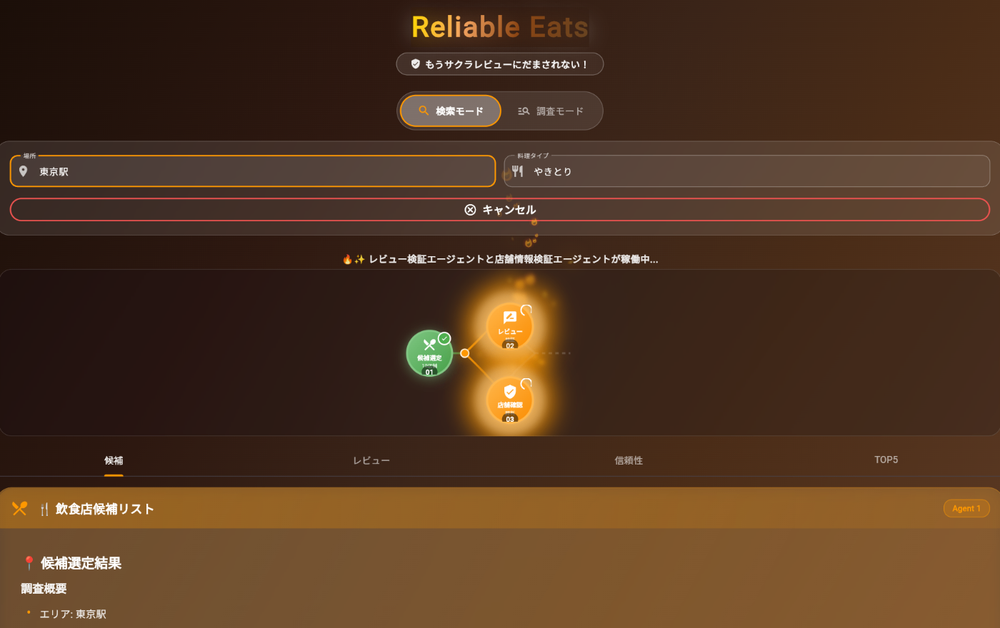
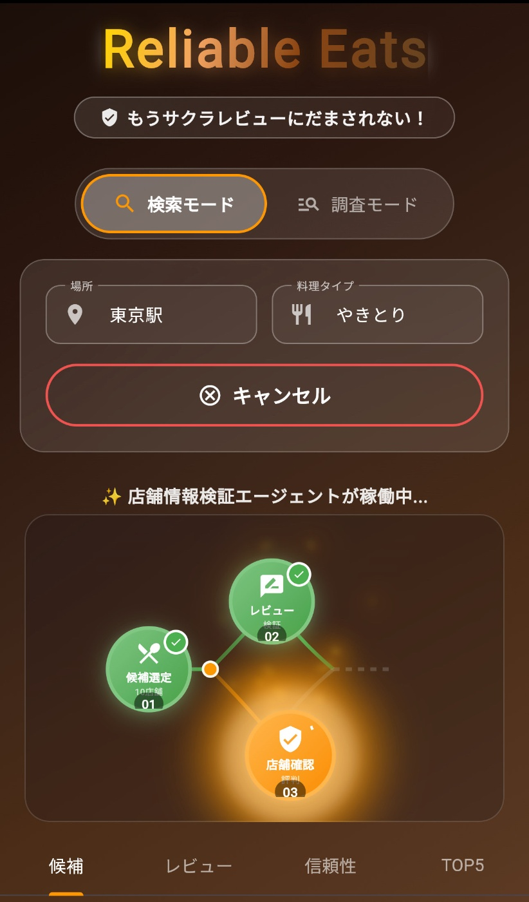
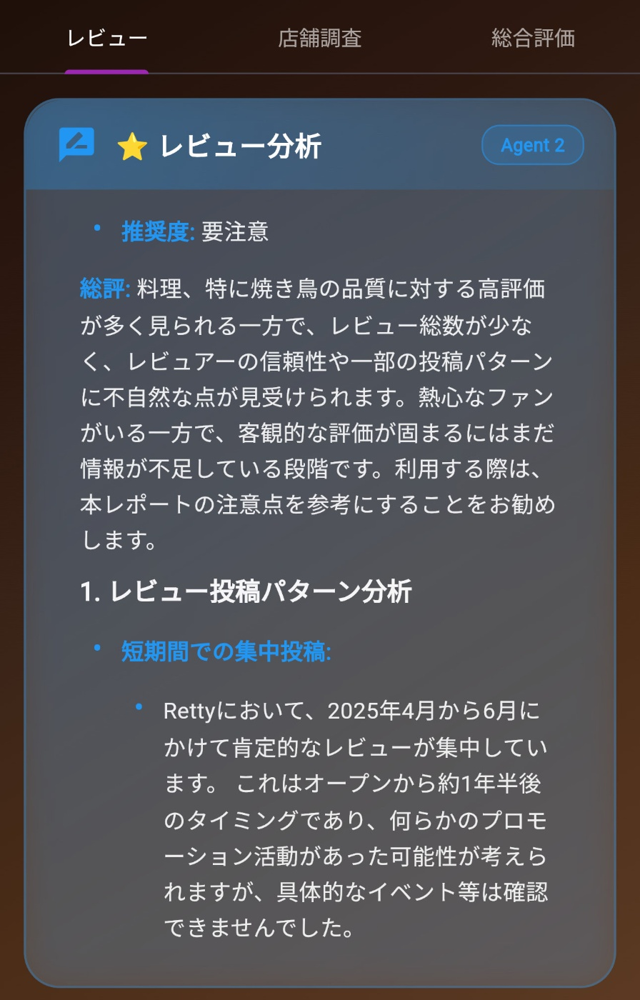
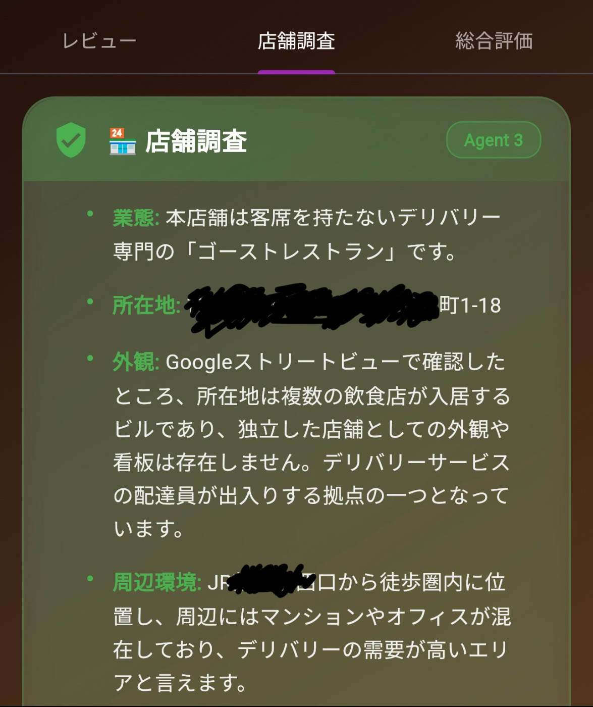

#  🍽️ もうサクラレビューに騙されない！AI×並列処理で飲食店の"本当の評価"を見極めるWebアプリ

##  はじめに

グルメサイトで高評価の新しいお店に行ったら、味も雰囲気もイマイチ...今日は美味しいものを食べたかったのに！ そんな経験ありませんか？

私も最近、高評価だった飲食店に行って失敗しました。後で調べたら、開店直後に投稿された高評価レビューの多くが、作成したばかりのアカウントからのものでした。😅

また、デリバリーの場合はさらに状況は悪く、冒険をすると、外すことの方が確率高いです・・😢

「複数のグルメサイトを全部チェックするのは面倒...」  
「レビューが本物か見分けるのが大変...」  
「結局どの店が本当に良いのか分からない！」

そんな課題を解決するために、**4つのAIエージェントが並列処理で徹底調査する** Webアプリ「Reliable Eats」を開発しました！

##  🎯 アプリの特徴

#  WEB

#  モバイル

###  2つの動作モード

####  1\. 検索モード

「東京駅 やきとり」のようにエリア×ジャンルで検索すると、信頼できるTOP5の飲食店を提案します。

####  2\. 調査モード

特定の店舗名を入力すると、その店の信頼性を徹底的に調査します。  
(デリバリーの場合はゴーストレストランの該当性も調査)

###  4つの専門AIエージェントによる並列処理

このアプリの最大の特徴は、**4つの専門AIエージェントが役割分担して並列処理** することです！

##  🏗️ システムアーキテクチャ

###  使用技術スタック

  * **Frontend** : Flutter Web（Material Design 3）
  * **Backend** : Python FastAPI + Google Cloud Run
  * **AI** : Vertex AI（Gemini 2.5 Flash/Pro）
  * **情報収集** : Web Grounding機能
  * **Hosting** : Firebase Hosting

###  なぜこの技術スタックを選んだか

####  1\. Flutter

飲み歩きが趣味の**自分自身の課題解決** も目的のひとつだったため、外出先でも利用できるようモバイル対応を重視しました。そのため**クロスプラットフォームで開発できるFlutter** を採用しました。

####  2\. Gemini 2.5 pro + Web Grounding

Web Grounding機能により**リアルタイムでWeb情報を収集** でき、Gemini 2.5 Proを活用することで、より深度あるレビュー分析や店舗情報の調査を可能にしました。

####  3\. 並列処理による高速化

エージェント②と③を並列実行することで、処理時間を短縮しました。

##  💡 技術的な工夫ポイント

###  1\. レビューの信頼性調査エージェント

エージェント②では、以下の観点でレビューの信頼性をチェックしています：

  * **サクラレビューの可能性**
  * **レビュアーの信頼性**
  * **ネガティブレビューの内容分析**

出力例  

###  2\. 店舗の信頼性調査エージェント

エージェント③では、以下の観点で店舗の信頼性をチェックしています：

  * **設立年月日**
  * **営業実績**
  * **地元での評判**  
（デリバリーの場合）
  * **ゴーストレストランではないか**
  * **店舗の実在性**
  * **運営会社**
  * 

###  3\. リアルタイム処理状況の可視化

ユーザーが待ち時間を感じないよう、各エージェントの処理状況をリアルタイムで表示：

###  検索結果の例

「東京駅 やきとり」で検索した結果：

順位 | 店名 | 独自スコア | レビュー信頼度 | 特徴  
---|---|---|---|---  
1位 | やきとり〇〇 | 4.8/5 | ⭐⭐⭐⭐⭐ | 地元民に愛される創業〇〇年の老舗。味・接客も間違いないとの高評価が多い。  
2位 | △△屋 | 4.5/5 | ⭐⭐⭐⭐ | 昨年できたばかりだが、高評価が続いている。味に対する具体的なレビューも多い。多数の投稿があるレビュアーも多く、サクラレビューの傾向はみられない。  
3位 | □□ダイニング | 3.6/5 | ⭐⭐ | 雰囲気や夜景に関するものレビューが多く、味に関する評価が少ない。高評価の割にはコメントが少なく、「クチコミ投稿でドリンクサービス」のようなインセンティブがある可能性があり、信頼性に欠けるものも見られる。  
  
##  💡 工夫したポイント

  * **マルチエージェント設計** ：役割ごとに分担し、多角的な分析を実現
  * **Web Grounding** ：様々なWeb情報を総合して信頼性を担保。人間では見切れない情報量の確保
  * **Streamingレスポンス** ：処理の進行状況をリアルタイムに表示
  * **規約対応** ：食べログ点数を直接表示せず、参考比率としてのみ利用

##  🔮 今後の展望

現時点では飲食店にフォーカスしていますが、同じ仕組みを応用することで以下のような分野にも展開できると考えています。

  * 美容院や病院など、生活サービスの口コミ
  * 宿泊施設や旅行のレビュー
  * ECサイトの商品レビューの信頼性検証

今後はユーザー体験を改善しつつ、より幅広いジャンルで役立つサービスへと拡張していきたいです。

##  既知の問題

通信環境により、まれにエージェントの順序や出力が乱れる場合があります。  
→ 提出版とは、別の普段使いバーションでは修正済です！

##  まとめ

「Reliable Eats」は、AIの力で飲食店選びの失敗を減らすことを目指したWebアプリです。

4つのAIエージェントが並列処理で徹底調査することで、サクラレビューに惑わされない、本当に信頼できる飲食店情報を提供します。

技術的には、Gemini 2.5とWeb Grounding機能を活用し、リアルタイムで信頼性の高い情報を収集・分析しています。

##  技術タグ

`#GoogleCloud` `#VertexAI` `#Gemini` `#Flutter` `#CloudRun` `#Firebase` `#WebGrounding` `#AIAgent` `#並列処理`

* * *

**Google Cloud AI Agent Hackathon 2025 参加作品**
