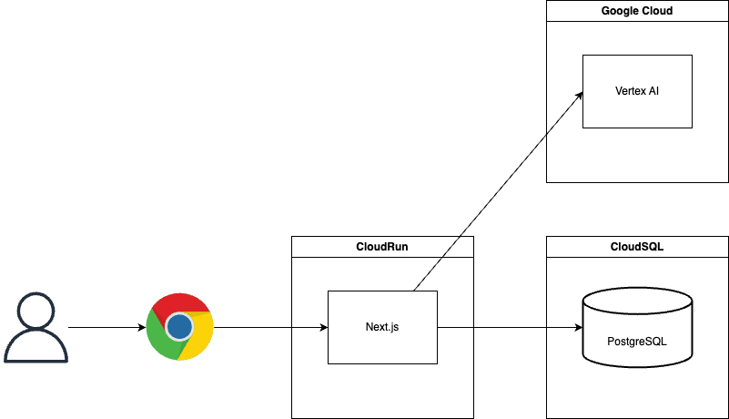

この記事は、[**第3回 AI Agent Hackathon with Google Cloud**](https://zenn.dev/hackathons/google-cloud-japan-ai-hackathon-vol3) への挑戦として開発したプロダクト「**lazy-bear** 」を紹介する記事です。

##  開発するに至った背景

資格取得は、キャリアアップやスキル証明のための重要な手段です。多くの人が「効率的に学習を進め、最短で合格したい」という目標を掲げて挑戦します。合格への道のりは、明確な学習計画を立て、それに沿って着実にタスクをこなしていくことで、より確実なものになります。

##  課題

しかし、多くの挑戦者が最初の「計画作り」の段階で大きな壁にぶつかります。

  * **どこから始めるか分からない** : 試験範囲の広さや、膨大な参考書の前に、何から手をつければ良いか分からず立ち尽くしてしまう。
  * **タスクの分解が難しい** : 全体の目標を、日々の具体的な学習タスクにまで落とし込む作業が困難で、現実的な計画が立てられない。
  * **計画の形骸化** : 一度計画を立てても、進捗の遅れや予期せぬズレによって形骸化し、やがて見直されなくなる。

結果として、多くの学習者が精度の高い計画がないまま学習を開始し、モチベーションの維持に苦しみ、最終的には目標達成を先延ばしにしてしまうという課題がありました。

##  その計画、AIに任せてみませんか？

もし、この最初のハードルである「精度の高い計画作り」さえ乗り越えられれば、もっと多くの人が自信を持って学習のスタートラインに立てるはず。

私たちは、そんな「計画倒れ」のストーリーを阻止するために、AIの力を借りることにしました。

##  AI学習プランナー `lazy-bear` のご紹介

そこで生まれたのが、AI学習プランナー `lazy-bear` です。  
ユーザーが「取りたい資格」と「学習期間」を入力するだけで、AIがあなたにピッタリの学習計画を自動で生成し、ガントチャートで分かりやすく見せてくれます。

これさえあれば、もう計画段階で挫折することはありません。すぐに学習のスタートラインに立つことができます！

##  こだわりのアーキテクチャ

今回のハッカソンは期間も短く、チームにインフラ専門家もいなかったため、「**いかにアプリケーション開発に集中できるか** 」が鍵でした。そこで、Google Cloudの強力なマネージドサービスを中心にアーキテクチャを組むことにしました。

アプリケーションの心臓部は、Next.jsで構築。そして、それを支えるのが以下のGoogle Cloudのサービスたちです。

  1. **Cloud Run**

     * 私たちのNext.jsアプリは、コンテナ化してCloud Run上で動いています。サーバーの構築や管理、スケーリングを全部よしなにやってくれるのが良いポイントと思いました。おかげで、私たちはコード実装に集中できました。
  2. **Cloud SQL for PostgreSQL**

     * AIが作った学習計画を保存しておくためのデータベースです。Cloud Runから安全に接続できるフルマネージドなPostgreSQLで、セットアップが簡単でした。
  3. **Vertex AI (Gemini Pro)**

     * このプロジェクトの肝であるAI Agentです。学習計画の生成には、Vertex AIのGemini Proモデルにお願いしています。特に、**Function Calling** という機能を使うことで、AIに「こういう形式でデータを返してね」とお願いできるのが非常に強力でした。このおかげで、AIからの出力をスムーズにアプリケーションで扱うことができています。

##  AIの精度を高めるための「コグニティブ・デザイン」という工夫

`lazy-bear`の開発中、私たちはVertex AIのレスポンスが時々不安定になるという課題に直面しました。「もっと的確な学習計画を生成してほしい…」と。

原因を探ると、私たちの「プロンプト（AIへの指示文）」の設計、特に**Context（文脈）**の不足にあると分かりました。単に「あなたは優秀なプランナーです」と役割を与えるだけでは、AIは私たちの意図を深く理解できなかったのです。

そこで導入したのが、**コグニティブ・デザイン** という考え方です。これは、AIに単なる指示ではなく、「思考のレンズ」を与えるアプローチです。

  * **前提** : 私たちが信じる価値観は何か
  * **状況** : 今、何が起きているのか
  * **目的** : 何を達成したいのか
  * **動機** : なぜそれを目指すのか
  * **制約** : 守るべきルールは何か

これらの要素をプロンプトに組み込むことで、AIは私たちのプロジェクトの価値観や背景を理解した上で、一貫性のある深いアウトプットを返してくれるようになりました。この工夫により、AIが生成する学習計画の精度と安定性は大きく向上しました。

##  これからの `lazy-bear`

今回は「AIによる学習計画の自動生成」という基本的な機能を中心に実装しました。しかし、`lazy-bear`の夢はまだまだ広がります！

次に目指すのは、**あなたの進捗を見守り、計画を自動で最適化してくれる機能** です。

  * **計画の自動再調整** : 進捗の遅れや、急な予定の追加をAIが検知。「大丈夫？計画を調整しようか？」と提案し、常に最適な学習ルートを示してくれます。

`lazy-bear`が、一度きりの計画作成ツールではなく、学習期間を通じて常に寄り添ってくれる、もっと賢く、もっと頼れる学習パートナーへと成長していく予定です。

##  まとめ

今回のハッカソンを通じて、Google Cloudのサービスを組み合わせることで、アイデアを素早く、そして楽しく形にしていくことができると実感しました。

この記事が、これからAIプロダクト開発に挑戦する誰かの、ちょっとしたヒントになれば嬉しいです。

最後までお読みいただきありがとうございました！
