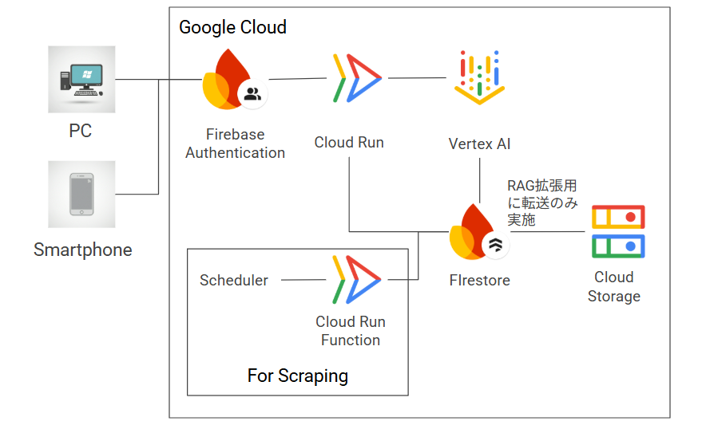
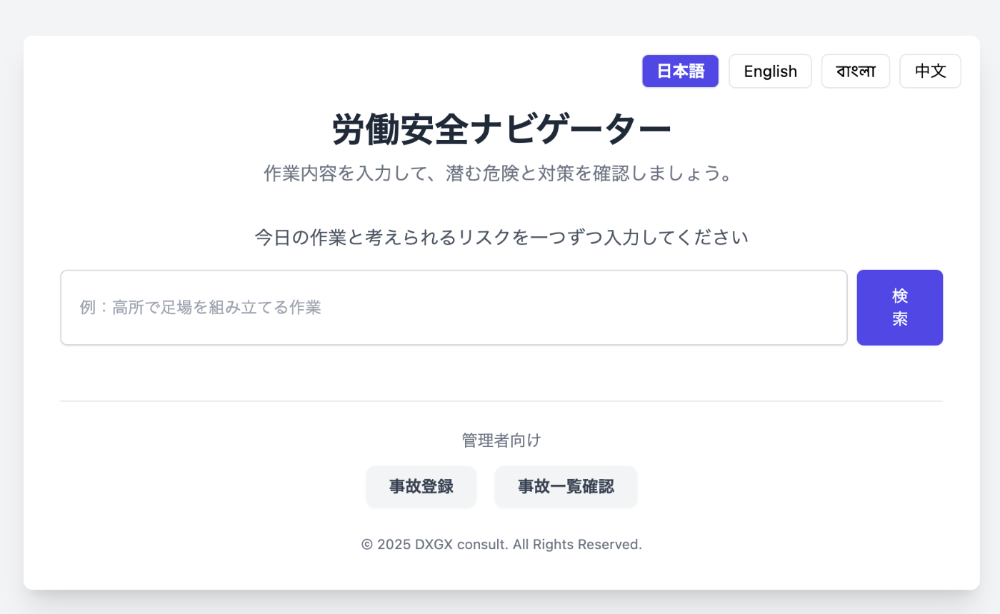

#  はじめに

本Hackathonに参加するにあたって、私が経験した作業現場での悲しい事故を少なくするという目的はぶれないように企画、開発を実施しました。  
本プロダクトが労働災害の減少に少しでも役立つと共に、本プロダクトが比較的容易にできたことを紹介することで、現場作業のベテランといったデジタルの知見が少ない方でもプロダクト制作を試してみようと思っていただければ嬉しく思います。

#  紹介ムービー

YouTubeに公開した本プロジェクトの説明は以下です。画面の推移などはこちらをご覧ください。  
<https://www.youtube.com/watch?v=QH_ipdxfYbk>

#  アーキテクチャ

#  今回認識した、Geminiに任せたいこと、人間がした方がいいこと

##  Geminiに任せたいこと

  * class, functionといった小さい単位のコード生成（これは早いです。ありがたい）
  * 最新情報を与えた上での、バグ修正
  * テストケースの生成（大量のダミーデータなど）

##  人間がした方がいいこと

  * プロジェクトの企画、設計
  * 技術選定（Geminiは数ヶ月前の情報に基づくため）
  * 最新技術を使う場合のコード修正（例として、今回Geminiはapiでgenaiを知りませんでした。こうなると、この部分は人間が作成した方がいいです。genaiを使ったコードを示しても、正解コードはほぼ出ないと思ってください）
  * テスト、QA工程（プログラム作成のエンジニアはこちらに移行しそう）

#  本プロジェクトの想定クライアント

海外で建設（EPC）プロジェクトを持つ企業を主に想定しています。

  * プラント企業
  * 商社
  * エネルギー企業  
また、労働関係のデータを集約している厚生労働省などの省庁にも導入いただけると思います。

#  社会的な問題

##  後を絶たない労働災害による死亡

  * 国際労働機関（ILO）のレポートによると、世界で1,000人/日が労働災害事故によって命を落としている  
<https://www.ilo.org/ja/media/71676/download>
  * 私も中東、アジアなどで、海外からの労働者の労災を経験
  * 作業員の作業安全意識の向上は急務

##  作業員の多国籍化、若年化

  * 英語と日本語が使えないことも多い
  * ベテランは知識があるが、その知識をわかりやすく説明する能力を保持しているとは限らない
  * 暗黙知を形式知（動画、画像）に！

#  解決したい課題

  * 作業環境の改善  
もちろん重要ですが、このHackathonの期間で解決するプロダクトを想像できませんでした。
  * 作業員の安全意識の向上  
こちらは、現場で実施する朝会、TBM（Tool Box Meeting）の代替・補助ソリューションを期間内で簡単なプロダクトを制作できると考えました。

##  作業員の国籍

中東、アジアのプロジェクトは、インド、バングラディッシュの作業員が多い。英語も使えるが、ベンガル語があるとありがたいという声を現地で聞いていました。

#  要件定義

個人開発なので一人アジャイルで頭の中で作るでもよいのですが、要件定義は簡単にしておきました。

##  業務要件

  * 作業内容の送信
  * リスクと施策の受信
  * 自社（現場）で発生した事故の登録
  * 登録した事故の確認

##  機能要件

  * 公的なサイトのスクレイピング
  * 入力画面
  * 4か国語対応
  * 公的なデータベースを根拠とした施策の提示
  * 最優先施策の動画表示
  * 生成AIからの一般的な対策の提示
  * 自社で発生した事故からの対策の提示
  * 印刷できるPDFの発行
  * PDFは対策毎に画像
  * 管理者画面 
    * 事故の登録
    * 事故の確認

##  非機能要件

  * 検索ボタンを押してからリスク・施策の表示までの時間は1分以内を目標
  * 文書表示ボタンを押してからPDFの表示までの時間は2分以内を目標
  * 公的なデータベースは毎月更新
  * 作業員はスマートフォンからの確認が主のため、スマートフォンで見やすい画面
  * 宗教などに配慮して、動画はピクトグラムを中心
  * クラウド使用料はできる限り低く抑える。よって、Veo3でリクエストごとに動画生成することはしない。  
**1つの8秒動画生成（効果音付き）で6ドルかかります。。。**
  * APIキーの管理の観点から、可能な限り使用しない

#  技術仕様

##  選択基準

できるだけライブラリなどのアップデートを少なくしたいため、至近で一般公開となったものを多く選択することにしました。また、Gemini APIもキーの管理の観点からAPIを取得せず、vertex aiのGemini APIを使うことにしました。

##  使用した技術

  * node.js 22 
    * playwright : スクレイピング用
    * puppeteer : PDF作成用
  * @google/genai 
    * gemini-2.5-flash : 回答生成用
    * gemini-2.5-pro : カテゴリ分類用
    * gemini-embedding
    * veo 3
    * imagen 4
  * cloud run
  * cloud run functions
  * firestore
  * firebase authenicator
  * cloudstorage

#  作成方法

##  チームビルディング

今回は現場のリーダーのような人が、自分でプロダクトを作ることを想定したので、私もチームは作らず、vertex ai studioのgemini-2.5-proと共に一人で作成しました。

##  なぜvertex aiの中のchatを使ったか？

費用を正確に把握する目的と、プロンプトを保存できる仕組みがあるからです。会社内ですと、引継ぎは重要であるため、履歴が個人に残ることが大切と考えました。

#  作成工程

##  公的データのfirestoreへの保存

###  サイトの選定

日本で災害事例がまとまっているサイトはいくつかありますが、データの仕様許可などの面から、  
<https://anzeninfo.mhlw.go.jp/anzen_pg/sai_fnd.aspx>  
からデータを取得することにしました。  
公共データ利用規約  
<https://www.digital.go.jp/resources/open_data/public_data_license_v1.0>  
を遵守し、プロダクトの出力は厚生労働省のサイトを出典としている旨を明記しています。

###  スクレイピング

最初にはまったのがここでした。私の知識が古いため、BeatifulSoup + Scrapyくらいしか浮かばず、Geminiに利いたところ、Puppeteerがいいと推奨されました。

####  puppeteerとの格闘, playwrightとの遭遇

Geminiにサイトの構成を細かく教え、挙動がおかしい場合は推定原因を伝えて、ローカルでは動くコードが完成しました。いざ、cloud run functionsにアップロードするとエラーが頻発。原因がわからず、1週間を潰しました。  
そこで、自分で他の技術が無いかを調べて、playwrightを発見。Geminiにコードを描いてもらい、デプロイも数回で完成。（1時間で完成。時間返して。。。）無事にfirestoreへ保存。  
**技術選定はAI頼らず、自分ですべき**  
という教訓を得ました。

####  Cloud Run functions へのデプロイとスケジュール化

Cloud Run functions jobにデプロイし、毎月実行にスケジュール化して、スクレイピング部分は完成。

##  災害事例のカテゴリ分類

###  方針

あらかじめカテゴリをこちらが指定する方法が王道。ですが、それすら面倒なので、この部分もGeminiに任せることにしました。

###  方法

  1. 事例データのうち、内容、原因の両データが揃っているデータをGemini 2.5 proのプロンプト内に入力し、50カテゴリを生成。
  2. 1のデータを50カテゴリに分類。
  3. 各カテゴリの内容、原因、対策の概要を分類したデータから生成。

##  カテゴリ内データの加工

  1. 内容、原因、対策を他言語化。Translate-to-textではなく、Gemini 2.5 Proにプロンプトで入力し、json形式にして、出力。
  2. 入力される作業内容との類似度検索のため、gemini-embeddingを用いてベクトル化。デフォルトの3072次元にしましたが、検索速度から考えると、もっと小さくても良かったかもしれません。

##  対策の動画作成

ユーザーが入力する毎に対策の動画を作成するのは、費用面と速度面から実用的ではありません。そこで、Veo3を用いて、各カテゴリの対策1つずつをピクトグラムで動画を生成**（50カテゴリ✖️6ドル＝300ドル）**。cloud storageに保存し、そのアドレスをfirestoreのカテゴリに紐付けさせています。

##  入力データとカテゴリの類似度検索

Google Cloudのベクトル検索は今回用意するデータ数から考えると、費用対効果がよくないので、採用を断念。  
Geminiにコサイン類似度検索のコードを出力してもらい完了。

##  PDFに出力する画像の生成

nano bananaを使用したかったのですが、Gemini APIが必要と理解したため、断念。  
Imagen 4を用いるコードをGeminiに生成してもらい完成。

##  対策のPDFへの出力

イメージが全くわかず、最初からGeminiに相談。これはPuppeteerの得意分野とのことで、コード生成すぐに終了（楽ですね）。出力スタイルなどを確認しながら修正指示し、完了。

##  ページの作成

ここからはVertex AIのstudioから離れ、一般サービスのGeminiのCanvasを使いました。Webサイトの作成の場合は、プレビュー機能もあるこちらの方が便利です。

  1. トップページ、トップページ内への対策の表示
  2. 管理者ページログインの追加
  3. 事故登録ページ
  4. 事故登録確認ページ  
これらもテストを含めて1日程度で終了。ここは人間が作るより圧倒的に速いですね。

#  完成

#  CAPEXとOPEX

##  CAPEX

Veo 3の費用が主です。使っていない動画や失敗した動画もあるため、150枚作成してしまい、900ドル。。。提供いただいたクレジットを超えてしまいました。（実際は50枚しか使っていないので、私のミス）  
動画を作成する場合には、その元になるデータの確認とテストを小さく実施することをお勧めします。  
コード生成は60万トークンくらいなので、100万トークンあたり入出力合わせて10数ドルのため、コストにはほとんど反映されません。  
ですので、テキストベースでチャットするのは、人件費はかかりますが、クラウドサービスの費用としては無視してOKです。

##  OPEX

上記の通り、テキストのやりとりはほぼ無視してOK。問題は、PDF生成の際のピクトグラム画像生成。1マイ0.04ドルなので、1文書15画像生成として、0.6ドル/文書。  
例えば、1000人の作業員がいる現場で一人1回生成するとすれば、600ドル/日。この費用を削減する工夫は必要ですね。

#  今後の改良点

あげればキリがないのですが。。。

  * 作業の入力が複数になっても対応可に。
  * カテゴリ検索の精度向上
  * 元となる公的データの拡充（オーストラリアがOHSの本場なので、そのデータなど）
  * 自社で登録したデータのRAGの構築（現在はプロンプト内で登録データを全て見るように指示している）
  * 画像生成コストの削減（対策をキー、画像を値としたfirestore DB作って、同じような対策の画像は生成しないようにする、など）
  * プロダクトとして完成度を高めるため、テストの数をこなしたい

#  終わりに

AIと一緒にコーディングするのは、AIの知識の古さには留意が必要ですが、おおまかな部分は正しいため、優れたプログラマーと仕事をする感覚でした。  
プログラムの知識がない方も、一度経験すれば、二度三度と繰り返すことは容易だと思います。  
AIで面白いことできそうというフェーズから、費用対効果をしっかりと考えたビジネスフェースに移行してきた感じがあり、大規模ならベンダーが提供するAIエージェント、小規模なら自分たちで構築する簡易エージェントを使って、ビジネス価値を創出できると感じました。  
最後に、この場を提供していただいた、主催のZenn様、協賛のGoogle Cloud Japan様に深く感謝いたします。ありがとうございました。
