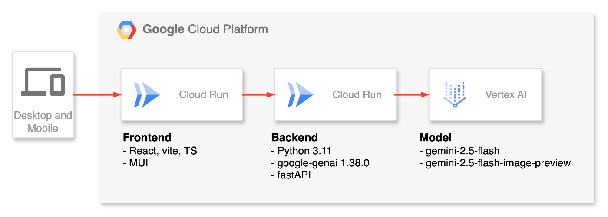

#  1\. デモ動画(3分)

<https://youtu.be/yMh0kqj1-UY>

#  2\. 背景・課題

初めまして。ヘビースモーカー酒井です。

現在、私たち喫煙者を取り巻く環境は、大変厳しいものとなっています。  
止まらないタバコの値上げ、あの角にあったはずの喫煙所の撤去、路上喫煙に対する罰金、吸えない居酒屋、そして新幹線の車両から喫煙室がなくなったこと。東京-大阪間の2時間半は強制禁煙宣告を受けることになりました。昔は席で吸っていたんだってよ。それなのに！！

およそ年間2兆円の税収を生み出している我ら同志に対し、世間の仕打ちがあまりにも酷ではないか。

そんな仕打ちに幾度となく打ちのめされ、禁煙を決意したことも数知れず。  
しかしどういうわけか、これだけの目に合っていてもなお、私の手にはいつもタバコが握られていた。

禁煙はとても難しいです。例えば以下の課題が私の禁煙活動にとっての大きな障壁です。

  * ニコチンの依存性が私を掴んで離さない。
  * 身体への影響が顕在化するまで長い時間を要し、悪影響の見積もりが激甘。
  * 上司が吸うから。

このように、そろそろ禁煙したいと思いつつも中々やめられない方はたくさんいると思います。  
そこで、私は禁煙を志すすべての方のために、AIを駆使して少しでも禁煙への助力となるサービス  
**「No More Smoking ~今の喫煙習慣を続けると20年後のお前はこうだ!~」** を、このハッカソンの場をお借りして作成しようと考えました！

#  3\. ソリューション

「No More Smoking」では、以下の課題を解決します。

  * 身体への影響が顕在化するまで長い時間を要し、悪影響の見積もりが激甘。

簡単なカウンセリングへの回答と現在の顔写真をアップロードすることで、  
喫煙習慣が20年後のあなたの身体や外見に及ぼす影響をAIで推測します！

20年後の顔写真のBefore,After比較および、現在の喫煙習慣がもたらすであろう影響をレポートに整理します。

##  3.1. アーキテクチャ

下記がアーキテクチャ図になります。  
実行環境はフロント・バックエンドともにCloud Runを選定。  
それぞれ、GCRにDocker Imageを登録し、そのイメージを元にデプロイしております。

##  3.2. 機能

大きく３つの機能を提供しています

  1. 20年後の顔写真比較機能
  2. 現在の喫煙習慣が及ぼす悪影響についてのレポーティング機能
  3. 現在の顔写真の肌の状況や特徴から喫煙による悪影響の診断機能

各機能ごとにプロンプトを用意し、AIで推論を実施しています。  
処理は以下のシーケンスに沿って実行されます。

##  3.3. UI

  1. カウンセリングフォームUI 
     1. 年齢や喫煙習慣について回答できる
     2. 画像アップロードが可能

  2. 診断結果UI 
     1. 画像のBefore / After表示
     2. 診断結果のレポーティング

#  4\. 最後に

##  4.1. 残課題

  1. プロンプトの最適化が不十分 
     1. 明らかに20年後の年齢とは思えない外見が出力されることがある
     2. プロンプトにて何歳の人物の画像を生成すべきか明示的に示したり、どのような特徴が発生するか細かに指示することで揺らぎを抑えたい
  2. 医学的根拠が希薄 
     1. LLMが学習済みの内容からしか解答を生成させていないので医学的根拠はかなり薄い
     2. RAGやWebサーチ、ファインチューニングしたカスタムモデルの使用などを通じて最適化を図りたい
  3. UI・UXが寂しい 
     1. フロントエンドエンジニアとしてこだわりたかったがタイムアップです
     2. 今後もちょくちょくメンテナンスしていき、素敵なサービスに進化させていきます

##  4.2. さて私は禁煙できそうか？

このシステムを実際に何度も自分の写真を用いて実行してみた。

20年後にそんな容姿であってたまるかぁぁあ！！と思うような  
ショッキングな画像も度々生成され、一定の恐怖感を覚えることができました。  
また、「大幅に寿命が短縮されることは避けられない」などといった、辛辣な診断結果もあり、少々タバコと距離を置きたくなるような気持ちになれました。

作りきれてよかったです  
ハッカソンの場を設けてくださりありがとうございました！

疲れました。タバコ吸ってきます。
