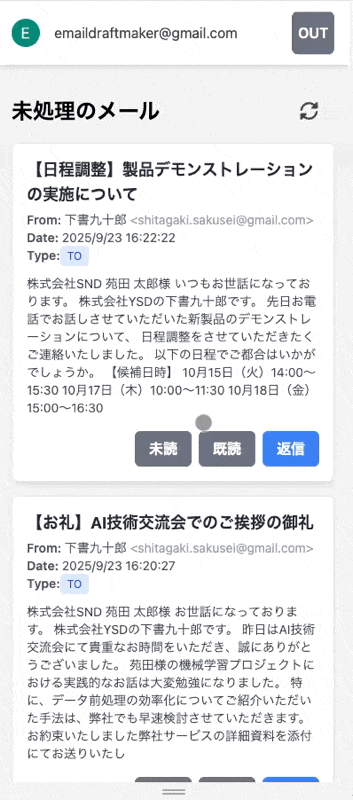
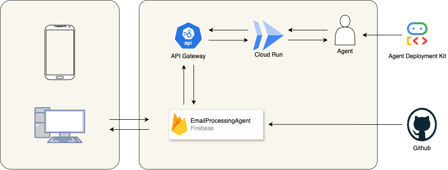

#  1.概要

「...株式会社 …様  
お世話になっております。…の〇田△人です。」

多くのビジネスパーソンが経験する、メール作成時のあの一瞬のためらい。適切な敬語を選び、相手に失礼のない文面を考える時間は、一通あたりわずか数分かもしれませんが、積み重なると相当な時間になります。  
そして気づけば、返信待ちのメールが受信トレイに溜まり、重要な商談や提案への返答が遅れてしまう。このような状況は決して珍しいことではありません。  
私たちは、メール作成・返信の煩雑さによって生じる機会損失に注目し、AIを活用したメールドラフト生成エージェントを開発しました。調査を進める中で、メールの未処理による影響は個人レベルの問題にとどまらず、企業の生産性、ひいてはビジネス機会全体に大きな影響を与えていることが明らかになりました。  
本記事では、この課題解決に向けたメールドラフト生成エージェントの開発プロセスと、限られた開発期間内で実現した技術的工夫について詳しくご紹介します。  
<https://youtu.be/MOhlTz3Zths>

#  2.課題

多くのビジネスパーソンが、日々の業務の大半をメール処理に費やしています。これは単なる感覚的な問題ではなく、データがその深刻さを示しています。

一般社団法人日本ビジネスメール協会の[「ビジネスメール実態調査2025」](https://businessmail.or.jp/research/2025-result/)によると、ビジネスパーソンが1日にメールの送受信に費やす時間は平均で「約2時間26分」、メール1通の作成にかかる時間は平均「約6分」と報告されています。

なぜ、たかがメール1通に6分もの時間がかかるのでしょうか。[2024年度に行われた同調査](https://businessmail.or.jp/research/2024-result/)によれば、多くの人がメールを送る前に「正しく伝わるか」や「相手を不快にさせないか」といった心理的安全性への配慮、つまり思考コストを抱えており、まずメールを開き、返信するかを判断し、どのような内容のメールを作成するか考える0→1の生み出すプロセスに多くの時間を費やしている実態が浮かび上がります。

項目 | 数値 | 算出根拠  
---|---|---  
1日の平均メール処理時間 | 約2時間26分 | ビジネスメール実態調査2025  
年間平均労働日数 | 245 日 | 365日 - 年間休日120日 (仮定)  
平均年収(正社員) | 523 万円 | 国税庁「令和4年分 民間給与実態統計調査」  
算出時間単価 | 約 2,668 円 | 523万円 ÷ (245日 × 8時間)  
メール作業に費やす従業員1人あたりの年間コスト | 約160万円 | 約2時間26分 × 245日 × 2,668円  
対象労働者数(推定) | 約 4,000 万人 | 国内のオフィスワーカー人口から推定  
国内年間総経済損失額(推定) | 約 63兆7,000億円 | 約160万円 × 4,000万人  
  
この約63兆円という数字は、日本（2025年計算）GDPの約10.6%に相当します。これは、本来であれば新製品の開発、顧客との対話、戦略策定といった高付加価値な活動に使われるべき知的資本が、定型的なコミュニケーションの摩擦によって失われていることを意味します。この巨大な機会損失こそ、私たちが解決すべき課題です。  
引用元：[内閣府 国民経済計算（GDP統計）](https://www.esri.cao.go.jp/jp/sna/menu.html)

#  3.解決策：思考の初速を最大化するAIエージェント「Auto Draft Maker」

この深刻な課題を解決するために、私たちは「Auto Draft Maker」を開発しました。これは、Gmailと連携し、AIが返信の下書きを自動で作成するWebアプリケーションです。

Auto Draft Makerは、「メール処理の心理的・時間的コストをゼロに近づける」ことを目的としたツールです。受信トレイに溜まった未返信メールを自動で検出し、内容をAIが解析。ワンクリックで質の高い返信用下書きを生成します。  

⚡Gmailとの安全な連携：OAuth 2.0によるセキュアな認証  
🗂️見やすいタスクカード表示：Toで来たメールのみを抽出し、直感的に返信するべきか判断可能  
🤖 ワンクリックで下書き作成：文脈を理解した高品質な下書きを瞬時に生成  
👍直感的な操作：「処理する（下書き作成）」「処理しない（アーカイブ）」を選ぶだけのシンプルなUXで、メールをサクサク片付けられます。

#  4.アーキテクチャ設計

###  フロントエンド

  * Vue.js 3 (Composition API): モダンなリアクティブフレームワーク
  * Tailwind CSS: ユーティリティファーストのCSSフレームワーク
  * Pinia: Vue.js向け状態管理ライブラリ
  * Vue Router: SPA向けルーティング
  * Vite: 高速ビルドツール

###  バックエンド・インフラ

  * Google Agent Development Kit (ADK): AI エージェント開発フレームワーク
  * Cloud Run: サーバーレスコンテナプラットフォーム
  * Gmail API: メールデータの取得・操作
  * Firebase Hosting: フロントエンドホスティング
  * GitHub Actions: CI/CDパイプライン

###  バックエンドの構築について

今回はWebサービスからエージェントを呼び出すため、セキュリティ的な部分を考えて API Gateway + Cloud Run(ADK) の構成とした。 認証に関しては Firebase にてidTokenでの認証を実現する。API Gatewayの構築：JWTトークンによる認証を行えるような構成としておく。
    
    
    x-google-backend:
      address: # Cloud Runのホスト名
    paths:
      /run_sse:
        post:
          summary: ドラフト生成 (SSE)
          description: Vertex AI Agent Engine に問い合わせを行い、ドラフト生成結果を Server-Sent Events でストリーミングします。
          operationId: runSse
          parameters:
            - in: body
              name: body
              description: エージェントに渡す問い合わせ内容。
              required: true
              schema:
                $ref: '#/definitions/RunSseRequest'
          responses:
            '200':
              description: エージェントからの応答ストリーム。
              schema:
                $ref: '#/definitions/RunSseResponse'
          security:
            - google_id_token: []
    securityDefinitions:
      google_id_token:
        type: oauth2
        flow: implicit
        authorizationUrl: ""
        x-google-issuer: https://securetoken.google.com/<YOUR_FIREBASE_PROJECT_ID>
        x-google-jwks_uri: https://www.googleapis.com/service_accounts/v1/metadata/x509/securetoken@system.gserviceaccount.com
        x-google-audiences: <YOUR_FIREBASE_PROJECT_ID>
    

###  APIの作成
    
    
    cloud api-gateway apis create make-draft-api --project=<プロジェクトID>
    

構成の作成
    
    
    gcloud api-gateway api-configs create <コンフィグ名> --api=<API名> --openapi-spec=<構成ファイル>.yaml --backend-auth-service-account=<Cloud Runが実行できるサービスアカウント>
    

###  ゲートウェイの作成
    
    
    gcloud api-gateway gateways create <ゲートウェイ名> --api=<API名> --api-config=<構成名> --location=asia-northeast1 --project=<プロジェクトID>
    

###  エージェントのデプロイ（ADK）

####  良かった点

  * エージェントの定義がシンプル
  * Gemini 2.5 Flash との統合が容易
  * Cloud Run へのデプロイが簡単

    
    
    uv run adk deploy cloud_run  --app_name=<アプリ名> --service_name=<サービス名> --region=asia-northeast1 --allow_origins="*" <エージェントのディレクトリ>
    

`--allow_origins="*" `ここはリクエスト元のオリジンにするべき

###  開発のハイライトとハマりどころ

####  良かった点

ADKによる爆速デプロイ：`uv run adk deploy cloud_run...`このコマンド一発で、認証情報や環境変数を考慮したエージェントをCloud Runにデプロイできる体験は感動的でした。

####  苦労した点

Agent Engineまでのデプロイは簡単にできたが、そこからのAPI呼び出しがやりたいことを満たしていなかった。[直接API呼び出しを使用してセッションを管理する](https://cloud.google.com/vertex-ai/generative-ai/docs/agent-engine/sessions/manage-sessions-api?hl=ja)にもあるように、直接APIを呼び出すことはできそうだったが、 この構成とする場合は、Cloud RunにFastAPIをデプロイして内部的にクライアントを作成するようなイメージになりそう。 間違っている可能性もあり、もっと簡単にできるかもしれない。

####  実際の構成図

#  5.Auto Draft Makerプロジェクトがもたらす価値

私たちは、Auto Draft Makerが単なる業務効率化ツールだとは考えていません。  
メールの返信が遅れる最大の理由であった「すぐに結論が出せない」という認知負荷の高いタスクから人々を解放すること。それは、私たちの思考の第一歩（0→1）をAIが肩代わりしてくれることを意味します。  
この「マイナスをゼロにする」体験こそが、私たちの定義する「現実を豊かにする」ことの第一歩です。

メール作成に費やしていた認知コストと時間が解放されれば、私たちはもっと創造的で、人間的な活動にリソースを再配分できます。新しいアイデアを考え、顧客と深く対話し、チームと未来を議論する。そうして生まれた時間こそが、私たちの仕事と生活、ひいては社会全体を豊かにしていくと信じています。
