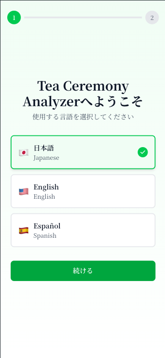
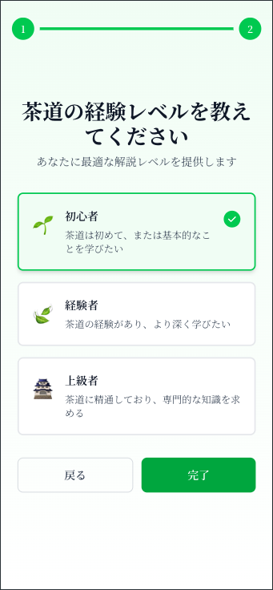
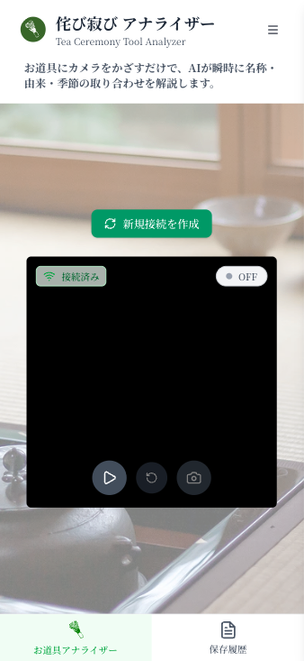
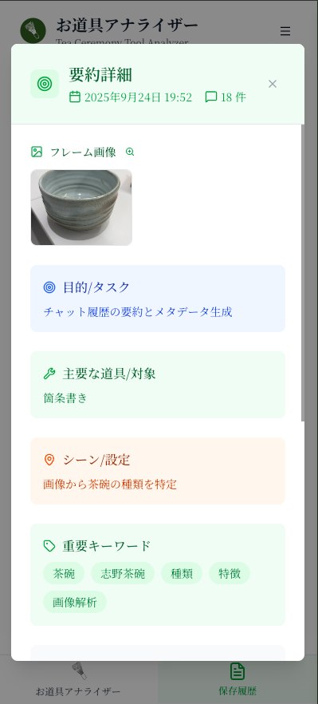
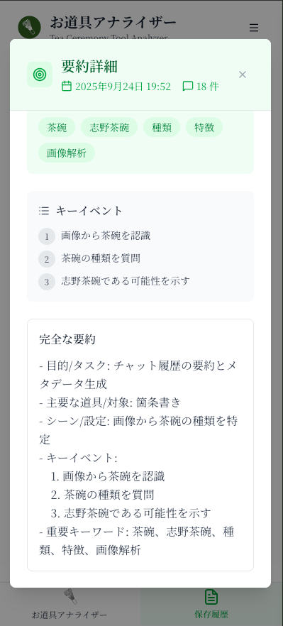
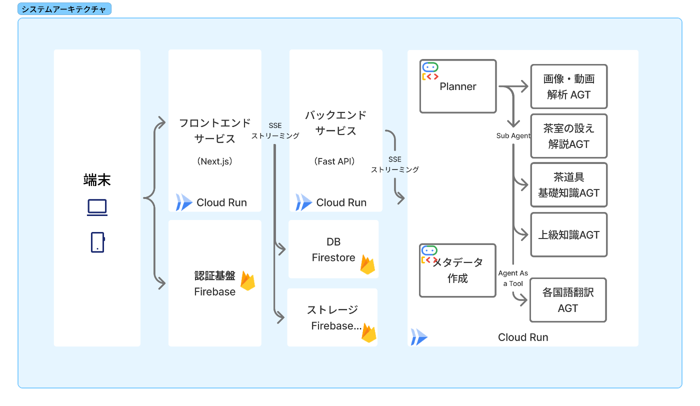

#  はじめに

GenAiの菅原です。  
本記事は第3回 AI Agent Hackathon with Google Cloudに向けて開発したアプリケーションの解説記事です。辻宗理、かわごえひかる様との共著となります。

スーパーエンジニアのかわごえさんがバックエンド×エージェント、茶道の専門家である辻さんがプロンプトや専門知識の監修を行い、菅原がフロントエンドを担当する分担で、短い期間で面白い取り組みができました。

#  「知って」買う、「感じて」残す —— 茶道体験をアップデートするAIエージェント

茶道と聞いて、みなさんはどんなイメージを持つでしょうか？  
静かにお茶を点てる所作、厳かな雰囲気、掛け軸や茶碗に漂う趣き……。  
けれど、ただ「美しい」「静かだ」と感じるだけでは、茶の湯が本来持つ奥深さにはなかなか届きません。そこには亭主の想い、歴史的な背景、そして季節感が織り込まれているからです。  
今回のアプリのテーマは、その**“深み”**を誰にでも開いてくれる、AIエージェントを活用した新しいプロジェクトです。

##  コンセプト

キーワードは **「知って」買う、「感じて」残す。**  
茶道の世界を知識で補い、感性で味わい、そして思い出として残す。そんな体験を実現するのが、このエージェントアプリの目指す姿です。

> まるで専門家が隣で教えてくれるように。  
>  AIが目の前の茶道具や設えを認識し、その意味や背景をリアルタイムで解説します。  
>  掛け軸の一行に込められた禅の心。茶碗の歪みに見出す美意識。茶杓の銘に宿る物語。  
>  知ることで、茶室に流れる静寂は「物語の空間」へと変わっていきます。

##  直面する課題

近年、"Matcha"は世界的なブームとなり、カフェで抹茶ラテを気軽に楽しむ光景も珍しくなくなりました。その人気は、美しい茶碗といった茶道具にも静かに広がりを見せています。  
しかし、その一方で、一つひとつの道具に込められた物語や、茶室の設えに込められた亭主の想いといった、茶の湯の奥深い精神性まで触れる機会は、まだ限られているのではないでしょうか。  
多くの人が茶道に触れるとき、次のような課題に直面しています。

  * 知識と体験のギャップ: せっかくの出会いも、背景にある意味を知らなければ、体験が表層的なものになりがちです。
  * 情報の壁: 専門的な知識は断片的で、特に海外の方にとっては言葉の壁も高く立ちはだかります。
  * 作り手との距離: 道具への関心は高まっても、その作り手である職人の想いや技術に直接触れる機会は少なく、文化の継承という点でも課題が残ります。

こうした見えないハードルが、茶の湯の豊かな世界への入り口を、少しだけ狭めてしまっているのかもしれません。

##  3つの特徴

このプロジェクトでは、AIとスマートフォンを活用し、次のような価値を届けます。

###  1\. 体験価値の深化

スマホをかざすだけで、茶道具や設えをリアルタイムで認識。  
その意味や背景を解説することで、知識が感性を後押しし、体験が格段に深まります。

###  2\. 知識へのバリアフリーアクセス

AIが母国語で解説してくれるため、初心者も外国人も安心。  
「知りたい」を、誰でも・いつでも実現できる文化の入口を提供します。

###  3\. 学びの振り返り

体験して終わり、ではありません。  
アプリは、やりとりや解説を写真と一緒に保存し、AIが要約を自動生成。  
「この茶碗の銘は◯◯」「この設えは秋の季節感を表す」など、自分が学んだことが一目で振り返れる「学びのアルバム」が残ります。

##  ターゲットユーザー

###  茶道未経験者・ビギナー

初めて茶室に入ったとき、何を見ればいいのか分からず「ただ静かだな」と感じるだけで終わってしまうことも少なくありません。そんな方にとって、このアプリは最初の先生になります。  
掛け軸や茶碗の意味を一つずつ解説してくれるので、「なるほど、こういう意図があったんだ」と気づきを積み重ねながら体験を楽しめます。  
結果として「もっと学びたい」という気持ちにつながり、茶道を続けるきっかけにもなります。

###  外国人観光客

訪日観光の人気アクティビティとして注目される茶道体験。  
しかし、専門用語や文化的背景の壁があり、ただ「見て」「飲んで」終わってしまうケースも多いのが現実です。  
このアプリは、母国語での解説とリアルタイムな体験補助を組み合わせることで、ハードルを大幅に下げます。  
「日本の美意識」や「一期一会の精神」といったキーワードを理解した上で体験できるため、観光を“消費”するだけではなく、文化を深く“体験”する旅へと変わります。

###  「本物の日本文化」を深く体験したい人

茶道に限らず、日本文化に関心のある方は数多くいます。  
和食や着物、書道や建築に触れる中で「もう一歩奥に踏み込みたい」と感じる人にとって、このアプリは強い味方です。  
単なる解説アプリではなく、自分が体験した瞬間を“知識と感性”の両面で残せるのが大きな特徴。  
旅のアルバムや日記を超えて、「文化の学び帳」として手元に残り、後から振り返ることで理解がさらに深まります。

##  デモ動画

アプリの実際の操作デモに関しては、こちらからご覧いただけます。  
<https://www.youtube.com/shorts/Osc4Oeerrmk>

##  アプリの機能フロー

ここからは、実際のユーザー体験の流れを追ってみます。

###  1\. オンボーディング

最初にアプリを開くと、オンボーディング画面が表示されます。  
言語選択：日本語、英語、スペイン語などから選択  

茶道経験の入力  
これにより、解説の深さや用語の難易度を自動調整します。  

###  2\. カメラストリーミング

次に、スマホをかざして茶室や茶道具を映すと、AIが対象をリアルタイムで認識します。  
解説が即座にオーバーレイ表示

「この掛け軸は『一期一会』を表す禅語です」  
「この茶碗の歪みは“わび”の美意識を示しています」

さらに、チャット機能を通じてAIエージェントに質問できます。  
例：「この茶碗はどの時代のものですか？」と聞くと、すぐに教えてくれます。。

###  3\. 写真と学びの保存

気に入った瞬間は、解説つきで写真を保存できます。

  * 写真 + 解説テキスト がセットで保存
  * AIが会話内容を要約して「学んだことメモ」として自動整理  
保存した写真は後から検索・閲覧でき、まるで自分だけの「茶道体験アルバム」ができ![]あがります。  

##  システムアーキテクチャ

今回のアプリでは、フロントエンド・サーバサイドはCloud Runにてホスティングしており、エージェント部分にはGoogle ADK、ホスティングはVertex AIのAgent Engineを利用しています。  
リアルタイムに画像解析の結果を返せるように、SSEを利用したストリーミングに対応しています。  
ユーザー認証や、学んだことの保存や、写真の保存にはFirebaseを利用しています。

###  システムアーキテクチャ図

###  マルチエージェント構成

####  Planner Agent (adk/planner/agent.py)

\- 役割: 司令塔・ルーター  
\- 機能:  
\- 画像/動画の自動Vision要約→テキスト化  
\- 適切なサブエージェントへのルーティング  
\- 最終回答の統合・翻訳  
\- 利用可能ツール:  
\- call_setting_analysis() - 茶室設え解析  
\- call_tools_basic() - 初心者向け道具解説  
\- call_tools_analysis() - 専門的道具分析  
\- call_translation() - 多言語翻訳

####  Vision Agent (adk/vision/agent.py)

\- 役割: 画像・動画解析  
\- 特化機能: 茶道具・茶席の視覚的要約  
\- 処理: JPEG/PNG → 日本語テキスト要約

####  Tools Basic Agent (adk/tools_basic/agent.py)

\- 役割: 初心者向け茶道具解説  
\- 対象: 茶道を始めたばかりの学習者  
\- 出力: 道具名称・使い方・基礎知識（200-300文字）

####  Tools Analysis Agent (adk/tools_analysis/agent.py)

\- 役割: 専門的茶道具分析  
\- 対象: 上級者・研究者・数寄者  
\- 特化: 由緒・格付け・千家十職との関連性（300-350文字）

####  Setting Agent (adk/setting/agent.py)

\- 役割: 茶室全体の設え・季節趣向解析  
\- 分析内容: 床の間・点前座・わびさび美学の統合解釈（300-350文字）

####  Translator Agent (adk/translator/agent.py)

\- 役割: 多言語翻訳  
\- 機能: 自然な文体での言語変換

###  採用した技術

\- ADK

###  苦労した・ハマった点

##### ストリーミング（LiveAPI）のそもそもの実装

今回、FastAPIを使ったSSEで、ADKのLiveAPIをラップする構成を実現しています。  
当然、サンプルやドキュメントもまだまだ少ない領域なので、ここまで実現するのにはかなり手探りで苦労しました。

##### LiveAPIの1011エラー

時間切れで詳細まで突き詰めることはできていないのですが、LiveAPIのセッションが増えると1011エラーが頻出するという事象に遭遇し、LiveAPIが応答を返さなくなってしまう点は、今回の実装で苦しめられた点です。
    
    
    ERROR:google_adk.google.adk.flows.llm_flows.base_llm_flow:Connection closed: received 1011 (internal error) RESOURCE_EXHAUSTED: Maximum concurrent sessions exceeded.; then sent 1011 (internal error) RESOURCE_EXHAUSTED: Maximum concurrent sessions exceeded..
    

最終的には、LiveAPIの呼び出し回数をへらすために、サブエージェントについてはADKのAgentは利用することを諦め、純粋なLLM呼び出しするをするToolsとしてAgentに組み込んでマルチエージェント（のような）構成を実現しています。

##  さらなる展望 —— 伝統工芸と地域経済への架け橋へ

このプロジェクトは、単なる「体験補助アプリ」に留まりません。  
茶道をきっかけに、職人・工芸品の世界とユーザーをつなぐ新しい循環を生み出すことを目指しています。

###  1\. 職人へのダイレクトアクセス

茶碗や茶杓、掛け軸などの茶道具は、それぞれに作り手の技術と物語が込められています。  
アプリの解説から、そのまま職人や工房の紹介ページへ遷移できる導線を設けることで、ユーザーは「気に入ったものを買う」だけでなく、作り手に直接触れる体験を得られます。

###  2\. 地域工芸と観光の活性化

販売導線は、単に物を売るだけでなく、地域の伝統文化を知る入口にもなります。  
たとえば、京都の茶杓職人や金沢の漆器作家など、地域ごとの特色を体験と結びつけて発信することで、観光や文化体験そのものが広がっていきます。

  * 「お土産」として買う → 職人や地域への興味が芽生える
  * 興味から「現地を訪ねたい」という次の行動につながる
  * 結果として、地域経済の活性化に寄与

###  3\. 文化継承の新しい形

伝統工芸の担い手不足が叫ばれる中、こうした仕組みは次世代への継承にもつながります。  
デジタルの世界で職人の技や思想を知り、興味を持った人が購入・体験することで、職人の仕事が持続可能になり、文化が未来へと受け継がれていきます。  
「一期一会」の精神を支えるのは、一期一会の道具を生み出す人々。  
その存在を可視化し、ユーザーと職人を橋渡しすることが、このプロジェクトの次なる挑戦です。

##  茶道 × AI がひらく未来

茶道には「一期一会」という言葉があります。  
一度きりの出会いを大切にする心です。  
このAIエージェントは、まさにその精神を体現する存在です。  
一期一会のひとときを「知って」「感じて」「残す」。  
伝統文化の体験は、単なる観光の枠を超え、知的で感性的な旅へと進化していきます。

##  開発あとがき

今回の開発は、短期間ながら「技術」と「文化」と「体験」をどう結び合わせるか、というチャレンジでした。

特に、LiveAPIやマルチエージェント構成といった技術的な試みは、まだまだ手探りの部分が多く、試行錯誤の連続でした。開発面ではマルチエージェント構成で検討していたからこそ、プロンプト周りの調整で分業ができた側面や、ADK周りの開発のしやすさ（Sub Agent、Toolsの切り替えのしやすさなど）には大きく助けられたのかなと思います。

最後に、本記事を読んでくださった皆さま、そしてハッカソンという場を共に作り上げてくださった参加者・関係者の皆さまに、心より感謝申し上げます。
