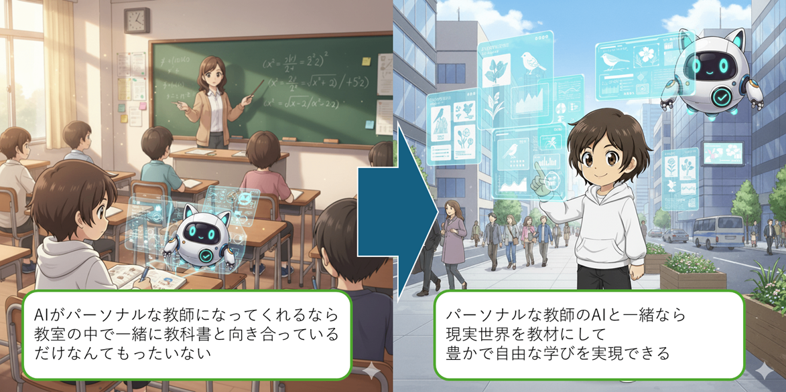
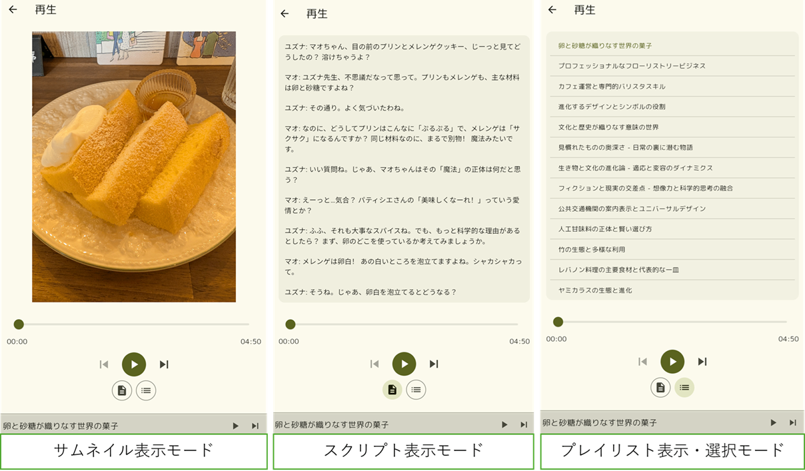
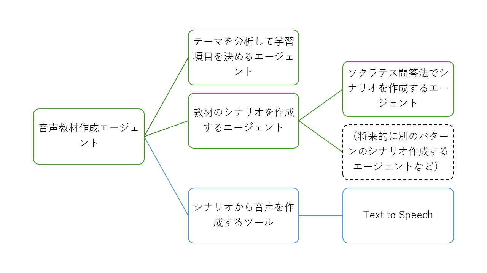
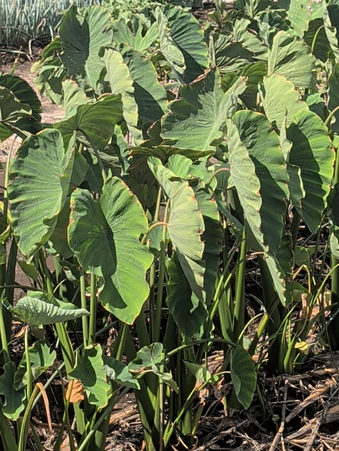
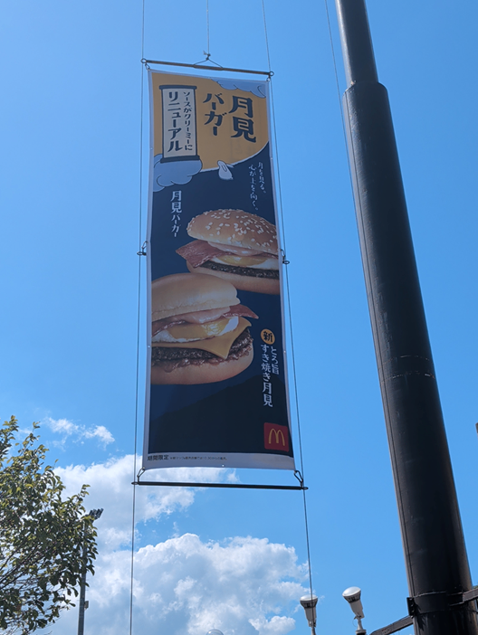
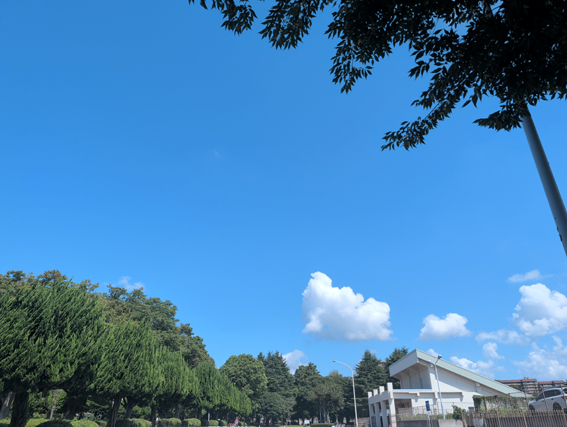
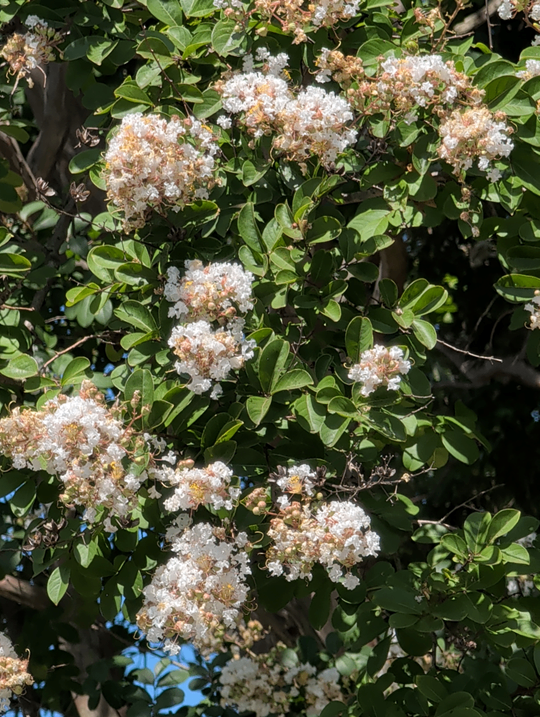
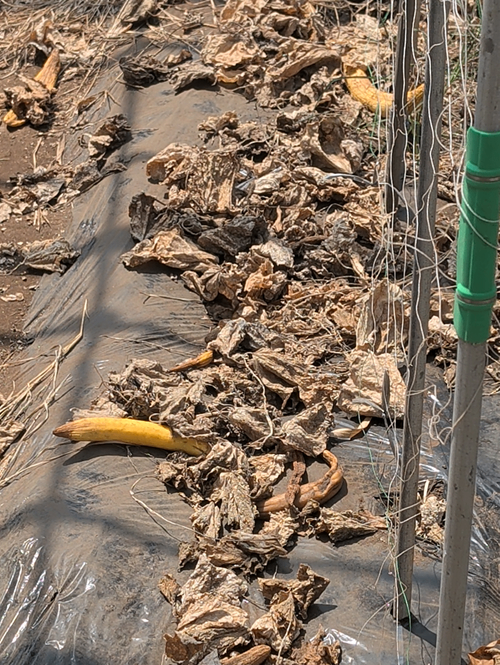

#  私たちの周りにあるものはすべて意味がある。だから、それはすべて学びになる。

あなたはこの写真にどのような意味があると考えますか？  
このプロジェクトのアプリ「Edison’s Eye」は、この写真から「東京駅の歴史と役割」や「都市の景観と建築の変遷」、「夜の都市景観と人々の営み」という学びを生み出します。

#  課題：「型通りの教育」から「自由な学び」へ

生成AIは教育現場に大きな波紋をもたらしています。大学生に対するいくつかの調査で、学生たちはレポートの作成や教科書・論文の理解のために生成AIを利用していることが報告されています。こうすることで、学生たちは分からないところがあったときに先生や優秀な友人に頼ることなく、AIをパーソナル教師にして勉強を進めることができます。今はまだ高校生以下の利用は少ないですが、いずれ広がったり、生成AIを利用したサービスが遠くない未来に展開されていくと考えられます。賛否もありますが、生成AIがこれまでの教育を「便利」にしてくれるのは間違いないと思います。

しかし、生成AIを既存の教育のなかで「便利」に使うだけで良いのでしょうか？学校教育というのは、少数の教員で多くの学生を育てるという効率重視が求められる教育です。そのため、基本的には学生一人ひとりが持つ好奇心に寄り添うのではなく、決められた学習項目を教えるという型に当てはめる教育になります。しかし、**学生一人ひとりにAIがパーソナル教師として寄り添えるなら、これまでの教育の考え方とは全く違った新しい学びの在り方を実現できるのではないでしょうか？**

その新しい学びの在り方のヒントは今から150年以上の前に学校教育の枠の外で育ち、ついには発明王にまでになったエジソンにあると考えました。子供の時のエジソンは好奇心旺盛で学校で「なぜ、空は青いのか？」のような質問をたくさんした結果、退学させられたと伝えられています。しかし、元教師であったエジソンの母は家でエジソンの疑問に真摯に向き合いました。さらには、実験室をエジソンに与えて、学びを深める機会も用意しました。

このことからエジソンの誕生には以下の三つが必要であったと考えました。

  1. 周りにある学びのきっかけを見つける力
  2. 学びに対して寄り添ってくれる存在
  3. 学びを深める機会

こうして決められた学習項目ではなく、**自身の好奇心の赴くままに学びを広げ、深めていったことがエジソンを形作った** と考えられます。実際、知識の幅を広げることは大きなアウトカムにつながることは様々な研究で示されています。

このプロジェクトの目的は**AIでエジソン誕生の3つ条件に基づいた自由な学習を実現する** ことです。

##  課題の価値の確認

この課題は新しい価値を見出すためのものであり、現状は誰かが明確に明確に困っているというわけではありません。しかし、それでもこの課題を解く価値があるということを、既存の研究から確認したいと思います。

子供が好奇心の赴くままに学びを広げることの意義について考えます。そういうことが可能な場として博物館が挙げられます。(Gong 2020)によれば、定期的に博物館に訪れることが創造性の発達に良い影響が示されており、(Tan 2021)でも認知発達にプラスの効果が示されています。一方で、(Bonnette 2019)では学校の教育以外で科学館などで科学に触れるような学び得ることが、好奇心の維持に結び付くことが示されています。このことから、子供に学びを広める場を提供することは子供の能力に良い影響を与えるだけでなく、それ自体が好奇心を育てることが示されています。

広い視点を持つことが社会において重要であることも示されています。問題解決の成功には専門ど真ん中ではなく周辺の人のほうが予想外の突破口を開くことができるとか(Jeppesen 2010)、良い研究には基盤を確立しながらもそこに異質な一滴が混ざることが重要だと示されています(Uzzi 2013)。3Mで強力な接着剤の開発中に偶然できた弱粘着で貼ってはがせる接着剤が、同僚の聖歌隊で賛美歌集のしおりが落ちるのを何とかしたいう視点と結びつき、やがてポストイットという大発明につながったことからも様々な視点を持つことの大切さが分かります。また、キャリアにおいても専門的な職業教育を受けたほうが就職時には有利だが、より広く学ぶ教育を受けた人の方が技術変化への適応性が高く、中高年以降では有利になるという調査もあります(Hanushek 2017)。

以上のことから、**知識の幅を広げる学びを行うことには一定の学習的な意義が期待されます。それも子供だけでなく大人であっても意義がある** と考えられます。このような視点もこの後に説明するアプリの開発に活かしています。

[参考文献]  
Gong, X., Zhang, X., & Tsang, M. C. (2020). Creativity development in preschoolers: The effects of children’s museum visits and other education environment factors. Studies in Educational Evaluation, 67, 100932.  
Tan, F., Gong, X., & Tsang, M. C. (2021). The educational effects of children’s museums on cognitive development: Empirical evidence based on two samples from Beijing. International Journal of Educational Research, 106, 101729.  
Bonnette, R. N., Crowley, K., & Schunn, C. D. (2019). Falling in love and staying in love with science: Ongoing informal science experiences support fascination for all children. _International Journal of Science Education, 41_(12), 1626–1643.  
Jeppesen, L. B., & Lakhani, K. R. (2010). Marginality and problem-solving effectiveness in broadcast search. _Organization Science, 21_(5), 1016–1033.  
Uzzi, B., Mukherjee, S., Stringer, M., & Jones, B. (2013). Atypical combinations and scientific impact. _Science, 342_(6157), 468–472.  
Hanushek, E. A., Schwerdt, G., Woessmann, L., & Zhang, L. (2017). General education, vocational education, and labor-market outcomes over the lifecycle. _Journal of Human Resources, 52_(1), 48–87.

##  ターゲットと想定シーン

  * 小中高生 
    * このプロジェクトの目的は既存の教育に対して、エジソンを生み出すような自由な学習を実現することにあります。そのため、**最も強く意識するターゲットは現在の教育課程を受けている小中高生** になります。ただし、AIがハルシネーションを起こすことを考えると特に小学生をターゲットにすることは慎重にすべきだと考えています。
  * 子供を育てている方 
    * 先のハルシネーションの問題を考えると現状では大人の監督もある程度必要であるため、そういう意味で子供を育てている大人もターゲットとして考えています。一方で、そういう保険的な意味だけでなく、**大人自身が子供が興味を持ちそうなことに対する知識を幅広く獲得することで、子供の興味を育むような対話を実現** できると考えています。
  * 問題解決や創造的な仕事をしている社会人 
    * 幅広い知識を持つことはキャリアにも影響を与えるため、社会人の誰しもがターゲットであると思ってはいます。しかし、幅広い知識を持つことの意義を感じられなければ、社会人の学びを続けることは難しいと思います。そのため、最初のステップのターゲットとして**学ぶことの意義を比較的実感しやすい問題解決や創造的な仕事をしている社会人** を想定します。
  * 旅行シーン 
    * 旅行は普段の生活圏では見かけないような刺激が多くあります。それらは、学びを広げるためのきっかけが多くあるということでもあります。それらを、適切に学びに変える仕組みを用意できれば、**キレイな風景を楽しむことやおいしいものを楽しむことに加えて、知ることを楽しむ旅が実現できる** と考えています。

#  ソリューション：『Edison’s Eye』がもたらすAR of Meanings

##  デモ動画

<https://youtu.be/Duf5z6Ulb14>

動画の中で例として紹介した音声教材はこちらから続きを聞くことができます。  
[音声教材へのリンク](https://drive.google.com/file/d/1jyCbY8l39n-KhpKhTN6LR7jTK7vMgxeZ/view?usp=sharing)

##  概要

このプロジェクトでは先のエジソンの誕生の条件から以下の三つのステップの実現をアプリ開発の要件としました。

  1. ユーザーの周囲にある学びのきっかけを見つける
  2. 学びに対して寄り添う
  3. 学びを深める機会を提供する

これを満たすためのアプリとして開発したのが『Edison’s Eye』です。これは、**ユーザーの周囲にあるものを学びのための教材として拡張するもの** です。こうすることにより、好奇心旺盛なエジソンが周囲のモノを学びへと変えたように、ユーザーがいる現実の世界を豊かな学びの空間へと変えることができます。  
このアプリの機能を簡単に言えば、１）周囲にあるものをカメラや位置情報から認識して、それらから学びのポイントを抽出して、２）興味深く頭に残りやすい音声教材に変えて、さらに３）次の学びを示すというものです。これらが要件をどのように満たしているのかを説明していきます。

##  １．ユーザーの周囲にある学びのきっかけを見つける

私たちの周りにはよく考えれば不思議なモノや興味深いモノがたくさんありますが、エジソンでもなければ、それに気づき、学びのきっかけにすることは難しいです。そこで、この**アプリではユーザーの代わりに学びのきっかけ（テーマ）を周囲から3つ見つけて提案** します。これがまさに学びを見つける「エジソンの目」に当たる機能です。

###  画像から学びのきっかけを見つける

**周囲を写真に撮りアップすると、アプリがその画像の内容から学びのテーマを3つ作成・提案する** 仕組みになっています。ただし、その学びの内容は必ずしも写っているものの直接の解説とは限らず、それから連想されるようなものが含まれる場合もあります。例えば、蝶の写真を撮った際には以下の3つが提案されます。

  * 蝶の生態と多様性
  * 蝶がおりなす文化と象徴
  * 蝶から学ぶ環境保全

それぞれ、蝶を生物として捉えたり、文化的な側面から捉えたり、環境の側面から注目したりしています。このように、一見はただの蝶であっても多様な学びを生むことができます。そのため、**普段見慣れているようなものであっても、全く違った視点での学びを得ることができます** 。もちろん、旅行先で見つけた変わったものからは全く未知のテーマが提案されることもあります。なお、過去に行った、見たものから学びを得たいという需要もあると考えたため、画像ファイルのアップロードにも対応しています（PCはカメラ撮影はできず、画像ファイルのアップロードのみ対応）。

実際に作った教材：[蝶が織りなす文化と象徴](https://drive.google.com/file/d/13TM8G9vpbsug1bNoIFQpVXzWaQfjh5T0/view?usp=sharing)

###  場所から学びのきっかけを見つける

目に見えるものだけでなく、ユーザーが立っているその場所自体が学びのきっかけになることもあると考えています。特に旅行先では神社や庭園といった場所自体が意味を持つことも多いです。そこで、**GPSに基づく位置情報とGoogle Map APIを使って現在地から最も近いスポットから学びを得られるようにしました** 。こちらも画像と同様に3つのテーマが提案されます。例えば動物園の施設が近くにあったときには、「動物の生態と多様性」という動物に直接関係するもののほか、「動物との共生と倫理」という人と動物との共生に関わるものや、「人と動物の関係史と心理的効果」のような心理学に関わるものも提案されます。

###  言葉から学びのきっかけを見つける

写真に撮りにくいものや、写真には撮らなかったけど気になったものなどは、言葉（テキスト入力）からだけでもテーマが作成できるようになっています。

##  ２．学びに対して寄り添う

このステップでは、前のステップでユーザーが興味を持った学びのテーマから教材を作成します。ただし、学びに対して寄り添うためには、単純にテーマに合った解説文章をテキストで提供するのが最良の選択ではないと考えています。検討の結果、採用したのは学びのテーマに関連する話題を二人が話すというシナリオに基づく音声教材でした。多くの人はNotebookLMの音声コンテンツを生成する機能を思い浮かべると思いますが、それと共通するところもありながらも、異なる点もあるので説明していきます。

###  なぜ、音声教材なのか

音声情報が優れる点は、聴覚モーダルは占有される一方で、視覚モーダルはほかのことに利用することができるということです。例えば、視覚的に情報が提示される場合（この場合は図だけでなくテキストも含む）、それに注目して情報を収集する必要があるため、その間はほかから情報を得ることができなくなります。一方で、聴覚モーダルで情報を得ながら同時に視覚モーダルからも情報を得ることができます。特に学習においてはこれが意味することは、**聴覚で学習情報を聞きながら、視覚的にその学習対象物を観察することによって、聴覚情報と視覚情報を関連付けた深い学びを得ることが可能になる** ということです。そのため、このアプリでは学びを音声教材として提供することで、視覚では元となったものを観察することを期待しています。過去のコンテンツであっても視覚的な情報を提供するために、再生中には元となった写真をサムネイルとして見られるようにしています。位置情報で学びのきっかけを得た場合も、参考画像としてGoogle Map APIを使ってそのスポットの画像を取得するようにしてあります。また、**聞きながらインターネットで気になる情報を並行して調べる** という使い方をしてくれることも期待しています。一方で、学びの内容が難しい場合は、じっくりと咀嚼したいこともあると考えたため、シナリオのテキスト版も提供しています。

###  精緻化させるための学習内容の決定

学んだ内容を頭に残しやすくするために、設定された学びのテーマをそのまま解説するのではなく、学習方略の「精緻化」に結び付くように学習内容に工夫を加えています。精緻化は学ぶ学習項目だけでなく、それに関連する背景などをともに学ぶことによって記憶を定着させやすくするだけでなく、さらにその知識を応用しやすくするというものです。そのため、**学習内容を決めているプロンプトには、そのテーマに関する重要なポイントだけでなく、背景知識や考えるうえでの争点、関連する問題、良くする勘違いなどの情報も含むように設定しています** 。

###  ソクラテス式問答法によるシナリオ

学習内容が決まったらシナリオを生成するが、これはNotebookLMのようにただ解説するシナリオではなく、「ソクラテス式問答法」に基づくシナリオを採用しています。ソクラテス式問答法では、教師役と生徒役のキャラクターが登場する。生徒役が主張する内容に対して、教師役が「なぜ？」問いかけて、それをきっかけに深いレベルの理解に進んでいくというものです。このシナリオを通して、**ユーザーも生徒役と一緒に思考を深めていくことができます** 。また、学習内容の決定の中で**「良くする勘違い」が設定されている場合は、生徒役が自分の勘違いを教師役との対話で修正していくシナリオにもなります**。これは**自分が直接誰かに勘違いを訂正されるよりも受け入れやすく、また自分の勘違いを修正することは記憶の定着にも効果的** です。

##  ３．学びを深める機会を提供する

一つの音声教材を聞いて、知識を得て満足して終わりでは、知識の幅は広がっても深みは生まれてきません。そのため、アプリとして学びを深める次のステップを提供する必要があると考えました。

###  次の学びの提案機能

もっとその学びを深めたいと思った場合は、特に気になる部分をユーザーがテキスト入力すれば次の学びを得ることもできます。ただし、そのためにはユーザーが次の学びの切り口を見つけてもらう必要があります。しかし、ユーザーに次の学びに進んでもらうことは、このプロジェクトにとって非常に重要なため、**アプリ側から次のステップへの足場掛けとして3つのテーマを提案する** ようにしました。これは、作成されたシナリオをインプットにして、次の学びのテーマを生成したものです。例えば、先ほどの蝶の写真から作成したテーマのうち、「蝶が織りなす文化と象徴」を選んだ場合は以下が提案されます。

  * 生物多様性と文化多様性：蝶が語る「バイオカルチュラル・ダイバーシティ」
  * プシュケと魂の探求：古代ギリシャにおける蝶の象徴性
  * 夢と現実の境界：荘子の「胡蝶の夢」と東洋思想

元々、文化的なものを含むテーマを選択しましたが、さらにそれを文化と生物の両方に注目したり、古代ギリシャから注目したり、東洋思想から考えたりしたものが提案されています。

実際に作った教材：[プシュケと魂の探求：古代ギリシャにおける蝶の象徴性](https://drive.google.com/file/d/1SCSuQS0t2DDnT3X2fPGasBU-spbNyq5f/view?usp=sharing)

###  セレンディピティな学びの提案機能

このアプリはユーザーの周りにあるものを学びにすることができますが、それはある程度はユーザーの意志によるものになります。それに加えて、ユーザーも予期していないような新たな学びを提案することができれば、視点はより広がると考えました。そこで、1日1回決まった時間に、前日に作成した学びと、それよりも前に作成した学びを組み合わせて新たな学びを提案する機能を実装しています。これには**予期しない学びを提案するという目的に加えて、これまでの学びを結び付けるような学びを提供することで、学んだ内容を構造化させてより深い学びへと導く** ことも目的にしています。

##  そのほかの機能（プレイヤー機能）

ユーザーの使い方によって作成した音声教材をすぐに聞くことなく、後でまとめて聞きたいという需要もあると考えました。例えば、旅行中に気になるものや場所で学びを作成しつつも移動の都合や一緒に来た人とのコミュニケーションを楽しむためにすぐには聞けず、ホテルに帰ってからゆっくりと聞きたい状況などがあると思います。その際に、スムーズに聞けるように音楽プレイヤーのようなプレイリストを作成して連続再生できる機能を開発しました。プレイリストの作成では作成した日付でフィルターしたり、新しい順、古い順に並び替えることができます。また、各音声教材にタグを設定することで、タグでフィルターすることもできます。専用の再生画面では、サムネイル表示モード、スクリプト表示モード、プレイリスト表示・選択モードがあります。

##  アプリに関するまとめ

このアプリが実現した機能はAR of Meaningというものになると考えています。ARというと「現実世界に対して視覚的なコンテンツを重畳することで認識できる情報を拡張する」というものが多いですが、**本アプリのARは「現実世界の文脈を引き出し学びの場へと拡張する」というもの** です。このアプリを使って学び続ければ、**見える世界は多くの意味があふれたものになり、それが豊かな発想につながっていく** と考えています。

#  システム構成

基本的にはFirebaseの機能を中心に使ったシステム構成になっています。こうすることで、スムーズな開発を実現できるだけでなく、セキュリティも容易に確保することができました。

##  フロントエンド

  * フロントエンドはFlutterで開発し、FirebaseのHostingでデプロイしています。
  * ユーザーごとにコンテンツを持つことになるので、FirebaseのAuthentication（Google認証）を使ってユーザー認証をしています。
  * バックエンドとのやりとりは基本的にFirestoreを経由して行う構成になっています。

##  バックエンド

###  基本的な処理系

  * フロントエンドがFirestoreにコンテンツの作成・更新をトリガーにして処理を行うFunctionsが起動します。
  * テーマの作成はFunctionsがVertex AI経由でGeminiを呼び出すことで作成しています
  * セレンディピティな学びの提案機能は1日1回定期的に更新をするので、担当するFunctionsをスケジューリングでトリガして起動します
  * 音声教材の作成はADKで構成されたエージェントが担当しています。このエージェントはCloud Run上にFast APIを使って実装しています。エージェントは音声教材を作成し、Storageに書き込みます。

###  データ保存

  * Firestoreでは、教材のコンテンツ情報の保存と作成段階の状態管理を行います。
  * Storageでは、音声教材や画像ファイル、スクリプト情報を保存しています。
  * これらにはアクセスルールを設定することでセキュリティを担保しています。

###  エージェント（音声教材作成）

  * エージェントは入力として教材のテーマを受け取ります。
  * エージェントは、「テーマを分析して学習項目を決めるエージェント」、「教材のシナリオを作成するエージェント」、そしてツールとして「シナリオを音声に変更するツール」で構成されています。
  * 「教材のシナリオを作成するエージェント」はカスタムエージェントとして構成されていますが、現在は一つのLLMエージェントで構成されているのでカスタムエージェントとして構成している意味はありません。これは将来的に学習項目の内容に応じて話の構成の仕方や話し手を変えるなどの追加機能を予定しているためにカスタムエージェントを採用しています。なお、校正を行う機能は一時的に入れていましたが、ほとんど校正されることがなかったため、トークン節約のために現在は使用していないです。
  * モデルは、エージェントやそれ以外のところでも基本的にはGemini 2.5 Flashを使っていますが、教材のシナリオの質はユーザー体験に大きな影響を与えるため、「教材のシナリオを作成するエージェント」だけはGemini 2.5 Proを採用しています。
  * 「シナリオを音声に変更するツール」ではText to Speechを使用してシナリオを音声に変換します。
  * アーティファクトの保存先としてStorage（Cloud Storage）を指定することで、作成した音声教材とスクリプトは自動的にStorageに保存されます。

###  そのほかの工夫した点

  * ユーザーが旅行先で次々と学びを得るために写真を撮ったりすることを考えるとアプリの待ち時間は極力ないことが望ましいと考えました。テーマを生成するのには場合によっては15秒、音声教材を作成するには数分間がかかります。この対策としてフロントエンドからFirestoreからの書き込みのみを行わせることで（画像がある場合はStorageにアップロードする必要はあります）、処理を軽くしました。実際の処理はFirestoreの作成・更新をトリガーとしてFunctionsで行い、処理の終了はFirestoreの内容を更新することでフロントエンドに伝える仕組みにしました。

#  実際に使ってみた

##  開発者が実際に使ってみた

近所で5km、1時間ほどウォーキングする際に使ってみました。ちょっと気になるものにカメラを向けてみたり、特に意味もなく目の前の風景を風景を撮ってみたり、適当な場所で位置情報所得してみたりしました。そして、作成した音声教材を聞きながらウォーキングしました。その間に作成した音声教材は以下になります。1時間のウォーキングの時間が、1時間のウォーキングと学びの時間となり、充実した時間になったと感じました。また、家に帰ってからも提案された次の学びから、新しい学びを得続けて際限なく遊べてしまいました。

ウォーキング中に実際に見つけた学びと音声教材は以下です。元になった撮影したものも掲載していますが、住んでいるところが分かってしまいそうなものは文字情報のみになっています。

学びのテーマのもとに  
なったもの | 提案されたテーマ  
リンクがあるものは実際に選択したもの（聴くこともできます） | 選択したテーマから生成された次の学びのテーマの候補  
---|---|---  
マンションの遊歩道を撮影 | ・現代建築と緑の調和  
・公共空間におけるユニバーサルデザイン  
・[都市の景観と人々の営み](https://drive.google.com/file/d/19gajq35YK0aAA4FM16TzGnOCbO41hG3_/view?usp=sharing) | ・都市計画の基礎と実践  
・都市におけるグリーンインフラと生態系サービス  
・開発と保全のジレンマ：住民参加と合意形成  
高架下の薄暗いところから明るい方を撮影 | ・都市インフラの構造と機能  
・日本の郊外住宅と生活環境  
・ [日常風景における光と影の美学](https://drive.google.com/file/d/1QyxphY9jY66iPQJ6AzyRFEjS5gbtdQgh/view?usp=sharing) | ・時間帯と光の質が織りなす写真表現  
・ダイナミックレンジと露出の選択：意図を伝える写真術  
・光と影が導く構図と物語性  
 | ・サトイモの栽培と農業  
・[サトイモの食文化と栄養](https://drive.google.com/file/d/1ZqSf4xKIoFazIf1A0Adj81Ds4d28-48v/view?usp=sharing)  
・サトイモの植物学的特徴と生態 | ・植物の知られざる化学戦略  
・世界をめぐる主食の物語  
・食の未来を拓くイノベーション  
 | ・植物のライフサイクルと枯死  
・[混作農業と生態系](https://drive.google.com/file/d/1M6yQWUdI3A2xOyJ1z4z0jv8JJVggzCr1/view?usp=sharing)  
・農業における環境適応と持続可能性 | ・アレロパシーの深堀：植物間の化学的コミュニケーション  
・土壌生態系と微生物の役割：混作が育む見えない生命の営み  
・混作農業の未来：効率と持続可能性の両立への挑戦  
街角の自治体が管理している花壇を撮影 | ・[地域コミュニティにおける緑地管理](https://drive.google.com/file/d/1ngUAHiua9PyzPmJsTFgeT589u0uzVXXn/view?usp=sharing)  
・公共空間におけるマナーと環境意識  
・都市の緑化と景観デザイン | ・地域コミュニティとソーシャル・キャピタル  
・多様な主体による協働と地域ガバナンス  
・地域活動の持続可能性と参加促進戦略  
自治体のデザインマンホールを撮影 | ・○○市のシンボルとデザイン（地名は伏字）  
・[マンホール蓋から見る日本の地域文化](https://drive.google.com/file/d/1cvFXEPsM-x5tmVDEkpdniqJtnZyi_nlS/view?usp=drive_link)  
・都市のインフラと環境デザイン | ・日本の「ものづくり」精神とマンホール工学  
・都市ブランディングと地域アイデンティティの表現  
・市民参加型デザインと公共空間の活用  
某有名小売チェーン店マスコットキャラクターの像を撮影 | ・小売業界のビジネス戦略と〇〇（店舗名は伏字）  
・[マスコットキャラクターと企業ブランディング](https://drive.google.com/file/d/1cvFXEPsM-x5tmVDEkpdniqJtnZyi_nlS/view?usp=sharing)  
・都市環境と商業施設の視覚的インパクト | ・ブランドアイデンティティの深堀：マスコット誕生前の戦略的思考  
・デジタル時代におけるキャラクターブランディングのリスク管理と倫理  
・ブランドの持続可能性：キャラクターのライフサイクルとリブランディング戦略  
位置情報を取得（動物園系のスポットを発見） | ・動物との共生と倫理  
・[動物の生態と多様性](https://drive.google.com/file/d/1dKeQQPHTy8WcxhNHaN5GbXan-hCVJ8hB/view?usp=sharing)  
・人と動物の関係史と心理的効果 | ・自然選択とメカニズム  
・食物網と生態系のバランス  
・生物多様性保全の国際的な取り組み  
 | ・マーケティング戦略と季節限定商品  
・日本と食文化とファストフードの融合  
・[商品開発とブランドイノベーション](https://drive.google.com/file/d/1UNNCNeAhT632ZdAjKmbuKJyBoJLfbb_6/view?usp=sharing) | ・経験価値デザインと顧客エンゲージメント  
・ブランドの核とリスク管理：ブランドエクステンションの落とし穴  
・希少性と限定性の心理学：消費者の購買行動を動かすメカニズム  
高い位置から大きな道路を撮影 | ・都市交通の課題と解決策  
・道路標示と交通安全の役割  
・[都市景観とインフラの調和](https://drive.google.com/file/d/1s_Chprc2cBn7jSo6yi0lHwEV7_cviLAS/view?usp=sharing) | ・グリーンインフラの多角的機能と導入戦略  
・歴史的景観と現代的開発の共存戦略  
・都市景観形成における十分参加と合意形成のプロセス  
運動場を撮影 | ・陸上競技の基礎と歴史  
・スポーツ施設の設計と管理  
・[屋外運動と健康促進](https://drive.google.com/file/d/1pfwbhQ4veh69DuJ-Dkxo21AYpeeGdyaO/view?usp=sharing) | ・ビタミンDの科学と健康効果  
・バイオフィリア仮説とウェルビーイング  
・行動科学に基づく習慣化の技術  
 | ・自然と都市の調和  
・都市景観と公共空間のデザイン  
・[気象と大気の科学](https://drive.google.com/file/d/1Kwy7CpoeI1sgmB-5FcKNXPaA5AwC8tgC/view?usp=sharing) | ・光の散乱と色の科学  
・地球の「見えない毛布」：温室効果ガスの真実  
・転機用の舞台裏：スーパーコンピューターとカオス  
 | ・サルスベリの生態と特徴  
・季節の移ろいと植物の開花サイクル  
・[庭木としてのサルスベリの魅力と手入れ](https://drive.google.com/file/d/1elHyQsBWAPDmxB47CmKuztS5arW-S7BG/view?usp=sharing) | ・サルスベリの剪定術：美しい樹形と花を保つために  
・サルスベリを主役にした庭づくり：四季を彩るコンパニオンプランツ  
・知っておきたいサルスベリ品種図鑑：庭にぴったりの「推し」を見つける  
 | ・[畑の終活と土壌管理](https://drive.google.com/file/d/1mlSF9g-GXgA4KUh5bhWgZfMymMnhMKi6/view?usp=sharing)  
・マルチング栽培の利点と課題  
・作物の生育不良と対策 | ・堆肥化とC/N比：窒素飢餓を防ぐ土壌管理  
・畑の献立ローテーション：効果的な輪作計画の立て方  
・畑の健康診断：土壌診断レポートの読み解きと改善策  
  
##  ある親子が資格の勉強のために使ってみた

###  頂いたコメント

資格の勉強に使いました。勉強したい単語を入力したり、テキストを撮影して、アプリを利用しました。勉強する中で知識が全くない単元だと教科書を読むのもとっつきにくいところがありましたが、このアプリで楽しく聞いた後だと、学習のハードルが大分下がり教科書が読みやすくなりました。話の展開も面白く楽しく聞けました。また、洗い物をしながら聴けるので勉強もしやすかったです。

###  見解

資格勉強はプロジェクトが想定している使い方とは少し違いましたが、こういった勉強にも使えることの証左になったと考えています。こういった使い方ができるのであれば、学校教育の中でもまずは予習として、このアプリで音声教材を作成して聴いておくことで、授業に入っていきやすくするという使い方もできると思います。

#  今後の展開

最もやってみたいと考えているのはこのアプリを使った親子向けワークショップです。やってみれば課題はまだまだ出てくるとは思っていますし、いきなり発明王が誕生することはないとは思っています。だから、まずは「知る」を楽しむという体験を提供できればと思っています。学校教育はいいところもたくさんありますが、子供によってはその中で勉強というのはテストのためにするもので、それは辛く楽しくないものだと感じてしまうこともあります。そして、大人になってもそのイメージを拭えずにキャリア形成のために資格の勉強などをするということに否定的な態度の人もいます。しかし、本来的には新しいことを知り、学ぶことは楽しいことです。それをこのアプリで子供たちに感じてもらえればなと考えています。

もう一つやってみたいのは、旅の音声ガイドです。博物館や美術館では、展示物の解説を音声ガイドを聞いて学びを深めることができますが、このアプリを使えば任意の街でそれが実現できるようになります。今回は残念ながらタイミング的に自分も頼める人にも旅行に行く予定がある人がいなかったため、試すことができませんでしたが、これは旅の体験を大きく変えてくれると考えています。そのため、性能評価として試したいというのがありますが、あとは単純に自分がそれで旅を楽しんでみたいというのもあります。

一方で、技術的な課題としてText to Speechがどうしても日本語を読み間違えることがあり、そこには対処をする必要があると考えています。スクリプトの表示も提供しているのはその保険的な意味もありますが、根本的な解決も必要であると考えています。

#  最後に

このプロジェクトの内容を思いつくに至った経緯はいくつかあるのですが、その一つは7月くらいに大学の先生とお話しする機会があり、そのときにおっしゃってたのが、研究では「便利」にするだけでは、新しい価値を創り出せていないので足りないということでした。そのことが、すごく頭に残っていて、生成AIを日頃から「便利」に使っているけど、それを越えて新しい価値を創るという視点で考えたら何ができるだろうかと考えたのが今回の着想のきっかけでした。日々、生成AIを使った様々な「便利」が生み出せていますが、いずれそれが飽和状態になったときにこの考え方は大切だなと今回のプロジェクトに取り組みながら思いました。

このプロジェクトでアプリを作成して機能を考えるにあたって、実際に何人かの方に使ってもらって感想を頂きました。ご協力いただいた方たち、本当にありがとうございました。継続して使用したいというお言葉も頂戴しているので、アプリを維持できるような準備を進めたいと思っています。
